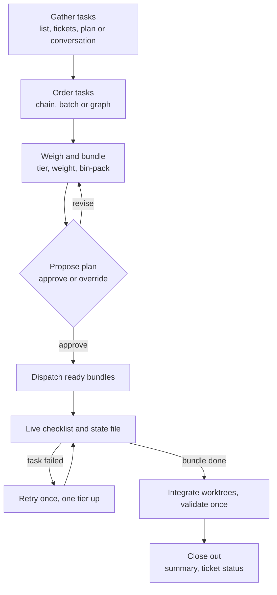

# dispatch-tasks

**Version 2.0.0**

A Claude Code skill that hands work to sub-agents and keeps the main thread posted as each piece lands. It packs tasks into as few agents as the work allows, proposes that plan for approval, and tracks the run to a single summary.

## When it fires

The skill is model-invoked. It triggers on:

- "dispatch ..." or "hand this to a background thread"
- "for each ..." over a list
- "in parallel" or "serially"
- "work through these tickets" or "run this plan with agents"

You can also type `/dispatch-tasks`, followed by what to dispatch.

## How a run goes

## Defaults and overrides

The skill states its recommendation in the plan. Reply with a yes, or name what to change.

| Setting | Default | Override by saying |
| --- | --- | --- |
| Pack mode | **economy**: fewest agents | "fast": one task per agent |
| Models | one per bundle by tier: cheapest for mechanical, session model for standard, strongest for judgment | a model or agent type, for the run or for named bundles |
| Concurrency | 3 bundles at once | a different number |
| Shape | read from your wording, tickets or plan | "serially", "in parallel", or a recipe |
| Failure | one retry a tier up, then report | "no retry" |
| Heartbeat | suggested only for long background bundles, every 10 minutes | accept, decline or set an interval |
| Integration | worktree changes merged into your checkout, uncommitted | "leave the branches" |
| Ticket status | updated after validation, when tickets are the source | "don't touch tickets" |

## What it can take as input

- A list in the request.
- Tickets, by number, range, path or feature directory. It reads the project's issue-tracker doc when one exists, and you can target specific items. Without a tracker, name the files.
- A plan you paste or point at.
- The recent conversation, shown back to you as inferred.

## Recipes

Fan-out, pipeline, map-reduce, review loop and speculative. The skill recommends one when your request fits. See [recipes.md](recipes.md).

## Files

| File | Holds |
| --- | --- |
| [SKILL.md](SKILL.md) | The eight steps |
| [sources.md](sources.md) | Where tasks come from; ticket and plan mapping |
| [packing.md](packing.md) | Tiers, weights, bin-packing, models, escalation |
| [bundle-prompt.md](bundle-prompt.md) | Sub-agent prompt template and reply format |
| [recipes.md](recipes.md) | Named task-graph shapes |
| [run-state.md](run-state.md) | State file and resume |
| [heartbeat.md](heartbeat.md) | Progress pings for long background runs |

## Known limits

> [!NOTE]
> The packing weights, the 8-point bundle budget and the 6-task cap are starting values. The close-out summary records each bundle's usage so they can be tuned.

- Worktree integration relies on the agent to merge; it has not been exercised against a real multi-bundle run.
- A background bundle that was running when the session ended cannot be reattached. Resume lists it and asks whether to dispatch it again.
- The `SKILLS` directory name is upper case; the Claude Code convention is `skills`.

## Version history

### 2.0.0

- Tasks pack into **bundles** by tier and weight, instead of one agent per task.
- One plan message with approve-or-override replaces the separate questions.
- Per-bundle models by tier.
- Dependency graphs, with chain and batch as the two simple shapes.
- Task sources: lists, tickets, plans.
- A fixed sub-agent reply format; chains forward only the handoff lines.
- A worktree integration step with a single validation run.
- One retry a tier up on failure.
- A resumable state file.
- Recipes.
- Heartbeat only for long background bundles, every 10 minutes.

### 1.0.0

The original skill: one agent per task, a chain or a batch, a fixed 5-minute heartbeat.
