# CONTEXT.md: TruthWeaver

This document is the shared vocabulary and domain model for the
`TruthWeaver` library. Read it before making structural changes to the
engine, and update it when the vocabulary changes. The [glossary](docs/glossary.md)
lists every term in short form.

## What this is

A general-purpose **Strong Kleene (K3)** expression engine for .NET. A **rule**
is authored as text, compiled once into an immutable tree, and evaluated many
times against an application-supplied context. It answers *"what is the truth
value of this expression right now, for this context?"* The answer is `True`,
`False` or `Unknown`, and nothing more.

It is not an authorization engine, a workflow engine, or a policy engine.
You can build such things on top of it: permission checks
("can the current user do X"), process-flow gating or feature-flag
combination logic. The engine itself has no opinion about permit/deny,
effects, or side effects, and it ships no authorization layer.

## Vocabulary

This table keeps the terms that carry engine reasoning. The [glossary](docs/glossary.md) defines
the rest, such as **Expression**, **CompiledRule**, `CompilerOptions` and `EvaluationOptions`.

| Term | Definition |
| --- | --- |
| **Rule** | The authored definition of one **Expression**, in any notation (DSL text, JSON, YAML or `RuleBuilder`). Compiling it yields a **CompiledRule**. A name, version or storage record around a rule belongs to the application, not to TruthWeaver. |
| **Predicate** | A registered, reusable implementation, `IPredicate<TContext>`, such as `hasTopping` or `lovesPineapple`. The *function*, not any particular call to it. |
| **Term** | A predicate bound to concrete arguments, e.g. `hasTopping(topping: "greenOlives")`. The tree's leaf node, and the unit of [term identity](#term-identity) and memoization. |
| **Gate** | The logical concept: `NOT`, `AND` and `OR` taken as Strong Kleene truth functions. A gate is what the function *is*; an **Operator** is how the engine and its users write and run it. The word is used in the [Strong Kleene reference](docs/strong-k3/README.md) (its "Gates / Operators" category) and when discussing logic itself; the engine's code and API say Operator, never gate. |
| **Operator** | The programmatic implementation of a logical function: the DSL word, the tree node, the JSON/YAML `op` and the `RuleBuilder` member. Spelled `AND`, `OR`, `NOT`, `XOR`, `EQUIVALENT` (aliases `IFF`, legacy `XNOR`), `IMPLIES`, `NAND`, `NOR`, `PARITY` (`NXOR` is rejected, because it conventionally means negated `XOR`), `ANY`, `ALL`, `NONE`, `BETWEEN(min, max)`, `COALESCE` (infix `??`), `If` (ternary `c ? t : f`), the inspections `IsTrue`/`IsFalse`/`IsUnknown`/`IsKnown`, `ExactlyOne`, and the threshold family `AtLeast(k)`/`AtMost(k)`/`GreaterThan(k)`/`LessThan(k)`/`Exactly(k)`, plus the constants `True`/`False`/`Unknown` (case-insensitive; printed upper camel). Operator names are case-insensitive on input and most have a symbol spelling (`&&` `||` `!` `∧` `∨` `¬` `⊕` `→` `↔` `↑` `↓` `??` `? :`); every spelling compiles to the same node and the canonical form is the upper camel word. Every operator has a `Label`/`Description` exposed via `OperatorInfo.Describe`. |
| **Decision** | The result of evaluating an expression: a `TruthValue` plus any faults recorded along the way, and optionally a trace. |
| **Trace** | The record of one evaluation, kept on its **Decision** when requested. It has two views of the same run: a flat log in evaluation order, one entry per node visited or skipped (including repeat lookups answered from memoization), and a tree that mirrors the rule's shape, each node carrying its own result. A node skipped by short-circuiting is recorded as not evaluated, never omitted. |
| **Outline** | The static, human-readable tree of a compiled rule: every operator and term with its **Label** and **Description**, and a term's arguments as text. It says what the rule means and involves no evaluation, so it mirrors the rule's shape in the same operand order as the **Trace** tree. *Avoid*: "rule description" (it is not a description of one rule, but a tree of per-node ones). |
| **Collapse** | A TruthWeaver term (not K3 literature) and a method on the result, not part of the rule language: `Decision.Collapse(policy)` turns a three-valued result into a **CollapseOutcome** (`True`, `False`, `RejectedUnresolved`) under a **CollapsePolicy** (`UnknownAsFalse`, `UnknownAsTrue`, `UnknownIsError`). `Decision.Result` is always the rule's raw value; rule text, JSON and YAML that declare a `Collapse` are rejected with a diagnostic pointing to `Decision.Collapse`. It is pure, so it never records a **Fault** and never changes the decision. `RejectedUnresolved` means "not known"; it is a normal outcome, not a **Fault**, and `Decision.IsSatisfied` stays fail-closed (true only for `True`). |
| **Inspection** | `IsTrue`, `IsFalse`, `IsUnknown`, `IsKnown`: external operators that test the K3 state of their operand. They always yield a definite `True`/`False`, so they never make the enclosing rule `Unknown`. |
| **Connective** | An **operator** that is a Strong Kleene (K3) operator: monotone in the **information order**, so refining an `Unknown` operand never changes a definite result. `NOT`, `AND`, `OR`, `IMPLIES`, `EQUIVALENT`, `XOR`, `NAND`, `NOR`, `PARITY`, the cardinality operators and `If`. The rest of the operator set is the **external operators**. |
| **External operator** | An operator that is not a Strong Kleene connective because it is not monotone in the **information order**: `COALESCE` (`??`) and the four inspections. They are the SQL (`COALESCE`, `IS [NOT] TRUE/FALSE/UNKNOWN`) and Bochvar (external connectives) precedents applied to truth values. Only the connectives (`NOT`, `AND`, `OR`, `IMPLIES`, `EQUIVALENT`, `XOR`, `NAND`, `NOR`, `PARITY`, the cardinality operators and `If`) are Strong K3, so the "no tautologies" theorem and `NAND`/`NOR` expressiveness do not extend to external operators (`IsKnown(a) OR IsUnknown(a)` is a tautology). |
| **Information order** | `Unknown` below both `True` and `False`, which are incomparable. A function is monotone in it when refining an `Unknown` input never changes a definite output; Kleene's strong connectives are exactly the monotone ones. It sits beside the truth order `False < Unknown < True` (`AND` is min, `OR` is max), which is only an implementation aid. |
| **Project** | A TruthWeaver term (not K3 literature; in relational algebra "projection" means selecting columns) and a method on the result, not part of the rule language: `Decision.Project(unknownAs)` keeps `True`/`False` and replaces only `Unknown` with the chosen definite value, so the answer is never `Unknown`. Inside a rule, `COALESCE(x, True)` / `COALESCE(x, False)` does the same; rule text, JSON and YAML that declare a `Project` are rejected with a diagnostic pointing to `COALESCE` and `Decision.Project`. It is pure, so it never records a **Fault** and never changes `Decision.Result`; `Decision.IsSatisfied` stays fail-closed. |
| **Rewrite** | An opt-in, value-preserving transform of a compiled rule that returns a new rule: `ExpandToPrimitives`, `ExpandToNand`, `ExpandToNor`, `CompressToDerived`, `Canonicalize`, `Simplify`. The compiler never rewrites on its own. Whitespace tidying of rule text (`RuleText.NormalizeWhitespace`) and depth-varying delimiters (`PrintRuleText(GroupingStyle)`) are text-level formatting, not rewrites. |
| **Diagnostic** | One structured compile-time problem: a stable code (`TRE` plus four digits, for "Trinary Rule Expression"), severity, message, source span (DSL) or `Path` (JSON/YAML), optional expected/found text and a `DiagnosticSuggestion` ("did you mean", or a hint). |
| **TruthValue** | `True` / `False` / `Unknown`: a dedicated three-valued (Kleene) type, never `bool?`. A predicate returns one directly (`ValueTask<TruthValue>`); `Unknown` is never implicitly converted to `True` or `False` outside an explicit boundary (`COALESCE` with a constant inside a rule, or `Decision.Project` / `Decision.Collapse` on the result). `False < Unknown < True` is an implementation aid, not a numeric order of truth. |
| **Fault** | A predicate or data source failed to produce an answer during one evaluation (exception, its own timeout, its own cancellation). Faults become `Unknown`, not thrown exceptions, at the expression level. A predicate that simply returns `Unknown` is a normal answer and records no fault. Cancellation of the evaluation's own token (the caller's token, or the token `EvaluationOptions.Timeout` links into it) is not a fault: it propagates as `OperationCanceledException` instead. |
| **Data source** | A named, read-only store of application data (a JSON document, a YAML document, anything that can answer a query) supplied to one evaluation through `DataSources`. Each source owns its query dialect; JSON and YAML sources use JSONPath. |
| **Variable reference** | A term argument written as `from("source", "query")` instead of a literal: it names a **data source** and a query, and is resolved afresh on each evaluation, then checked against the argument's `LiteralKind`. Not a predicate and not an operator. A scalar needs exactly one match; none or several is a **Fault** and the term is `Unknown`. *Avoid*: context path, binding. |
| **PredicateRegistry** | Where predicate implementations are registered under a name, with their argument schema. Every predicate carries a required, read-only `Label` and `Description`; every argument carries a required `Description`. |

Avoid these near-synonyms once the term above is established: "term" and
"predicate" are not interchangeable (a predicate is the function; a term is
a bound call to it); "gate" names the logical concept an **Operator** implements (see **Gate**), and the code does not use it;
`EvaluationContext` is not a type in this design. The context is just
`TContext`, owned entirely by the application.

## Conceptual model

```mermaid
classDiagram
    class Expression {
        <<abstract>>
    }
    class TermExpression {
        +TermIdentity Identity
    }
    class AndExpression
    class OrExpression
    class NotExpression
    class XorExpression
    class EquivalentExpression
    class ImpliesExpression
    class NandExpression
    class NorExpression
    class ParityExpression
    class AnyExpression
    class AllExpression
    class NoneExpression
    class BetweenExpression {
        +int Min
        +int Max
    }
    class CoalesceExpression
    class InspectionExpression {
        +InspectionKind Kind
    }
    class IfExpression {
        +Expression Condition
        +Expression WhenTrue
        +Expression WhenFalse
    }
    class ExactlyOneExpression
    class ThresholdExpression {
        +int K
        +ThresholdComparison Comparison
    }
    class ConstantExpression {
        +TruthValue Value
    }
    class Predicate {
        <<Interface>>
        +EvaluateAsync() TruthValue
    }

    Expression <|-- TermExpression
    Expression <|-- AndExpression
    Expression <|-- OrExpression
    Expression <|-- NotExpression
    Expression <|-- XorExpression
    Expression <|-- EquivalentExpression
    Expression <|-- ImpliesExpression
    Expression <|-- NandExpression
    Expression <|-- NorExpression
    Expression <|-- ParityExpression
    Expression <|-- AnyExpression
    Expression <|-- AllExpression
    Expression <|-- NoneExpression
    Expression <|-- BetweenExpression
    Expression <|-- CoalesceExpression
    Expression <|-- IfExpression
    Expression <|-- InspectionExpression
    Expression <|-- ExactlyOneExpression
    Expression <|-- ThresholdExpression
    Expression <|-- ConstantExpression
    AndExpression "1" o-- "2..*" Expression : operands
    OrExpression "1" o-- "2..*" Expression : operands
    NotExpression "1" o-- "1" Expression : operand
    XorExpression "1" o-- "2" Expression : operands
    EquivalentExpression "1" o-- "2" Expression : operands
    ImpliesExpression "1" o-- "2" Expression : antecedent, consequent
    NandExpression "1" o-- "2" Expression : operands
    NorExpression "1" o-- "2" Expression : operands
    ParityExpression "1" o-- "2..*" Expression : operands
    AnyExpression "1" o-- "2..*" Expression : operands
    AllExpression "1" o-- "2..*" Expression : operands
    NoneExpression "1" o-- "2..*" Expression : operands
    BetweenExpression "1" o-- "2..*" Expression : operands
    CoalesceExpression "1" o-- "2..*" Expression : operands
    IfExpression "1" o-- "3" Expression : condition, whenTrue, whenFalse
    InspectionExpression "1" o-- "1" Expression : operand
    ExactlyOneExpression "1" o-- "2..*" Expression : operands
    ThresholdExpression "1" o-- "2..*" Expression : operands
    TermExpression "1" --> "1" Predicate : bound to
```

<!-- doctest:skip class diagram, structure only -->


The same shape, as an abstract (tree) grammar. This is the shape of the tree, so binary operators are
written as calls here; in the text DSL they are infix (`a XOR b`). The complete text grammar is in
[Rule text](docs/rule-text.md#grammar), and the precedence summary is in [Precedence and grouping](docs/strong-k3/specification/syntax.md#precedence-and-grouping).

<!-- doctest:skip abstract grammar notation, not a rule -->
```text

Expression =
      Term
    | AND(Expression, Expression, ...)
    | OR(Expression, Expression, ...)
    | NOT(Expression)
    | XOR(Expression, Expression)          // binary only
    | EQUIVALENT(Expression, Expression)   // binary only; NOT(XOR(...)); aliases IFF, XNOR
    | IMPLIES(Expression, Expression)      // binary only; OR(NOT(antecedent), consequent)
    | NAND(Expression, Expression)         // binary only; NOT(AND(...))
    | NOR(Expression, Expression)          // binary only; NOT(OR(...))
    | PARITY(Expression, Expression, ...)    // n-ary parity; Unknown if any operand is Unknown
    | ANY(Expression, Expression, ...)     // AtLeast(1, ...)
    | ALL(Expression, Expression, ...)     // AtLeast(n, ...)
    | NONE(Expression, Expression, ...)    // AtMost(0, ...)
    | BETWEEN(min, max, Expression, Expression, ...)  // AND(AtLeast(min, ...), AtMost(max, ...))
    | COALESCE(Expression, Expression, ...)           // first non-Unknown operand; infix: a ?? b ?? c
    | If(Expression, Expression, Expression)          // condition, whenTrue, whenFalse; ternary: c ? t : f
    | IsTrue(Expression) | IsFalse(Expression) | IsUnknown(Expression) | IsKnown(Expression)  // always a definite True/False
    | ExactlyOne(Expression, Expression, ...)
    | AtLeast(k, Expression, Expression, ...)
    | AtMost(k, Expression, Expression, ...)
    | GreaterThan(k, Expression, Expression, ...)
    | LessThan(k, Expression, Expression, ...)
    | Exactly(k, Expression, Expression, ...)
    | True | False | Unknown

Rule = Expression
```

Every expression evaluates to exactly one `TruthValue`. At the API boundary,
a `Decision.IsSatisfied` is `true` only when the result is `True`; `Unknown`
fails closed.

## Term identity

Term identity is what makes memoization, canonical equality, and constant/
contradiction analysis sound. Two terms are "the same variable" if and only
if:

- predicate name, normalized case-insensitively to the registered casing, **and**
- arguments, sorted by name, each compared by exact type-normalized value. A **variable reference**
  compares by its source name and query text, never by the value it resolves to, so two references are the
  same variable only when both match exactly.

Argument **values** are case-**sensitive** (`role: "Y"` and `role: "y"` are
different terms: role codes are frequently case-significant, and folding
them silently would be a security bug in an authorization consumer).
Argument **order** in the source text does not affect identity. Array-valued
arguments **are** order-sensitive.

## Equivalency rules

The operator set above is closed (no operator plug-in model) but not minimal: several
operators (and threshold-family edge values) are semantically equivalent to
a composition of others. These equivalences are recorded here so authors and
reviewers can recognize them, and so the set is never accidentally widened
with an operator that would just be a synonym for one of these:

| Expression | Equivalent to |
| --- | --- |
| `AtMost(0, ...)` | `NOT(OR(...))` (also `NONE(...)`) |
| `AtLeast(1, ...)` | `ANY(...)` (and, in K3, `OR(...)`) |
| `AtLeast(n, ...)`, where `n` is the operand count | `ALL(...)` (and, in K3, `AND(...)`) |
| `AND(AtLeast(min, ...), AtMost(max, ...))` | `BETWEEN(min, max, ...)` |
| `Exactly(n, ...)`, where `n` is the operand count | `AND(...)` |
| `Exactly(1, ...)` | `ExactlyOne(...)` |
| `EQUIVALENT(a, b)` (`IFF`, legacy `XNOR`) | `NOT(XOR(a, b))` |
| `IMPLIES(a, b)` | `OR(NOT(a), b)` |
| `NAND(a, b)` | `NOT(AND(a, b))` |
| `NOR(a, b)` | `NOT(OR(a, b))` |
| `GreaterThan(0, ...)` | `OR(...)` |
| `LessThan(n, ...)`, where `n` is the operand count | `NOT(AND(...))` |

`ANY`, `ALL` and `NONE` are first-class derived cardinality operators (`AtLeast(1, ...)`, `AtLeast(n, ...)`, `AtMost(0, ...)`). Each is its own node, so a rule round-trips as written. The other derived and external operators follow the same rule:

- `BETWEEN(min, max, ...)` is `AND(AtLeast(min, ...), AtMost(max, ...))` over the interval, with the two integer bounds written first. It needs two or more operands and `0 <= min <= max <= n`. It rejects the whole range `0..n` as an always-true constant (`InvalidThresholdValue`).
- `COALESCE(a, b, ...)` and the infix `a ?? b ?? c` are one node that replaces only `Unknown` with the next operand. `True` and `False` pass through, and evaluation short-circuits at the first known value. A chain of `??` is accepted as one n-ary node because the operator is associative, but `??` still follows the no-mixing rule against `AND`/`OR` and other infix operators.
- `If(condition, whenTrue, whenFalse)` and the ternary `c ? t : f` are one node. A definite condition picks its branch, and the other branch is not evaluated. An `Unknown` condition does not guess: the result is definite only when both branches are the same definite value (`(c AND t) OR (NOT c AND f) OR (t AND f)`). The ternary may not be mixed with other infix operators or a nested ternary without parentheses.
- `IsTrue(x)`, `IsFalse(x)`, `IsUnknown(x)` and `IsKnown(x)` are one `InspectionExpression` node with a kind. They test the K3 state of `x` and always yield a definite `True` or `False`, never `Unknown`, so they never collapse or fault the enclosing rule.
- `Project` and `Collapse` are not part of the rule language. `Decision.Result` is always the raw three-valued value, and `COALESCE(x, True|False)` resolves `Unknown` inside a rule. The application chooses at the call site with `Decision.Project(bool)` or `Decision.Collapse(CollapsePolicy)`.

`ANY(...)`, `ALL(...)` and `NONE(...)` take two or more operands, like `AND`/`OR`/`ExactlyOne`. In Strong K3 they happen to coincide with `OR(...)`, `AND(...)` and `NOT(OR(...))` (the cardinality interval collapses to the same truth tables); they exist as named, intent-revealing spellings.

These equivalences are documentation, not a normalization pass: the compiler
does not rewrite one form into the other (the opt-in `CompiledRule.ExpandToPrimitives()`
does, on request, returning a new rule built only from `NOT`, `AND`, `OR`, `AtLeast`,
`AtMost`, `Exactly` and `COALESCE`; `CompressToDerived()` goes back to derived operators where a
K3-sound pattern matches), and both sides of each row remain
independently valid, distinct things a rule author can write. The
[Cardinality Functions](docs/strong-k3/cardinality/README.md) reference gives the full
`AtLeast`/`AtMost`/`GreaterThan`/`LessThan`/`Exactly` design this table draws its threshold rows from.

## The predicate-author contract

This is the one rule every predicate implementation must follow, and the one
the whole memoization/simplification/analysis story is unsound without:

> **A predicate must return the same answer for the same [term identity](#term-identity)
> within a single evaluation.**

Nothing broader is claimed or enforced:

- **No cross-evaluation guarantee.** A predicate reading `IOptions<T>` or a
  slowly-changing database row may return a different answer on the *next*
  evaluation. That's fine: memoization is scoped to one evaluation only.
- **Ambient state (clocks, timezones) is the predicate's problem, not the
  engine's.** `IsToday` is just a predicate that happens to read
  `TimeProvider` internally; the engine only ever sees and memoizes its
  `TruthValue` answer. The engine does not claim overall determinism across time.
- **IO volume and sequencing inside a predicate is the predicate author's
  responsibility.** The engine will not fan out or batch calls on a
  predicate's behalf; a predicate that makes 40 sequential HTTP calls is a
  predicate-authoring problem, not an engine problem.

See [Evaluation](docs/strong-k3/specification/evaluation.md) for the full
evaluation model this contract supports.

## Predicate catalog rules

Rules the shipped predicate catalog (`TruthWeaver.Predicates`) follows. Each is a rule for
catalog members, not for the engine.

- **Null selected value.** The existing built-in members (`StringPredicates`, `RegexPredicates`,
  `CollectionPredicates`) return a definite `False` for a null selected value by default; a host can
  pass `NullBehavior.Unknown` at registration to get `Unknown` (still no fault) instead. New comparison families
  (equality, ordering, range, count) return `Unknown` for a null input, and the null tests themselves
  (`IsNull`, `IsNullOrEmpty`, ...) return a definite `True` or `False`. Rationale: `Unknown` is the K3
  reading of a missing value and stays fail-closed under `Decision.IsSatisfied`, while changing the
  existing members would be a breaking behaviour change.
- **String comparison is ordinal only.** Catalog members never use culture-sensitive comparison;
  `ignoreCase` means `OrdinalIgnoreCase`. Rationale: culture rules (the Turkish-I case) make results
  depend on the host's locale, which is unsafe for authorization rules. `EqualsConfigurable` follows the
  rule too and has no `culture` argument; a rule that still passes one is rejected at compile time
  with an `UnknownArgument` diagnostic that says to remove it.
- **Date and time use `DateTimeOffset` only.** There is no `DateTime` literal kind; a host holding a
  `DateTime` converts it in its selector. Rationale: `DateTime` with an unspecified `Kind` is ambiguous,
  and adding a kind breaks exhaustive switches over the closed `LiteralKind` set.
- **Clock predicates receive a `TimeProvider` at registration.** `AfterNow`/`BeforeNow` take the
  provider as a required registration parameter with no ambient default. Rationale: the clock stays an
  explicit dependency, so evaluation is testable with a fake provider, consistent with the
  [predicate-author contract](#the-predicate-author-contract).
- **Every positive predicate has a `NotX` twin.** The catalog registers a first-class `NotX` predicate
  for each positive predicate `X`. `NotX` is the Strong Kleene complement of `X`: `True` becomes
  `False`, `False` becomes `True` and `Unknown` stays `Unknown`. Rationale: a twin keeps a null input
  `Unknown` instead of an accidental `True`, and rule text can name the negation directly.
- **`In` and `NotIn` test scalar membership.** The selector returns one scalar value, and the
  predicate is `True` when that value is in the literal candidate array. A collection selector is a
  compile error. The collection predicates are `ContainsAny` (at least one element is in the candidate
  array), `ContainsAll` (every candidate is an element) and `IsSubsetOf` (every element is in the
  candidate array). Each of them has a `NotX` twin.
- **`Between` is inclusive and `Outside` is its exact complement.** `Between(value, n, k)` is `True`
  when `n <= value <= k`, for numeric and `DateTimeOffset` values. `Outside` is `True` when `Between` is
  `False`. Reversed bounds (`n > k`) are an authoring error. When both bounds are literals, the
  compiler reports a diagnostic. Otherwise the predicate throws an argument error. The catalog never
  swaps the bounds silently. Rationale: a swapped range hides a mistake in the rule.
- **Each value kind has its own static predicate class.** The new families are `NumericPredicates`,
  `DateTimePredicates` and `TypePredicates`. Each selector is typed for the kind of its class.
  Rationale: a typed selector rejects a wrong kind at compile time, and each class stays small.

## Failure model (summary)

Internally three-valued (Kleene), two-valued at the boundary. A predicate
may answer `Unknown` directly (no fault) and signals a failure by throwing; the evaluator catches it, records a `Fault`
(predicate identity + exception), and treats the term as `Unknown` rather
than aborting evaluation. Evaluation continues wherever the logic can still
reach a determinate answer (`Unknown OR True` is `True`), because a fault
that can't affect the outcome shouldn't turn a transient blip into a denial.
The truth tables are in [Semantics](docs/strong-k3/specification/semantics.md), and the fault rules are in [Evaluation](docs/strong-k3/specification/evaluation.md#predicates-and-faults).

## Compilation and persistence (summary)

`Compile` never throws for authoring errors; it returns a `CompilationResult`
of a nullable `CompiledRule` plus a list of diagnostics (code, severity,
message, source span or JSON/YAML path (`$.operands[1].op`), expected-versus-found pair and an
optional "did you mean" suggestion; `CompilationResult.FormatDiagnostics`
renders them as text). **Nothing that fails compilation is ever persisted.** The
write path treats diagnostics as form-validation messages, and a rejected
save leaves the previously persisted rule active. `CompiledRule` is
immutable, so runtime rule changes are a compile-and-swap-a-reference: no
locking, in-flight evaluations finish against the old rule.

The analyzer step reasons in Strong K3 too (dual-rail BDD: "definitely true" /
"possibly true"). It warns (`TRE0012` tautology, `TRE0013` contradiction) only
when a sub-expression is `True` (resp. `False`) for every
`{True, False, Unknown}` assignment of its terms, so `A AND NOT A` and
`A OR NOT A` are not reported: both are `Unknown` when `A` is.

## Syntax and serialization (summary)

The string DSL (word operators, plus the symbol aliases `&&`, `||`, `!`, `∧`, `∨`,
`¬`, `⊕`, `→`, `↔`, `↑`, `↓`, `??` and the ternary `? :` that compile to the same nodes and are never printed; `NOT > AND > OR` precedence, every infix operator other than `NOT`/`AND`/`OR`
never mixed with `AND`/`OR` or with a different infix operator without parentheses; `()`, `[]` and `{}` are interchangeable grouping delimiters that the tree does not retain; `CanonicalText` prints parentheses only, `PrintRuleText(GroupingStyle.DepthCycling)` is the opt-in depth-varying rendering; `RuleText.NormalizeWhitespace` tidies the spacing of text as written) is
canonical and is what gets persisted. JSON and YAML are interchange/tooling
formats that compile to the same AST and round-trip losslessly with the DSL.
A rule can also be assembled programmatically via `RuleBuilder`
(`TruthWeaver.Building`), which renders to the same JSON tree shape
and compiles through the identical pipeline. The JSON tree shape is also
published as a JSON Schema document,
[`rule-tree.schema.json`](src/TruthWeaver/Json/rule-tree.schema.json),
shipped as a content asset in the `TruthWeaver` package. The full grammar
is in [Rule text](docs/rule-text.md#grammar), and the formats are in
[Rule formats](docs/rule-formats.md).

## Package boundaries (summary)

`TruthWeaver.Abstractions` (the kernel: `IPredicate<TContext>`,
argument schema, `TruthValue`, `Decision`, with zero dependencies, shared across
projects that only *implement* predicates), `TruthWeaver` (AST,
parser, compiler, analyzer, evaluator, System.Text.Json support, DI
extensions), `TruthWeaver.Yaml` (YamlDotNet; also `YamlDataSource`), `TruthWeaver.DataSources.Json` (`JsonDataSource`, `JsonQueryValidator`
and the JSONPath dependency, for `from("source", "query")` variable references), plus two optional add-ons that depend on the kernel
alone: `TruthWeaver.Predicates` (ready-made predicate factories) and `TruthWeaver.Testing` (`Decision` assertions, fake predicates,
`FakeDataSource`). See [Packages](docs/packages.md) for the full list.

## AOT / trim compatibility

Trimming/AOT is a design constraint rather than an afterthought here, so
it's verified rather than assumed. `src/Directory.Build.props` sets
`IsAotCompatible` for every shipping package (`TruthWeaver.Abstractions`,
`TruthWeaver`, `TruthWeaver.Predicates`, `TruthWeaver.Testing`,
`TruthWeaver.Yaml`), enabling both the trim analyzer (`IL2xxx`) and the NativeAOT
analyzer (`IL3xxx`), and CI (`.github/workflows/ci.yml`) promotes their warnings to build
errors. As of this writing that analysis is clean: zero trim/AOT warnings across all five
packages.

This holds by construction, not by suppression:

- The rule tree's JSON support (`TruthWeaver/Json`) reads and writes `JsonElement`/
  `JsonNode`/`JsonObject`/`JsonArray` directly, never `JsonSerializer.Deserialize<T>`, so
  there is no reflection-based (de)serialization to source-generate around.
- The DI registration extension (`AddTruthWeaver<TContext>`) registers a
  closed-generic instance and a factory delegate, not an open-generic or reflection-driven
  registration.
- No production code path uses `Activator.CreateInstance`, `MakeGenericMethod`, assembly
  scanning, or runtime code generation (`System.Reflection.Emit`, `Expression.Compile`, etc.).

**Known limitation (YamlDotNet):** `TruthWeaver.Yaml` only depends on YamlDotNet's
low-level `RepresentationModel` DOM (`YamlStream`/`YamlNode`), not its reflection-based
object-graph (de)serializer, so nothing in this package's own code triggers a trim/AOT
warning today. However, YamlDotNet 18.1.0 does not itself ship `IsTrimmable`/AOT annotations
(no `ILLink` metadata in its NuGet package), so the trim/AOT analyzer can't see into it and
verify its internals. A real incompatibility inside YamlDotNet's own reflection paths would
not surface as a build warning here. `TruthWeaver.Yaml` is trim/AOT-*analyzed* clean,
not independently *proven* safe end-to-end; a consumer publishing with `PublishAot`/
`PublishTrimmed` who reaches this package should smoke-test that specific scenario.

No dedicated `PublishAot` smoke-test host was added: `PublishAot`/`PublishTrimmed` are
publish-time settings for an executable, and none of these six packages is one. The
build-time analyzer (`IsAotCompatible`) is the correct and sufficient check for a library.
It's the same mechanism the .NET runtime's own libraries use to stay AOT-compatible without
publishing themselves.

## Related documents

- [Kleene failure model (decision record)](docs/adr/0001-kleene-failure-model.md)
- [Evaluation semantics (decision record)](docs/adr/0002-evaluation-semantics.md)
- [Rule syntax and serialization (decision record)](docs/adr/0003-rule-syntax-and-serialization.md)
- [Package boundaries and extensibility (decision record)](docs/adr/0004-package-boundaries-and-extensibility.md)
- [Strong K3 language surface (decision record)](docs/adr/0005-strong-k3-language-surface.md)
- [Data sources for expression variables (decision record)](docs/adr/0006-data-sources-for-expression-variables.md)
- [Data sources guide](docs/data-sources.md)
- [Glossary](docs/glossary.md)
- [Strong Kleene (K3) reference](docs/strong-k3/README.md)
- [README.md](README.md)
