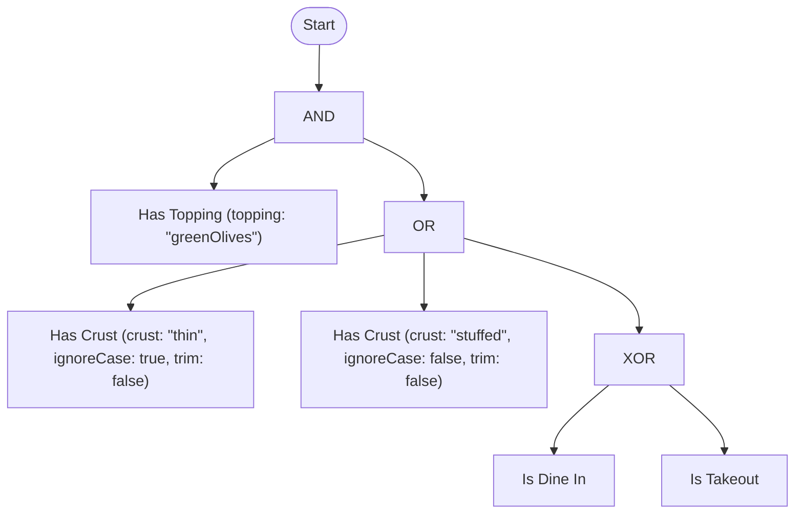

# TruthWeaver

[](https://github.com/rheone/TruthWeaver/actions/workflows/ci.yml)
[](global.json)
[](LICENSE)

A general-purpose **Strong Kleene (K3)** expression engine for .NET. Every
expression evaluates to one of three values — `True`, `False` or `Unknown` — and
`Unknown` is never silently turned into `True` or `False`. Author a rule once as
text, compile it into an immutable tree, and evaluate it many times against
whatever application context you supply — a user, a request, a resource, or
anything else.

<details>
<summary><strong>Table of contents</strong></summary>

- [What it is (and isn't)](#what-it-is-and-isnt)
- [Requirements](#requirements)
- [Getting started](#getting-started)
- [Packages](#packages)
- [Architecture](#architecture)
- [Features](#features)
- [Writing rules](#writing-rules)
- [Rewriting rules](#rewriting-rules)
  - [Expand to primitives](#expand-to-primitives)
  - [NAND-only and NOR-only](#nand-only-and-nor-only)
  - [Compress to derived operators](#compress-to-derived-operators)
  - [Canonical form](#canonical-form)
  - [Simplify](#simplify)
- [Predicate types](#predicate-types)
- [Examples](#examples)
- [Reading diagnostics](#reading-diagnostics)
  - [JSON and YAML rules](#json-and-yaml-rules)
- [Benchmarks](#benchmarks)
- [Glossary](#glossary)
- [Appendix: Truth tables](#appendix-truth-tables)
- [Design documents](#design-documents)
- [License](#license)

</details>

## What it is (and isn't)

`TruthWeaver` answers one question: *what is the truth value of this expression
right now, for this context?* — `True`, `False` or `Unknown`. It knows about `AND`, `OR`, `NOT`, `XOR`, `EQUIVALENT`, `IMPLIES`, `NAND`, `NOR`,
`PARITY`, `ANY`, `ALL`, `NONE`, `BETWEEN`, `COALESCE`, `If`, `IsTrue`, `IsFalse`, `IsUnknown`, `IsKnown`, `ExactlyOne`, the threshold family (`AtLeast`/`AtMost`/`GreaterThan`/
`LessThan`/`Exactly`), terms, and evaluation. It does not know about
permissions, workflows, or policies — those are things you build *on top* of
it. A permission check ("can the current user do X") is one consumer of this
engine, not what the engine itself is.

| Concept | Meaning |
| --- | --- |
| **Rule** | A named unit of persistence: metadata + one expression. |
| **Expression** | The three-valued tree — operators over terms, constants and sub-expressions. |
| **Predicate** | A registered, reusable implementation, e.g. `hasTopping`, `lovesPineapple`. |
| **Term** | A predicate bound to concrete arguments, e.g. `hasTopping(topping: "greenOlives")` — the tree's leaf node. |
| **Operator** | `AND` `OR` `NOT` `XOR` `EQUIVALENT` `IMPLIES` `NAND` `NOR` `PARITY` `ANY` `ALL` `NONE` `BETWEEN(min, max)` `COALESCE` `If` `IsTrue` `IsFalse` `IsUnknown` `IsKnown` `ExactlyOne` and the threshold family (`AtLeast(k)`/`AtMost(k)`/`GreaterThan(k)`/`LessThan(k)`/`Exactly(k)`), plus the constants `True`/`False`/`Unknown`. Operators are case-insensitive and most have a symbol spelling (`&&`, `||`, `!`, `∧`, `∨`, `¬`, `⊕`, `→`, `↔`, `↑`, `↓`, `??`, `? :`). `Project` and `Collapse` are not part of the rule language: they are methods on the result (`Decision.Project(unknownAs)` and `Decision.Collapse(policy)`, see [Collapse](docs/strong-k3/result-transformations/collapse.md)); inside a rule use `COALESCE(x, True)` / `COALESCE(x, False)`. See [Operations](docs/strong-k3/specification/operations.md). |
| **Decision** | The evaluation result: a `TruthValue` plus any faults, and optionally a trace. `IsSatisfied` is fail-closed: only `True` is satisfied. |

Full vocabulary and the predicate-author contract: [CONTEXT.md](CONTEXT.md).

Release status, version policy and the migration guide for every breaking change: [CHANGELOG.md](CHANGELOG.md).

## Requirements

Building from source needs at least the SDK version floor in
[`global.json`](global.json) — currently `11.0.100-rc.1.26425.128` — but
`rollForward: latestMajor` with `allowPrerelease: true` means any later
major .NET SDK on the machine, preview or RC included, is accepted. This
isn't a pin to that exact patch.

## Getting started

1. **Reference the packages you need.** A service that only *implements*
   predicates references `TruthWeaver.Abstractions`; a host that
   authors and evaluates rules references `TruthWeaver` (and
   `TruthWeaver.Yaml` if it wants YAML too). See
   [Packages](#packages) below.

   ```xml
   <ProjectReference Include="..\TruthWeaver\TruthWeaver.csproj" />
   ```

2. **Implement a predicate.** A zero-argument predicate is the simplest
   shape — a class implementing `IPredicate<TContext>`. A predicate answers
   a three-valued `TruthValue`: return `TruthValue.Unknown` when the answer
   is legitimately indeterminate (that is a normal result and records no
   fault), and throw only for a genuine failure:

   ```csharp
   public sealed class LovesPineapple : IPredicate<Customer>
   {
       public static PredicateSchema Schema =>
           PredicateSchema.NoArguments("lovesPineapple", "Loves Pineapple", "Does this customer like pineapple on pizza?");

       public ValueTask<TruthValue> EvaluateAsync(Customer customer, PredicateArguments args, CancellationToken ct) =>
           ValueTask.FromResult(customer.LovesPineapple ? TruthValue.True : TruthValue.False);
   }
   ```

3. **Register it and compile a rule:**

   ```csharp
   PredicateRegistry<Customer> registry = PredicateRegistry<Customer>.CreateBuilder().Add<LovesPineapple>().Build();
   RuleCompiler<Customer> compiler = new(registry);
   CompilationResult<Customer> result = compiler.Compile("lovesPineapple");

   if (!result.Succeeded)
   {
       // result.Diagnostics explains why - surface it to whoever authored the rule.
       return;
   }
   ```

4. **Evaluate it against a context:**

   ```csharp
   Decision decision = await result.CompiledRule!.EvaluateAsync(customer, serviceProvider, cancellationToken: ct);

   if (decision.IsSatisfied)
   {
       // allowed
   }
   ```

That's the whole lifecycle: implement → register → compile once → evaluate
many times. [Architecture](docs/architecture.md) maps
that lifecycle onto the actual folders, and [Examples](#examples) builds up
from here to named arguments, the full operator set, and the full ADR-0003
worked example in DSL, JSON, and YAML.

## Packages

| Package | Use it to |
| --- | --- |
| `TruthWeaver.Abstractions` | Implement predicates. It has no third-party dependency. |
| `TruthWeaver` | Parse, compile, analyze and evaluate rules. |
| `TruthWeaver.Yaml` | Read and write rules and data sources as YAML. |
| `TruthWeaver.DataSources.Json` | Read variable values from a JSON document. |
| `TruthWeaver.Predicates` | Use ready-made predicates for common checks. |
| `TruthWeaver.Testing` | Assert on decisions and fake predicates in tests. |

A service that only implements predicates references `TruthWeaver.Abstractions` alone. For the dependencies and the contents of each package, see [Packages](docs/packages.md).

## Architecture

The source layout, the compilation pipeline and the evaluation flow are in [Architecture](docs/architecture.md). The evaluation behavior is in [Evaluation](docs/strong-k3/specification/evaluation.md).

## Features

- **Kleene three-valued logic.** Every operator follows the three-valued
  truth tables in [ADR-0001](docs/adr/0001-kleene-failure-model.md) (full
  tables: [Appendix](#appendix-truth-tables)) — a predicate fault becomes
  `Unknown`, never a thrown exception or a silently coerced `false`, and a
  predicate can also answer `Unknown` directly. Entry
  point: [`Evaluator`](src/TruthWeaver/Evaluation/Evaluator.cs).
- **A complete Strong Kleene (K3) language, plus external operators.** The
  Strong Kleene connectives are `NOT`, `AND`, `OR`, `IMPLIES`, `EQUIVALENT`,
  `XOR`, `PARITY`, `NAND`, `NOR`, the cardinality operators
  (`AtLeast`/`AtMost`/`Exactly`, `ANY`/`ALL`/`NONE`/`BETWEEN`) and `If`/`? :`.
  `COALESCE`/`??` and the four inspections (`IsTrue`, `IsFalse`, `IsUnknown`,
  `IsKnown`) are external operators, not K3 connectives. `Unknown` is also a
  constant. Operators are case-insensitive, have symbol spellings, and every
  notation compiles to the same tree with one canonical form. See
  [Operations](docs/strong-k3/specification/operations.md) and
  [Strong Kleene connectives and external operators](docs/strong-k3/specification/semantics.md#strong-kleene-connectives-and-external-operators).
- **Explicit boundaries.** `COALESCE(x, True|False)` resolves `Unknown` anywhere
  inside a rule; `Decision.Project(unknownAs)` and `Decision.Collapse(policy)` turn
  the rule's three-valued result into a definite value or a two-valued answer at the
  call site, and are not part of the rule. See
  [Result transformations](docs/strong-k3/result-transformations/README.md).
- **Rule rewriting.** Opt-in, value-preserving transforms return a new rule:
  expand to primitives, to NAND-only or NOR-only, compress back to derived
  operators, canonicalize, simplify, plus whitespace normalization. See
  [Rewriting rules](#rewriting-rules).
- **Readable diagnostics.** Every authoring error is a structured `Diagnostic`
  (code, span or JSON/YAML path, expected/found, "did you mean") with a
  plain-text formatter. See [Reading diagnostics](#reading-diagnostics).
- **Per-evaluation memoization.** A term referenced from multiple branches
  of the same rule is invoked at most once per evaluation, keyed by
  structural term identity (see [CONTEXT.md#term-identity](CONTEXT.md#term-identity)).
  Entry point: [`Evaluator`](src/TruthWeaver/Evaluation/Evaluator.cs).
- **A Strong K3 BDD analyzer**, not brute-force truth tables, flags
  sub-expressions that are `True` (or `False`) for every `{True, False, Unknown}`
  assignment of their terms (e.g.
  `hasTopping(topping: "greenOlives") AND FALSE`) as compile diagnostics. It does
  not flag `A AND NOT A` or `A OR NOT A`: both are `Unknown` when `A` is.
  Entry point: [`Analyzer`](src/TruthWeaver/Analysis/Analyzer.cs) and
  [`BddManager`](src/TruthWeaver/Analysis/BddManager.cs).
- **Resource limits and `CompilationMode.Lenient`.** `CompilerOptions`
  bounds tree depth, node count, and the analyzer's term cap so an
  admin-authored rule can't hang a request thread; `Lenient` mode compiles
  an unregistered predicate to a permanent `Unknown` term instead of an
  error. Entry point: [`CompilerOptions`](src/TruthWeaver/Compilation/CompilerOptions.cs).
- **`EvaluationOptions`**: an opt-in `FaultBudget` for fail-fast behavior
  during a known outage, an `Exhaustive` mode that runs every reachable term
  without changing the result, and an overall evaluation timeout linked into
  the caller's `CancellationToken`. Entry point:
  [`EvaluationOptions`](src/TruthWeaver/Evaluation/EvaluationOptions.cs).
- **Scoped DI resolution.** Class-based predicates resolve fresh from the
  `IServiceProvider` supplied to each evaluation call, so a predicate with a
  scoped dependency works correctly even though a `CompiledRule<TContext>`
  is long-lived and shared. Entry point:
  [`TruthWeaverServiceCollectionExtensions`](src/TruthWeaver/DependencyInjection/TruthWeaverServiceCollectionExtensions.cs).
- **Structured logging and metrics.** Faults, compile diagnostics, and
  rule-swap notifications log as structured events through `ILogger<T>`; a
  `"TruthWeaver"` `Meter` exposes counters for evaluations, faults, and
  compile diagnostics, observable through OpenTelemetry's `AddMeter` with no
  new dependency. Entry points: [`src/TruthWeaver/Logging`](src/TruthWeaver/Logging)
  and [`TruthWeaverMetrics`](src/TruthWeaver/Metrics/TruthWeaverMetrics.cs).
- **Structural rule diffing.** `RuleDiff.Compare` compares two compiled
  rules and reports which operator, term, or constant nodes were added,
  removed, or changed, each located by operand-index path and paired with a
  human-readable description — useful for "what did this edit actually
  change" tooling. The result also says whether the change preserves meaning
  (see [Rule equivalence](#rule-equivalence)). Entry point:
  [`RuleDiff`](src/TruthWeaver/Diffing/RuleDiff.cs).
- **Strong K3 rule equivalence.** `RuleEquivalence.Compare` says whether two
  compiled rules give the same result for every `True`/`False`/`Unknown`
  assignment of their terms, with a counter-example when they do not. See
  [Rule equivalence](#rule-equivalence). Entry point:
  [`RuleEquivalence`](src/TruthWeaver/Analysis/RuleEquivalence.cs).
- **Diagram rendering.** A compiled rule renders as a Mermaid flowchart or
  an indented plain-text tree, optionally colored by one evaluation's
  result and short-circuit path — see
  [Rendering a rule as a diagram](docs/rulebuilder.md#rendering-a-rule-as-a-diagram). Entry
  points: [`MermaidTreePrinter`](src/TruthWeaver/Printing/MermaidTreePrinter.cs),
  [`PlainTextTreePrinter`](src/TruthWeaver/Printing/PlainTextTreePrinter.cs).
- **Ready-made predicates.** `TruthWeaver.Predicates` ships generic
  string-comparison, null/empty, set-equality, and regex-matching predicate
  factories so common checks don't need a hand-written class. Entry point:
  [`src/TruthWeaver.Predicates`](src/TruthWeaver.Predicates).
- **Test support.** `TruthWeaver.Testing` ships fluent `Decision`
  assertions and fake/scripted predicate factories (fixed answer, simulated
  fault, sequenced answers, `Unknown` answered directly) for testing without a hand-written
  `IPredicate<TContext>` per test. Entry point:
  [`src/TruthWeaver.Testing`](src/TruthWeaver.Testing).

## Writing rules

Rule text, JSON, YAML and `RuleBuilder` all compile to the same immutable tree.

- [Rule text](docs/rule-text.md): the grammar, grouping delimiters, whitespace and case.
- [Rule formats](docs/rule-formats.md): how to choose between rule text, JSON and YAML, and how to convert between them.
- [RuleBuilder, outlines and diagrams](docs/rulebuilder.md): assemble a rule in code, describe it and draw it.
- [Strong Kleene (K3) reference](docs/strong-k3/README.md): the meaning of every operator. See [Syntax](docs/strong-k3/specification/syntax.md) for spellings, precedence and operand counts, [Operations](docs/strong-k3/specification/operations.md) for the operator list, [Semantics](docs/strong-k3/specification/semantics.md#strong-kleene-connectives-and-external-operators) for connectives and external operators, and [Result transformations](docs/strong-k3/result-transformations/README.md) for `Collapse` and `Project`.

## Rewriting rules

A compiled rule is immutable, so a rewrite never edits it: it returns a **new**
`CompiledRule` over the same predicates, that evaluates to the same value for every `True`/`False`/`Unknown` assignment of
its terms. Rewrites are opt-in; the compiler never applies one for you, so a rule
always prints and round-trips as it was written.

### Expand to primitives

`ExpandToPrimitives()` replaces every derived operator with its definition in the
primitive kernel: `NOT`, `AND`, `OR`, `AtLeast`, `AtMost`, `Exactly` and `COALESCE`.

```csharp
CompiledRule<MyContext> rule = compiler.Compile("a IMPLIES ANY(b, c)").CompiledRule!;
CompiledRule<MyContext> kernel = rule.ExpandToPrimitives().CompiledRule!;

Console.WriteLine(kernel.CanonicalText);   // only primitive operators
Console.WriteLine(rule.CanonicalText);     // unchanged: (a IMPLIES ANY(b, c))
```

| Derived operator | Expands to |
| --- | --- |
| `a IMPLIES b` | `NOT a OR b` |
| `a XOR b` | `(a AND NOT b) OR (NOT a AND b)` |
| `a EQUIVALENT b` | `(a AND b) OR (NOT a AND NOT b)` |
| `a NAND b` / `a NOR b` | `NOT (a AND b)` / `NOT (a OR b)` |
| `PARITY(a, b, ...)` | `Exactly(1, ...) OR Exactly(3, ...) OR ...` (every odd count) |
| `ExactlyOne(...)` | `Exactly(1, ...)` |
| `ANY(...)` / `ALL(...)` / `NONE(...)` | `AtLeast(1, ...)` / `AtLeast(n, ...)` / `AtMost(0, ...)` |
| `BETWEEN(min, max, ...)` | `AtLeast(min, ...) AND AtMost(max, ...)` (a vacuous bound is dropped) |
| `GreaterThan(k, ...)` / `LessThan(k, ...)` | `AtLeast(k + 1, ...)` / `AtMost(k - 1, ...)` |
| `If(c, t, f)` | `(c AND t) OR (NOT c AND f) OR (t AND f)` |
| `IsTrue(x)` | `COALESCE(x, False)` |
| `IsFalse(x)` | `COALESCE(NOT x, False)` |
| `IsUnknown(x)` | `COALESCE(x, True) AND COALESCE(NOT x, True)` |
| `IsKnown(x)` | `COALESCE(x, False) OR COALESCE(NOT x, False)` |

Every row was checked against an independent truth-table oracle for all
`True`/`False`/`Unknown` inputs, because classical shortcuts fail in Strong
Kleene logic (`a OR NOT a` is not `True`, and `If(Unknown, t, t)` is `t`, which the
`If` row's third term preserves). Nothing is left unexpanded: even the inspections
are expressible with `COALESCE`, which is the primitive that can see `Unknown`.

### Size cap

The three expanding rewrites (`ExpandToPrimitives()`, `ExpandToNand()`, `ExpandToNor()`)
can produce a tree far larger than the rule they start from, so each returns a
`CompilationResult<TContext>` and refuses to build a result larger than
`CompilerOptions.MaxRewriteNodeCount` (default **100,000** nodes, counted as a printed
tree, so a sub-expression shared in memory but written twice counts twice). An
over-cap rewrite never throws and is not built: `Succeeded` is `false`, `CompiledRule`
is `null`, and a single `TRE0016` error says which rewrite hit which cap. To allow a bigger
result, pass options with a larger cap:

```csharp
CompilationResult<MyContext> expanded = rule.ExpandToNand(new CompilerOptions(MaxRewriteNodeCount: 1_000_000));
if (!expanded.Succeeded)
{
    Console.WriteLine(expanded.FormatDiagnostics());   // TRE0016: ExpandToNand would produce more than ...
}
```

How the size grows, so you can predict a refusal:

| Rewrite | Growth |
| --- | --- |
| `ExpandToPrimitives()` | Linear for most operators. `XOR`, `EQUIVALENT`, `If` and the inspections repeat an operand, so nesting them multiplies the printed size by about two per level (exponential in nesting depth). |
| `ExpandToNand()` / `ExpandToNor()` | The primitive size, times a small constant for the NAND or NOR rewrite, plus `C(n, k)` operand subsets for each `AtLeast(k, ...)` over `n` operands (`AtMost(k)` costs `C(n, k + 1)`, `Exactly(k)` both). Each subset is rebuilt as a NAND or NOR conjunction, so a wide threshold is refused quickly. A rewrite is also refused when its primitive form alone is over the cap. |

`CompressToDerived()`, `Canonicalize()` and `Simplify()` never make a rule larger and
have no cap.

### NAND-only and NOR-only

`ExpandToNand()` and `ExpandToNor()` rewrite a rule so the only logical operator is
one universal connective (`NAND` or `NOR`). They expand to the primitive kernel first, then rewrite it:

| Primitive | `ExpandToNand()` | `ExpandToNor()` |
| --- | --- | --- |
| `NOT a` | `a NAND a` | `a NOR a` |
| `a AND b` | `(a NAND b) NAND (a NAND b)` | `(a NOR a) NOR (b NOR b)` |
| `a OR b` | `(a NAND a) NAND (b NAND b)` | `(a NOR b) NOR (a NOR b)` |
| `AtLeast(k, ...)` | `OR` over every k-subset of the `AND` of that subset | same, with the target connective's `AND`/`OR` |
| `AtMost(k, ...)` | `NOT AtLeast(k + 1, ...)` | same |
| `Exactly(k, ...)` | `AtLeast(k) AND AtMost(k)` (a vacuous side is dropped) | same |

Longer `AND`/`OR` chains fold left (both are associative in K3). The threshold
rewrite is monotone, so it is exact for `Unknown` operands too, but it has `C(n, k)`
subsets: very wide thresholds produce very large trees.

**`COALESCE` is the one boundary.** Every circuit built from `NAND`, `NOR`,
`NOT`, `AND` and `OR` is monotone in the information order (`Unknown` below `True`
and `False`), while `COALESCE(x, True)` turns `Unknown` into `True` and `False` into
`False`, which no monotone function can do. So `COALESCE`, and the
inspections (`IsTrue`, `IsFalse`, `IsUnknown`, `IsKnown`) that expand to it, stay as
`COALESCE` nodes with their operands rewritten. A rule without them is purely
`NAND` (or `NOR`). Same guarantees as above: a new rule, the original untouched,
identical results and faults.

Things to know for `ExpandToPrimitives`:

- **Size.** Operators whose definition mentions an operand twice (`XOR`,
  `EQUIVALENT`, `If`, the inspections) repeat that operand's text, so a deeply
  nested rule can grow a lot. The expanded rule's printed text compiles back to
  the same rule, but may exceed the default `CompilerOptions.MaxNodeCount`. The
  result itself is capped at `CompilerOptions.MaxRewriteNodeCount` (see
  [Size cap](#size-cap)).
- **Faults.** A predicate that throws is `Unknown` plus a `Fault` in the expanded
  rule exactly as in the original; terms are still memoized by identity.

### Compress to derived operators

`CompressToDerived()` goes the other way: it recognises primitive shapes and
writes them as readable derived operators. The usual input is an expanded rule,
but any rule is accepted. It does not promise to recover the exact rule that was
expanded, only an equivalent one that is **never larger** (counted in nodes) and
that compresses to itself.

| Primitive shape | Becomes |
| --- | --- |
| `NOT a OR b` (either order) | `a IMPLIES b` |
| `NOT (a AND b)` / `NOT a OR NOT b` | `a NAND b` |
| `NOT (a OR b)` / `NOT a AND NOT b` | `a NOR b` |
| `(a AND NOT b) OR (NOT a AND b)` | `a XOR b` |
| `(a AND b) OR (NOT a AND NOT b)` | `a EQUIVALENT b` |
| `(c AND t) OR (NOT c AND f) OR (t AND f)` | `If(c, t, f)` |
| `Exactly(1, ...) OR Exactly(3, ...) OR ...` (every odd count, 3+ operands) | `PARITY(...)` |
| `AtLeast(1, ...)` / `AtLeast(n, ...)` / `AtMost(0, ...)` / `Exactly(1, ...)` | `ANY` / `ALL` / `NONE` / `ExactlyOne` |
| `NOT AtLeast(k, ...)` / `NOT AtMost(k, ...)` | `AtMost(k - 1, ...)` / `AtLeast(k + 1, ...)` |
| `AtLeast(m, ...) AND AtMost(M, ...)` over the same operands | `BETWEEN(m, M, ...)` |
| `COALESCE(NOT x, False)` | `IsFalse(x)` |
| `COALESCE(x, True) AND COALESCE(NOT x, True)` | `IsUnknown(x)` |
| `COALESCE(x, False) OR COALESCE(NOT x, False)` | `IsKnown(x)` |

Every row is an identity of Strong Kleene logic, checked against the truth-table
oracle for every `True`/`False`/`Unknown` assignment. A `COALESCE` with a constant
that matches none of the rows above, such as `COALESCE(x, True)`, is already the
shortest form and is left as written. Classical-only shapes are never matched:
`a OR NOT a` stays as written. Operand order inside a matched `OR`/`AND` can
differ from the original, which changes the order predicates are invoked in but
never a result.

### Canonical form

`Canonicalize()` gives rules that are equivalent under a fixed set of Strong
Kleene-sound rewrites one deterministic representation, so rules can be compared,
cached and de-duplicated by their `CanonicalText`. It is deterministic,
idempotent (`Canonicalize()` of a canonical rule is the same rule), evaluates
like the original for every `True`/`False`/`Unknown` assignment, and is never
larger than the original.

The rewrites, in the order they are applied (bottom-up, repeated until stable):

1. **Aliases collapse.** `ANY(...)` and `AtLeast(1, ...)` become `OR`; `ALL(...)`
   and `AtLeast(n, ...)` become `AND`; `GreaterThan(k)` becomes `AtLeast(k + 1)`;
   `LessThan(k)` becomes `AtMost(k - 1)`; `ExactlyOne(...)` becomes `Exactly(1, ...)`.
2. **Double negation.** `NOT NOT x` becomes `x` (holds in K3).
3. **Flatten.** `AND` inside `AND`, `OR` inside `OR` and `COALESCE` inside
   `COALESCE` are spliced into the parent (all associative).
4. **Sort.** The operands of the commutative operators (`AND`, `OR`, `XOR`,
   `EQUIVALENT`, `NAND`, `NOR`, `PARITY`, `ExactlyOne`, the threshold family,
   `BETWEEN`) are sorted by their canonical text, ordinally.
5. **Deduplicate.** Repeated operands of `AND`/`OR` are removed (`a AND a` is `a`;
   idempotence holds in K3). Counting operators keep repeats, since they count.

`COALESCE`, `IMPLIES` and `If` keep their operand order because it carries
meaning. **Nothing is folded and no complement law is used:** `a OR NOT a` is not
`True` in Strong Kleene logic (it is `Unknown` when `a` is), so it stays as a
two-operand `OR`; constant folding and the other cost-reducing rewrites are the
job of `Simplify()`.

> [!IMPORTANT]
> The canonical rule has the same *value* as the original but not the same
> *evaluation order*. Reordering, flattening and removing duplicates can change
> which predicate is invoked first, which are invoked at all once a short-circuit
> applies, and so which faults are reported. Use a canonical rule as a comparison
> or storage key; keep evaluating the rule as written if invocation order matters.

### Simplify

`Simplify()` replaces a rule with an equivalent, cheaper one. It starts from the
canonical form (above) and then applies only rewrites that are identities of
Strong Kleene logic, repeating until nothing changes. The result evaluates like
the original for every `True`/`False`/`Unknown` assignment, is never larger
(counted in nodes), and simplifying it again changes nothing.

| Rewrite | Example |
| --- | --- |
| Identity and annihilator constants | `a AND True` is `a`; `a AND False` is `False`; `a OR False` is `a`; `a OR True` is `True` |
| `Unknown` is kept | `a AND Unknown` stays; `True AND Unknown` is `Unknown`; `NOT Unknown` is `Unknown` |
| Constant folding | `NOT True` is `False`; any operator over constants folds to a constant |
| Idempotence, double negation, flattening | `a AND a` is `a`; `NOT NOT a` is `a`; `a AND (b AND a)` is `a AND b` |
| Absorption | `a AND (a OR b)` is `a`; `a OR (a AND b)` is `a` |
| De Morgan, only where it removes nodes | `NOT (NOT a AND NOT b)` is `a OR b`; `NOT a NAND NOT b` is `a OR b` |
| Negation through derived operators | `NOT a IMPLIES b` is `a OR b`; `NOT a XOR b` is `a EQUIVALENT b`; `NOT IsKnown(a)` is `IsUnknown(a)` |
| `COALESCE` | `COALESCE(Unknown, a)` is `a`; `COALESCE(a, True, b)` is `COALESCE(a, True)`; `COALESCE(IsKnown(a), b)` is `IsKnown(a)`; `COALESCE(IsTrue(a), False)` is `IsTrue(a)` |
| Inspections | `IsKnown(True)` is `True`; `IsUnknown(IsTrue(a))` is `False`; `IsTrue(NOT a)` is `IsFalse(a)` |
| `If` | `If(True, a, b)` is `a`; `If(c, a, a)` is `a` |
| Derived operator with a constant operand | `a IMPLIES False` is `NOT a`; `a XOR True` is `NOT a`; `a NAND False` is `True` (expanded one level, simplified, kept only if no larger) |
| Thresholds with `True`/`False` operands | `AtLeast(2, True, a, b)` is `a OR b`; `AtMost(0, True, a, b)` is `False`; `Exactly(2, True, True, a)` is `NOT a` |

"Never `Unknown`" operands (constants, the inspections, a `COALESCE` with such an
operand, and operators over only those) also let `COALESCE` and the inspections be
removed.

**Classical rules that deliberately do not apply.** Each of these is valid in
two-valued logic and false in Strong Kleene logic, because it fails when `a` is
`Unknown`, so `Simplify()` never uses it and the rule keeps its value:

| Classical law | Why it fails when `a` is `Unknown` |
| --- | --- |
| `a OR NOT a` is `True` (excluded middle) | `Unknown OR Unknown` is `Unknown` |
| `a AND NOT a` is `False` (non-contradiction) | `Unknown AND Unknown` is `Unknown` |
| `a IMPLIES a` and `a EQUIVALENT a` are `True` | both are `Unknown` |
| `a XOR a` is `False` | it is `Unknown` |
| `a AND (NOT a OR b)` is `a AND b`; `a OR (NOT a AND b)` is `a OR b` (complement absorption) | `Unknown AND (Unknown OR False)` is `Unknown`, but `Unknown AND False` is `False` |
| `If(c, t, f)` with an `Unknown` condition follows a branch | it yields a value only when both branches agree |

Only plain absorption (`a AND (a OR b)`) holds, since `AND` and `OR` form a lattice.

> [!IMPORTANT]
> Like `Canonicalize()`, simplification keeps the *value* but not the evaluation
> order or side effects. Operands can be reordered, merged or dropped; an annihilated
> `AND` never evaluates its other operands, so a predicate the original would have
> invoked (and any fault it would have reported) may not run.

The rewrite does not use the analyzer's dual-rail findings: those are reported as
diagnostics (`StructuralTautology`, `StructuralContradiction`) for authors, and
every simplification here is a local, structural rule that is easy to check.

## Rule equivalence

`RuleEquivalence.Compare(first, second)` answers "do these two rules always give
the same result?" under Strong Kleene logic, using the same dual-rail BDD as the
analyzer. It is exact, not sampled, and returns a `RuleEquivalenceResult`:

| `Outcome` | Meaning |
| --- | --- |
| `Equivalent` | Same value for every `True`/`False`/`Unknown` assignment of the terms. |
| `NotEquivalent` | Some assignment differs. `CounterExample` maps every distinct term in either rule (keyed by its printed form, such as `hasRole(role: "Y")`) to the value it takes. |
| `Undecided` | The rules have more distinct terms between them than `CompilerOptions.MaxAnalysisTerms` (default 20). `Reason` says so; nothing is guessed. |

```csharp
RuleEquivalenceResult result = RuleEquivalence.Compare(
    compiler.Compile("NOT (a AND b)").CompiledRule!,
    compiler.Compile("NOT a OR NOT b").CompiledRule!);
// result.Outcome == RuleEquivalenceOutcome.Equivalent

RuleEquivalenceResult excluded = RuleEquivalence.Compare(
    compiler.Compile("a OR NOT a").CompiledRule!,
    compiler.Compile("TRUE").CompiledRule!);
// excluded.Outcome == NotEquivalent, excluded.CounterExample["a"] == TruthValue.Unknown
```

Limits to know:

- **Terms are opaque and independent.** Two terms are the same variable only when
  their predicate name and arguments match. The check cannot know that two
  different predicates are related, so `isManager` and `isDepartmentHead` are
  treated as unrelated.
- **The cap is on distinct terms across both rules**, not on size. A rule pair at
  exactly the cap is decided. Pass `new CompilerOptions(MaxAnalysisTerms: n)` to
  change it; only that option is read.
- **Value only.** Evaluation order, short-circuiting and faults are not compared.
- **A counter-example is one witness**, not all of them. Terms the difference does
  not depend on are reported as `False`.
- **Strong K3 is not two-valued logic.** `a OR NOT a` is not equivalent to `TRUE`,
  because it is `Unknown` when `a` is.

`RuleDiff.Compare` uses this check: `RuleDiffResult.PreservesMeaning` is `true`
when the rules are equivalent (including when structurally identical), `false`
when not, and `null` when the term cap makes it undecidable (default 20). Call
`RuleEquivalence.Compare` directly, or pass `new CompilerOptions(MaxAnalysisTerms: n)` as the optional third argument of `RuleDiff.Compare(before, after, options)`, to use a larger cap; only that option is read and omitting it behaves as before.

## Predicate types

Every predicate is one of four registration shapes, and they mix freely
within one `PredicateRegistryBuilder<TContext>.Build()`. Two independent
axes: **how many rule-authored arguments** it takes (zero, one, or several —
"n"), and **where its implementation comes from** (a stateless lambda, or a
class resolved from DI).

| Shape | Arguments | Implementation | When to use |
| --- | --- | --- | --- |
| Lambda, 0 args | none | stateless delegate | A simple stateless check with no rule-authored parameter. |
| Lambda, 1 arg | one | stateless delegate with a 1-argument schema | The common case — a stateless check parameterized by the rule text, e.g. `hasTopping(topping: "greenOlives")`. |
| Class-based (DI), 0 args | none | `IPredicate<TContext>` | Needs a scoped/injected dependency but no rule-authored parameter. |
| Class-based (DI), n args | several | `IPredicate<TContext>` with a multi-argument schema | Needs both rule-authored parameters *and* one or more injected dependencies. |

Before writing one by hand, check whether
[`TruthWeaver.Predicates`](src/TruthWeaver.Predicates) already has it —
`StringPredicates`, `CollectionPredicates`, and `RegexPredicates` cover
string comparison, null/empty checks, set equality, and regex matching as
generic factories parameterized by a value selector, and
`SelectedValuePredicates` covers the externally-selected-value pattern
(below) for a safe-to-share lookup client. Every method on
`StringPredicates` except one is ordinal-only and fixed-behavior by
design — a case-insensitive variant is a separate predicate
(`EqualsIgnoreCase`), never a rule-text flag on `Equals`. The exception,
`StringPredicates.EqualsConfigurable`, deliberately inverts that: it's one
predicate whose `ignoreCase`/`trim` arguments are set per rule
(case-insensitive by default; comparison is always ordinal, so there is no
`culture` argument), for the case where a
rule author genuinely needs that flexibility rather than a fixed-behavior
predicate per name.

> [!WARNING]
> **Breaking change:** `EqualsConfigurable` no longer has a `culture` argument.
> A rule that still passes one (even `culture: ""`) now fails to compile with an
> `UnknownArgument` diagnostic that tells you to remove it. Previously a non-empty
> `culture` faulted at evaluation, so such a rule answered `Unknown`.

A null selected value is a definite `False` by default, with no fault. Every
`StringPredicates` comparison (`Equals`, `EqualsIgnoreCase`, `StartsWith`,
`EndsWith`, `Contains`, `EqualsConfigurable`), `RegexPredicates.Matches` and
`CollectionPredicates.SetEquals` also take an optional `nullBehavior`
parameter that the host sets at registration. `NullBehavior.Unknown` makes a
null selected value answer `Unknown` instead (still without a fault), so
`NOT hasCrust(crust: "thin")` stays `Unknown` for an order with no crust
rather than becoming `True`, and `Decision.IsSatisfied` stays fail-closed.
The default is `NullBehavior.False`, so existing registrations behave as
before. `StringPredicates.IsNullOrEmpty` has no option: it is a null test and
always returns a definite answer.

```csharp
StringPredicates.Equals<PizzaOrder>(
    "hasCrust", order => order.Crust, "Has Crust", argumentName: "crust",
    nullBehavior: NullBehavior.Unknown);
```

### 0 arguments, stateless lambda

```csharp
.Add(
    PredicateSchema.NoArguments("isBanned", "Is Banned", "Is the current customer's account banned?"),
    (customer, args, ct) => ValueTask.FromResult(customer.IsBanned ? TruthValue.True : TruthValue.False))
```

### 1 argument, stateless lambda

See [Example 3](#3-named-arguments)'s `hasTopping(topping: "greenOlives")` —
a single named `string` argument, no injected dependency.

### 0 arguments, class-based (DI)

See [Example 1](#1-a-single-predicate)'s `LovesPineapple` — a class
implementing `IPredicate<TContext>`, resolved fresh from `IServiceProvider`
on every evaluation (the right shape whenever a scoped dependency, e.g. a
`DbContext`, is involved, even with no rule-authored parameter).

### n arguments, class-based, multiple injected dependencies

The shape that combines everything: two rule-authored arguments *and* two
constructor-injected dependencies, resolved from DI per evaluation:

```csharp
public sealed class HasEarnedEnoughLoyaltyStamps : IPredicate<PizzaOrder>
{
    private readonly ILoyaltyStampStore stamps;
    private readonly TimeProvider clock;

    public HasEarnedEnoughLoyaltyStamps(ILoyaltyStampStore stamps, TimeProvider clock)
    {
        this.stamps = stamps;
        this.clock = clock;
    }

    public static PredicateSchema Schema =>
        new(
            "hasEarnedEnoughLoyaltyStamps",
            "Has Earned Enough Loyalty Stamps",
            "Has the order's customer earned at least the given number of loyalty stamps within the given time window?",
            [
                new PredicateArgumentSchema("minCount", "The minimum number of loyalty stamps required.", LiteralKind.Int64),
                new PredicateArgumentSchema("withinDays", "The lookback window, in days.", LiteralKind.Int64),
            ]);

    public async ValueTask<TruthValue> EvaluateAsync(PizzaOrder order, PredicateArguments args, CancellationToken ct)
    {
        long minCount = args.GetInt64("minCount");
        long withinDays = args.GetInt64("withinDays");
        DateTimeOffset cutoff = this.clock.GetUtcNow().AddDays(-withinDays);

        long count = await this.stamps.CountStampsSinceAsync(order.Id, cutoff, ct);
        return count >= minCount ? TruthValue.True : TruthValue.False;
    }
}
```

Used in a rule as `hasEarnedEnoughLoyaltyStamps(minCount: 5, withinDays: 30)`.
`ILoyaltyStampStore` might be scoped (an `IDbContextFactory`-backed store)
and `TimeProvider` is typically a singleton — both resolve correctly on
every evaluation because the predicate itself is resolved fresh from
`IServiceProvider`, not constructed once at registration.

Wiring it up: **`AddTruthWeaver` registers the registry and compiler,
not the predicate types themselves** — a class-based predicate (and its own
dependencies) must be registered in the host's container separately, same
as any other DI service:

```csharp
services.AddScoped<ILoyaltyStampStore, LoyaltyStampStore>();
services.AddSingleton(TimeProvider.System);
services.AddScoped<HasEarnedEnoughLoyaltyStamps>();  // the predicate type itself
services.AddScoped<LovesPineapple>();

services.AddTruthWeaver<PizzaOrder>(builder => builder
    .Add<LovesPineapple>()
    .Add<HasEarnedEnoughLoyaltyStamps>());
```

Both lambda and class-based predicates register against the same
`PredicateRegistryBuilder<TContext>.Add(...)` overloads — the difference is
purely dependency lifetime and how many rule-authored arguments the schema
declares, never a difference in rule text or how the compiler validates a
term. See
[ADR-0002](docs/adr/0002-evaluation-semantics.md#predicate-registration-and-dependency-lifetimes).

### n arguments, class-based, externally-selected value

`HasEarnedEnoughLoyaltyStamps` above injects a dependency to read a value it
already knows how to interpret (`minCount`, `withinDays` are values, used
directly). A related but distinct shape: a rule-text literal argument and/or
a `TContext`-supplied value is a **key to be looked up** — not a value
already ready to use — and a constructor-injected service performs that
live lookup before the predicate can answer anything. There is no
single canonical shape here; it covers three distinct cases, none more
central than the others:

1. **Single-value, no comparison target.** The literal key resolves
   directly to the answer — there's no "other side" to compare
   against, and `TContext` may not be read at all. A feature-flag check is
   the classic instance:

   ```csharp
   public sealed class IsPromoActive(IPromoService promos) : IPredicate<object?>
   {
       public static PredicateSchema Schema =>
           new(
               "isPromoActive",
               "Is Promo Active",
               "Is the given promo code currently active, selected live from the promotions service?",
               [new PredicateArgumentSchema("promoCode", "The promo code to look up.", LiteralKind.String)]);

       public async ValueTask<TruthValue> EvaluateAsync(object? context, PredicateArguments args, CancellationToken ct) =>
           await promos.IsActiveAsync(args.GetString("promoCode"), ct) ? TruthValue.True : TruthValue.False;
   }
   ```

   Used in a rule as `isPromoActive(promoCode: "SUMMER-2026")`.

2. **Single-sided value check.** One side — the argument or a context
   value — is resolved live; the other side is a plain value already
   sitting on `TContext`, needing no resolution of its own. Note that
   `TContext` here has no user field at all — this pattern isn't about "the
   current user," it's about a key that needs a live lookup:

   ```csharp
   public sealed class IsWithinZoneLimit(IZoneLimitLookupService zoneLimits) : IPredicate<DeliveryRun>
   {
       public static PredicateSchema Schema =>
           new(
               "isWithinZoneLimit",
               "Is Within Zone Limit",
               "Is the delivery run's amount within the live order limit resolved for the given delivery zone code?",
               [new PredicateArgumentSchema("zoneCode", "The delivery zone code to look up a live limit for.", LiteralKind.String)]);

       public async ValueTask<TruthValue> EvaluateAsync(DeliveryRun run, PredicateArguments args, CancellationToken ct)
       {
           string zoneCode = args.GetString("zoneCode");
           decimal limit = await zoneLimits.ResolveLimitAsync(zoneCode, ct);
           return run.Amount <= limit ? TruthValue.True : TruthValue.False;
       }
   }
   ```

   Used in a rule as `isWithinZoneLimit(zoneCode: "Z-100")`. Only
   `zoneCode` is resolved; `run.Amount` is read straight off
   `TContext`, no lookup needed.

3. **Two-sided comparison.** Both a `TContext`-supplied anchor and the
   rule-text argument are independently resolved through the injected
   service, and the two *resolved* results are compared — the original
   motivating case (a relationship check), but only one instance of this
   family, not the pattern itself:

   ```csharp
   public sealed class IsAssignedToCandidateDriver(IDriverLookupService drivers) : IPredicate<PizzaOrder>
   {
       public static PredicateSchema Schema =>
           new(
               "isAssignedToCandidateDriver",
               "Is Assigned To Candidate Driver",
               "Does the order's actual assigned driver, resolved live, match the given candidate?",
               [new PredicateArgumentSchema("candidateDriverId", "The candidate driver to validate.", LiteralKind.Guid)]);

       public async ValueTask<TruthValue> EvaluateAsync(PizzaOrder order, PredicateArguments args, CancellationToken ct)
       {
           Guid candidateDriverId = args.GetGuid("candidateDriverId");
           // candidateDriverId here belongs to "Mister Moneybags," our top delivery driver.
           Guid actualDriverId = await drivers.ResolveDriverIdAsync(order.Id, ct);
           return actualDriverId == candidateDriverId ? TruthValue.True : TruthValue.False;
       }
   }
   ```

   Used in a rule as
   `isAssignedToCandidateDriver(candidateDriverId: "3fa85f64-5717-4562-b3fc-2c963f66afa6")`.
   `order` (the context) is an order id, not "the current user" — it
   needs its own resolution just as much as the argument does. Neither side
   of a two-sided comparison is privileged as "the identity one."

A few things stay true across all three shapes:

- The rule-text argument is a **key**, not necessarily an identity — a
  `String` cost-center code is exactly as valid a key as a `Guid`. Whatever
  it resolves to plays no role in the DSL, JSON, or YAML surface; it exists
  only inside `EvaluateAsync`.
- `TContext` participation is optional. Shape 1 above never reads it at
  all; shapes 2 and 3 read it, but nothing about this pattern requires that.
- Term identity ([CONTEXT.md#term-identity](CONTEXT.md#term-identity)) is
  unaffected: the literal argument is still compared as an ordinary literal
  for memoization purposes. What it resolves to on any given evaluation
  never enters term identity. The predicate-author contract
  ([CONTEXT.md#the-predicate-author-contract](CONTEXT.md#the-predicate-author-contract))
  still applies — the same argument plus the same context within *one*
  evaluation must yield the same answer, so a resolution service that's
  internally consistent within a single evaluation (even if the underlying
  data could change between evaluations) is what the contract expects.
- Because the live call happens inside `EvaluateAsync`, a lookup failure
  (timeout, connection error) is absorbed the same way any other predicate
  fault is — as a `Fault` and `TruthValue.Unknown` (ADR-0001), never an
  unhandled exception. A predicate that merely cannot decide (for example
  the data is not available) returns `TruthValue.Unknown` directly, with no
  `Fault`. No special handling is needed in the predicate itself; see [`IPredicate<TContext>`](src/TruthWeaver.Abstractions/IPredicate.cs).

This is the documented alternative to the deferred
"[context-bound term arguments](.scratch/deferred-features/spec.md)" feature (a
path-expression mini-language like `IsManagerOf({{resource.ownerId}})`) —
every shape above is expressible today, with no engine changes, by letting
the predicate itself select whatever it needs.

**All three examples above are class-based**, which is the right choice
whenever the thing doing the selecting is a scoped dependency (a
`DbContext`, a per-request `HttpClient`) that must be re-created fresh on
every evaluation. When the lookup client is instead safe to capture once
— a long-lived, thread-safe instance such as a cached feature-flag reader or
an `HttpClient`-backed lookup wrapper already held by the host —
`SelectedValuePredicates` in [`TruthWeaver.Predicates`](src/TruthWeaver.Predicates)
covers the same pattern as a lighter-weight lambda factory, with no one-off
class needed. The single-value convenience overload matches shape 1 above:

```csharp
(PredicateSchema schema, Func<object?, PredicateArguments, CancellationToken, ValueTask<TruthValue>> evaluate) =
    SelectedValuePredicates.Create<object?>(
        "isPromoActive",
        "Is Promo Active",
        "Is the given promo code currently active, selected live from the promotions service?",
        async (_, args, ct) => await promos.IsActiveAsync(args.GetString("promoCode"), ct) ? TruthValue.True : TruthValue.False,
        new PredicateArgumentSchema("promoCode", "The promo code to look up.", LiteralKind.String));
```

A second overload takes a separate `test` delegate for shapes 2 and 3 above,
when it reads more clearly to keep "select" and "turn the selected value
into an answer" apart. Both paths solve the same conceptual pattern; neither
replaces the other — reach for `SelectedValuePredicates` when the lookup
client is safe to share, and a hand-written `IPredicate<TContext>` (as shown
above) when it isn't.

### Arguments read from a data source

A literal argument is fixed in the rule. When the value changes per request, or lives in a JSON or YAML
document, write a variable reference instead: the source name and a query. It is resolved on every
evaluation.

<!-- doctest:rule ageVariable -->
```text
ageAtLeast(min: from("user", "$.minAge"))
```

Declare the source names when you compile (`new CompilerOptions(DataSources: ...)` with a `DataSourceDeclarations`), and pass
the sources when you evaluate (`rule.EvaluateAsync(context, services, dataSources)`). A name that was not declared is a
`TRE0024` error, and a name declared with an `IQueryValidator` (for example `JsonQueryValidator.Instance`) turns a malformed query into a `TRE0025` error. Nothing is read at compile time. A missing, ambiguous or mistyped result, an unsupplied source or a
failing source makes the term `Unknown` and records a `Fault` carrying a `VariableResolutionException`; the fault and the
trace name the reference, never the resolved value. In tests, `FakeDataSource` (in `TruthWeaver.Testing`) stands in for a
real source. See the [data sources guide](docs/data-sources.md) and
[ADR-0006](docs/adr/0006-data-sources-for-expression-variables.md).

## Examples

Seven examples, each adding one more piece — a single predicate, combining
predicates, named arguments, `XOR`/`EQUIVALENT`/`ExactlyOne`/the threshold family,
the full worked example in all three formats, assembling that same rule with
`RuleBuilder` instead of writing text, and matching a value against one or
several constants — plus a bonus on turning a denial into a human-readable
sentence.

### 1. A single predicate

<!-- doctest:rule ex1 -->
```text
lovesPineapple
```

```csharp
PredicateRegistry<Customer> registry = PredicateRegistry<Customer>.CreateBuilder().Add<LovesPineapple>().Build();
RuleCompiler<Customer> compiler = new(registry);
CompiledRule<Customer> rule = compiler.Compile("lovesPineapple").CompiledRule!;

Decision decision = await rule.EvaluateAsync(customer, serviceProvider, cancellationToken: ct);
```

### 2. Combining predicates: `AND` / `OR` / `NOT`

<!-- doctest:rule ex2 -->
```text
lovesPineapple AND NOT isBanned
```

`NOT` binds tighter than `AND`, which binds tighter than `OR`, so this
parses as `lovesPineapple AND (NOT isBanned)` without needing parentheses.

### 3. Named arguments

<!-- doctest:rule ex3 -->
```text
hasTopping(topping: "greenOlives")
```

```csharp
PredicateRegistry<Customer> registry = PredicateRegistry<Customer>.CreateBuilder()
    .Add(
        new PredicateSchema(
            "hasTopping",
            "Has Topping",
            "Does the order include the given topping?",
            [new PredicateArgumentSchema("topping", "The topping to check for.", LiteralKind.String)]),
        (customer, args, ct) =>
            ValueTask.FromResult(customer.Toppings.Contains(args.GetString("topping")) ? TruthValue.True : TruthValue.False))
    .Build();
```

Argument order in the source text never matters (`hasTopping(topping:
"greenOlives")` and a predicate with several arguments written in any order
compile to the same term identity); argument *values* are case-sensitive
(`"greenOlives"` and `"Greenolives"` are different terms — see
[CONTEXT.md#term-identity](CONTEXT.md#term-identity)). `Description` is
required on both `PredicateSchema` and `PredicateArgumentSchema`, and
`PredicateSchema` also requires a `Label` — a short display name distinct
from the machine-facing `Name` used in rule text (e.g. `Name: "hasTopping"`,
`Label: "Has Topping"`) — so a rule-authoring UI or generated documentation
always has something to show for every predicate and argument. See
[Outlining a compiled rule](docs/rulebuilder.md#outlining-a-compiled-rule) for how this
pairs with operators' own label/description.

A DSL string-literal argument supports four escape sequences: `\"` for a
literal quote, `\\` for a literal backslash, `\n` for a newline, and `\t` for
a tab. For example, `hasTopping(topping: "Chef's \"Special\"")` compiles to
a string argument whose value is `Chef's "Special"`, and printing that
compiled rule back to DSL text reproduces `hasTopping(topping: "Chef's
\"Special\"")` unchanged. Any other backslash sequence
(e.g. `\p`) is a compile-time `InvalidEscapeSequence` diagnostic, not a
silently-corrupted literal value — the compilation fails rather than
guessing what you meant. This escaping rule is specific to the DSL text
format: the JSON and YAML forms (see
[Converting between DSL, JSON, and YAML](docs/rule-formats.md#converting-between-dsl-json-and-yaml))
use their own format's native string escaping (`System.Text.Json` and
YamlDotNet respectively), not this rule.

A predicate can take more than one named argument — same registration shape,
just a longer `PredicateArgumentSchema` array and an `EvaluateAsync` that
reads more than one `Get*` call:

<!-- doctest:rule ex3b -->
```text
hasToppingAmount(topping: "pepperoni", amount: "extra")
```

```csharp
PredicateRegistry<Customer> registry = PredicateRegistry<Customer>.CreateBuilder()
    .Add(
        new PredicateSchema(
            "hasToppingAmount",
            "Has Topping Amount",
            "Does the order include the given topping at the given amount?",
            [
                new PredicateArgumentSchema("topping", "The topping to check for.", LiteralKind.String),
                new PredicateArgumentSchema("amount", "The amount requested (e.g. \"regular\" or \"extra\").", LiteralKind.String),
            ]),
        (customer, args, ct) =>
            ValueTask.FromResult(
                customer.ToppingAmounts.TryGetValue(args.GetString("topping"), out string? amount)
                && amount == args.GetString("amount")
                    ? TruthValue.True
                    : TruthValue.False))
    .Build();
```

`hasToppingAmount(topping: "pepperoni", amount: "extra")` and
`hasToppingAmount(amount: "extra", topping: "pepperoni")` compile to the
exact same term identity — argument order in the source text still never
matters, however many arguments a predicate declares (see
[Term identity](CONTEXT.md#term-identity)).

### 4. `XOR`, `EQUIVALENT`, `ExactlyOne`, and the threshold family

<!-- doctest:rule ex4a -->
```text
AtLeast(2, approvedByAlice, approvedByBob, approvedByCarol)
```

"At least two of these three approvals." Its siblings read the same way:
`AtMost(1, ...)`, `GreaterThan(1, ...)`, `LessThan(2, ...)`, and
`Exactly(2, ...)` all compile to one shared `ThresholdExpression` node,
differing only in which comparison against the true-operand count they
apply (see [Operations](docs/strong-k3/specification/operations.md) for every operator).

`ExactlyOne(a, b, c)` is the n-ary "exactly one of these" operator; `XOR` is
binary-only — a third operand is a compile error that points at both
alternatives. Use `ExactlyOne` for "exactly one", or `PARITY(a, b, c)` for
n-ary *parity* (an odd number are true; `Unknown` if any operand is `Unknown`).
The two differ from three operands: with all of `a`, `b`, `c` true, `PARITY` is
`True` and `ExactlyOne` is `False`.

`EQUIVALENT` (`IFF`, `↔`) is `XOR`'s counterpart — "these two must agree":

<!-- doctest:rule ex4b -->
```text
isPrimaryReviewer EQUIVALENT isBackupReviewer
```

reads as "exactly one of primary/backup reviewer status, or neither" — true
when both are reviewers or neither is, false when exactly one is.

`IMPLIES` (or `→`) is material implication — "if this holds, that must too":

<!-- doctest:rule ex4c -->
```text
isContractor IMPLIES hasSignedNda
```

It is `NOT isContractor OR hasSignedNda`, so a non-contractor passes
regardless of the NDA, and when `isContractor` is `True` the result is just
`hasSignedNda`. Like `XOR`/`EQUIVALENT` it is binary and must be parenthesized
next to `AND`/`OR` or another infix operator
(`(isContractor IMPLIES hasSignedNda) AND isActive`); in JSON/YAML it is
`{"op": "implies", "operands": [antecedent, consequent]}`.

### 5. The full worked example, in all three formats

Rule text as authored (`CanonicalText` prints the same rule with the optional `hasCrust` arguments filled in from their defaults):

<!-- doctest:rule worked -->
```text
hasTopping(topping: "greenOlives") AND (hasCrust(crust: "thin") OR hasCrust(crust: "stuffed", ignoreCase: false) OR (isDineIn XOR isTakeout))
```

The same rule as JSON:

<!-- doctest:json worked -->
```json
{
  "op": "and",
  "operands": [
    { "predicate": "hasTopping", "args": { "topping": "greenOlives" } },
    {
      "op": "or",
      "operands": [
        { "predicate": "hasCrust", "args": { "crust": "thin" } },
        { "predicate": "hasCrust", "args": { "crust": "stuffed", "ignoreCase": false } },
        {
          "op": "xor",
          "operands": [
            { "predicate": "isDineIn" },
            { "predicate": "isTakeout" }
          ]
        }
      ]
    }
  ]
}
```

...and in YAML (`TruthWeaver.Yaml`):

<!-- doctest:yaml worked -->
```yaml
op: and
operands:
  - predicate: hasTopping
    args:
      topping: "greenOlives"
  - op: or
    operands:
      - predicate: hasCrust
        args:
          crust: "thin"
      - predicate: hasCrust
        args:
          crust: "stuffed"
          ignoreCase: false
      - op: xor
        operands:
          - predicate: isDineIn
          - predicate: isTakeout
```

Registering predicates and evaluating:

```csharp
(PredicateSchema hasCrustSchema, var hasCrustEvaluate) =
    StringPredicates.EqualsConfigurable<PizzaOrder>("hasCrust", order => order.Crust, "Has Crust", argumentName: "crust");

PredicateRegistry<PizzaOrder> registry = PredicateRegistry<PizzaOrder>.CreateBuilder()
    .Add<IsDineIn>()
    .Add<IsTakeout>()
    .Add(
        new PredicateSchema(
            "hasTopping",
            "Has Topping",
            "Does the order include the given topping?",
            [new PredicateArgumentSchema("topping", "The topping to check for.", LiteralKind.String)]),
        (order, args, ct) =>
            ValueTask.FromResult(order.Toppings.Contains(args.GetString("topping")) ? TruthValue.True : TruthValue.False))
    .Add(hasCrustSchema, hasCrustEvaluate)
    .Build();

RuleCompiler<PizzaOrder> compiler = new(registry);
CompilationResult<PizzaOrder> result = compiler.Compile(ruleText);

if (!result.Succeeded)
{
    // Surface result.Diagnostics to whoever is authoring the rule.
    // The previously persisted rule (if any) stays active — see ADR-0002.
    return;
}

CompiledRule<PizzaOrder> rule = result.CompiledRule!;
Decision decision = await rule.EvaluateAsync(order, serviceProvider, cancellationToken: cancellationToken);

if (decision.IsSatisfied)
{
    // allowed
}
```

`IsDineIn`/`IsTakeout` are class-based predicates (`IPredicate<PizzaOrder>`),
resolved fresh from `serviceProvider` on every call — the right shape for a
predicate with a scoped dependency such as a `DbContext`. `hasTopping` is a
hand-written stateless lambda; `hasCrust` comes from the ready-made
`StringPredicates.EqualsConfigurable` factory instead (see
[Predicate types](#predicate-types)) — it takes `crust` as its rule-text
comparison target, plus `ignoreCase`/`trim` arguments with sensible
defaults, so `hasCrust(crust: "thin")` alone already compiles. All three
forms register against the same `PredicateRegistryBuilder<TContext>`; see
[ADR-0002](docs/adr/0002-evaluation-semantics.md#predicate-registration-and-dependency-lifetimes).

Wiring into a host's DI container instead of constructing things by hand:

```csharp
services.AddTruthWeaver<PizzaOrder>(builder => builder
    .Add<IsDineIn>()
    .Add<IsTakeout>());
```

### 6. The same rule, assembled with `RuleBuilder` instead of text

Same tree as example 5's `hasTopping(topping: "greenOlives") AND
(hasCrust(...) OR hasCrust(...) OR (isDineIn XOR isTakeout))`, built without
writing DSL, JSON, or YAML text by hand — useful when a rule's shape comes
from application logic (e.g. a dynamically assembled list of conditions)
rather than an author typing it directly:

```csharp
using TruthWeaver.Building;

RuleBuilder rule = RuleBuilder.And(
    RuleBuilder.Predicate("hasTopping", ("topping", "greenOlives")),
    RuleBuilder.Or(
        RuleBuilder.Predicate("hasCrust", ("crust", "thin")),
        RuleBuilder.Predicate("hasCrust", ("crust", "stuffed"), ("ignoreCase", false)),
        RuleBuilder.Xor(RuleBuilder.Predicate("isDineIn"), RuleBuilder.Predicate("isTakeout"))));

CompilationResult<PizzaOrder> result = rule.Compile(compiler);
```

Rendering the same rule as a Mermaid diagram:

```csharp
string mermaid = result.CompiledRule!.PrintMermaid();
```

<!-- doctest:mermaid worked -->


Rendering the same rule as a text tree:

```csharp
string tree = result.CompiledRule!.PrintPlainText();
```

<!-- doctest:tree worked -->
```text
AND
├─ Has Topping (topping: "greenOlives")
└─ OR
   ├─ Has Crust (crust: "thin", ignoreCase: true, trim: false)
   ├─ Has Crust (crust: "stuffed", ignoreCase: false, trim: false)
   └─ XOR
      ├─ Is Dine In
      └─ Is Takeout
```

The second `hasCrust` term deliberately sets `ignoreCase: false` in the rule
text itself, rather than leaving every optional argument at its default —
`StringPredicates.EqualsConfigurable` (see [Predicate types](#predicate-types))
declares three rule-text arguments (`crust`, `ignoreCase`, `trim`),
and this shows a rule actually setting more than one of them, not just the
one required argument every other predicate in this example takes. Both
diagrams show every term's rule-text argument values by default — the first
`hasCrust` term's `ignoreCase`/`trim` are filled in from their
schema defaults even though its rule text never mentions them (ADR-0003's
compiler behavior for optional arguments), which is also why the two
`hasCrust` terms are visually distinct here, unlike a predicate label alone.
Pass `showArgumentValues: false` to either `PrintMermaid`/`PrintPlainText`
overload to render structure-only labels instead (see
[Rendering a rule as a diagram](docs/rulebuilder.md#rendering-a-rule-as-a-diagram)).

`RuleBuilder` is not a fourth parallel parser into the AST — every builder
method renders to the exact same flat JSON tree shape [ADR-0003](docs/adr/0003-rule-syntax-and-serialization.md)
defines, and `Compile` hands that JSON to the same `CompileJson` any other
JSON-producing tool would use. A builder-assembled rule therefore gets every
diagnostic a hand-written one would — an unknown predicate, a bad argument,
an out-of-range threshold, `XOR`/`EQUIVALENT`/`IMPLIES`/`NAND`/`NOR` arity, resource limits, structural
tautology/contradiction — nothing here bypasses the Validate/Analyze stages
of the [compilation pipeline](docs/architecture.md#compilation-pipeline). See
[RuleBuilder](docs/rulebuilder.md)
for the full API.

### 7. Matching against a constant, or any of several constants

"Has at least one topping of either pepperoni, mushroom, or green olives" —
two ways to write this, depending on whether the set of alternatives already
has a predicate per value or not.

**If a single-value predicate already exists** (e.g. [Example 3](#3-named-arguments)'s
`hasTopping(topping: "greenOlives")`), just `OR` it together per
alternative — no new predicate needed:

<!-- doctest:rule ex7a -->
```text
hasTopping(topping: "pepperoni") OR hasTopping(topping: "mushroom") OR hasTopping(topping: "greenOlives")
```

Each call is a distinct term (and a distinct memoization unit), so this
reads clearly for a handful of alternatives but gets verbose as the set
grows, and the set of alternatives is baked into the rule text rather than
passed as data.

**For an arbitrary-size set, write a predicate that takes an array
argument** and checks membership itself — one term, one predicate call,
and the alternatives are rule-authored data rather than repeated rule
structure:

```csharp
public sealed class HasAnyTopping : IPredicate<Customer>
{
    public static PredicateSchema Schema =>
        new(
            "hasAnyTopping",
            "Has Any Topping",
            "Does the order include at least one of the given toppings?",
            [
                new PredicateArgumentSchema(
                    "toppings",
                    "The toppings to check for (any match).",
                    LiteralKind.StringArray
                ),
            ]);

    public ValueTask<TruthValue> EvaluateAsync(Customer customer, PredicateArguments args, CancellationToken ct)
    {
        IReadOnlyList<string> toppings = args.GetStringArray("toppings");
        bool result = toppings.Any(topping => customer.Toppings.Any(t => string.Equals(t, topping, StringComparison.Ordinal)));
        return ValueTask.FromResult(result ? TruthValue.True : TruthValue.False);
    }
}
```

Used in a rule as:

<!-- doctest:rule ex7b -->
```text
hasAnyTopping(toppings: ["pepperoni", "mushroom", "greenOlives"])
```

**Case sensitivity is the predicate's own decision, not the engine's.** Term
identity (which two term references count as "the same variable" for
memoization) is always exact/case-sensitive — `"pepperoni"` and
`"Pepperoni"` are different arguments, full stop (see
[CONTEXT.md#term-identity](CONTEXT.md#term-identity)). But *what the
predicate does* with the string it reads via `GetString`/`GetStringArray` is
ordinary C#: the example above uses `StringComparison.Ordinal`
(case-sensitive); switch that one argument to
`StringComparison.OrdinalIgnoreCase` and the same predicate becomes
case-insensitive, with no other change. If both variants are needed, they're
two distinct predicates (e.g. `hasAnyTopping` vs. `hasAnyToppingIgnoreCase`)
rather than a flag threaded through rule text, keeping each one's behavior
fixed and inspectable from its name alone.

The same shape works for "equals one specific constant" too — just compare
against a single value instead of checking array membership (e.g.
`args.GetGuid("id") == expectedId`, or the `hasTopping`/`hasFlavor`-style
single-argument predicates already shown). Whether the constant(s) come
from a `LiteralKind.String`, `Int64`, `Decimal`, `Boolean`, `DateTimeOffset`,
or `Guid` argument (scalar or array) is purely a schema choice — the
compiler validates and converts each one identically (see
[Guid literal tests](tests/TruthWeaver.Tests/GuidLiteralTests.cs)
for a worked `Guid` example).

**"Matches a pattern" instead of "matches a fixed set"** is the same idea
again, just with `Regex.IsMatch` instead of set membership — the pattern
itself is a rule-authored `string` argument, not a special literal kind:

```csharp
public sealed class HasToppingMatching : IPredicate<Customer>
{
    public static PredicateSchema Schema =>
        new(
            "hasToppingMatching",
            "Has Topping Matching",
            "Does the order include a topping whose code matches the given regular expression?",
            [new PredicateArgumentSchema("pattern", "The regular expression to match a topping code against.", LiteralKind.String)]);

    public ValueTask<TruthValue> EvaluateAsync(Customer customer, PredicateArguments args, CancellationToken ct)
    {
        Regex pattern = new(args.GetString("pattern"), RegexOptions.None, TimeSpan.FromMilliseconds(100));
        return ValueTask.FromResult(customer.Toppings.Any(pattern.IsMatch) ? TruthValue.True : TruthValue.False);
    }
}
```

Used in a rule as `hasToppingMatching(pattern: "^EXTRA-.+$")` — "any
topping code of the form `EXTRA-CHEESE`." Pass `RegexOptions.IgnoreCase`
instead of `RegexOptions.None` for a case-insensitive match, same as the
`StringComparison` choice above. The explicit timeout matters here more than
in the other examples: unlike a fixed-set comparison, a pattern is
rule-authored text that could — accidentally or not — be pathologically
slow to match (catastrophic backtracking), and a predicate is exactly where
that risk should be contained, rather than letting it stall evaluation for
every rule that reaches this term.

`RegexPredicates` in [`TruthWeaver.Predicates`](src/TruthWeaver.Predicates)
already wraps this pattern with the same timeout discipline, if a
hand-written predicate isn't needed.

### Bonus: explaining a denied decision

`Decision`/`Fault`/`Trace` give you the *structured* reason for a denial;
turning that into a sentence for an end user or a support ticket is the
host's job. [Humanizer](https://github.com/Humanizr/Humanizer) is a
convenient pairing — predicate names are already camelCase words, and fault
counts are already numbers:

```csharp
using Humanizer;

if (!decision.IsSatisfied && decision.Faults.Count > 0)
{
    string summary = decision.Faults.Count.ToQuantity("predicate");
    Console.WriteLine($"Couldn't reach a decision: {summary} failed to answer.");

    foreach (Fault fault in decision.Faults)
    {
        // "hasTopping" -> "has topping"
        Console.WriteLine($"  - {fault.Term.PredicateName.Humanize()}: {fault.Exception.Message}");
    }
}
```

## Reading diagnostics

A rule that does not compile never throws; `Compile` returns a
`CompilationResult<TContext>` whose `Diagnostics` explain what is wrong. Each
`Diagnostic` is structured data first and text second, so an editor can lay it
out itself and a log can print it as is.

| Member          | Meaning                                                                                              |
| --------------- | ---------------------------------------------------------------------------------------------------- |
| `Code`          | Stable identifier such as `TRE0001` (see `DiagnosticCodes`).                                         |
| `Severity`      | `Error` blocks compilation; `Warning` and `Info` do not.                                             |
| `Message`       | A plain-language explanation of the problem.                                                         |
| `Span`          | Where it is in the rule text (0-based offset and length). `Span.GetLocation(source)` gives line and column. |
| `Path`          | Where it is in a JSON or YAML rule, for example `$.operands[1].op`; `null` for DSL text.             |
| `Expected` / `Found` | What the compiler needed and what it saw (`')'` and `']'`, `2 operands` and `3 operands`), when that applies. |
| `Suggestion`    | A `DiagnosticSuggestion`: a `Replacement` ("did you mean `AND`?") or a `Hint` (advice such as adding parentheses). |

```csharp
const string source = "a ANDD b";
CompilationResult<MyContext> result = compiler.Compile(source);

foreach (Diagnostic d in result.Diagnostics)
{
    SourceLocation at = d.Span.GetLocation(source);          // line 1, column 3
    Console.WriteLine($"{d.Code} {at.Line}:{at.Column} {d.Message}");
    Console.WriteLine($"expected {d.Expected}, found {d.Found}, try {d.Suggestion?.Text}");
}

// Or render everything as plain text for a log or an editor panel.
Console.WriteLine(result.FormatDiagnostics(source));
```

<!-- doctest:diagnostics-dsl a ANDD b -->
```text
TRE0001 error at line 1, column 3: Unexpected token 'ANDD' after end of expression.
  a ANDD b
    ^^^^
  Expected: an operator or the end of the rule
  Found: 'ANDD'
  Did you mean: AND
```

`DiagnosticFormatter.Format(diagnostic, source)` renders a single diagnostic;
without the source text the header shows `at offset 2` and the source line is
left out.

"Did you mean" suggestions come from a small, deterministic edit distance
(case-insensitive, counting a swapped pair of letters as one edit, with a
cut-off that scales with the length of the word) over the operators, aliases,
reserved words and the predicate names registered in your registry; equally
close candidates resolve to the ordinally first one, so the same typo always
gets the same answer. A word that is nowhere near anything known gets no
suggestion rather than a bad guess. They cover unknown predicate and operator
names, undeclared predicate argument names, and a
lone `&` or `|`.

### Lint rules (opt-in)

Beyond the Strong K3 tautology and contradiction warnings, the compiler can flag constructs that are redundant under
Strong K3 and say what to write instead. The lints are off by default, so a rule that compiled clean before keeps
compiling clean; switch them on with `CompilerOptions.Lints`:

```csharp
RuleCompiler<MyContext> compiler = new(registry, new CompilerOptions(Lints: LintRules.All));
CompilationResult<MyContext> result = compiler.Compile("NOT NOT isAdmin");
// TRE0023 info: a negation of a negation cancels out ... Did you mean: isAdmin
```

Each finding is an `Info` diagnostic (it never blocks compilation) with a `Replacement` suggestion holding the simpler
rule text, and a message that gives the Strong K3 reason the replacement means the same. Findings carry no source span
(the compiled tree does not remember where a node was written), so the message and `Found` show the construct. Every
suggestion is checked in the test suite with `RuleEquivalence`: it is the same rule for every `True`/`False`/`Unknown`
input. A lint never fires on a two-valued intuition that Strong K3 does not share (`a XOR a`, `a AND NOT a` and a
repeated `PARITY` operand are left alone).

| `LintRules` flag | Code | Flags | Suggests |
| --- | --- | --- | --- |
| `RedundantInspection` | `TRE0017` | `IsTrue`/`IsFalse`/`IsUnknown`/`IsKnown` over an operand that can never be `Unknown`, or never be known (`IsKnown(IsTrue(a))`) | `True`/`False`, the operand, or its negation |
| `RedundantCoalesce` | `TRE0018` | a `COALESCE` operand that can never be `Unknown`, so the operands after it are unreachable | the operands up to and including it |
| `ConstantIfCondition` | `TRE0019` | an `If` whose condition is always `True` or always `False` | the branch that is always chosen |
| `IdenticalIfBranches` | `TRE0020` | `If(c, t, t)` | `t` |
| `VacuousCardinality` | `TRE0021` | a threshold or `BETWEEN` whose constant operands already fix the result (`AtLeast(1, a, TRUE)`) | the constant |
| `DuplicateOperands` | `TRE0022` | a structurally identical operand repeated inside `AND`, `OR`, `ANY`, `ALL` or `COALESCE` | the operator with each operand once |
| `DoubleNegation` | `TRE0023` | `NOT NOT x` | `x` |

`LintRules` is a flags enum: combine the ones you want (`LintRules.DuplicateOperands | LintRules.DoubleNegation`) or use
`LintRules.All`. The semantic lints (`TRE0017` to `TRE0019`, `TRE0021`) use the analyzer's BDD and are skipped for a
sub-expression with more than `CompilerOptions.MaxAnalysisTerms` distinct terms; the structural ones (`TRE0020`,
`TRE0022`, `TRE0023`) always run.

### JSON and YAML rules

A malformed JSON or YAML rule is located by `Path` instead of by line and
column: the route from the document root to the offending key, written the
same way for both formats (`$` is the root, `.name` a key, `[n]` a 0-based
sequence item). A YAML diagnostic also carries the `Span` of the offending node,
so `FormatDiagnostics(yaml)` adds the line and column and the source line; a JSON
diagnostic carries the span of the offending node in the same way (found by
re-reading the text, since `System.Text.Json` keeps no positions), and invalid JSON
syntax carries the parser's position.

```csharp
const string json = """{"op":"and","operands":[{"const":true},{"op":"orr","operands":[]}]}""";
Console.WriteLine(compiler.CompileJson(json).FormatDiagnostics(json));
```

<!-- doctest:diagnostics-json {"op":"and","operands":[{"const":true},{"op":"orr","operands":[]}]} -->
```text
TRE0014 error at $.operands[1].op (line 1, column 46): Unknown operator 'orr'.
  {"op":"and","operands":[{"const":true},{"op":"orr","operands":[]}]}
                                               ^^^^^
  Expected: a known operator
  Found: 'orr'
  Did you mean: or
```

Unknown `op` names are answered with the nearest operator in the tree's own
spelling (`atLeast`, not `AtLeast`) and unknown predicate names with the nearest
registered predicate. Where a field is wrong the path points at the field
(`$.k`, `$.policy`, `$.unknownAs`, `$.min`, `$.args.role`, `$.predicate`, `$.op`,
`$.const`); a wrong operand count points at `.operands`; a missing key is
reported at the node that should have held it. Invalid JSON or YAML syntax
reports the nearest valid ancestor (the innermost object or array still open) and
the parser's position:

<!-- doctest:diagnostics-json {"op":"and","operands":[{"const":true}, -->
```text
TRE0014 error at $.operands (line 1, column 39): Malformed JSON: Expected start of a property name or value, but instead reached end of data. LineNumber: 0 | BytePositionInLine: 38.
  {"op":"and","operands":[{"const":true},
                                        ^
  Expected: well-formed JSON
  Found: Expected start of a property name or value, but instead reached end of data. LineNumber: 0 | BytePositionInLine: 38.
```

The classes of malformed rule text each report as follows.

| Problem | Code | Expected / found | Suggestion |
| ------- | ---- | ---------------- | ---------- |
| Unknown predicate or operator name | `TRE0002` | a registered name or an operator / the name | nearest known name |
| Misspelt operator between operands, trailing tokens | `TRE0001` | an operator or the end of the rule / the token | nearest word operator |
| Missing operand or literal | `TRE0001` | a term, constant or `(` (or a literal) / the token or end of rule | none |
| Mismatched, unclosed or unmatched delimiter | `TRE0001` | the closer / the token or end of rule (an unclosed group is reported at its opener) | none |
| Unterminated string, bad escape | `TRE0001`, `TRE0015` | a closing `"`, or the supported escapes / end of rule or the escape | none |
| Wrong operand count, `XOR` and the other binary operators | `TRE0006`, `TRE0014` | `2 operands` / `3 operands` | `PARITY` / `ExactlyOne` for `XOR`, parentheses for the others |
| Ambiguous mixing without parentheses | `TRE0007` | parentheses around one of the groups / the operators sharing a level | hint showing the parenthesised text |
| Threshold or `BETWEEN` bounds, non-integer bound | `TRE0008`, `TRE0001` | the valid range, or an integer / the value | none |
| Declared `Collapse` | `TRE0001` (DSL), `TRE0014` (JSON/YAML) | a rule without `Collapse` / `Collapse` | hint to call `Decision.Collapse(policy)` on the result |
| Declared `Project` | `TRE0001` (DSL), `TRE0014` (JSON/YAML) | a rule without `Project` / `Project` | hint to use `COALESCE(x, True)` / `COALESCE(x, False)` or `Decision.Project(unknownAs)` |
| Missing, unknown or mistyped predicate argument | `TRE0003`, `TRE0005`, `TRE0004` | the argument or kind / what was written | nearest declared argument name |
| Variable reference naming an undeclared data source | `TRE0024` | a declared data source name / the name written | nearest declared source name, or a hint to declare it |
| Variable reference whose query fails its source's validator | `TRE0025` | a query valid for the data source / the query written | none |

## Benchmarks

`benchmarks/TruthWeaver.Benchmarks` is a [BenchmarkDotNet](https://benchmarkdotnet.org/)
console project (dev-only — never packed, never referenced by `src/`) measuring:

- **Compile-time cost** (`CompileBenchmarks.Compile`) — `RuleCompiler.CompileJson`'s full
  Parse → Validate → Analyze → Build pipeline, including the BDD-based tautology/contradiction
  analyzer, across a small (10-term) and a large (200-term) representative rule.
- **Eval-time memoized term lookup** (`EvaluationBenchmarks.EvaluateAsync`) — `CompiledRule.EvaluateAsync`
  against a rule whose branches all share one term, at increasing branch fan-out, exercising the
  per-evaluation term memoization ADR-0002 describes.
- **Operator families** (`OperatorBenchmarks`) - evaluation cost of the connective, cardinality, threshold,
  external, `If` and `PARITY` operator families.
- **Rewrites** (`RewriteBenchmarks`) - `ExpandToPrimitives`/`ExpandToNand`/`ExpandToNor`, `CompressToDerived`,
  `Canonicalize` and `Simplify` on one mixed-operator rule.
- **Diagnostics formatting** (`DiagnosticsBenchmarks`) - `CompilationResult.FormatDiagnostics` with and without source text.

A committed baseline (captured with `--job Short`) lives at
[`benchmarks/TruthWeaver.Benchmarks/results/baseline-results.md`](benchmarks/TruthWeaver.Benchmarks/results/baseline-results.md).

Run the full suite (this repo's `net11.0` preview target isn't yet recognized by BenchmarkDotNet's
default toolchain, so `--inProcess` is required — see the code comment on `CompileBenchmarks`/
`EvaluationBenchmarks`' host project for why):

```powershell
dotnet build benchmarks/TruthWeaver.Benchmarks -c Release
dotnet run -c Release --no-build --project benchmarks/TruthWeaver.Benchmarks -- --filter "*" --inProcess
```

Useful variations:

```powershell
# Discover benchmark names without running them
dotnet run -c Release --no-build --project benchmarks/TruthWeaver.Benchmarks -- --list flat

# Fast smoke test (one iteration per case, no meaningful measurement)
dotnet run -c Release --no-build --project benchmarks/TruthWeaver.Benchmarks -- --filter "*" --job Dry --inProcess

# Regenerate the committed baseline
dotnet run -c Release --no-build --project benchmarks/TruthWeaver.Benchmarks -- --filter "*" --job Short --inProcess --exporters github --artifacts ./benchmarks/TruthWeaver.Benchmarks/results
```

## Glossary

The [glossary](docs/glossary.md) explains the vocabulary of TruthWeaver, including the terms that are new or easy to confuse. [CONTEXT.md](CONTEXT.md) gives the reasoning behind each engine term.

## Appendix: Truth tables

Kleene three-valued truth tables for every binary/unary operator, in both
logical-name and boolean-algebra notation. `T` = `TruthValue.True`, `F` =
`TruthValue.False`, `?` = `TruthValue.Unknown`. Algebra notation: `∧` = AND,
`∨` = OR, `¬` = NOT, `⊕` = XOR, `↔` = EQUIVALENT (biconditional / IFF / legacy XNOR), `→` = IMPLIES, `↑` = NAND, `↓` = NOR, `1` = true,
`0` = false. Full reasoning: [ADR-0001](docs/adr/0001-kleene-failure-model.md).

### Unary: `NOT`

| a | `NOT a` | ¬a |
| :-: | :-: | :-: |
| T | F | ¬1 = 0 |
| F | T | ¬0 = 1 |
| ? | ? | ¬? = ? |

### Binary: `AND`

| a | b | `a AND b` | a∧b |
| :-: | :-: | :-: | :-: |
| T | T | T | 1∧1 = 1 |
| T | F | F | 1∧0 = 0 |
| T | ? | ? | 1∧? = ? |
| F | T | F | 0∧1 = 0 |
| F | F | F | 0∧0 = 0 |
| F | ? | F | 0∧? = 0 |
| ? | T | ? | ?∧1 = ? |
| ? | F | F | ?∧0 = 0 |
| ? | ? | ? | ?∧? = ? |

### Binary: `OR`

| a | b | `a OR b` | a∨b |
| :-: | :-: | :-: | :-: |
| T | T | T | 1∨1 = 1 |
| T | F | T | 1∨0 = 1 |
| T | ? | T | 1∨? = 1 |
| F | T | T | 0∨1 = 1 |
| F | F | F | 0∨0 = 0 |
| F | ? | ? | 0∨? = ? |
| ? | T | T | ?∨1 = 1 |
| ? | F | ? | ?∨0 = ? |
| ? | ? | ? | ?∨? = ? |

### Binary: `XOR`

| a | b | `a XOR b` | a⊕b |
| :-: | :-: | :-: | :-: |
| T | T | F | 1⊕1 = 0 |
| T | F | T | 1⊕0 = 1 |
| T | ? | ? | 1⊕? = ? |
| F | T | T | 0⊕1 = 1 |
| F | F | F | 0⊕0 = 0 |
| F | ? | ? | 0⊕? = ? |
| ? | T | ? | ?⊕1 = ? |
| ? | F | ? | ?⊕0 = ? |
| ? | ? | ? | ?⊕? = ? |

### Binary: `EQUIVALENT` (`NOT (a XOR b)`)

| a | b | `a EQUIVALENT b` | a↔b |
| :-: | :-: | :-: | :-: |
| T | T | T | 1↔1 = 1 |
| T | F | F | 1↔0 = 0 |
| T | ? | ? | 1↔? = ? |
| F | T | F | 0↔1 = 0 |
| F | F | T | 0↔0 = 1 |
| F | ? | ? | 0↔? = ? |
| ? | T | ? | ?↔1 = ? |
| ? | F | ? | ?↔0 = ? |
| ? | ? | ? | ?↔? = ? |

### Binary: `IMPLIES` (`NOT a OR b`)

| a | b | `a IMPLIES b` | a→b |
| :-: | :-: | :-: | :-: |
| T | T | T | 1→1 = 1 |
| T | F | F | 1→0 = 0 |
| T | ? | ? | 1→? = ? |
| F | T | T | 0→1 = 1 |
| F | F | T | 0→0 = 1 |
| F | ? | T | 0→? = 1 |
| ? | T | T | ?→1 = 1 |
| ? | F | ? | ?→0 = ? |
| ? | ? | ? | ?→? = ? |

### Binary: `NAND` (`NOT (a AND b)`)

| a | b | `a NAND b` | a↑b |
| :-: | :-: | :-: | :-: |
| T | T | F | 1↑1 = 0 |
| T | F | T | 1↑0 = 1 |
| T | ? | ? | 1↑? = ? |
| F | T | T | 0↑1 = 1 |
| F | F | T | 0↑0 = 1 |
| F | ? | T | 0↑? = 1 |
| ? | T | ? | ?↑1 = ? |
| ? | F | T | ?↑0 = 1 |
| ? | ? | ? | ?↑? = ? |

### Binary: `NOR` (`NOT (a OR b)`)

| a | b | `a NOR b` | a↓b |
| :-: | :-: | :-: | :-: |
| T | T | F | 1↓1 = 0 |
| T | F | F | 1↓0 = 0 |
| T | ? | F | 1↓? = 0 |
| F | T | F | 0↓1 = 0 |
| F | F | T | 0↓0 = 1 |
| F | ? | ? | 0↓? = ? |
| ? | T | F | ?↓1 = 0 |
| ? | F | ? | ?↓0 = ? |
| ? | ? | ? | ?↓? = ? |

### N-ary: `PARITY` (parity)

`PARITY` is `Unknown` whenever any operand is `Unknown`; otherwise it is `True`
exactly when an odd number of operands are `True`. Two operands give the
`XOR` table above; three operands:

| a | b | c | `PARITY(a, b, c)` |
| :-: | :-: | :-: | :-: |
| T | T | T | T |
| T | T | F | F |
| T | F | F | T |
| F | F | F | F |
| T | T | ? | ? |
| F | F | ? | ? |
| T | ? | F | ? |

### N-ary: `ANY`, `ALL`, `NONE` (three operands)

Each is a count of `True` operands compared over the interval
`[definitely true, definitely true + Unknown]`: the result is certain only when
every reachable count agrees.

| a | b | c | `ANY` | `ALL` | `NONE` |
| :-: | :-: | :-: | :-: | :-: | :-: |
| T | F | F | T | F | F |
| F | F | F | F | F | T |
| T | T | T | T | T | F |
| T | ? | F | T | F | F |
| F | ? | F | ? | F | ? |
| T | ? | T | T | ? | F |
| ? | ? | ? | ? | ? | ? |

### Binary: `COALESCE` (`a ?? b`)

Only `Unknown` is replaced; a known first operand always wins. The n-ary form
folds this from the right (`COALESCE(a, b, c)` is `COALESCE(a, COALESCE(b, c))`).

| a \ b | T | F | ? |
| :-: | :-: | :-: | :-: |
| **T** | T | T | T |
| **F** | F | F | F |
| **?** | T | F | ? |

### Unary: inspection (`IsTrue`, `IsFalse`, `IsUnknown`, `IsKnown`)

These test the K3 state itself, so the answer is always a definite `True` or
`False` (never `Unknown`) and can be combined freely with the rest of a rule.
`IsUnknown(a) OR IsKnown(a)` is a genuine tautology.

| a | `IsTrue(a)` | `IsFalse(a)` | `IsUnknown(a)` | `IsKnown(a)` |
| :-: | :-: | :-: | :-: | :-: |
| T | T | F | F | T |
| F | F | T | F | T |
| ? | F | F | T | F |

### Projection: `Decision.Project(unknownAs)` / `COALESCE(a, True|False)`

`Project` is a method on the result. It keeps `True` and `False` and replaces only
`Unknown` with the chosen constant, so its result is always definite. It is the same
value as the in-rule `COALESCE(a, v)`.

| a | `Project(unknownAs: true)` / `COALESCE(a, True)` | `Project(unknownAs: false)` / `COALESCE(a, False)` |
| :-: | :-: | :-: |
| T | T | T |
| F | F | F |
| ? | T | F |

### Collapse: `Decision.Collapse(policy)`

`Collapse` is a method on the result, so its "truth table" maps a K3 result to a
`CollapseOutcome` rather than to another `TruthValue`.

| a | `UnknownAsFalse` | `UnknownAsTrue` | `UnknownIsError` |
| :-: | :-: | :-: | :-: |
| T | True | True | True |
| F | False | False | False |
| ? | False | True | RejectedUnresolved |

### Ternary: `If(c, t, f)` (`c ? t : f`)

A definite condition picks its branch. An `Unknown` condition cannot, so the
result is certain only when both branches agree on a definite value (the
`(t AND f)` consensus term in the definition).

| c | t | f | `If(c, t, f)` |
| :-: | :-: | :-: | :-: |
| T | T | F | T |
| T | F | T | F |
| T | ? | F | ? |
| F | T | F | F |
| F | F | T | T |
| F | T | ? | ? |
| ? | T | T | T |
| ? | F | F | F |
| ? | T | F | ? |
| ? | F | T | ? |
| ? | ? | ? | ? |

This is the strongest extension of the classical conditional: `If(c, t, f)` is
definite exactly when every `True`/`False` resolution of the `Unknown` inputs
gives the same answer (27 of 27 triples agree, pinned by a test). The bare
multiplexer `(c AND t) OR (NOT c AND f)` would give `Unknown` for
`If(Unknown, A, A)`; the consensus term keeps it `A`. The classical
consensus-removal rewrite is therefore invalid in K3, and `Simplify` and
`Canonicalize` never apply it (rationale: [ADR-0005](docs/adr/0005-strong-k3-language-surface.md)
decision 13 and the [spec audit](.scratch/k3-conformance/spec-audit.md), C2).

**SQL `CASE` equivalent.** SQL `CASE WHEN c THEN t ELSE f END` sends an
`Unknown` condition to the `ELSE` branch, so it differs from `If` at four of the
27 triples. Write `If(IsTrue(c), t, f)` to get that behavior.

### N-ary: `BETWEEN(1, 2, a, b, c)`

The count of `True` operands must lie in `[1, 2]` for every reachable count
(`[definitely true, definitely true + Unknown]`) for the result to be certain.

| a | b | c | `BETWEEN(1, 2, a, b, c)` |
| :-: | :-: | :-: | :-: |
| T | F | F | T |
| F | F | F | F |
| T | T | T | F |
| T | ? | F | T |
| F | ? | F | ? |
| T | T | ? | ? |
| ? | ? | ? | ? |

`ExactlyOne(...)` and the threshold family don't get their own table here —
they're n-ary counting operators over the *number* of `True` operands, not
fixed two-input truth tables; their exact Kleene semantics (what counts as
"certain" vs. "still possibly reachable" when some operands are `Unknown`)
are covered by the evaluator's behavior described in
[Evaluation](docs/strong-k3/specification/evaluation.md) and tested directly in
`XorExactlyOneThresholdTests`.

## Design documents

- [CONTEXT.md](CONTEXT.md) — vocabulary, conceptual model, and the
  predicate-author contract.
- [ADR-0001: Kleene failure model](docs/adr/0001-kleene-failure-model.md) —
  why evaluation is three-valued internally and fails closed at the boundary.
- [ADR-0002: Evaluation semantics](docs/adr/0002-evaluation-semantics.md) —
  async predicates, per-evaluation memoization, short-circuit, fault
  handling, predicate registration, and the compile-and-swap rule lifecycle.
- [ADR-0003: Rule syntax and serialization](docs/adr/0003-rule-syntax-and-serialization.md) —
  the DSL grammar, the JSON/YAML tree form and the compile pipeline (its operator set
  is superseded by ADR-0005).
- [ADR-0004: Package boundaries and extensibility](docs/adr/0004-package-boundaries-and-extensibility.md) —
  why the library ships as six packages and how predicates and operators
  are extended.
- [ADR-0005: Strong K3 language surface](docs/adr/0005-strong-k3-language-surface.md) —
  the full K3 operator set, notations, boundaries (`Decision.Project` and `Decision.Collapse` on the result), rewrites,
  structured diagnostics and `TruthValue`-returning predicates.
- [Strong Kleene (K3) reference](docs/strong-k3/README.md) —
  one document per operation with truth tables, formulas, canonical forms and the shared specification.

## License

Apache License 2.0 — see [LICENSE](LICENSE).

See [CLAUDE.md](CLAUDE.md) for development rules, required validation
commands, and formatting/testing conventions.
