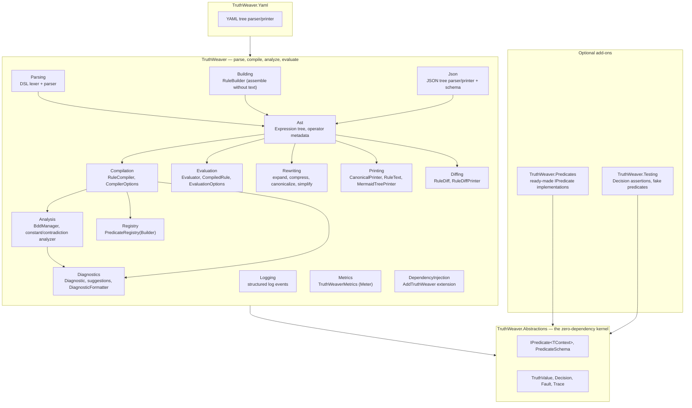
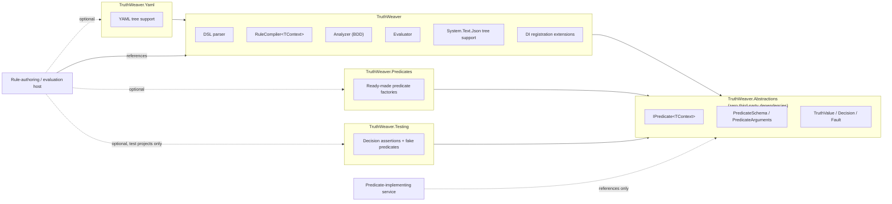
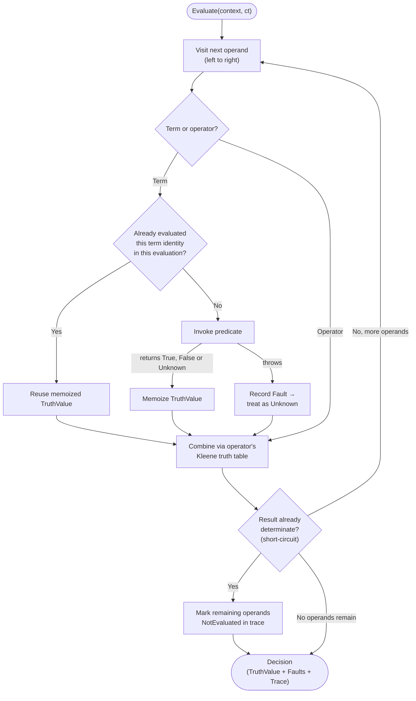
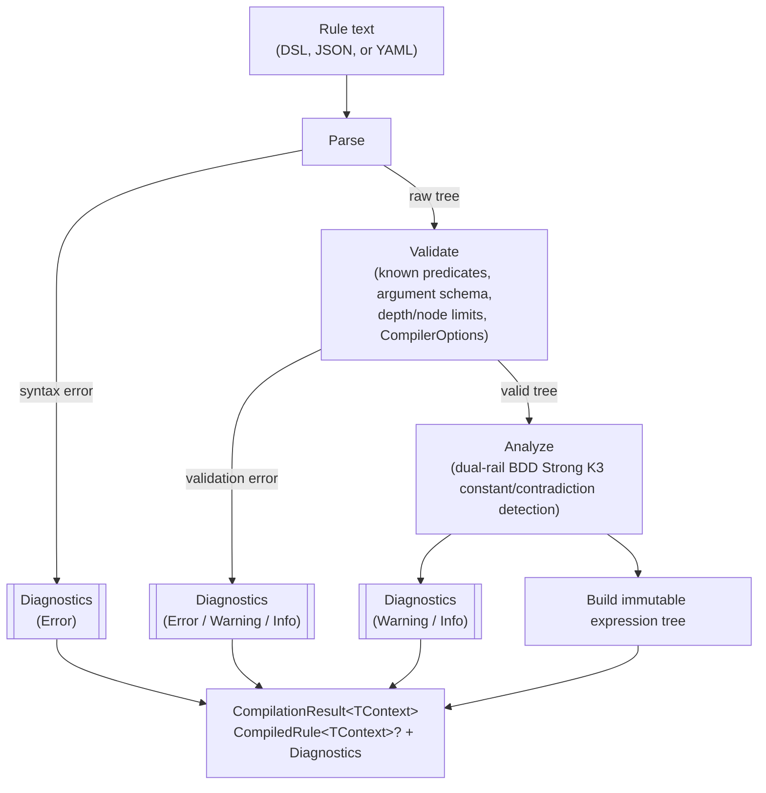

# TruthWeaver

[](https://github.com/rheone/TruthWeaver/actions/workflows/ci.yml)
[](global.json)
[](LICENSE)

A general-purpose **Strong Kleene (K3)** expression engine for .NET. Every
expression evaluates to one of three values — `True`, `False` or `Unknown` — and
`Unknown` is never silently turned into `True` or `False`. Author a rule once as
text, compile it into an immutable tree, and evaluate it many times against
whatever application context you supply — a user, a request, a resource, or
anything else.

<details>
<summary><strong>Table of contents</strong></summary>

- [What it is (and isn't)](#what-it-is-and-isnt)
- [Requirements](#requirements)
- [Getting started](#getting-started)
- [A tour of the codebase](#a-tour-of-the-codebase)
- [Packages](#packages)
- [Features](#features)
- [Operators](#operators)
  - [Symbol notation](#symbol-notation)
  - [Grammar](#grammar)
  - [Order of operations](#order-of-operations)
  - [Grouping delimiters](#grouping-delimiters)
  - [Whitespace](#whitespace)
  - [Binary vs. unary operators](#binary-vs-unary-operators)
  - [All operators](#all-operators)
  - [Strong Kleene connectives and external operators](#strong-kleene-connectives-and-external-operators)
  - [Collapse: the final boundary](#collapse-the-final-boundary)
- [Rewriting rules](#rewriting-rules)
  - [Expand to primitives](#expand-to-primitives)
  - [NAND-only and NOR-only](#nand-only-and-nor-only)
  - [Compress to derived operators](#compress-to-derived-operators)
  - [Canonical form](#canonical-form)
  - [Simplify](#simplify)
- [Choosing a rule format](#choosing-a-rule-format)
- [Predicate types](#predicate-types)
- [Examples](#examples)
- [Building rules programmatically](#building-rules-programmatically)
  - [Converting between DSL, JSON, and YAML](#converting-between-dsl-json-and-yaml)
  - [`RuleBuilder` reference](#rulebuilder-reference)
  - [Describing a compiled rule](#describing-a-compiled-rule)
  - [Rendering a rule as a diagram](#rendering-a-rule-as-a-diagram)
- [Evaluation flow](#evaluation-flow)
- [Compilation pipeline](#compilation-pipeline)
- [Reading diagnostics](#reading-diagnostics)
  - [JSON and YAML rules](#json-and-yaml-rules)
- [Benchmarks](#benchmarks)
- [Glossary](#glossary)
- [Appendix: Truth tables](#appendix-truth-tables)
- [Design documents](#design-documents)
- [License](#license)

</details>

## What it is (and isn't)

`TruthWeaver` answers one question: *what is the truth value of this expression
right now, for this context?* — `True`, `False` or `Unknown`. It knows about `AND`, `OR`, `NOT`, `XOR`, `EQUIVALENT`, `IMPLIES`, `NAND`, `NOR`,
`PARITY`, `ANY`, `ALL`, `NONE`, `BETWEEN`, `COALESCE`, `If`, `IsTrue`, `IsFalse`, `IsUnknown`, `IsKnown`, `ExactlyOne`, the threshold family (`AtLeast`/`AtMost`/`GreaterThan`/
`LessThan`/`Exactly`), terms, and evaluation. It does not know about
permissions, workflows, or policies — those are things you build *on top* of
it. A permission check ("can the current user do X") is one consumer of this
engine, not what the engine itself is.

| Concept | Meaning |
| --- | --- |
| **Rule** | A named unit of persistence: metadata + one expression. |
| **Expression** | The three-valued tree — operators over terms, constants and sub-expressions. |
| **Predicate** | A registered, reusable implementation, e.g. `hasTopping`, `lovesPineapple`. |
| **Term** | A predicate bound to concrete arguments, e.g. `hasTopping(topping: "greenOlives")` — the tree's leaf node. |
| **Operator** | `AND` `OR` `NOT` `XOR` `EQUIVALENT` `IMPLIES` `NAND` `NOR` `PARITY` `ANY` `ALL` `NONE` `BETWEEN(min, max)` `COALESCE` `If` `IsTrue` `IsFalse` `IsUnknown` `IsKnown` `ExactlyOne` and the threshold family (`AtLeast(k)`/`AtMost(k)`/`GreaterThan(k)`/`LessThan(k)`/`Exactly(k)`), plus the constants `True`/`False`/`Unknown`. Operators are case-insensitive and most have a symbol spelling (`&&`, `||`, `!`, `∧`, `∨`, `¬`, `⊕`, `→`, `↔`, `↑`, `↓`, `??`, `? :`). `Project` and `Collapse` are not part of the rule language: they are methods on the result (`Decision.Project(unknownAs)` and `Decision.Collapse(policy)`, see [Collapse](#collapse-the-final-boundary)); inside a rule use `COALESCE(x, True)` / `COALESCE(x, False)`. See [Operators](#operators) below. |
| **Decision** | The evaluation result: a `TruthValue` plus any faults, and optionally a trace. `IsSatisfied` is fail-closed: only `True` is satisfied. |

Full vocabulary and the predicate-author contract: [CONTEXT.md](CONTEXT.md).

## Requirements

Building from source needs at least the SDK version floor in
[`global.json`](global.json) — currently `11.0.100-rc.1.26425.128` — but
`rollForward: latestMajor` with `allowPrerelease: true` means any later
major .NET SDK on the machine, preview or RC included, is accepted. This
isn't a pin to that exact patch.

## Getting started

1. **Reference the packages you need.** A service that only *implements*
   predicates references `TruthWeaver.Abstractions`; a host that
   authors and evaluates rules references `TruthWeaver` (and
   `TruthWeaver.Yaml` if it wants YAML too). See
   [Packages](#packages) below.

   ```xml
   <ProjectReference Include="..\TruthWeaver\TruthWeaver.csproj" />
   ```

2. **Implement a predicate.** A zero-argument predicate is the simplest
   shape — a class implementing `IPredicate<TContext>`. A predicate answers
   a three-valued `TruthValue`: return `TruthValue.Unknown` when the answer
   is legitimately indeterminate (that is a normal result and records no
   fault), and throw only for a genuine failure:

   ```csharp
   public sealed class LovesPineapple : IPredicate<Customer>
   {
       public static PredicateSchema Schema =>
           PredicateSchema.NoArguments("lovesPineapple", "Loves Pineapple", "Does this customer like pineapple on pizza?");

       public ValueTask<TruthValue> EvaluateAsync(Customer customer, PredicateArguments args, CancellationToken ct) =>
           ValueTask.FromResult(customer.LovesPineapple ? TruthValue.True : TruthValue.False);
   }
   ```

3. **Register it and compile a rule:**

   ```csharp
   PredicateRegistry<Customer> registry = PredicateRegistry<Customer>.CreateBuilder().Add<LovesPineapple>().Build();
   RuleCompiler<Customer> compiler = new(registry);
   CompilationResult<Customer> result = compiler.Compile("lovesPineapple");

   if (!result.Succeeded)
   {
       // result.Diagnostics explains why - surface it to whoever authored the rule.
       return;
   }
   ```

4. **Evaluate it against a context:**

   ```csharp
   Decision decision = await result.CompiledRule!.EvaluateAsync(customer, serviceProvider, cancellationToken: ct);

   if (decision.IsSatisfied)
   {
       // allowed
   }
   ```

That's the whole lifecycle: implement → register → compile once → evaluate
many times. [A tour of the codebase](#a-tour-of-the-codebase) below maps
that lifecycle onto the actual folders, and [Examples](#examples) builds up
from here to named arguments, the full operator set, and the full ADR-0003
worked example in DSL, JSON, and YAML.

## A tour of the codebase

The five `src` projects mirror the rule lifecycle from
[Getting started](#getting-started): a predicate-implementing service only
needs the zero-dependency kernel, while a rule-authoring host pulls in the
parser, compiler, analyzer, and evaluator.



Starting points for common tasks:

| Task | Start here |
| --- | --- |
| Implement a new predicate | [`IPredicate<TContext>`](src/TruthWeaver.Abstractions/IPredicate.cs), or a factory in [`TruthWeaver.Predicates`](src/TruthWeaver.Predicates) if it's a generic string/collection/regex check |
| Register predicates and compile a rule | [`PredicateRegistryBuilder`](src/TruthWeaver/Registry/PredicateRegistryBuilder.cs), [`RuleCompiler`](src/TruthWeaver/Compilation/RuleCompiler.cs) |
| Understand DSL parsing | [`Lexer`](src/TruthWeaver/Parsing/Lexer.cs) → [`DslParser`](src/TruthWeaver/Parsing/DslParser.cs) |
| Understand the compiled tree shape | [`Expression`](src/TruthWeaver/Ast/Expression.cs) |
| Understand constant/contradiction detection | [`BddManager`](src/TruthWeaver/Analysis/BddManager.cs), [`Analyzer`](src/TruthWeaver/Analysis/Analyzer.cs) |
| Understand evaluation and short-circuiting | [`Evaluator`](src/TruthWeaver/Evaluation/Evaluator.cs), [`CompiledRule`](src/TruthWeaver/Evaluation/CompiledRule.cs) |
| Assemble a rule without hand-writing text | [`RuleBuilder`](src/TruthWeaver/Building/RuleBuilder.cs) |
| Rewrite a rule (expand, compress, canonicalize, simplify) | [`CompiledRule`](src/TruthWeaver/Evaluation/CompiledRule.cs) and [`Rewriting`](src/TruthWeaver/Rewriting) |
| Understand compile diagnostics and "did you mean" | [`Diagnostic`](src/TruthWeaver/Diagnostics/Diagnostic.cs), [`DiagnosticFormatter`](src/TruthWeaver/Diagnostics/DiagnosticFormatter.cs) |
| Print or diagram a compiled rule | [`CanonicalPrinter`](src/TruthWeaver/Printing/CanonicalPrinter.cs), [`MermaidTreePrinter`](src/TruthWeaver/Printing/MermaidTreePrinter.cs) |
| Diff two compiled rules | [`RuleDiff`](src/TruthWeaver/Diffing/RuleDiff.cs) |
| Wire into a DI container | [`TruthWeaverServiceCollectionExtensions`](src/TruthWeaver/DependencyInjection/TruthWeaverServiceCollectionExtensions.cs) |
| Compile JSON or YAML instead of the DSL | [`JsonTreeParser`](src/TruthWeaver/Json/JsonTreeParser.cs), [`YamlTreeParser`](src/TruthWeaver.Yaml/YamlTreeParser.cs) |
| Write a unit test against a `Decision` | [`DecisionAssertions`](src/TruthWeaver.Testing/DecisionAssertions.cs), [`FakePredicates`](src/TruthWeaver.Testing/FakePredicates.cs) |

Beyond `src`, the rest of the repository:

- [`tests/TruthWeaver.Tests`](tests/TruthWeaver.Tests) — unit tests for all
  five packages, one file per behavior area (parsing, compilation,
  evaluation, memoization, YAML/JSON round-tripping, diffing, and so on).
- [`benchmarks/TruthWeaver.Benchmarks`](benchmarks/TruthWeaver.Benchmarks) —
  a BenchmarkDotNet suite measuring compile-time and evaluation-time cost
  (dev-only; see [Benchmarks](#benchmarks)).
- [`docs/adr/`](docs/adr/) — the architecture decision records behind every
  major design choice.
- [`CONTEXT.md`](CONTEXT.md) — the domain vocabulary and conceptual model,
  kept in sync with the code.

## Packages

| Package | Depends on | Ships |
| --- | --- | --- |
| `TruthWeaver.Abstractions` | *(nothing third-party)* | `IPredicate<TContext>`, `PredicateSchema`, `PredicateArguments`, `TruthValue`, `Decision`, `Fault` — everything a predicate-implementing service needs. |
| `TruthWeaver` | `Abstractions`, `Microsoft.Extensions.DependencyInjection.Abstractions`, `Microsoft.Extensions.Logging.Abstractions` | The DSL parser, `RuleCompiler<TContext>`, `CompiledRule<TContext>`, the BDD-based analyzer, the evaluator, `System.Text.Json` tree support, printing/diffing, and DI registration extensions. |
| `TruthWeaver.Yaml` | `TruthWeaver`, YamlDotNet | YAML tree support (`CompileYaml`/`PrintYaml`), isolated so a consumer with no interest in YAML never pulls in YamlDotNet. |
| `TruthWeaver.Predicates` | `TruthWeaver.Abstractions` | Ready-made generic `IPredicate<TContext>` factories — string comparison, null/empty, set equality, regex matching, and externally-resolved-value predicates for a safe-to-share resolving client — for a consumer that wants common checks without writing a class, and without acquiring the parser, compiler, or analyzer. |
| `TruthWeaver.Testing` | `TruthWeaver.Abstractions` | Fluent `Decision` assertions and fake/scripted predicate factories for tests, without a hand-written `IPredicate<TContext>` per test. |



A service that only *implements* domain predicates references
`Abstractions` alone — no parser, no BDD analyzer, no YAML library. See
[ADR-0004](docs/adr/0004-package-boundaries-and-extensibility.md).

## Features

- **Kleene three-valued logic.** Every operator follows the three-valued
  truth tables in [ADR-0001](docs/adr/0001-kleene-failure-model.md) (full
  tables: [Appendix](#appendix-truth-tables)) — a predicate fault becomes
  `Unknown`, never a thrown exception or a silently coerced `false`, and a
  predicate can also answer `Unknown` directly. Entry
  point: [`Evaluator`](src/TruthWeaver/Evaluation/Evaluator.cs).
- **A complete Strong Kleene (K3) language, plus external operators.** The
  Strong Kleene connectives are `NOT`, `AND`, `OR`, `IMPLIES`, `EQUIVALENT`,
  `XOR`, `PARITY`, `NAND`, `NOR`, the cardinality operators
  (`AtLeast`/`AtMost`/`Exactly`, `ANY`/`ALL`/`NONE`/`BETWEEN`) and `If`/`? :`.
  `COALESCE`/`??` and the four inspections (`IsTrue`, `IsFalse`, `IsUnknown`,
  `IsKnown`) are external operators, not K3 connectives. `Unknown` is also a
  constant. Operators are case-insensitive, have symbol spellings, and every
  notation compiles to the same tree with one canonical form. See
  [Operators](#operators) and
  [Strong Kleene connectives and external operators](#strong-kleene-connectives-and-external-operators).
- **Explicit boundaries.** `COALESCE(x, True|False)` resolves `Unknown` anywhere
  inside a rule; `Decision.Project(unknownAs)` and `Decision.Collapse(policy)` turn
  the rule's three-valued result into a definite value or a two-valued answer at the
  call site, and are not part of the rule. See
  [Collapse](#collapse-the-final-boundary).
- **Rule rewriting.** Opt-in, value-preserving transforms return a new rule:
  expand to primitives, to NAND-only or NOR-only, compress back to derived
  operators, canonicalize, simplify, plus whitespace normalization. See
  [Rewriting rules](#rewriting-rules).
- **Readable diagnostics.** Every authoring error is a structured `Diagnostic`
  (code, span or JSON/YAML path, expected/found, "did you mean") with a
  plain-text formatter. See [Reading diagnostics](#reading-diagnostics).
- **Per-evaluation memoization.** A term referenced from multiple branches
  of the same rule is invoked at most once per evaluation, keyed by
  structural term identity (see [CONTEXT.md#term-identity](CONTEXT.md#term-identity)).
  Entry point: [`Evaluator`](src/TruthWeaver/Evaluation/Evaluator.cs).
- **A Strong K3 BDD analyzer**, not brute-force truth tables, flags
  sub-expressions that are `True` (or `False`) for every `{True, False, Unknown}`
  assignment of their terms (e.g.
  `hasTopping(topping: "greenOlives") AND FALSE`) as compile diagnostics. It does
  not flag `A AND NOT A` or `A OR NOT A`: both are `Unknown` when `A` is.
  Entry point: [`Analyzer`](src/TruthWeaver/Analysis/Analyzer.cs) and
  [`BddManager`](src/TruthWeaver/Analysis/BddManager.cs).
- **Resource limits and `CompilationMode.Lenient`.** `CompilerOptions`
  bounds tree depth, node count, and the analyzer's term cap so an
  admin-authored rule can't hang a request thread; `Lenient` mode compiles
  an unregistered predicate to a permanent `Unknown` term instead of an
  error. Entry point: [`CompilerOptions`](src/TruthWeaver/Compilation/CompilerOptions.cs).
- **`EvaluationOptions`**: an opt-in `FaultBudget` for fail-fast behavior
  during a known outage, an `Exhaustive` mode that runs every reachable term
  without changing the result, and an overall evaluation timeout linked into
  the caller's `CancellationToken`. Entry point:
  [`EvaluationOptions`](src/TruthWeaver/Evaluation/EvaluationOptions.cs).
- **Scoped DI resolution.** Class-based predicates resolve fresh from the
  `IServiceProvider` supplied to each evaluation call, so a predicate with a
  scoped dependency works correctly even though a `CompiledRule<TContext>`
  is long-lived and shared. Entry point:
  [`TruthWeaverServiceCollectionExtensions`](src/TruthWeaver/DependencyInjection/TruthWeaverServiceCollectionExtensions.cs).
- **Structured logging and metrics.** Faults, compile diagnostics, and
  rule-swap notifications log as structured events through `ILogger<T>`; a
  `"TruthWeaver"` `Meter` exposes counters for evaluations, faults, and
  compile diagnostics, observable through OpenTelemetry's `AddMeter` with no
  new dependency. Entry points: [`src/TruthWeaver/Logging`](src/TruthWeaver/Logging)
  and [`TruthWeaverMetrics`](src/TruthWeaver/Metrics/TruthWeaverMetrics.cs).
- **Structural rule diffing.** `RuleDiff.Compare` compares two compiled
  rules and reports which operator, term, or constant nodes were added,
  removed, or changed, each located by operand-index path and paired with a
  human-readable description — useful for "what did this edit actually
  change" tooling. Entry point:
  [`RuleDiff`](src/TruthWeaver/Diffing/RuleDiff.cs).
- **Diagram rendering.** A compiled rule renders as a Mermaid flowchart or
  an indented plain-text tree, optionally colored by one evaluation's
  result and short-circuit path — see
  [Rendering a rule as a diagram](#rendering-a-rule-as-a-diagram). Entry
  points: [`MermaidTreePrinter`](src/TruthWeaver/Printing/MermaidTreePrinter.cs),
  [`PlainTextTreePrinter`](src/TruthWeaver/Printing/PlainTextTreePrinter.cs).
- **Ready-made predicates.** `TruthWeaver.Predicates` ships generic
  string-comparison, null/empty, set-equality, and regex-matching predicate
  factories so common checks don't need a hand-written class. Entry point:
  [`src/TruthWeaver.Predicates`](src/TruthWeaver.Predicates).
- **Test support.** `TruthWeaver.Testing` ships fluent `Decision`
  assertions and fake/scripted predicate factories (fixed answer, simulated
  fault, sequenced answers, `Unknown` answered directly) for testing without a hand-written
  `IPredicate<TContext>` per test. Entry point:
  [`src/TruthWeaver.Testing`](src/TruthWeaver.Testing).

## Operators

### Symbol notation

Every existing operator can also be written with a symbol. Symbols compile to
exactly the same tree as the named operator, so notation is a style choice and
never a semantic one; the canonical printer (and persisted DSL text) always
prints the named form.

| Named | Symbols |
| --- | --- |
| `AND` | `&&`, `∧` |
| `OR` | `\|\|`, `∨` |
| `NOT` | `!`, `¬` |
| `XOR` | `⊕`, `⊻` |
| `IMPLIES` | `→`, `⇒` |
| `NAND` | `↑`, `⊼` |
| `NOR` | `↓`, `⊽` |
| `COALESCE` | `??` (infix; the word `COALESCE` is the function-call form only) |
| `If` | `c ? t : f` (ternary; `If(c, t, f)` is the function-call form) |
| `EQUIVALENT` | `↔`, `⇔` (words `IFF` and the legacy `XNOR` are accepted too) |

Symbols and words mix freely (`a && b OR c`) and follow the same precedence
and no-mixing rules as the named operators. A lone `&` or `|` is a syntax error; a lone `?` is only valid as the ternary's `?`.

### Grammar

The whole DSL in EBNF (`{ x }` is zero or more, `[ x ]` optional, `|` a choice). Keywords and
constants are case-insensitive; a term name may not be a reserved word.

```ebnf
rule        = expression ;

expression  = or_expr [ "?" or_expr ":" or_expr ] ;          (* ternary = If *)
or_expr     = and_expr { ( "OR" | "||" | "∨" ) and_expr } ;
and_expr    = infix_expr { ( "AND" | "&&" | "∧" ) infix_expr } ;
infix_expr  = not_expr [ infix_op not_expr ]                 (* at most one *)
            | not_expr { "??" not_expr } ;                   (* COALESCE chain *)
infix_op    = "XOR" | "⊕" | "⊻" | "EQUIVALENT" | "IFF" | "XNOR" | "↔" | "⇔"
            | "IMPLIES" | "→" | "⇒" | "NAND" | "↑" | "⊼" | "NOR" | "↓" | "⊽" ;
not_expr    = ( "NOT" | "!" | "¬" ) not_expr | primary ;

primary     = "(" expression ")" | "[" expression "]" | "{" expression "}"
            | constant | call | term ;
constant    = "True" | "False" | "Unknown" ;
call        = list_op "(" expression { "," expression } ")"
            | threshold "(" integer "," expression { "," expression } ")"
            | "BETWEEN" "(" integer "," integer "," expression { "," expression } ")"
            | "If" "(" expression "," expression "," expression ")"
            | inspection "(" expression ")" ;
list_op     = "PARITY" | "ANY" | "ALL" | "NONE" | "COALESCE" | "ExactlyOne" ;
threshold   = "AtLeast" | "AtMost" | "GreaterThan" | "LessThan" | "Exactly" ;
inspection  = "IsTrue" | "IsFalse" | "IsUnknown" | "IsKnown" ;

term        = identifier [ "(" [ argument { "," argument } ] ")" ] ;
argument    = identifier ":" literal ;
literal     = string | number | "true" | "false" | "[" [ literal { "," literal } ] "]" ;
```

Two rules sit outside the grammar because they are context rules, not syntax:

- **No implicit mixing.** An `infix_op` expression (or `??`, or the ternary) may not sit next to
  `AND`/`OR`, another infix operator or a nested ternary at the same level without parentheses
  (`AmbiguousOperatorMixing`); see [Order of operations](#order-of-operations).
- **`NXOR` is not part of the language.** It was renamed `PARITY` (`NXOR` conventionally means negated
  `XOR`, which is `EQUIVALENT`, the opposite of n-ary parity). The old spelling is rejected in the DSL,
  JSON and YAML with a "did you mean `PARITY`" suggestion.
- **`Collapse` is not part of the language.** It is rejected wherever it appears, with a diagnostic
  that points to `Decision.Collapse`. Operand counts, threshold bounds and argument schemas are
  checked after parsing, as diagnostics.

Precedence, tightest first: grouping, `NOT`, `AND`, `OR`. Everything else is a one-step infix form
that needs parentheses to combine.

### Order of operations

Precedence governs *parsing* the DSL only — the canonical printer always
disambiguates explicitly (see [below](#choosing-a-rule-format)), so a
persisted or printed rule never depends on a reader holding this table in
their head.

1. **Grouping** — `(...)`, `[...]` and `{...}` are interchangeable and always evaluated first, exactly as written
   (see [Grouping delimiters](#grouping-delimiters)).
2. **`NOT`** — binds tightest of the operators; right-associative (`NOT NOT
   a` is valid, if odd).
3. **`AND`** — binds tighter than `OR`.
4. **`OR`** — binds loosest of the infix operators.

`lovesPineapple AND NOT isBanned OR isVip` therefore parses as
`(lovesPineapple AND (NOT isBanned)) OR isVip`.

Every infix operator other than `NOT`/`AND`/`OR` (today `XOR`, `EQUIVALENT`, `IMPLIES`, `NAND`, `NOR` and `??`)
is **not** part of this precedence chain: mixing one with `AND`/`OR`, or with
a *different* infix operator, at the same syntactic level without explicit
parentheses is a **compile error** (`AmbiguousOperatorMixing`) rather than
resolved by an implicit precedence guess. The diagnostic points at the
offending operator (or at the bare infix expression sitting next to
`AND`/`OR`) and tells you to add parentheses — see
[ADR-0005](docs/adr/0005-strong-k3-language-surface.md) decision 8 (which
extends [ADR-0003](docs/adr/0003-rule-syntax-and-serialization.md)'s rule) for
why. The coalescing operator `??` follows the same rule (`a ?? b AND c` is an error, `(a ?? b) AND c` is fine) but, unlike
the binary-only infix operators, a chain of it is accepted: `a ?? b ?? c` is one n-ary `COALESCE(a, b, c)` node, because
coalescing is associative. Its operands are `NOT`-level expressions, so `NOT a ?? b` is `COALESCE(NOT a, b)`.
The ternary `condition ? whenTrue : whenFalse` (the same node as `If(condition, whenTrue, whenFalse)`) follows the
no-mixing rule too: its condition and each branch must be a single operand or a parenthesized group, so `a AND b ? c : d`,
`a ? b XOR c : d` and a nested `a ? b : c ? d : e` are all `AmbiguousOperatorMixing` errors, while `(a AND b) ? c : d` and
`a ? b : (c ? d : e)` are fine. Everywhere a full expression is allowed (the root, parentheses, call arguments such as
`ANY(a ? b : c, d)`) a ternary may appear without extra parentheses.
Function-call-style operators (`PARITY(...)`, `ANY(...)`, `ALL(...)`, `NONE(...)`, `BETWEEN(...)`, `COALESCE(...)`, `If(...)`, `IsTrue(...)`, `IsFalse(...)`, `IsUnknown(...)`, `IsKnown(...)`, `ExactlyOne(...)` and the threshold
family) are self-delimiting — their parentheses are part of the call syntax,
not grouping, so they never participate in precedence at all.

### Grouping delimiters

`()`, `[]` and `{}` all group a sub-expression and mean exactly the same thing, so
`a AND (b OR c)`, `a AND [b OR c]` and `a AND {b OR c}` compile to equal trees and print identically
(`CanonicalText` always uses parentheses). The tree does not remember which delimiter you wrote. Delimiters must
nest and each closer must match its opener, so `(a AND b]` is an error. Function calls (`ANY(...)`, `Role(name: "x")`)
keep `(` as their own argument-list syntax; only a grouped *sub-expression* may use `[` or `{`. Brackets and braces
inside a quoted string are ordinary text.

Delimiter mistakes are `SyntaxError` diagnostics with the exact span:

| Mistake | Example | Message (span) |
| ------- | ------- | -------------- |
| Mismatched closer | `a AND (b OR c]` | `Expected ')' to close '(' at offset 6 but found ']'.` (the `]`) |
| Unclosed group | `a AND (b OR c` | `Unclosed '(' at offset 6: expected ')' before the end of the rule.` (the `(`) |
| Closer with no opener | `a AND b)` | `Unexpected closing ')' with no matching opener.` (the `)`) |

To print a rule with delimiters that vary by nesting depth, pass a `GroupingStyle` to `CompiledRule.PrintRuleText`:

```csharp
CompiledRule<MyContext> rule = compiler.Compile("a AND (b OR (c AND (d OR (e AND (f OR g)))))").CompiledRule!;

rule.CanonicalText;                                  // a AND (b OR (c AND (d OR (e AND (f OR g)))))  (parentheses only)
rule.PrintRuleText(GroupingStyle.Parentheses);           // same as CanonicalText
rule.PrintRuleText(GroupingStyle.DepthCycling);          // a AND (b OR [c AND {d OR (e AND [f OR g])}])
```

`DepthCycling` is opt-in and deterministic: the delimiter depends only on how many groups enclose it, cycling `(`,
`[`, `{` and repeating. It is a readability aid for people; the output always re-parses to a tree equal to the
original, so `CanonicalText` stays the form to persist. Function-call argument lists keep `(`.

### Whitespace

Whitespace between tokens never matters, so rule text can be laid out freely. `CanonicalText` always prints a
single space around each infix operator and after each comma, with no leading or trailing whitespace, whatever spacing the rule
was written with. To tidy text *as written* (keeping your operators, letter case and delimiters, and without compiling it
or needing a predicate registry), use `RuleText.NormalizeWhitespace`:

```csharp
RuleText.NormalizeWhitespace("  a&&b ||\n  !c  ");          // "a && b || !c"
RuleText.NormalizeWhitespace("ANY( a ,b,	c )");            // "ANY(a, b, c)"
RuleText.NormalizeWhitespace("named( value :\"x  y\" )");   // "named(value: \"x  y\")" (string contents untouched)
```

The result is deterministic for any input spacing, idempotent, and compiles to a tree equal to the input's. Prefix `!`/`¬`
hugs its operand, a call or term's argument list hugs its name, and nothing pads the inside of `()`, `[]` or `{}`.
Characters the DSL does not recognise are kept in place, so the text of a rule that does not compile yet is never lost.

### Binary vs. unary operators

| Arity | Operators | Notes |
| --- | --- | --- |
| **Unary** | `NOT`, `IsTrue`, `IsFalse`, `IsUnknown`, `IsKnown` | Take exactly one operand (`MalformedTree` otherwise). The four inspections are function calls (`IsUnknown(a)`). |
| **Binary only** | `XOR`, `EQUIVALENT`, `IMPLIES`, `NAND`, `NOR` | Always exactly two operands — a compile error otherwise (`InfixArityViolation`). `XOR` with three or more operands is an error whose message points at `PARITY` (n-ary parity) and `ExactlyOne` (see [ADR-0005](docs/adr/0005-strong-k3-language-surface.md) decision 7); a chain such as `a IMPLIES b IMPLIES c` or `a NAND b NAND c` is rejected too — parenthesize it. |
| **Ternary** | `If` | Takes exactly three operands, `[condition, whenTrue, whenFalse]` — `MalformedTree` otherwise. |
| **N-ary (≥ 2)** | `AND`, `OR`, `PARITY`, `ANY`, `ALL`, `NONE`, `BETWEEN`, `COALESCE`, `ExactlyOne`, `AtLeast`, `AtMost`, `GreaterThan`, `LessThan`, `Exactly` | Take two or more operands. `AND`/`OR` are commonly thought of as "binary" from C-family languages, but this engine treats them as flat n-ary chains (`AND(a, b, c)`, not `AND(AND(a, b), c)`). |
| **0-ary** | `True`, `False`, `Unknown` | Constants, not operators over operands. Written in any letter case; printed upper camel. |

### All operators

| Operator | Arity | Description |
| --- | --- | --- |
| `AND` / `&&` / `∧` | n-ary | True iff every operand is true. Short-circuits at the first `False`. |
| `OR` / `\|\|` / `∨` | n-ary | True iff at least one operand is true. Short-circuits at the first `True`. |
| `NOT a` / `!a` / `¬a` | unary | Logical negation. `Unknown` stays `Unknown`. |
| `a XOR b` / `a ⊕ b` | binary | True iff exactly one of the two operands is true. `Unknown` if either operand is `Unknown`. |
| `a EQUIVALENT b` / `a ↔ b` | binary | Logical biconditional — true iff both operands agree (both true or both false). The negation of `XOR`; `Unknown` if either operand is `Unknown`. `IFF` and the legacy `XNOR` are accepted on input and compile to the same node; the canonical printer writes `EQUIVALENT`. |
| `a IMPLIES b` / `a → b` | binary | Strong Kleene material implication, `NOT a OR b`. `True` when `a` is `False` or `b` is `True`; `False` only for `True → False`; otherwise `Unknown`. |
| `a NAND b` / `a ↑ b` | binary | Negated conjunction, `NOT (a AND b)`. `False` only when both operands are `True`; `True` if either is `False`; otherwise `Unknown`. Both operands are always evaluated. |
| `a NOR b` / `a ↓ b` | binary | Negated disjunction, `NOT (a OR b)`. `True` only when both operands are `False`; `False` if either is `True`; otherwise `Unknown`. Both operands are always evaluated. |
| `PARITY(a, b, ...)` | n-ary | Parity: `True` iff an odd number of operands are `True`, `False` iff an even number are, and `Unknown` whenever any operand is `Unknown`. At two operands it equals `XOR`; from three operands it differs from `ExactlyOne` (`PARITY(a, b, c)` is `True` when all three are `True`). A function call, so it has no precedence and needs no parentheses next to other operators. |
| `ANY(a, b, ...)` | n-ary | At least one operand is `True` (`AtLeast(1, ...)`): `True` if any operand is `True`, `False` if every operand is `False`, otherwise `Unknown`. |
| `ALL(a, b, ...)` | n-ary | Every operand is `True` (`AtLeast(n, ...)`): `True` if all are `True`, `False` if any is `False`, otherwise `Unknown`. |
| `NONE(a, b, ...)` | n-ary | No operand is `True` (`AtMost(0, ...)`): `True` if all are `False`, `False` if any is `True`, otherwise `Unknown`. |
| `BETWEEN(min, max, a, b, ...)` | n-ary | The number of `True` operands lies in `[min, max]`, defined as `AtLeast(min, ...) AND AtMost(max, ...)` over the definitely-true / possibly-true interval. The two integer bounds come first; they must satisfy `0 <= min <= max <= n` and may not be the whole range `0..n` (always `True`), otherwise `InvalidThresholdValue`. Needs two or more operands. |
| `COALESCE(a, b, ...)` / `a ?? b` | n-ary | Replaces only `Unknown`: the first operand that is not `Unknown`, with `True` and `False` passing through unchanged (`Unknown` only if every operand is). Operands are evaluated left to right and the rest are skipped (recorded as `NotEvaluated`) once a known value is found; `EvaluationMode.Exhaustive` evaluates them all. `a ?? b ?? c` is one three-operand node. |
| `If(c, t, f)` / `c ? t : f` | ternary | K3-aware conditional. `True` condition: `t`; `False`: `f`; an `Unknown` condition does not guess a branch: the result is the branch value only when `t` and `f` are the same definite value, otherwise `Unknown` (definition: `(c AND t) OR (NOT c AND f) OR (t AND f)`). Only the needed branch is evaluated for a definite condition (the other is recorded as `NotEvaluated`); an `Unknown` condition evaluates both, and `EvaluationMode.Exhaustive` always does. |
| `IsTrue(x)` | unary | Inspection: `True` iff `x` is `True`; `False` when it is `False` or `Unknown`. |
| `IsFalse(x)` | unary | Inspection: `True` iff `x` is `False`; `False` when it is `True` or `Unknown`. |
| `IsUnknown(x)` | unary | Inspection: `True` iff `x` is `Unknown`; `False` when it is `True` or `False`. |
| `IsKnown(x)` | unary | Inspection: `True` iff `x` is `True` or `False`; `False` when it is `Unknown`. |
| `ExactlyOne(...)` | n-ary | True iff exactly one operand is true — the unambiguous name for what `XOR` only means at exactly two operands. |
| `AtLeast(k, ...)` | n-ary | True iff at least `k` operands are true. |
| `AtMost(k, ...)` | n-ary | True iff at most `k` operands are true. |
| `GreaterThan(k, ...)` | n-ary | True iff more than `k` operands are true. |
| `LessThan(k, ...)` | n-ary | True iff fewer than `k` operands are true. |
| `Exactly(k, ...)` | n-ary | True iff exactly `k` operands are true. |
| `True` / `False` / `Unknown` | constant | Fixed K3 truth value (any letter case; the canonical printer writes `True`, `False`, `Unknown`). `Unknown` models an indeterminate constant, e.g. when stubbing out incomplete logic. In JSON a constant is `{"const": true}` or, for `Unknown`, `{"const": "unknown"}`; in YAML `const: unknown`. Operator names are case-insensitive in every format. |

The binary logical operators are infix only (`a XOR b`); there is no `XOR(a, b)` call form. The n-ary
operators, the threshold family and the other functions are calls (`PARITY(a, b, c)`).

The connectives follow the Strong Kleene truth tables in
[ADR-0001](docs/adr/0001-kleene-failure-model.md); `COALESCE` and the inspections
are external operators with their own tables (next section). See the
[truth table appendix](#appendix-truth-tables) for every table.

### Strong Kleene connectives and external operators

Only the connectives are Strong Kleene (K3): `NOT`, `AND`, `OR`, `IMPLIES`,
`EQUIVALENT`, `XOR`, `NAND`, `NOR`, `PARITY`, the cardinality operators (`AtLeast`,
`AtMost`, `Exactly`, `ExactlyOne`, the threshold family, `ANY`, `ALL`, `NONE`,
`BETWEEN`) and `If`. `COALESCE` / `??` and the four inspections `IsTrue`,
`IsFalse`, `IsUnknown` and `IsKnown` are **external operators**: they test or
replace `Unknown` itself, as SQL's `COALESCE` and `IS [NOT] TRUE/FALSE/UNKNOWN`
do and as Bochvar's external connectives do. They are useful and well defined,
but they are not part of Kleene's logic.

Two orders on the values explain the difference.

| Order | Definition | Used for |
| --- | --- | --- |
| Truth order | `False < Unknown < True`. `AND` is the minimum, `OR` the maximum and `NOT` reverses it. | Truth functions and cardinality bounds. It is an implementation aid, not a numeric order of truth. |
| Information order | `Unknown` is below both `True` and `False`, which are incomparable. | Monotonicity: replacing an `Unknown` input by `True` or `False` may refine an output but never changes a definite one. |

Every K3 connective is monotone in the information order. `COALESCE` and the
inspections are not: `COALESCE(Unknown, False)` is `False` but `COALESCE(True, False)`
is `True`, and `IsUnknown` flips from `True` to `False` when its operand is
refined. Three consequences:

- **The "no tautologies" theorem does not extend to them.** A formula built only
  from terms, `NOT`, `AND` and `OR` is `Unknown` when every term is, so it is
  never a tautology. `IsKnown(a) OR IsUnknown(a)` is one, because the inspections
  can observe `Unknown`.
- **`NAND` and `NOR` are not expressive enough for them.** Every `NAND`-only or
  `NOR`-only circuit is monotone, so it cannot compute them (see
  [NAND-only and NOR-only](#nand-only-and-nor-only)).
- **Each rewrite is verified per operator.** The K3 laws (De Morgan, absorption,
  double negation) hold for the connectives only; `Simplify` handles the external
  operators with their own rules.

`If` is a connective in this sense: it is the strongest extension of the
classical conditional, so it is monotone, and its `(t AND f)` consensus term is
what keeps it so (see [Ternary](#ternary-ifc-t-f-c--t--f)).

The names `Project` and `Collapse` are TruthWeaver's own terms, not terms from
the K3 literature (in relational algebra "projection" means selecting columns).
Both are methods on the result (`Decision.Project`, `Decision.Collapse`), not
rule operators; see [Collapse](#collapse-the-final-boundary).

### Collapse: the final boundary

`Unknown` is a normal Strong Kleene value, never an error, and the engine never
turns it into `True` or `False` on its own. A rule always yields its raw
three-valued result: `Decision.Result` is exactly what the expression produced.
An application that needs a plain yes/no answer decides how at the call site,
with `Decision.Collapse(CollapsePolicy)`. Collapse is a method on the result, not
a feature of the rule language.

| Policy | `True` | `False` | `Unknown` | Use it when |
| --- | --- | --- | --- | --- |
| `UnknownAsFalse` | `True` | `False` | `False` | Fail closed: only a definite `True` is accepted. |
| `UnknownAsTrue` | `True` | `False` | `True` | Fail open: only a definite `False` is refused. Choose it deliberately. |
| `UnknownIsError` | `True` | `False` | `RejectedUnresolved` | You want "not known" reported as its own outcome. |

The answer is a `CollapseOutcome`: `True`, `False`, or `RejectedUnresolved`. A
rejected outcome is **not** a `Fault` and nothing is thrown, so "the answer is not
known" stays distinguishable from "something broke": a faulting predicate still
puts its exception in `Decision.Faults`, while a clean `Unknown` leaves that list
empty.

```csharp
Decision decision = await rule.EvaluateAsync(context, services);
CollapseOutcome outcome = decision.Collapse(CollapsePolicy.UnknownIsError);
if (outcome == CollapseOutcome.RejectedUnresolved)
{
    // not known; decision.Faults.Count > 0 would additionally mean a predicate broke
}
```

`Decision.Project(unknownAs)` is the lighter-weight sibling for when you want a
definite `TruthValue` rather than a `CollapseOutcome`: `True` and `False` pass
through and `Unknown` becomes the `bool` you pass (`true` for `True`, `false` for
`False`; an `Unknown` replacement cannot be requested). Like `Collapse` it is a pure
method on the result, so `Decision.Result`, `Faults` and the fail-closed
`IsSatisfied` are untouched.

```csharp
TruthValue lenient = decision.Project(unknownAs: true);   // Unknown becomes True
TruthValue strict = decision.Project(unknownAs: false);   // Unknown becomes False
```

`Decision.Collapse(policy)` is pure: it never changes the decision, its `Result`,
its `Faults` or `IsSatisfied`. `Decision.IsSatisfied` stays fail-closed regardless
of any policy you apply: it is `true` only when `Decision.Result` is `True`, so
`decision.Collapse(CollapsePolicy.UnknownAsTrue)` on an `Unknown` decision returns
`CollapseOutcome.True` but leaves `IsSatisfied` `false`.

Rule text, JSON and YAML cannot declare a `Collapse`: a `Collapse(expr, policy)`
call or a `collapse` node is rejected (`SyntaxError` in the DSL, `MalformedTree` in
JSON and YAML) with a diagnostic that points to `Decision.Collapse`. Use
`COALESCE(expr, True)` / `COALESCE(expr, False)` to resolve `Unknown` *inside* a rule.
`UnknownRequiresResolution` is not supported.

`Project` follows the same split. A `Project(expr, True|False)` call or a `project`
node in rule text, JSON or YAML is rejected (`SyntaxError` in the DSL, `MalformedTree`
in JSON and YAML) with a diagnostic that points to `COALESCE` and `Decision.Project`.
`COALESCE(x, True)` is the in-rule form and `Decision.Project(true)` the call-site
form; both give the same value for every input.

## Rewriting rules

A compiled rule is immutable, so a rewrite never edits it: it returns a **new**
`CompiledRule` over the same predicates, that evaluates to the same value for every `True`/`False`/`Unknown` assignment of
its terms. Rewrites are opt-in; the compiler never applies one for you, so a rule
always prints and round-trips as it was written.

### Expand to primitives

`ExpandToPrimitives()` replaces every derived operator with its definition in the
primitive kernel: `NOT`, `AND`, `OR`, `AtLeast`, `AtMost`, `Exactly` and `COALESCE`.

```csharp
CompiledRule<MyContext> rule = compiler.Compile("a IMPLIES ANY(b, c)").CompiledRule!;
CompiledRule<MyContext> kernel = rule.ExpandToPrimitives();

Console.WriteLine(kernel.CanonicalText);   // only primitive operators
Console.WriteLine(rule.CanonicalText);     // unchanged: (a IMPLIES ANY(b, c))
```

| Derived operator | Expands to |
| --- | --- |
| `a IMPLIES b` | `NOT a OR b` |
| `a XOR b` | `(a AND NOT b) OR (NOT a AND b)` |
| `a EQUIVALENT b` | `(a AND b) OR (NOT a AND NOT b)` |
| `a NAND b` / `a NOR b` | `NOT (a AND b)` / `NOT (a OR b)` |
| `PARITY(a, b, ...)` | `Exactly(1, ...) OR Exactly(3, ...) OR ...` (every odd count) |
| `ExactlyOne(...)` | `Exactly(1, ...)` |
| `ANY(...)` / `ALL(...)` / `NONE(...)` | `AtLeast(1, ...)` / `AtLeast(n, ...)` / `AtMost(0, ...)` |
| `BETWEEN(min, max, ...)` | `AtLeast(min, ...) AND AtMost(max, ...)` (a vacuous bound is dropped) |
| `GreaterThan(k, ...)` / `LessThan(k, ...)` | `AtLeast(k + 1, ...)` / `AtMost(k - 1, ...)` |
| `If(c, t, f)` | `(c AND t) OR (NOT c AND f) OR (t AND f)` |
| `IsTrue(x)` | `COALESCE(x, False)` |
| `IsFalse(x)` | `COALESCE(NOT x, False)` |
| `IsUnknown(x)` | `COALESCE(x, True) AND COALESCE(NOT x, True)` |
| `IsKnown(x)` | `COALESCE(x, False) OR COALESCE(NOT x, False)` |

Every row was checked against an independent truth-table oracle for all
`True`/`False`/`Unknown` inputs, because classical shortcuts fail in Strong
Kleene logic (`a OR NOT a` is not `True`, and `If(Unknown, t, t)` is `t`, which the
`If` row's third term preserves). Nothing is left unexpanded: even the inspections
are expressible with `COALESCE`, which is the primitive that can see `Unknown`.

### NAND-only and NOR-only

`ExpandToNand()` and `ExpandToNor()` rewrite a rule so the only logical operator is
one universal gate. They expand to the primitive kernel first, then rewrite it:

| Primitive | `ExpandToNand()` | `ExpandToNor()` |
| --- | --- | --- |
| `NOT a` | `a NAND a` | `a NOR a` |
| `a AND b` | `(a NAND b) NAND (a NAND b)` | `(a NOR a) NOR (b NOR b)` |
| `a OR b` | `(a NAND a) NAND (b NAND b)` | `(a NOR b) NOR (a NOR b)` |
| `AtLeast(k, ...)` | `OR` over every k-subset of the `AND` of that subset | same, with the gate's `AND`/`OR` |
| `AtMost(k, ...)` | `NOT AtLeast(k + 1, ...)` | same |
| `Exactly(k, ...)` | `AtLeast(k) AND AtMost(k)` (a vacuous side is dropped) | same |

Longer `AND`/`OR` chains fold left (both are associative in K3). The threshold
rewrite is monotone, so it is exact for `Unknown` operands too, but it has `C(n, k)`
subsets: very wide thresholds produce very large trees.

**`COALESCE` is the one boundary.** Every circuit built from `NAND`, `NOR`,
`NOT`, `AND` and `OR` is monotone in the information order (`Unknown` below `True`
and `False`), while `COALESCE(x, True)` turns `Unknown` into `True` and `False` into
`False`, which no monotone function can do. So `COALESCE`, and the
inspections (`IsTrue`, `IsFalse`, `IsUnknown`, `IsKnown`) that expand to it, stay as
`COALESCE` nodes with their operands rewritten. A rule without them is purely
`NAND` (or `NOR`). Same guarantees as above: a new rule, the original untouched,
identical results and faults.

Things to know for `ExpandToPrimitives`:

- **Size.** Operators whose definition mentions an operand twice (`XOR`,
  `EQUIVALENT`, `If`, the inspections) repeat that operand's text, so a deeply
  nested rule can grow a lot. The expanded rule's printed text compiles back to
  the same rule, but may exceed the default `CompilerOptions.MaxNodeCount`.
- **Faults.** A predicate that throws is `Unknown` plus a `Fault` in the expanded
  rule exactly as in the original; terms are still memoized by identity.

### Compress to derived operators

`CompressToDerived()` goes the other way: it recognises primitive shapes and
writes them as readable derived operators. The usual input is an expanded rule,
but any rule is accepted. It does not promise to recover the exact rule that was
expanded, only an equivalent one that is **never larger** (counted in nodes) and
that compresses to itself.

| Primitive shape | Becomes |
| --- | --- |
| `NOT a OR b` (either order) | `a IMPLIES b` |
| `NOT (a AND b)` / `NOT a OR NOT b` | `a NAND b` |
| `NOT (a OR b)` / `NOT a AND NOT b` | `a NOR b` |
| `(a AND NOT b) OR (NOT a AND b)` | `a XOR b` |
| `(a AND b) OR (NOT a AND NOT b)` | `a EQUIVALENT b` |
| `(c AND t) OR (NOT c AND f) OR (t AND f)` | `If(c, t, f)` |
| `Exactly(1, ...) OR Exactly(3, ...) OR ...` (every odd count, 3+ operands) | `PARITY(...)` |
| `AtLeast(1, ...)` / `AtLeast(n, ...)` / `AtMost(0, ...)` / `Exactly(1, ...)` | `ANY` / `ALL` / `NONE` / `ExactlyOne` |
| `NOT AtLeast(k, ...)` / `NOT AtMost(k, ...)` | `AtMost(k - 1, ...)` / `AtLeast(k + 1, ...)` |
| `AtLeast(m, ...) AND AtMost(M, ...)` over the same operands | `BETWEEN(m, M, ...)` |
| `COALESCE(NOT x, False)` | `IsFalse(x)` |
| `COALESCE(x, True) AND COALESCE(NOT x, True)` | `IsUnknown(x)` |
| `COALESCE(x, False) OR COALESCE(NOT x, False)` | `IsKnown(x)` |

Every row is an identity of Strong Kleene logic, checked against the truth-table
oracle for every `True`/`False`/`Unknown` assignment. A `COALESCE` with a constant
that matches none of the rows above, such as `COALESCE(x, True)`, is already the
shortest form and is left as written. Classical-only shapes are never matched:
`a OR NOT a` stays as written. Operand order inside a matched `OR`/`AND` can
differ from the original, which changes the order predicates are invoked in but
never a result.

### Canonical form

`Canonicalize()` gives rules that are equivalent under a fixed set of Strong
Kleene-sound rewrites one deterministic representation, so rules can be compared,
cached and de-duplicated by their `CanonicalText`. It is deterministic,
idempotent (`Canonicalize()` of a canonical rule is the same rule), evaluates
like the original for every `True`/`False`/`Unknown` assignment, and is never
larger than the original.

The rewrites, in the order they are applied (bottom-up, repeated until stable):

1. **Aliases collapse.** `ANY(...)` and `AtLeast(1, ...)` become `OR`; `ALL(...)`
   and `AtLeast(n, ...)` become `AND`; `GreaterThan(k)` becomes `AtLeast(k + 1)`;
   `LessThan(k)` becomes `AtMost(k - 1)`; `ExactlyOne(...)` becomes `Exactly(1, ...)`.
2. **Double negation.** `NOT NOT x` becomes `x` (holds in K3).
3. **Flatten.** `AND` inside `AND`, `OR` inside `OR` and `COALESCE` inside
   `COALESCE` are spliced into the parent (all associative).
4. **Sort.** The operands of the commutative operators (`AND`, `OR`, `XOR`,
   `EQUIVALENT`, `NAND`, `NOR`, `PARITY`, `ExactlyOne`, the threshold family,
   `BETWEEN`) are sorted by their canonical text, ordinally.
5. **Deduplicate.** Repeated operands of `AND`/`OR` are removed (`a AND a` is `a`;
   idempotence holds in K3). Counting operators keep repeats, since they count.

`COALESCE`, `IMPLIES` and `If` keep their operand order because it carries
meaning. **Nothing is folded and no complement law is used:** `a OR NOT a` is not
`True` in Strong Kleene logic (it is `Unknown` when `a` is), so it stays as a
two-operand `OR`; constant folding and the other cost-reducing rewrites are the
job of `Simplify()`.

> [!IMPORTANT]
> The canonical rule has the same *value* as the original but not the same
> *evaluation order*. Reordering, flattening and removing duplicates can change
> which predicate is invoked first, which are invoked at all once a short-circuit
> applies, and so which faults are reported. Use a canonical rule as a comparison
> or storage key; keep evaluating the rule as written if invocation order matters.

### Simplify

`Simplify()` replaces a rule with an equivalent, cheaper one. It starts from the
canonical form (above) and then applies only rewrites that are identities of
Strong Kleene logic, repeating until nothing changes. The result evaluates like
the original for every `True`/`False`/`Unknown` assignment, is never larger
(counted in nodes), and simplifying it again changes nothing.

| Rewrite | Example |
| --- | --- |
| Identity and annihilator constants | `a AND True` is `a`; `a AND False` is `False`; `a OR False` is `a`; `a OR True` is `True` |
| `Unknown` is kept | `a AND Unknown` stays; `True AND Unknown` is `Unknown`; `NOT Unknown` is `Unknown` |
| Constant folding | `NOT True` is `False`; any operator over constants folds to a constant |
| Idempotence, double negation, flattening | `a AND a` is `a`; `NOT NOT a` is `a`; `a AND (b AND a)` is `a AND b` |
| Absorption | `a AND (a OR b)` is `a`; `a OR (a AND b)` is `a` |
| De Morgan, only where it removes nodes | `NOT (NOT a AND NOT b)` is `a OR b`; `NOT a NAND NOT b` is `a OR b` |
| Negation through derived operators | `NOT a IMPLIES b` is `a OR b`; `NOT a XOR b` is `a EQUIVALENT b`; `NOT IsKnown(a)` is `IsUnknown(a)` |
| `COALESCE` | `COALESCE(Unknown, a)` is `a`; `COALESCE(a, True, b)` is `COALESCE(a, True)`; `COALESCE(IsKnown(a), b)` is `IsKnown(a)`; `COALESCE(IsTrue(a), False)` is `IsTrue(a)` |
| Inspections | `IsKnown(True)` is `True`; `IsUnknown(IsTrue(a))` is `False`; `IsTrue(NOT a)` is `IsFalse(a)` |
| `If` | `If(True, a, b)` is `a`; `If(c, a, a)` is `a` |
| Derived operator with a constant operand | `a IMPLIES False` is `NOT a`; `a XOR True` is `NOT a`; `a NAND False` is `True` (expanded one level, simplified, kept only if no larger) |
| Thresholds with `True`/`False` operands | `AtLeast(2, True, a, b)` is `a OR b`; `AtMost(0, True, a, b)` is `False`; `Exactly(2, True, True, a)` is `NOT a` |

"Never `Unknown`" operands (constants, the inspections, a `COALESCE` with such an
operand, and operators over only those) also let `COALESCE` and the inspections be
removed.

**Classical rules that deliberately do not apply.** Each of these is valid in
two-valued logic and false in Strong Kleene logic, because it fails when `a` is
`Unknown`, so `Simplify()` never uses it and the rule keeps its value:

| Classical law | Why it fails when `a` is `Unknown` |
| --- | --- |
| `a OR NOT a` is `True` (excluded middle) | `Unknown OR Unknown` is `Unknown` |
| `a AND NOT a` is `False` (non-contradiction) | `Unknown AND Unknown` is `Unknown` |
| `a IMPLIES a` and `a EQUIVALENT a` are `True` | both are `Unknown` |
| `a XOR a` is `False` | it is `Unknown` |
| `a AND (NOT a OR b)` is `a AND b`; `a OR (NOT a AND b)` is `a OR b` (complement absorption) | `Unknown AND (Unknown OR False)` is `Unknown`, but `Unknown AND False` is `False` |
| `If(c, t, f)` with an `Unknown` condition follows a branch | it yields a value only when both branches agree |

Only plain absorption (`a AND (a OR b)`) holds, since `AND` and `OR` form a lattice.

> [!IMPORTANT]
> Like `Canonicalize()`, simplification keeps the *value* but not the evaluation
> order or side effects. Operands can be reordered, merged or dropped; an annihilated
> `AND` never evaluates its other operands, so a predicate the original would have
> invoked (and any fault it would have reported) may not run.

The rewrite does not use the analyzer's dual-rail findings: those are reported as
diagnostics (`StructuralTautology`, `StructuralContradiction`) for authors, and
every simplification here is a local, structural rule that is easy to check.

## Choosing a rule format

DSL, JSON, and YAML compile to the exact same tree through the exact same
Parse → Validate → Analyze → Build pipeline (see
[Compilation pipeline](#compilation-pipeline) below) — none of them is more
"real" than another at evaluation time. What differs is who's meant to
write and read each one:

| | DSL string | JSON tree | YAML tree |
| --- | --- | --- | --- |
| **Canonical / persisted form?** | Yes — this is what a `CompiledRule<TContext>` prints back to. | No — an interchange format. | No — an interchange format. |
| **Best for** | A human author or reviewer typing/reading a rule directly (a database column, a code review, a log line). | A UI rule builder generating or consuming a tree without writing a parser. | The same as JSON, when the host's tooling already prefers YAML (config files, GitOps). |
| **Package** | `TruthWeaver` | `TruthWeaver` | `TruthWeaver.Yaml` |
| **Compile with** | `compiler.Compile(text)` | `compiler.CompileJson(json)` | `compiler.CompileYaml(yaml)` |
| **Print with** | `rule.CanonicalText` | `rule.PrintJson()` | `rule.PrintYaml()` |
| **Round-trips losslessly?** | Yes, by definition. | Yes — `parse(print(x))` is structurally equal to `x` (ticket 07). | Yes — same guarantee (ticket 08). |
| **Nesting for `AND`/`OR`/`XOR`/`EQUIVALENT`/`IMPLIES`/`NAND`/`NOR`/`??`** | Infix with precedence (see [Operators](#operators)); `XOR`/`EQUIVALENT`/`IMPLIES`/`NAND`/`NOR`/`??` mixed with `AND`/`OR`, or with each other, needs explicit parens. | Explicit `{"op": "...", "operands": [...]}` nodes — no precedence to get wrong. | Same explicit `op`/`operands` shape as JSON. |
| **Comments** | No | No (JSON has none) | Yes (`#`) — a practical reason to prefer YAML for hand-maintained rule files. |

See [ADR-0003](docs/adr/0003-rule-syntax-and-serialization.md) for the full
grammar and tree schema. There's also a fourth way to produce a rule without
writing text in any of these formats by hand — see
[Building rules programmatically](#building-rules-programmatically) below.

A fifth format, of sorts: `CanonicalText` isn't merely "minimal" — it
parenthesizes an operand whenever it's a different operator than the one
it's nested under (e.g. `a AND b OR c` prints as `(a AND b) OR c`), even
where precedence alone already makes the parse unambiguous. The goal is a
rule that reads clearly at a glance without the reader reconstructing
precedence mentally, not merely one that reparses correctly.

## Predicate types

Every predicate is one of four registration shapes, and they mix freely
within one `PredicateRegistryBuilder<TContext>.Build()`. Two independent
axes: **how many rule-authored arguments** it takes (zero, one, or several —
"n"), and **where its implementation comes from** (a stateless lambda, or a
class resolved from DI).

| Shape | Arguments | Implementation | When to use |
| --- | --- | --- | --- |
| Lambda, 0 args | none | stateless delegate | A simple stateless check with no rule-authored parameter. |
| Lambda, 1 arg | one | stateless delegate with a 1-argument schema | The common case — a stateless check parameterized by the rule text, e.g. `hasTopping(topping: "greenOlives")`. |
| Class-based (DI), 0 args | none | `IPredicate<TContext>` | Needs a scoped/injected dependency but no rule-authored parameter. |
| Class-based (DI), n args | several | `IPredicate<TContext>` with a multi-argument schema | Needs both rule-authored parameters *and* one or more injected dependencies. |

Before writing one by hand, check whether
[`TruthWeaver.Predicates`](src/TruthWeaver.Predicates) already has it —
`StringPredicates`, `CollectionPredicates`, and `RegexPredicates` cover
string comparison, null/empty checks, set equality, and regex matching as
generic factories parameterized by a value selector, and
`ResolvedValuePredicates` covers the externally-resolved-value pattern
(below) for a safe-to-share resolving client. Every method on
`StringPredicates` except one is ordinal-only and fixed-behavior by
design — a case-insensitive variant is a separate predicate
(`EqualsIgnoreCase`), never a rule-text flag on `Equals`. The exception,
`StringPredicates.EqualsConfigurable`, deliberately inverts that: it's one
predicate whose `ignoreCase`/`trim` arguments are set per rule
(case-insensitive by default; comparison is always ordinal, and the retained
`culture` argument must be empty), for the case where a
rule author genuinely needs that flexibility rather than a fixed-behavior
predicate per name.

A null selected value is a definite `False` by default, with no fault. Every
`StringPredicates` comparison (`Equals`, `EqualsIgnoreCase`, `StartsWith`,
`EndsWith`, `Contains`, `EqualsConfigurable`), `RegexPredicates.Matches` and
`CollectionPredicates.SetEquals` also take an optional `nullBehavior`
parameter that the host sets at registration. `NullBehavior.Unknown` makes a
null selected value answer `Unknown` instead (still without a fault), so
`NOT hasCrust(crust: "thin")` stays `Unknown` for an order with no crust
rather than becoming `True`, and `Decision.IsSatisfied` stays fail-closed.
The default is `NullBehavior.False`, so existing registrations behave as
before. `StringPredicates.IsNullOrEmpty` has no option: it is a null test and
always returns a definite answer.

```csharp
StringPredicates.Equals<PizzaOrder>(
    "hasCrust", order => order.Crust, "Has Crust", argumentName: "crust",
    nullBehavior: NullBehavior.Unknown);
```

### 0 arguments, stateless lambda

```csharp
.Add(
    PredicateSchema.NoArguments("isBanned", "Is Banned", "Is the current customer's account banned?"),
    (customer, args, ct) => ValueTask.FromResult(customer.IsBanned ? TruthValue.True : TruthValue.False))
```

### 1 argument, stateless lambda

See [Example 3](#3-named-arguments)'s `hasTopping(topping: "greenOlives")` —
a single named `string` argument, no injected dependency.

### 0 arguments, class-based (DI)

See [Example 1](#1-a-single-predicate)'s `LovesPineapple` — a class
implementing `IPredicate<TContext>`, resolved fresh from `IServiceProvider`
on every evaluation (the right shape whenever a scoped dependency, e.g. a
`DbContext`, is involved, even with no rule-authored parameter).

### n arguments, class-based, multiple injected dependencies

The shape that combines everything: two rule-authored arguments *and* two
constructor-injected dependencies, resolved from DI per evaluation:

```csharp
public sealed class HasEarnedEnoughLoyaltyStamps : IPredicate<PizzaOrder>
{
    private readonly ILoyaltyStampStore stamps;
    private readonly TimeProvider clock;

    public HasEarnedEnoughLoyaltyStamps(ILoyaltyStampStore stamps, TimeProvider clock)
    {
        this.stamps = stamps;
        this.clock = clock;
    }

    public static PredicateSchema Schema =>
        new(
            "hasEarnedEnoughLoyaltyStamps",
            "Has Earned Enough Loyalty Stamps",
            "Has the order's customer earned at least the given number of loyalty stamps within the given time window?",
            [
                new PredicateArgumentSchema("minCount", "The minimum number of loyalty stamps required.", LiteralKind.Int64),
                new PredicateArgumentSchema("withinDays", "The lookback window, in days.", LiteralKind.Int64),
            ]);

    public async ValueTask<TruthValue> EvaluateAsync(PizzaOrder order, PredicateArguments args, CancellationToken ct)
    {
        long minCount = args.GetInt64("minCount");
        long withinDays = args.GetInt64("withinDays");
        DateTimeOffset cutoff = this.clock.GetUtcNow().AddDays(-withinDays);

        long count = await this.stamps.CountStampsSinceAsync(order.Id, cutoff, ct);
        return count >= minCount ? TruthValue.True : TruthValue.False;
    }
}
```

Used in a rule as `hasEarnedEnoughLoyaltyStamps(minCount: 5, withinDays: 30)`.
`ILoyaltyStampStore` might be scoped (an `IDbContextFactory`-backed store)
and `TimeProvider` is typically a singleton — both resolve correctly on
every evaluation because the predicate itself is resolved fresh from
`IServiceProvider`, not constructed once at registration.

Wiring it up: **`AddTruthWeaver` registers the registry and compiler,
not the predicate types themselves** — a class-based predicate (and its own
dependencies) must be registered in the host's container separately, same
as any other DI service:

```csharp
services.AddScoped<ILoyaltyStampStore, LoyaltyStampStore>();
services.AddSingleton(TimeProvider.System);
services.AddScoped<HasEarnedEnoughLoyaltyStamps>();  // the predicate type itself
services.AddScoped<LovesPineapple>();

services.AddTruthWeaver<PizzaOrder>(builder => builder
    .Add<LovesPineapple>()
    .Add<HasEarnedEnoughLoyaltyStamps>());
```

Both lambda and class-based predicates register against the same
`PredicateRegistryBuilder<TContext>.Add(...)` overloads — the difference is
purely dependency lifetime and how many rule-authored arguments the schema
declares, never a difference in rule text or how the compiler validates a
term. See
[ADR-0002](docs/adr/0002-evaluation-semantics.md#predicate-registration-and-dependency-lifetimes).

### n arguments, class-based, externally-resolved value

`HasEarnedEnoughLoyaltyStamps` above injects a dependency to read a value it
already knows how to interpret (`minCount`, `withinDays` are values, used
directly). A related but distinct shape: a rule-text literal argument and/or
a `TContext`-supplied value is a **key to be resolved** — not a value
already ready to use — and a constructor-injected service performs that
live resolution before the predicate can answer anything. There is no
single canonical shape here; it covers three distinct cases, none more
central than the others:

1. **Single-value, no comparison target.** The literal key resolves
   directly to the answer — there's no "other side" to compare
   against, and `TContext` may not be read at all. A feature-flag check is
   the classic instance:

   ```csharp
   public sealed class IsPromoActive(IPromoService promos) : IPredicate<object?>
   {
       public static PredicateSchema Schema =>
           new(
               "isPromoActive",
               "Is Promo Active",
               "Is the given promo code currently active, resolved live from the promotions service?",
               [new PredicateArgumentSchema("promoCode", "The promo code to look up.", LiteralKind.String)]);

       public async ValueTask<TruthValue> EvaluateAsync(object? context, PredicateArguments args, CancellationToken ct) =>
           await promos.IsActiveAsync(args.GetString("promoCode"), ct) ? TruthValue.True : TruthValue.False;
   }
   ```

   Used in a rule as `isPromoActive(promoCode: "SUMMER-2026")`.

2. **Single-sided value check.** One side — the argument or a context
   value — is resolved live; the other side is a plain value already
   sitting on `TContext`, needing no resolution of its own. Note that
   `TContext` here has no user field at all — this pattern isn't about "the
   current user," it's about a key that needs a live lookup:

   ```csharp
   public sealed class IsWithinZoneLimit(IZoneLimitLookupService zoneLimits) : IPredicate<DeliveryRun>
   {
       public static PredicateSchema Schema =>
           new(
               "isWithinZoneLimit",
               "Is Within Zone Limit",
               "Is the delivery run's amount within the live order limit resolved for the given delivery zone code?",
               [new PredicateArgumentSchema("zoneCode", "The delivery zone code to look up a live limit for.", LiteralKind.String)]);

       public async ValueTask<TruthValue> EvaluateAsync(DeliveryRun run, PredicateArguments args, CancellationToken ct)
       {
           string zoneCode = args.GetString("zoneCode");
           decimal limit = await zoneLimits.ResolveLimitAsync(zoneCode, ct);
           return run.Amount <= limit ? TruthValue.True : TruthValue.False;
       }
   }
   ```

   Used in a rule as `isWithinZoneLimit(zoneCode: "Z-100")`. Only
   `zoneCode` is resolved; `run.Amount` is read straight off
   `TContext`, no lookup needed.

3. **Two-sided comparison.** Both a `TContext`-supplied anchor and the
   rule-text argument are independently resolved through the injected
   service, and the two *resolved* results are compared — the original
   motivating case (a relationship check), but only one instance of this
   family, not the pattern itself:

   ```csharp
   public sealed class IsAssignedToCandidateDriver(IDriverLookupService drivers) : IPredicate<PizzaOrder>
   {
       public static PredicateSchema Schema =>
           new(
               "isAssignedToCandidateDriver",
               "Is Assigned To Candidate Driver",
               "Does the order's actual assigned driver, resolved live, match the given candidate?",
               [new PredicateArgumentSchema("candidateDriverId", "The candidate driver to validate.", LiteralKind.Guid)]);

       public async ValueTask<TruthValue> EvaluateAsync(PizzaOrder order, PredicateArguments args, CancellationToken ct)
       {
           Guid candidateDriverId = args.GetGuid("candidateDriverId");
           // candidateDriverId here belongs to "Mister Moneybags," our top delivery driver.
           Guid actualDriverId = await drivers.ResolveDriverIdAsync(order.Id, ct);
           return actualDriverId == candidateDriverId ? TruthValue.True : TruthValue.False;
       }
   }
   ```

   Used in a rule as
   `isAssignedToCandidateDriver(candidateDriverId: "3fa85f64-5717-4562-b3fc-2c963f66afa6")`.
   `order` (the context) is an order id, not "the current user" — it
   needs its own resolution just as much as the argument does. Neither side
   of a two-sided comparison is privileged as "the identity one."

A few things stay true across all three shapes:

- The rule-text argument is a **key**, not necessarily an identity — a
  `String` cost-center code is exactly as valid a key as a `Guid`. Whatever
  it resolves to plays no role in the DSL, JSON, or YAML surface; it exists
  only inside `EvaluateAsync`.
- `TContext` participation is optional. Shape 1 above never reads it at
  all; shapes 2 and 3 read it, but nothing about this pattern requires that.
- Term identity ([CONTEXT.md#term-identity](CONTEXT.md#term-identity)) is
  unaffected: the literal argument is still compared as an ordinary literal
  for memoization purposes. What it resolves to on any given evaluation
  never enters term identity. The predicate-author contract
  ([CONTEXT.md#the-predicate-author-contract](CONTEXT.md#the-predicate-author-contract))
  still applies — the same argument plus the same context within *one*
  evaluation must yield the same answer, so a resolution service that's
  internally consistent within a single evaluation (even if the underlying
  data could change between evaluations) is what the contract expects.
- Because the live call happens inside `EvaluateAsync`, a lookup failure
  (timeout, connection error) is absorbed the same way any other predicate
  fault is — as a `Fault` and `TruthValue.Unknown` (ADR-0001), never an
  unhandled exception. A predicate that merely cannot decide (for example
  the data is not available) returns `TruthValue.Unknown` directly, with no
  `Fault`. No special handling is needed in the predicate itself; see [`IPredicate<TContext>`](src/TruthWeaver.Abstractions/IPredicate.cs).

This is the documented alternative to the deferred
"[context-bound term arguments](.scratch/deferred-features/spec.md)" feature (a
path-expression mini-language like `IsManagerOf({{resource.ownerId}})`) —
every shape above is expressible today, with no engine changes, by letting
the predicate itself resolve whatever it needs.

**All three examples above are class-based**, which is the right choice
whenever the thing doing the resolving is a scoped dependency (a
`DbContext`, a per-request `HttpClient`) that must be re-resolved fresh on
every evaluation. When the resolving client is instead safe to capture once
— a long-lived, thread-safe instance such as a cached feature-flag reader or
an `HttpClient`-backed lookup wrapper already held by the host —
`ResolvedValuePredicates` in [`TruthWeaver.Predicates`](src/TruthWeaver.Predicates)
covers the same pattern as a lighter-weight lambda factory, with no one-off
class needed. The single-value convenience overload matches shape 1 above:

```csharp
(PredicateSchema schema, Func<object?, PredicateArguments, CancellationToken, ValueTask<TruthValue>> evaluate) =
    ResolvedValuePredicates.Create<object?>(
        "isPromoActive",
        "Is Promo Active",
        "Is the given promo code currently active, resolved live from the promotions service?",
        async (_, args, ct) => await promos.IsActiveAsync(args.GetString("promoCode"), ct) ? TruthValue.True : TruthValue.False,
        new PredicateArgumentSchema("promoCode", "The promo code to look up.", LiteralKind.String));
```

A second overload takes a separate `test` delegate for shapes 2 and 3 above,
when it reads more clearly to keep "resolve" and "turn the resolved value
into an answer" apart. Both paths solve the same conceptual pattern; neither
replaces the other — reach for `ResolvedValuePredicates` when the resolving
client is safe to share, and a hand-written `IPredicate<TContext>` (as shown
above) when it isn't.

## Examples

Seven examples, each adding one more piece — a single predicate, combining
predicates, named arguments, `XOR`/`EQUIVALENT`/`ExactlyOne`/the threshold family,
the full worked example in all three formats, assembling that same rule with
`RuleBuilder` instead of writing text, and matching a value against one or
several constants — plus a bonus on turning a denial into a human-readable
sentence.

### 1. A single predicate

```text
lovesPineapple
```

```csharp
PredicateRegistry<Customer> registry = PredicateRegistry<Customer>.CreateBuilder().Add<LovesPineapple>().Build();
RuleCompiler<Customer> compiler = new(registry);
CompiledRule<Customer> rule = compiler.Compile("lovesPineapple").CompiledRule!;

Decision decision = await rule.EvaluateAsync(customer, serviceProvider, cancellationToken: ct);
```

### 2. Combining predicates: `AND` / `OR` / `NOT`

```text
lovesPineapple AND NOT isBanned
```

`NOT` binds tighter than `AND`, which binds tighter than `OR`, so this
parses as `lovesPineapple AND (NOT isBanned)` without needing parentheses.

### 3. Named arguments

```text
hasTopping(topping: "greenOlives")
```

```csharp
PredicateRegistry<Customer> registry = PredicateRegistry<Customer>.CreateBuilder()
    .Add(
        new PredicateSchema(
            "hasTopping",
            "Has Topping",
            "Does the order include the given topping?",
            [new PredicateArgumentSchema("topping", "The topping to check for.", LiteralKind.String)]),
        (customer, args, ct) =>
            ValueTask.FromResult(customer.Toppings.Contains(args.GetString("topping")) ? TruthValue.True : TruthValue.False))
    .Build();
```

Argument order in the source text never matters (`hasTopping(topping:
"greenOlives")` and a predicate with several arguments written in any order
compile to the same term identity); argument *values* are case-sensitive
(`"greenOlives"` and `"Greenolives"` are different terms — see
[CONTEXT.md#term-identity](CONTEXT.md#term-identity)). `Description` is
required on both `PredicateSchema` and `PredicateArgumentSchema`, and
`PredicateSchema` also requires a `Label` — a short display name distinct
from the machine-facing `Name` used in rule text (e.g. `Name: "hasTopping"`,
`Label: "Has Topping"`) — so a rule-authoring UI or generated documentation
always has something to show for every predicate and argument. See
[Describing a compiled rule](#describing-a-compiled-rule) below for how this
pairs with operators' own label/description.

A DSL string-literal argument supports four escape sequences: `\"` for a
literal quote, `\\` for a literal backslash, `\n` for a newline, and `\t` for
a tab. For example, `hasTopping(topping: "Chef's \"Special\"")` compiles to
a string argument whose value is `Chef's "Special"`, and printing that
compiled rule back to DSL text reproduces `hasTopping(topping: "Chef's
\"Special\"")` unchanged. Any other backslash sequence
(e.g. `\p`) is a compile-time `InvalidEscapeSequence` diagnostic, not a
silently-corrupted literal value — the compilation fails rather than
guessing what you meant. This escaping rule is specific to the DSL text
format: the JSON and YAML forms (see
[Converting between DSL, JSON, and YAML](#converting-between-dsl-json-and-yaml))
use their own format's native string escaping (`System.Text.Json` and
YamlDotNet respectively), not this rule.

A predicate can take more than one named argument — same registration shape,
just a longer `PredicateArgumentSchema` array and an `EvaluateAsync` that
reads more than one `Get*` call:

```text
hasToppingAmount(topping: "pepperoni", amount: "extra")
```

```csharp
PredicateRegistry<Customer> registry = PredicateRegistry<Customer>.CreateBuilder()
    .Add(
        new PredicateSchema(
            "hasToppingAmount",
            "Has Topping Amount",
            "Does the order include the given topping at the given amount?",
            [
                new PredicateArgumentSchema("topping", "The topping to check for.", LiteralKind.String),
                new PredicateArgumentSchema("amount", "The amount requested (e.g. \"regular\" or \"extra\").", LiteralKind.String),
            ]),
        (customer, args, ct) =>
            ValueTask.FromResult(
                customer.ToppingAmounts.TryGetValue(args.GetString("topping"), out string? amount)
                && amount == args.GetString("amount")
                    ? TruthValue.True
                    : TruthValue.False))
    .Build();
```

`hasToppingAmount(topping: "pepperoni", amount: "extra")` and
`hasToppingAmount(amount: "extra", topping: "pepperoni")` compile to the
exact same term identity — argument order in the source text still never
matters, however many arguments a predicate declares (see
[Term identity](CONTEXT.md#term-identity)).

### 4. `XOR`, `EQUIVALENT`, `ExactlyOne`, and the threshold family

```text
AtLeast(2, approvedByAlice, approvedByBob, approvedByCarol)
```

"At least two of these three approvals." Its siblings read the same way:
`AtMost(1, ...)`, `GreaterThan(1, ...)`, `LessThan(2, ...)`, and
`Exactly(2, ...)` all compile to one shared `ThresholdExpression` node,
differing only in which comparison against the true-operand count they
apply (see [Operators](#operators) for the full table).

`ExactlyOne(a, b, c)` is the n-ary "exactly one of these" operator; `XOR` is
binary-only — a third operand is a compile error that points at both
alternatives. Use `ExactlyOne` for "exactly one", or `PARITY(a, b, c)` for
n-ary *parity* (an odd number are true; `Unknown` if any operand is `Unknown`).
The two differ from three operands: with all of `a`, `b`, `c` true, `PARITY` is
`True` and `ExactlyOne` is `False`.

`EQUIVALENT` (`IFF`, `↔`) is `XOR`'s counterpart — "these two must agree":

```text
isPrimaryReviewer EQUIVALENT isBackupReviewer
```

reads as "exactly one of primary/backup reviewer status, or neither" — true
when both are reviewers or neither is, false when exactly one is.

`IMPLIES` (or `→`) is material implication — "if this holds, that must too":

```text
isContractor IMPLIES hasSignedNda
```

It is `NOT isContractor OR hasSignedNda`, so a non-contractor passes
regardless of the NDA, and when `isContractor` is `True` the result is just
`hasSignedNda`. Like `XOR`/`EQUIVALENT` it is binary and must be parenthesized
next to `AND`/`OR` or another infix operator
(`(isContractor IMPLIES hasSignedNda) AND isActive`); in JSON/YAML it is
`{"op": "implies", "operands": [antecedent, consequent]}`.

### 5. The full worked example, in all three formats

Rule text as authored (`CanonicalText` prints the same rule with the optional `hasCrust` arguments filled in from their defaults):

```text
hasTopping(topping: "greenOlives") AND (hasCrust(crust: "thin") OR hasCrust(crust: "stuffed", ignoreCase: false) OR (isDineIn XOR isTakeout))
```

The same rule as JSON:

```json
{
  "op": "and",
  "operands": [
    { "predicate": "hasTopping", "args": { "topping": "greenOlives" } },
    {
      "op": "or",
      "operands": [
        { "predicate": "hasCrust", "args": { "crust": "thin" } },
        { "predicate": "hasCrust", "args": { "crust": "stuffed", "ignoreCase": false } },
        {
          "op": "xor",
          "operands": [
            { "predicate": "isDineIn" },
            { "predicate": "isTakeout" }
          ]
        }
      ]
    }
  ]
}
```

...and in YAML (`TruthWeaver.Yaml`):

```yaml
op: and
operands:
  - predicate: hasTopping
    args:
      topping: "greenOlives"
  - op: or
    operands:
      - predicate: hasCrust
        args:
          crust: "thin"
      - predicate: hasCrust
        args:
          crust: "stuffed"
          ignoreCase: false
      - op: xor
        operands:
          - predicate: isDineIn
          - predicate: isTakeout
```

Registering predicates and evaluating:

```csharp
(PredicateSchema hasCrustSchema, var hasCrustEvaluate) =
    StringPredicates.EqualsConfigurable<PizzaOrder>("hasCrust", order => order.Crust, "Has Crust", argumentName: "crust");

PredicateRegistry<PizzaOrder> registry = PredicateRegistry<PizzaOrder>.CreateBuilder()
    .Add<IsDineIn>()
    .Add<IsTakeout>()
    .Add(
        new PredicateSchema(
            "hasTopping",
            "Has Topping",
            "Does the order include the given topping?",
            [new PredicateArgumentSchema("topping", "The topping to check for.", LiteralKind.String)]),
        (order, args, ct) =>
            ValueTask.FromResult(order.Toppings.Contains(args.GetString("topping")) ? TruthValue.True : TruthValue.False))
    .Add(hasCrustSchema, hasCrustEvaluate)
    .Build();

RuleCompiler<PizzaOrder> compiler = new(registry);
CompilationResult<PizzaOrder> result = compiler.Compile(ruleText);

if (!result.Succeeded)
{
    // Surface result.Diagnostics to whoever is authoring the rule.
    // The previously persisted rule (if any) stays active — see ADR-0002.
    return;
}

CompiledRule<PizzaOrder> rule = result.CompiledRule!;
Decision decision = await rule.EvaluateAsync(order, serviceProvider, cancellationToken: cancellationToken);

if (decision.IsSatisfied)
{
    // allowed
}
```

`IsDineIn`/`IsTakeout` are class-based predicates (`IPredicate<PizzaOrder>`),
resolved fresh from `serviceProvider` on every call — the right shape for a
predicate with a scoped dependency such as a `DbContext`. `hasTopping` is a
hand-written stateless lambda; `hasCrust` comes from the ready-made
`StringPredicates.EqualsConfigurable` factory instead (see
[Predicate types](#predicate-types)) — it takes `crust` as its rule-text
comparison target, plus `ignoreCase`/`culture`/`trim` arguments with sensible
defaults, so `hasCrust(crust: "thin")` alone already compiles. All three
forms register against the same `PredicateRegistryBuilder<TContext>`; see
[ADR-0002](docs/adr/0002-evaluation-semantics.md#predicate-registration-and-dependency-lifetimes).

Wiring into a host's DI container instead of constructing things by hand:

```csharp
services.AddTruthWeaver<PizzaOrder>(builder => builder
    .Add<IsDineIn>()
    .Add<IsTakeout>());
```

### 6. The same rule, assembled with `RuleBuilder` instead of text

Same tree as example 5's `hasTopping(topping: "greenOlives") AND
(hasCrust(...) OR hasCrust(...) OR (isDineIn XOR isTakeout))`, built without
writing DSL, JSON, or YAML text by hand — useful when a rule's shape comes
from application logic (e.g. a dynamically assembled list of conditions)
rather than an author typing it directly:

```csharp
using TruthWeaver.Building;

RuleBuilder rule = RuleBuilder.And(
    RuleBuilder.Predicate("hasTopping", ("topping", "greenOlives")),
    RuleBuilder.Or(
        RuleBuilder.Predicate("hasCrust", ("crust", "thin")),
        RuleBuilder.Predicate("hasCrust", ("crust", "stuffed"), ("ignoreCase", false)),
        RuleBuilder.Xor(RuleBuilder.Predicate("isDineIn"), RuleBuilder.Predicate("isTakeout"))));

CompilationResult<PizzaOrder> result = rule.Compile(compiler);
```

Rendering the same rule as a Mermaid diagram:

```csharp
string mermaid = result.CompiledRule!.PrintMermaid();
```


Rendering the same rule as a text tree:

```csharp
string tree = result.CompiledRule!.PrintPlainText();
```

```text
AND
├─ Has Topping (topping: "greenOlives")
└─ OR
   ├─ Has Crust (crust: "thin", culture: "", ignoreCase: true, trim: false)
   ├─ Has Crust (crust: "stuffed", culture: "", ignoreCase: false, trim: false)
   └─ XOR
      ├─ Is Dine In
      └─ Is Takeout
```

The second `hasCrust` term deliberately sets `ignoreCase: false` in the rule
text itself, rather than leaving every optional argument at its default —
`StringPredicates.EqualsConfigurable` (see [Predicate types](#predicate-types))
declares four rule-text arguments (`crust`, `ignoreCase`, `culture`, `trim`),
and this shows a rule actually setting more than one of them, not just the
one required argument every other predicate in this example takes. Both
diagrams show every term's rule-text argument values by default — the first
`hasCrust` term's `ignoreCase`/`culture`/`trim` are filled in from their
schema defaults even though its rule text never mentions them (ADR-0003's
compiler behavior for optional arguments), which is also why the two
`hasCrust` terms are visually distinct here, unlike a predicate label alone.
Pass `showArgumentValues: false` to either `PrintMermaid`/`PrintPlainText`
overload to render structure-only labels instead (see
[Rendering a rule as a diagram](#rendering-a-rule-as-a-diagram)).

`RuleBuilder` is not a fourth parallel parser into the AST — every builder
method renders to the exact same flat JSON tree shape [ADR-0003](docs/adr/0003-rule-syntax-and-serialization.md)
defines, and `Compile` hands that JSON to the same `CompileJson` any other
JSON-producing tool would use. A builder-assembled rule therefore gets every
diagnostic a hand-written one would — an unknown predicate, a bad argument,
an out-of-range threshold, `XOR`/`EQUIVALENT`/`IMPLIES`/`NAND`/`NOR` arity, resource limits, structural
tautology/contradiction — nothing here bypasses the Validate/Analyze stages
of the [compilation pipeline](#compilation-pipeline). See
[Building rules programmatically](#building-rules-programmatically) below
for the full API.

### 7. Matching against a constant, or any of several constants

"Has at least one topping of either pepperoni, mushroom, or green olives" —
two ways to write this, depending on whether the set of alternatives already
has a predicate per value or not.

**If a single-value predicate already exists** (e.g. [Example 3](#3-named-arguments)'s
`hasTopping(topping: "greenOlives")`), just `OR` it together per
alternative — no new predicate needed:

```text
hasTopping(topping: "pepperoni") OR hasTopping(topping: "mushroom") OR hasTopping(topping: "greenOlives")
```

Each call is a distinct term (and a distinct memoization unit), so this
reads clearly for a handful of alternatives but gets verbose as the set
grows, and the set of alternatives is baked into the rule text rather than
passed as data.

**For an arbitrary-size set, write a predicate that takes an array
argument** and checks membership itself — one term, one predicate call,
and the alternatives are rule-authored data rather than repeated rule
structure:

```csharp
public sealed class HasAnyTopping : IPredicate<Customer>
{
    public static PredicateSchema Schema =>
        new(
            "hasAnyTopping",
            "Has Any Topping",
            "Does the order include at least one of the given toppings?",
            [
                new PredicateArgumentSchema(
                    "toppings",
                    "The toppings to check for (any match).",
                    LiteralKind.StringArray
                ),
            ]);

    public ValueTask<TruthValue> EvaluateAsync(Customer customer, PredicateArguments args, CancellationToken ct)
    {
        IReadOnlyList<string> toppings = args.GetStringArray("toppings");
        bool result = toppings.Any(topping => customer.Toppings.Any(t => string.Equals(t, topping, StringComparison.Ordinal)));
        return ValueTask.FromResult(result ? TruthValue.True : TruthValue.False);
    }
}
```

Used in a rule as:

```text
hasAnyTopping(toppings: ["pepperoni", "mushroom", "greenOlives"])
```

**Case sensitivity is the predicate's own decision, not the engine's.** Term
identity (which two term references count as "the same variable" for
memoization) is always exact/case-sensitive — `"pepperoni"` and
`"Pepperoni"` are different arguments, full stop (see
[CONTEXT.md#term-identity](CONTEXT.md#term-identity)). But *what the
predicate does* with the string it reads via `GetString`/`GetStringArray` is
ordinary C#: the example above uses `StringComparison.Ordinal`
(case-sensitive); switch that one argument to
`StringComparison.OrdinalIgnoreCase` and the same predicate becomes
case-insensitive, with no other change. If both variants are needed, they're
two distinct predicates (e.g. `hasAnyTopping` vs. `hasAnyToppingIgnoreCase`)
rather than a flag threaded through rule text, keeping each one's behavior
fixed and inspectable from its name alone.

The same shape works for "equals one specific constant" too — just compare
against a single value instead of checking array membership (e.g.
`args.GetGuid("id") == expectedId`, or the `hasTopping`/`hasFlavor`-style
single-argument predicates already shown). Whether the constant(s) come
from a `LiteralKind.String`, `Int64`, `Decimal`, `Boolean`, `DateTimeOffset`,
or `Guid` argument (scalar or array) is purely a schema choice — the
compiler validates and converts each one identically (see
[Guid literal tests](tests/TruthWeaver.Tests/GuidLiteralTests.cs)
for a worked `Guid` example).

**"Matches a pattern" instead of "matches a fixed set"** is the same idea
again, just with `Regex.IsMatch` instead of set membership — the pattern
itself is a rule-authored `string` argument, not a special literal kind:

```csharp
public sealed class HasToppingMatching : IPredicate<Customer>
{
    public static PredicateSchema Schema =>
        new(
            "hasToppingMatching",
            "Has Topping Matching",
            "Does the order include a topping whose code matches the given regular expression?",
            [new PredicateArgumentSchema("pattern", "The regular expression to match a topping code against.", LiteralKind.String)]);

    public ValueTask<TruthValue> EvaluateAsync(Customer customer, PredicateArguments args, CancellationToken ct)
    {
        Regex pattern = new(args.GetString("pattern"), RegexOptions.None, TimeSpan.FromMilliseconds(100));
        return ValueTask.FromResult(customer.Toppings.Any(pattern.IsMatch) ? TruthValue.True : TruthValue.False);
    }
}
```

Used in a rule as `hasToppingMatching(pattern: "^EXTRA-.+$")` — "any
topping code of the form `EXTRA-CHEESE`." Pass `RegexOptions.IgnoreCase`
instead of `RegexOptions.None` for a case-insensitive match, same as the
`StringComparison` choice above. The explicit timeout matters here more than
in the other examples: unlike a fixed-set comparison, a pattern is
rule-authored text that could — accidentally or not — be pathologically
slow to match (catastrophic backtracking), and a predicate is exactly where
that risk should be contained, rather than letting it stall evaluation for
every rule that reaches this term.

`RegexPredicates` in [`TruthWeaver.Predicates`](src/TruthWeaver.Predicates)
already wraps this pattern with the same timeout discipline, if a
hand-written predicate isn't needed.

### Bonus: explaining a denied decision

`Decision`/`Fault`/`Trace` give you the *structured* reason for a denial;
turning that into a sentence for an end user or a support ticket is the
host's job. [Humanizer](https://github.com/Humanizr/Humanizer) is a
convenient pairing — predicate names are already camelCase words, and fault
counts are already numbers:

```csharp
using Humanizer;

if (!decision.IsSatisfied && decision.Faults.Count > 0)
{
    string summary = decision.Faults.Count.ToQuantity("predicate");
    Console.WriteLine($"Couldn't reach a decision: {summary} failed to answer.");

    foreach (Fault fault in decision.Faults)
    {
        // "hasTopping" -> "has topping"
        Console.WriteLine($"  - {fault.Term.PredicateName.Humanize()}: {fault.Exception.Message}");
    }
}
```

## Building rules programmatically

### Converting between DSL, JSON, and YAML

Any compiled rule converts losslessly to any of the three surfaces by
printing from one and compiling from the other — nothing about the compiled
tree itself is format-specific:

```csharp
CompiledRule<PizzaOrder> rule = compiler.Compile(dslText).CompiledRule!;

string json = rule.PrintJson();                       // DSL -> JSON
string yaml = rule.PrintYaml();                        // DSL -> YAML (TruthWeaver.Yaml)

CompiledRule<PizzaOrder> fromJson = compiler.CompileJson(json).CompiledRule!;
string backToDsl = fromJson.CanonicalText;              // JSON -> DSL

// backToDsl == rule.CanonicalText always: parse(print(x)) is structurally
// equal to x in every direction (ADR-0003), so converting formats never
// silently changes a rule's meaning.
```

This is exactly how a rule-authoring UI would offer "export as JSON/YAML" or
"paste JSON, get back DSL to review" without needing its own parser for
anything but the format it's currently editing.

### `RuleBuilder` reference

[Example 6](#6-the-same-rule-assembled-with-rulebuilder-instead-of-text)
shows `RuleBuilder` end to end. Every operator has a matching static factory
on `TruthWeaver.Building.RuleBuilder`:

| Operator | Factory method |
| --- | --- |
| `True` / `False` / `Unknown` | `RuleBuilder.Constant(bool value)` / `RuleBuilder.Constant(TruthValue value)` |
| A term | `RuleBuilder.Predicate(string name)` / `RuleBuilder.Predicate(string name, params (string Name, object Value)[] arguments)` |
| `AND` | `RuleBuilder.And(params RuleBuilder[] operands)` |
| `OR` | `RuleBuilder.Or(params RuleBuilder[] operands)` |
| `NOT` | `RuleBuilder.Not(RuleBuilder operand)` |
| `XOR` | `RuleBuilder.Xor(RuleBuilder left, RuleBuilder right)` |
| `EQUIVALENT` | `RuleBuilder.Equivalent(RuleBuilder left, RuleBuilder right)` (`RuleBuilder.Xnor` is kept and forwards to it) |
| `IMPLIES` | `RuleBuilder.Implies(RuleBuilder antecedent, RuleBuilder consequent)` |
| `NAND` | `RuleBuilder.Nand(RuleBuilder left, RuleBuilder right)` |
| `NOR` | `RuleBuilder.Nor(RuleBuilder left, RuleBuilder right)` |
| `PARITY` | `RuleBuilder.Parity(params RuleBuilder[] operands)` |
| `ANY` / `ALL` / `NONE` | `RuleBuilder.Any(params RuleBuilder[] operands)` / `RuleBuilder.All(...)` / `RuleBuilder.None(...)` |
| `BETWEEN(min, max)` | `RuleBuilder.Between(int min, int max, params RuleBuilder[] operands)` (JSON/YAML: `{"op": "between", "min": 1, "max": 2, "operands": [...]}`) |
| `COALESCE` | `RuleBuilder.Coalesce(params RuleBuilder[] operands)` |
| `IsTrue` / `IsFalse` / `IsUnknown` / `IsKnown` | `RuleBuilder.IsTrue(RuleBuilder operand)` / `RuleBuilder.IsFalse(...)` / `RuleBuilder.IsUnknown(...)` / `RuleBuilder.IsKnown(...)` (JSON/YAML: `{"op": "isTrue", "operands": [x]}`, `isFalse`, `isUnknown`, `isKnown`) |
| `If` | `RuleBuilder.If(RuleBuilder condition, RuleBuilder whenTrue, RuleBuilder whenFalse)` (JSON/YAML: `{"op": "if", "operands": [condition, whenTrue, whenFalse]}`) |
| `ExactlyOne` | `RuleBuilder.ExactlyOne(params RuleBuilder[] operands)` |
| `AtLeast(k)` / `AtMost(k)` / `GreaterThan(k)` / `LessThan(k)` / `Exactly(k)` | `RuleBuilder.AtLeast(int k, params RuleBuilder[] operands)` (and the four siblings, same shape) |

For operand lists whose length is only known at run time, `And`, `Or`,
`Parity`, `Any`, `All`, `None`, `ExactlyOne` and `Coalesce` also have an
`IEnumerable<RuleBuilder>` overload. It folds short lists at build time instead
of producing a node the compiler would reject (`MalformedTree`); two or more
items build the same node as the `params` overload:

| Operator | 0 items | 1 item `x` |
| -------- | ------- | ---------- |
| `And` / `All` | `Constant(True)` | `x` |
| `Or` / `Any` | `Constant(False)` | `x` |
| `Parity` / `ExactlyOne` | `Constant(False)` | `x` |
| `None` | `Constant(True)` | `Not(x)` |
| `Coalesce` | `Constant(Unknown)` | `x` |

An empty list silently becoming a constant can hide a mistake (an empty list of
role checks under `And` is `True`), so check the count first when that matters.
`Between` and the threshold family have no enumerable overload.

`RuleBuilder.Compile(compiler)` is a thin wrapper around
`compiler.CompileJson(builder.ToJson())` — nothing bypasses the
Validate/Analyze pipeline described in
[Compilation pipeline](#compilation-pipeline). `ToJson()` alone is useful
too, e.g. for logging or persisting the tree a builder assembled without
compiling it immediately.

### Describing a compiled rule

Every predicate carries a required `Label`/`Description` on its
`PredicateSchema` ([Predicate types](#predicate-types)); every operator has
the equivalent, exposed via `OperatorInfo.Describe` in
`TruthWeaver.Ast`. `CompiledRule<TContext>.Describe()` combines both
into one recursive, walkable description of an entire compiled rule —
useful for a rule-authoring UI or a generated "what does this rule mean"
report, without needing access to the closed-set AST types themselves:

```csharp
CompiledRule<Customer> rule = compiler.Compile("lovesPineapple AND hasTopping(topping: \"greenOlives\")").CompiledRule!;

RuleDescription description = rule.Describe();
// description.Label       == "AND"
// description.Description == "True iff every operand is true. Short-circuits at the first False."
// description.Operands[0].Label == "Loves Pineapple"   (from LovesPineapple's PredicateSchema.Label)
// description.Operands[1].Label == "Has Topping"       (from hasTopping's PredicateSchema.Label)
```

A simple recursive print, for the shape of a "what does this rule mean"
report:

```csharp
void Print(RuleDescription node, int depth = 0)
{
    Console.WriteLine($"{new string(' ', depth * 2)}{node.Label} — {node.Description}");
    foreach (RuleDescription operand in node.Operands)
    {
        Print(operand, depth + 1);
    }
}
```

### Rendering a rule as a diagram

`RuleDescription` also feeds
[`MermaidTreePrinter`](src/TruthWeaver/Printing/MermaidTreePrinter.cs) and
[`PlainTextTreePrinter`](src/TruthWeaver/Printing/PlainTextTreePrinter.cs),
which render it as a Mermaid `flowchart` or an indented ASCII tree
respectively — either structure only, or colored/annotated by one
evaluation's result and short-circuit path:

```csharp
CompiledRule<Customer> rule = compiler.Compile("lovesPineapple AND hasTopping(topping: \"greenOlives\")").CompiledRule!;
RuleDescription description = rule.Describe();

// Structure only:
string mermaid = MermaidTreePrinter.Print(description);
string plainText = PlainTextTreePrinter.Print(description);

// Colored/annotated by one evaluation (Mermaid: green = contributed True, red = contributed False,
// gray = short-circuited; plain text: a "[true]"/"[false]"/"[skipped]" suffix per node):
Decision decision = await rule.EvaluateAsync(customer, serviceProvider, cancellationToken: ct);
string coloredMermaid = MermaidTreePrinter.Print(description, decision.EvaluatedTree);
string annotatedText = PlainTextTreePrinter.Print(description, decision.EvaluatedTree);
```

`MermaidTreePrinter`'s result is plain Mermaid text — paste it into any
Mermaid renderer, or hand it to a UI that already embeds one, to see the
rule's structure (and optionally, why one particular evaluation came out the
way it did) as a diagram instead of a nested expression. Its output always
includes a synthetic `Start` node pointing at the root, so the diagram shows
where evaluation begins without the reader having to infer it from "the node
with no incoming edge." `PlainTextTreePrinter`'s result needs no renderer at
all — the same information as an indented tree, suitable for a log line or a
terminal. Both printers include each term's rule-text argument values in its
label by default (e.g. `Has Crust (crust: "thin")`) — pass
`showArgumentValues: false` to either `Print` overload (or to
`CompiledRule<TContext>`'s `PrintMermaid`/`PrintPlainText` below) for
structure-only labels instead. `CompiledRule<TContext>` also exposes both
directly as `PrintMermaid()`/`PrintMermaid(decision)` and
`PrintPlainText()`/`PrintPlainText(decision)`, without a separate
`Describe()` call.

## Evaluation flow



Short-circuit is real (an `AND` stops at the first `False`, an `OR` stops at
the first `True`) but the trace still records what was skipped, rather than
omitting it — the point of a trace is to explain a decision, and a hole
where an unevaluated branch should be defeats that. Faults don't abort
evaluation; they become `Unknown` and are absorbed wherever the operator's
truth table allows. Full reasoning: [ADR-0001](docs/adr/0001-kleene-failure-model.md)
and [ADR-0002](docs/adr/0002-evaluation-semantics.md).

## Compilation pipeline

Rule text — DSL, JSON, or YAML — all funnel through the same
Parse → Validate → Analyze → Build pipeline, which is why
`parse(print(x))` round-trips structurally regardless of which surface a
rule came from:



`Compile` never throws for an authoring error — every problem, from a
syntax error to a Strong K3 tautology, becomes a `Diagnostic` (code,
severity, source span) in the returned `CompilationResult<TContext>`.
`CompiledRule<TContext>` is populated only when there are no `Error`-severity
diagnostics, which is what makes "a bad edit is rejected, the previously
persisted rule stays active" true by construction rather than by convention.
Full reasoning: [ADR-0003](docs/adr/0003-rule-syntax-and-serialization.md).

## Reading diagnostics

A rule that does not compile never throws; `Compile` returns a
`CompilationResult<TContext>` whose `Diagnostics` explain what is wrong. Each
`Diagnostic` is structured data first and text second, so an editor can lay it
out itself and a log can print it as is.

| Member          | Meaning                                                                                              |
| --------------- | ---------------------------------------------------------------------------------------------------- |
| `Code`          | Stable identifier such as `BRE0001` (see `DiagnosticCodes`).                                         |
| `Severity`      | `Error` blocks compilation; `Warning` and `Info` do not.                                             |
| `Message`       | A plain-language explanation of the problem.                                                         |
| `Span`          | Where it is in the rule text (0-based offset and length). `Span.GetLocation(source)` gives line and column. |
| `Path`          | Where it is in a JSON or YAML rule, for example `$.operands[1].op`; `null` for DSL text.             |
| `Expected` / `Found` | What the compiler needed and what it saw (`')'` and `']'`, `2 operands` and `3 operands`), when that applies. |
| `Suggestion`    | A `DiagnosticSuggestion`: a `Replacement` ("did you mean `AND`?") or a `Hint` (advice such as adding parentheses). |

```csharp
const string source = "a ANDD b";
CompilationResult<MyContext> result = compiler.Compile(source);

foreach (Diagnostic d in result.Diagnostics)
{
    SourceLocation at = d.Span.GetLocation(source);          // line 1, column 3
    Console.WriteLine($"{d.Code} {at.Line}:{at.Column} {d.Message}");
    Console.WriteLine($"expected {d.Expected}, found {d.Found}, try {d.Suggestion?.Text}");
}

// Or render everything as plain text for a log or an editor panel.
Console.WriteLine(result.FormatDiagnostics(source));
```

```text
BRE0001 error at line 1, column 3: Unexpected token 'ANDD' after end of expression.
  a ANDD b
    ^^^^
  Expected: an operator or the end of the rule
  Found: 'ANDD'
  Did you mean: AND
```

`DiagnosticFormatter.Format(diagnostic, source)` renders a single diagnostic;
without the source text the header shows `at offset 2` and the source line is
left out.

"Did you mean" suggestions come from a small, deterministic edit distance
(case-insensitive, counting a swapped pair of letters as one edit, with a
cut-off that scales with the length of the word) over the operators, aliases,
reserved words and the predicate names registered in your registry; equally
close candidates resolve to the ordinally first one, so the same typo always
gets the same answer. A word that is nowhere near anything known gets no
suggestion rather than a bad guess. They cover unknown predicate and operator
names, undeclared predicate argument names, and a
lone `&` or `|`.

### JSON and YAML rules

A malformed JSON or YAML rule is located by `Path` instead of by line and
column: the route from the document root to the offending key, written the
same way for both formats (`$` is the root, `.name` a key, `[n]` a 0-based
sequence item). A YAML diagnostic also carries the `Span` of the offending node,
so `FormatDiagnostics(yaml)` adds the line and column and the source line; a JSON
diagnostic has no span, because `System.Text.Json` keeps no positions, except for
invalid JSON syntax, which carries the parser's position.

```csharp
const string json = """{"op":"and","operands":[{"const":true},{"op":"orr","operands":[]}]}""";
Console.WriteLine(compiler.CompileJson(json).FormatDiagnostics(json));
```

```text
BRE0014 error at $.operands[1].op: Unknown operator 'orr'.
  Expected: a known operator
  Found: 'orr'
  Did you mean: or
```

Unknown `op` names are answered with the nearest operator in the tree's own
spelling (`atLeast`, not `AtLeast`) and unknown predicate names with the nearest
registered predicate. Where a field is wrong the path points at the field
(`$.k`, `$.policy`, `$.unknownAs`, `$.min`, `$.args.role`, `$.predicate`, `$.op`,
`$.const`); a wrong operand count points at `.operands`; a missing key is
reported at the node that should have held it. Invalid JSON or YAML syntax
reports the nearest valid ancestor (the innermost object or array still open) and
the parser's position:

```text
BRE0014 error at $.operands (line 1, column 39): Malformed JSON: Expected start of a property name or value, but instead reached end of data. LineNumber: 0 | BytePositionInLine: 38.
  {"op":"and","operands":[{"const":true},
                                        ^
  Expected: well-formed JSON
  Found: Expected start of a property name or value, but instead reached end of data. LineNumber: 0 | BytePositionInLine: 38.
```

The classes of malformed rule text each report as follows.

| Problem | Code | Expected / found | Suggestion |
| ------- | ---- | ---------------- | ---------- |
| Unknown predicate or operator name | `BRE0002` | a registered name or an operator / the name | nearest known name |
| Misspelt operator between operands, trailing tokens | `BRE0001` | an operator or the end of the rule / the token | nearest word operator |
| Missing operand or literal | `BRE0001` | a term, constant or `(` (or a literal) / the token or end of rule | none |
| Mismatched, unclosed or unmatched delimiter | `BRE0001` | the closer / the token or end of rule (an unclosed group is reported at its opener) | none |
| Unterminated string, bad escape | `BRE0001`, `BRE0015` | a closing `"`, or the supported escapes / end of rule or the escape | none |
| Wrong operand count, `XOR` and the other binary operators | `BRE0006`, `BRE0014` | `2 operands` / `3 operands` | `PARITY` / `ExactlyOne` for `XOR`, parentheses for the others |
| Ambiguous mixing without parentheses | `BRE0007` | parentheses around one of the groups / the operators sharing a level | hint showing the parenthesised text |
| Threshold or `BETWEEN` bounds, non-integer bound | `BRE0008`, `BRE0001` | the valid range, or an integer / the value | none |
| Declared `Collapse` | `BRE0001` (DSL), `BRE0014` (JSON/YAML) | a rule without `Collapse` / `Collapse` | hint to call `Decision.Collapse(policy)` on the result |
| Declared `Project` | `BRE0001` (DSL), `BRE0014` (JSON/YAML) | a rule without `Project` / `Project` | hint to use `COALESCE(x, True)` / `COALESCE(x, False)` or `Decision.Project(unknownAs)` |
| Missing, unknown or mistyped predicate argument | `BRE0003`, `BRE0005`, `BRE0004` | the argument or kind / what was written | nearest declared argument name |

## Benchmarks

`benchmarks/TruthWeaver.Benchmarks` is a [BenchmarkDotNet](https://benchmarkdotnet.org/)
console project (dev-only — never packed, never referenced by `src/`) measuring:

- **Compile-time cost** (`CompileBenchmarks.Compile`) — `RuleCompiler.CompileJson`'s full
  Parse → Validate → Analyze → Build pipeline, including the BDD-based tautology/contradiction
  analyzer, across a small (10-term) and a large (200-term) representative rule.
- **Eval-time memoized term lookup** (`EvaluationBenchmarks.EvaluateAsync`) — `CompiledRule.EvaluateAsync`
  against a rule whose branches all share one term, at increasing branch fan-out, exercising the
  per-evaluation term memoization ADR-0002 describes.

A committed baseline (captured with `--job Short`) lives at
[`benchmarks/TruthWeaver.Benchmarks/results/baseline-results.md`](benchmarks/TruthWeaver.Benchmarks/results/baseline-results.md).

Run the full suite (this repo's `net11.0` preview target isn't yet recognized by BenchmarkDotNet's
default toolchain, so `--inProcess` is required — see the code comment on `CompileBenchmarks`/
`EvaluationBenchmarks`' host project for why):

```powershell
dotnet build benchmarks/TruthWeaver.Benchmarks -c Release
dotnet run -c Release --no-build --project benchmarks/TruthWeaver.Benchmarks -- --filter "*" --inProcess
```

Useful variations:

```powershell
# Discover benchmark names without running them
dotnet run -c Release --no-build --project benchmarks/TruthWeaver.Benchmarks -- --list flat

# Fast smoke test (one iteration per case, no meaningful measurement)
dotnet run -c Release --no-build --project benchmarks/TruthWeaver.Benchmarks -- --filter "*" --job Dry --inProcess

# Regenerate the committed baseline
dotnet run -c Release --no-build --project benchmarks/TruthWeaver.Benchmarks -- --filter "*" --job Short --inProcess --exporters github --artifacts ./benchmarks/TruthWeaver.Benchmarks/results
```

## Glossary

The short version lives in the [concept table](#what-it-is-and-isnt) above;
this is the full vocabulary, alphabetically. The authoritative version,
with the reasoning behind each term, is [CONTEXT.md](CONTEXT.md).

| Term | Meaning |
| --- | --- |
| `AtLeast(k, ...)` / `AtMost(k, ...)` / `GreaterThan(k, ...)` / `LessThan(k, ...)` / `Exactly(k, ...)` | The threshold operator family: n-ary comparisons against the true-operand count, all compiling to one shared `ThresholdExpression` node — see [Operators](#operators). |
| BDD analyzer | The compiler's constant/contradiction-detection pass, backed by a real binary decision diagram rather than brute-force truth tables. It reasons in Strong K3 with a dual-rail BDD ("definitely true" / "possibly true" per sub-expression, each term contributing an independent `True`/`False`/`Unknown` state), so its warnings (`BRE0012` tautology, `BRE0013` contradiction) mean the sub-expression is `True` (resp. `False`) for every `{True, False, Unknown}` assignment: `A AND NOT A` and `A OR NOT A` are not reported because they are `Unknown` when `A` is (ADR-0005 decision 17) — see [Compilation pipeline](#compilation-pipeline). |
| `CompilationMode` | `Strict` (default — an unregistered predicate is a compile error) or `Lenient` (an unregistered predicate compiles to a permanent `Unknown` term, for services sharing a rule store with different predicate sets). |
| `CompilationResult<TContext>` | What `Compile`/`CompileJson`/`CompileYaml` return: a nullable `CompiledRule<TContext>` plus every `Diagnostic` raised. |
| `CompiledRule<TContext>` | The immutable, thread-safe result of a successful compile. Safe to cache, share, and evaluate repeatedly; swapping the reference that holds it is how a host applies a rule edit at runtime. |
| `CompilerOptions` | Compile-time resource bounds — max tree depth, max node count, the BDD analyzer's term cap — plus `CompilationMode`. |
| `Decision` | The result of one evaluation: a `TruthValue`, the `Fault`s absorbed along the way, and optionally a `Trace`. `Decision.IsSatisfied` is true only when the result is `TruthValue.True`. `Decision.Result` is always the rule's raw value; `Decision.Collapse(policy)` turns it into a final `CollapseOutcome` and `Decision.Project(unknownAs)` into a definite `TruthValue`, both at the call site. |
| `Collapse` / `CollapsePolicy` / `CollapseOutcome` | A method on the result, not part of the rule (ADR-0005 decision 14). `CollapsePolicy` (`UnknownAsFalse`, `UnknownAsTrue`, `UnknownIsError`) says how `Unknown` becomes a two-valued answer; `CollapseOutcome` (`True`, `False`, `RejectedUnresolved`) is the answer. `RejectedUnresolved` is a normal outcome, not a `Fault`. Rule text, JSON and YAML cannot declare it. See [Collapse](#collapse-the-final-boundary). |
| `Diagnostic` | One compile-time problem: a code, a `DiagnosticSeverity` (`Error`/`Warning`/`Info`), a message, a source span or JSON/YAML `Path`, optional expected/found text and a `DiagnosticSuggestion`. See [Reading diagnostics](#reading-diagnostics). `Error` severity is what blocks `CompiledRule<TContext>` from being populated. |
| `EvaluationOptions` | Per-call evaluation knobs: `FaultBudget` (abort after N faults), `Mode` (`Default` or `Exhaustive`), and an overall timeout. |
| `PARITY(...)` | N-ary parity: true iff an odd number of operands are true; `Unknown` whenever any operand is `Unknown`. The unambiguous name for what `XOR` would mean past two operands. |
| `ANY(...)` / `ALL(...)` / `NONE(...)` | N-ary cardinality operators over the definitely-true / possibly-true interval: `AtLeast(1, ...)`, `AtLeast(n, ...)` and `AtMost(0, ...)`, kept as their own nodes so a rule round-trips as written. They take two or more operands. |
| `BETWEEN(min, max, ...)` | N-ary operator: the number of true operands lies in `[min, max]` (`AtLeast(min, ...) AND AtMost(max, ...)`); the bounds are validated at compile time and a rule prints them first. |
| `COALESCE(...)` / `??` | N-ary operator that replaces only `Unknown` with the next operand (`True`/`False` pass through); short-circuits at the first known value. `??` is the infix spelling and chains into one node. |
| `IsTrue(...)` / `IsFalse(...)` / `IsUnknown(...)` / `IsKnown(...)` | Inspection operators: test the K3 state of their operand and always answer a definite `True` or `False`, so they never collapse or fault the enclosing rule. |
| `If(...)` / `c ? t : f` | Ternary conditional. A definite condition picks its branch (the other is not evaluated); an `Unknown` condition yields a value only when both branches are the same definite value. |
| `ExactlyOne(...)` | N-ary operator: true iff exactly one operand is true. The explicit name for "exactly one," so it's never confused with `XOR`'s binary-only meaning or `PARITY`'s parity. |
| Expression | The three-valued tree itself — operators over terms, constants and sub-expressions. What a `CompiledRule<TContext>` wraps. |
| `Fault` | A record of one predicate failing to produce an answer during one evaluation: the faulting term's identity plus the exception. Faults are absorbed as `Unknown`, never rethrown. |
| `a IMPLIES b` / `→` | Strong Kleene material implication, `NOT a OR b`; a first-class binary node that prints as written (`(a IMPLIES b)`). Mixing it with `AND`/`OR` or another infix operator without parentheses is a compile error. See [Operators](#operators). |
| Inspection | `IsTrue`, `IsFalse`, `IsUnknown`, `IsKnown`: external operators that test the K3 state of their operand and always answer a definite `True`/`False`. |
| External operator | An operator that is not a Strong Kleene connective because it is not monotone in the information order: `COALESCE` / `??` and the four inspections. The "no tautologies" theorem and `NAND`/`NOR` expressiveness do not extend to them. See [Strong Kleene connectives and external operators](#strong-kleene-connectives-and-external-operators). |
| Information order | `Unknown` below both `True` and `False`. Strong Kleene connectives are monotone in it; external operators are not. The truth order `False < Unknown < True` is separate. |
| Rewrite | An opt-in, value-preserving transform of a compiled rule returning a new rule: `ExpandToPrimitives`, `ExpandToNand`, `ExpandToNor`, `CompressToDerived`, `Canonicalize`, `Simplify`. See [Rewriting rules](#rewriting-rules). |
| `GroupingStyle` / `RuleText` | `CompiledRule.PrintRuleText(GroupingStyle)` prints with `()` only or depth-cycling `()` `[]` `{}`; `RuleText.NormalizeWhitespace` tidies rule text as written without compiling it. See [Grouping delimiters](#grouping-delimiters). |
| Kleene logic | Three-valued logic (`True`/`False`/`Unknown`) instead of two-valued boolean logic — the reason a predicate fault becomes `Unknown` rather than a thrown exception or a silently coerced `false`. See [ADR-0001](docs/adr/0001-kleene-failure-model.md). |
| Memoization | Within one evaluation, a given term identity is invoked at most once, however many places in the tree reference it. Never carries across separate `EvaluateAsync` calls. |
| Operator | `AND`, `OR`, `NOT`, `XOR`, `EQUIVALENT`, `IMPLIES`, `NAND`, `NOR`, `PARITY`, `ANY`, `ALL`, `NONE`, `BETWEEN`, `COALESCE`, `If`, `IsTrue`, `IsFalse`, `IsUnknown`, `IsKnown`, `ExactlyOne`, the threshold family, and the `True`/`False`/`Unknown` constants — the closed set of ways to combine terms and sub-expressions. Every operator has a `Label`/`Description` via `OperatorInfo.Describe`. See [Operators](#operators). |
| `OperatorInfo` / `OperatorDescriptor` | `OperatorInfo.Describe(node)` (`TruthWeaver.Ast`) returns an operator node's `OperatorDescriptor` (`Label`, `Description`) — the operator-side counterpart to a predicate's `PredicateSchema.Label`/`Description`. See [Describing a compiled rule](#describing-a-compiled-rule). |
| Predicate | A registered, reusable implementation (e.g. `hasTopping`, `lovesPineapple`) — the *function*, not any one call to it. Implements `IPredicate<TContext>` or is registered as a stateless lambda. Required to carry a `Label` and `Description`; see [Predicate types](#predicate-types). |
| `PredicateArguments` | The non-generic accessor (`GetString`, `GetInt64`, ...) a predicate uses to read its own term's arguments inside `EvaluateAsync`. |
| `PredicateRegistry<TContext>` | Where predicates are registered under a name, with their `PredicateSchema`. Built once via `PredicateRegistryBuilder<TContext>`; no attribute or assembly scanning. `TryGetSchema` looks one up by name. |
| `PredicateSchema` | A predicate's registered name, a required read-only `Label` and `Description`, and its named-argument declarations (each also carrying a required `Description`), validated against a term's arguments at compile time. |
| `RuleBuilder` | A fluent API (`TruthWeaver.Building`) for assembling a rule tree from application logic without hand-writing DSL/JSON/YAML text; renders to the same JSON tree shape and compiles through the same `CompileJson` pipeline. See [Building rules programmatically](#building-rules-programmatically). |
| `RuleDescription` | The recursive result of `CompiledRule<TContext>.Describe()`: a node's `Label`, `Description`, and its `Operands` described the same way — the "what does this rule mean" view of a compiled tree, without exposing the AST types themselves. See [Describing a compiled rule](#describing-a-compiled-rule). |
| `RuleDiff` | Computes a structural diff between two compiled rules — which operator, term, or constant nodes were added, removed, or changed, located by operand-index path. See [Features](#features). |
| Rule | A named unit of persistence: metadata plus one expression. What gets compiled into a `CompiledRule<TContext>`. |
| Short-circuit | `AND` stops evaluating operands at the first `False`; `OR` stops at the first `True`. Skipped operands are recorded as `NotEvaluated` in the trace, not omitted. |
| Term | A predicate bound to concrete, literal arguments (e.g. `hasTopping(topping: "greenOlives")`) — the tree's leaf node, and the unit of memoization. |
| Term identity | What makes two term references "the same variable": predicate name (normalized to registered casing) plus arguments sorted by name and compared by exact, case-sensitive value. Argument order in source text never matters; array-valued arguments are order-sensitive. |
| `Trace` | An ordered, literal record of every node an evaluation visited or explicitly skipped — the "why was this denied" explanation. |
| `TruthValue` | The three-valued result type: `True`, `False`, or `Unknown`. Never `bool?`. |
| `a EQUIVALENT b` / `↔` | The Strong Kleene biconditional (`IFF`; formerly and still readable as `XNOR`) — the negation of `XOR`, deliberately binary. Mixing `EQUIVALENT` with `AND`/`OR`, or with `XOR`, at the same level without parentheses is a compile error — see [Examples #4](#4-xor-equivalent-exactlyone-and-the-threshold-family). |
| `a XOR b` | Binary exclusive-or (infix only); `PARITY(...)` is the n-ary parity operator. Mixing `XOR` with `AND`/`OR`, or with `EQUIVALENT`, at the same level without parentheses is a compile error — see [Examples #4](#4-xor-equivalent-exactlyone-and-the-threshold-family). |

## Appendix: Truth tables

Kleene three-valued truth tables for every binary/unary operator, in both
logical-name and boolean-algebra notation. `T` = `TruthValue.True`, `F` =
`TruthValue.False`, `?` = `TruthValue.Unknown`. Algebra notation: `∧` = AND,
`∨` = OR, `¬` = NOT, `⊕` = XOR, `↔` = EQUIVALENT (biconditional / IFF / legacy XNOR), `→` = IMPLIES, `↑` = NAND, `↓` = NOR, `1` = true,
`0` = false. Full reasoning: [ADR-0001](docs/adr/0001-kleene-failure-model.md).

### Unary: `NOT`

| a | `NOT a` | ¬a |
| :-: | :-: | :-: |
| T | F | ¬1 = 0 |
| F | T | ¬0 = 1 |
| ? | ? | ¬? = ? |

### Binary: `AND`

| a | b | `a AND b` | a∧b |
| :-: | :-: | :-: | :-: |
| T | T | T | 1∧1 = 1 |
| T | F | F | 1∧0 = 0 |
| T | ? | ? | 1∧? = ? |
| F | T | F | 0∧1 = 0 |
| F | F | F | 0∧0 = 0 |
| F | ? | F | 0∧? = 0 |
| ? | T | ? | ?∧1 = ? |
| ? | F | F | ?∧0 = 0 |
| ? | ? | ? | ?∧? = ? |

### Binary: `OR`

| a | b | `a OR b` | a∨b |
| :-: | :-: | :-: | :-: |
| T | T | T | 1∨1 = 1 |
| T | F | T | 1∨0 = 1 |
| T | ? | T | 1∨? = 1 |
| F | T | T | 0∨1 = 1 |
| F | F | F | 0∨0 = 0 |
| F | ? | ? | 0∨? = ? |
| ? | T | T | ?∨1 = 1 |
| ? | F | ? | ?∨0 = ? |
| ? | ? | ? | ?∨? = ? |

### Binary: `XOR`

| a | b | `a XOR b` | a⊕b |
| :-: | :-: | :-: | :-: |
| T | T | F | 1⊕1 = 0 |
| T | F | T | 1⊕0 = 1 |
| T | ? | ? | 1⊕? = ? |
| F | T | T | 0⊕1 = 1 |
| F | F | F | 0⊕0 = 0 |
| F | ? | ? | 0⊕? = ? |
| ? | T | ? | ?⊕1 = ? |
| ? | F | ? | ?⊕0 = ? |
| ? | ? | ? | ?⊕? = ? |

### Binary: `EQUIVALENT` (`NOT (a XOR b)`)

| a | b | `a EQUIVALENT b` | a↔b |
| :-: | :-: | :-: | :-: |
| T | T | T | 1↔1 = 1 |
| T | F | F | 1↔0 = 0 |
| T | ? | ? | 1↔? = ? |
| F | T | F | 0↔1 = 0 |
| F | F | T | 0↔0 = 1 |
| F | ? | ? | 0↔? = ? |
| ? | T | ? | ?↔1 = ? |
| ? | F | ? | ?↔0 = ? |
| ? | ? | ? | ?↔? = ? |

### Binary: `IMPLIES` (`NOT a OR b`)

| a | b | `a IMPLIES b` | a→b |
| :-: | :-: | :-: | :-: |
| T | T | T | 1→1 = 1 |
| T | F | F | 1→0 = 0 |
| T | ? | ? | 1→? = ? |
| F | T | T | 0→1 = 1 |
| F | F | T | 0→0 = 1 |
| F | ? | T | 0→? = 1 |
| ? | T | T | ?→1 = 1 |
| ? | F | ? | ?→0 = ? |
| ? | ? | ? | ?→? = ? |

### Binary: `NAND` (`NOT (a AND b)`)

| a | b | `a NAND b` | a↑b |
| :-: | :-: | :-: | :-: |
| T | T | F | 1↑1 = 0 |
| T | F | T | 1↑0 = 1 |
| T | ? | ? | 1↑? = ? |
| F | T | T | 0↑1 = 1 |
| F | F | T | 0↑0 = 1 |
| F | ? | T | 0↑? = 1 |
| ? | T | ? | ?↑1 = ? |
| ? | F | T | ?↑0 = 1 |
| ? | ? | ? | ?↑? = ? |

### Binary: `NOR` (`NOT (a OR b)`)

| a | b | `a NOR b` | a↓b |
| :-: | :-: | :-: | :-: |
| T | T | F | 1↓1 = 0 |
| T | F | F | 1↓0 = 0 |
| T | ? | F | 1↓? = 0 |
| F | T | F | 0↓1 = 0 |
| F | F | T | 0↓0 = 1 |
| F | ? | ? | 0↓? = ? |
| ? | T | F | ?↓1 = 0 |
| ? | F | ? | ?↓0 = ? |
| ? | ? | ? | ?↓? = ? |

### N-ary: `PARITY` (parity)

`PARITY` is `Unknown` whenever any operand is `Unknown`; otherwise it is `True`
exactly when an odd number of operands are `True`. Two operands give the
`XOR` table above; three operands:

| a | b | c | `PARITY(a, b, c)` |
| :-: | :-: | :-: | :-: |
| T | T | T | T |
| T | T | F | F |
| T | F | F | T |
| F | F | F | F |
| T | T | ? | ? |
| F | F | ? | ? |
| T | ? | F | ? |

### N-ary: `ANY`, `ALL`, `NONE` (three operands)

Each is a count of `True` operands compared over the interval
`[definitely true, definitely true + Unknown]`: the result is certain only when
every reachable count agrees.

| a | b | c | `ANY` | `ALL` | `NONE` |
| :-: | :-: | :-: | :-: | :-: | :-: |
| T | F | F | T | F | F |
| F | F | F | F | F | T |
| T | T | T | T | T | F |
| T | ? | F | T | F | F |
| F | ? | F | ? | F | ? |
| T | ? | T | T | ? | F |
| ? | ? | ? | ? | ? | ? |

### Binary: `COALESCE` (`a ?? b`)

Only `Unknown` is replaced; a known first operand always wins. The n-ary form
folds this from the right (`COALESCE(a, b, c)` is `COALESCE(a, COALESCE(b, c))`).

| a \ b | T | F | ? |
| :-: | :-: | :-: | :-: |
| **T** | T | T | T |
| **F** | F | F | F |
| **?** | T | F | ? |

### Unary: inspection (`IsTrue`, `IsFalse`, `IsUnknown`, `IsKnown`)

These test the K3 state itself, so the answer is always a definite `True` or
`False` (never `Unknown`) and can be combined freely with the rest of a rule.
`IsUnknown(a) OR IsKnown(a)` is a genuine tautology.

| a | `IsTrue(a)` | `IsFalse(a)` | `IsUnknown(a)` | `IsKnown(a)` |
| :-: | :-: | :-: | :-: | :-: |
| T | T | F | F | T |
| F | F | T | F | T |
| ? | F | F | T | F |

### Projection: `Decision.Project(unknownAs)` / `COALESCE(a, True|False)`

`Project` is a method on the result. It keeps `True` and `False` and replaces only
`Unknown` with the chosen constant, so its result is always definite. It is the same
value as the in-rule `COALESCE(a, v)`.

| a | `Project(unknownAs: true)` / `COALESCE(a, True)` | `Project(unknownAs: false)` / `COALESCE(a, False)` |
| :-: | :-: | :-: |
| T | T | T |
| F | F | F |
| ? | T | F |

### Collapse: `Decision.Collapse(policy)`

`Collapse` is a method on the result, so its "truth table" maps a K3 result to a
`CollapseOutcome` rather than to another `TruthValue`.

| a | `UnknownAsFalse` | `UnknownAsTrue` | `UnknownIsError` |
| :-: | :-: | :-: | :-: |
| T | True | True | True |
| F | False | False | False |
| ? | False | True | RejectedUnresolved |

### Ternary: `If(c, t, f)` (`c ? t : f`)

A definite condition picks its branch. An `Unknown` condition cannot, so the
result is certain only when both branches agree on a definite value (the
`(t AND f)` consensus term in the definition).

| c | t | f | `If(c, t, f)` |
| :-: | :-: | :-: | :-: |
| T | T | F | T |
| T | F | T | F |
| T | ? | F | ? |
| F | T | F | F |
| F | F | T | T |
| F | T | ? | ? |
| ? | T | T | T |
| ? | F | F | F |
| ? | T | F | ? |
| ? | F | T | ? |
| ? | ? | ? | ? |

This is the strongest extension of the classical conditional: `If(c, t, f)` is
definite exactly when every `True`/`False` resolution of the `Unknown` inputs
gives the same answer (27 of 27 triples agree, pinned by a test). The bare
multiplexer `(c AND t) OR (NOT c AND f)` would give `Unknown` for
`If(Unknown, A, A)`; the consensus term keeps it `A`. The classical
consensus-removal rewrite is therefore invalid in K3, and `Simplify` and
`Canonicalize` never apply it (rationale: [ADR-0005](docs/adr/0005-strong-k3-language-surface.md)
decision 13 and the [spec audit](.scratch/k3-conformance/spec-audit.md), C2).

**SQL `CASE` equivalent.** SQL `CASE WHEN c THEN t ELSE f END` sends an
`Unknown` condition to the `ELSE` branch, so it differs from `If` at four of the
27 triples. Write `If(IsTrue(c), t, f)` to get that behavior.

### N-ary: `BETWEEN(1, 2, a, b, c)`

The count of `True` operands must lie in `[1, 2]` for every reachable count
(`[definitely true, definitely true + Unknown]`) for the result to be certain.

| a | b | c | `BETWEEN(1, 2, a, b, c)` |
| :-: | :-: | :-: | :-: |
| T | F | F | T |
| F | F | F | F |
| T | T | T | F |
| T | ? | F | T |
| F | ? | F | ? |
| T | T | ? | ? |
| ? | ? | ? | ? |

`ExactlyOne(...)` and the threshold family don't get their own table here —
they're n-ary counting operators over the *number* of `True` operands, not
fixed two-input truth tables; their exact Kleene semantics (what counts as
"certain" vs. "still possibly reachable" when some operands are `Unknown`)
are covered by the evaluator's behavior described in
[Evaluation flow](#evaluation-flow) and tested directly in
`XorExactlyOneThresholdTests`.

## Design documents

- [CONTEXT.md](CONTEXT.md) — vocabulary, conceptual model, and the
  predicate-author contract.
- [ADR-0001: Kleene failure model](docs/adr/0001-kleene-failure-model.md) —
  why evaluation is three-valued internally and fails closed at the boundary.
- [ADR-0002: Evaluation semantics](docs/adr/0002-evaluation-semantics.md) —
  async predicates, per-evaluation memoization, short-circuit, fault
  handling, predicate registration, and the compile-and-swap rule lifecycle.
- [ADR-0003: Rule syntax and serialization](docs/adr/0003-rule-syntax-and-serialization.md) —
  the DSL grammar, the JSON/YAML tree form and the compile pipeline (its operator set
  is superseded by ADR-0005).
- [ADR-0004: Package boundaries and extensibility](docs/adr/0004-package-boundaries-and-extensibility.md) —
  why the library ships as five packages and how predicates and operators
  are extended.
- [ADR-0005: Strong K3 language surface](docs/adr/0005-strong-k3-language-surface.md) —
  the full K3 operator set, notations, boundaries (`Decision.Project` and `Decision.Collapse` on the result), rewrites,
  structured diagnostics and `TruthValue`-returning predicates.

## License

Apache License 2.0 — see [LICENSE](LICENSE).

See [CLAUDE.md](CLAUDE.md) for development rules, required validation
commands, and formatting/testing conventions.
