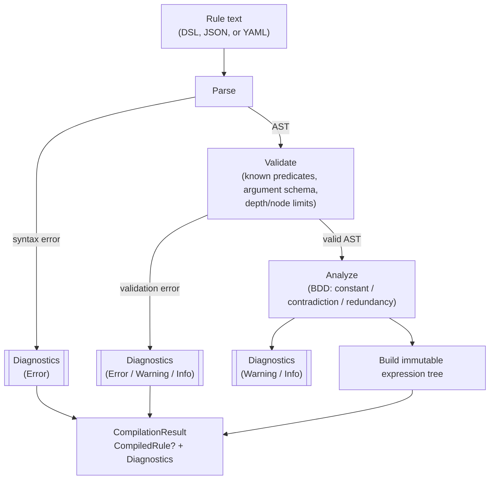
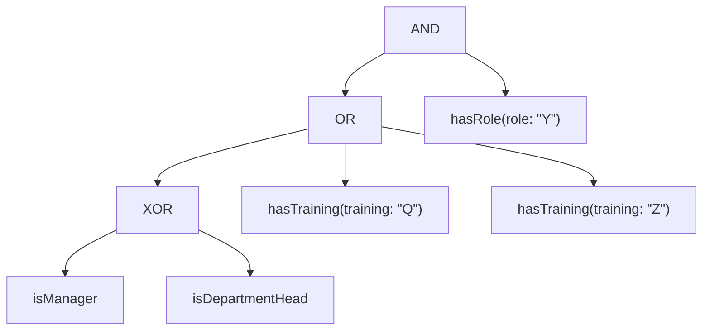

# ADR-0003: Rule syntax and serialization

## Status

Accepted. Partly superseded by [ADR-0005](0005-strong-k3-language-surface.md): the operator set, the ban on `IMPLIES` and symbol aliases, binary-only `XOR`/`XNOR` naming, and "word operators only" no longer hold. All other decisions here stand.

## Context

A rule needs at least one human-editable textual form and at least one
tree-shaped form that's easy to generate programmatically (e.g. from a UI
rule builder) and easy to validate structurally. Three surfaces were on the
table: a string DSL, a JSON tree, and YAML. They need to agree, byte-for-byte
in meaning, on: operator precedence and grouping, how terms take arguments,
and which one is authoritative for persistence.

Two specific traps drove several of the decisions below:

- **Precedence vs. explicitness.** A rule language that requires
  parenthesizing every operator combination is unpleasant to author by hand;
  one that relies purely on implicit precedence for *persisted, machine-read*
  structure is fragile and error-prone to reason about. These pull in
  opposite directions unless separated: precedence can safely govern
  *parsing*, as long as the canonical *printed* form always disambiguates
  explicitly.
- **N-ary XOR is not what people mean.** The parity generalization of binary
  XOR (odd number of `true` operands) is the algebraically "correct"
  extension to more than two operands, but it is almost never what an author
  writing `XOR(a, b, c)` intends — they mean *exactly one*. Silently
  resolving that ambiguity one way is a latent bug generator.

## Decision

### Operator set

> **Superseded by [ADR-0005](0005-strong-k3-language-surface.md) (decisions 3, 4, 5, 6):** the operator
> set is no longer this list. `IMPLIES`, `NAND`, `NOR`, `PARITY`, `ANY`/`ALL`/`NONE`/`BETWEEN`,
> `COALESCE`, `If`, the inspections exist (and `Project` as a method on `Decision`, not a rule operator), `EQUIVALENT` replaces `XNOR`, and `Unknown` is
> a constant. The text below is kept as the original decision.

`AND`, `OR`, `NOT`, `XOR` (**binary only** — a compile error if given more
than two operands), `ExactlyOne(...)` (n-ary, true iff exactly one operand is
`True`), `AtLeast(k, ...)` (n-ary threshold, e.g. "any two of these three
approvals"), and the constants `true`/`false`. See
[Amendments](#amendments) below for `XNOR` and the rest of the threshold
family (`AtMost`/`GreaterThan`/`LessThan`/`Exactly`), added after this ADR
was first accepted.

> **Superseded by ADR-0005 (decision 3):** `IMPLIES` is now an operator (Strong Kleene material implication).

`IMPLIES` was deliberately **not** included — it saves two characters over
`OR(NOT(a), b)` and rule authors reliably get its truth table wrong, so the
"convenience" is negative value. N-ary `XOR` is not supported under that
name at all — the ambiguity above is resolved by giving the "exactly one"
meaning its own explicit name (`ExactlyOne`) instead of overloading `XOR`.

### String DSL — canonical form

> **Superseded in part by ADR-0005 (decisions 2, 8, 9):** symbol aliases and `[]`/`{}` grouping are
> accepted on input (the canonical form is still the upper camel word with parentheses), and every
> infix operator other than `NOT`/`AND`/`OR` follows the no-mixing rule, not just `XOR`. The
> `NOT` > `AND` > `OR` precedence below stands.

Word operators only (`AND`, `OR`, `NOT`, `XOR`, `ExactlyOne`, `AtLeast`),
matched case-insensitively on input. No symbol aliases (`&&`, `||`) — one
syntax is one thing to document, parse, and test, and rules will often be
authored or reviewed by people who are not C# developers and have no
existing attachment to C-style operators.

Precedence for parsing: `NOT` > `AND` > `OR`. **Mixing `XOR` with `AND`/`OR`
without parentheses is a compile error**, not resolved by a precedence rule
— nobody's intuition about `a AND b XOR c` is reliable enough to make an
implicit answer safe. Zero-argument terms are written bare (`isManager`, not
`isManager()`).

Arguments are **named, never positional**, in both the DSL and the tree
forms — `hasRole(role: "Y")`. This removes the inconsistency in the original
draft (JSON used named arguments, the string sketch used positional), and it
lets each predicate declare an explicit argument schema (name, type,
required/default) that the compiler validates once, at compile time, so a
missing or mistyped argument can never surface as a runtime failure inside a
predicate.

Argument values are **literals only**, from a closed set of types: `string`,
`long`, `decimal`, `bool`, `DateTimeOffset`, and arrays of those. There is no
`{{handlebar}}` or path-expression syntax referencing the evaluation context
from within a rule string — a rule needing something like "the resource's
owner id" defines a predicate that reaches into its own `TContext` for that
value (e.g. `IsManagerOfResourceOwner`), rather than the rule text expressing
a context path. This is deliberate: context-bound argument values are
tempting but (a) require a real typed path-expression grammar to do safely,
and (b) break static, structural rule-to-rule equality, since two "same
shaped" rules would no longer be comparable without also evaluating what
their path expressions resolve to. See
[CONTEXT.md](../../CONTEXT.md#deferred) for this as a deferred, not
rejected, feature.

The canonical printer (the form a `CompiledRule` round-trips back to)
emits **minimal but unambiguous** parentheses — it always parenthesizes
`XOR` explicitly and is deterministic (the same tree always prints
identically), so canonical printed forms can be diffed and compared directly.

Example:

```
hasRole(role: "Y") AND (hasTraining(training: "Q") OR hasTraining(training: "Z") OR (isManager XOR isDepartmentHead))
```

### JSON / YAML — interchange, not canonical

JSON and YAML are **interchange and tooling formats**, not the persisted
form. Both compile to exactly the same AST as the DSL, and the guarantee
that matters is: `parse(print(x))` is structurally equal to `x`, in both
directions, for every supported form. This makes JSON/YAML suitable for a
UI rule builder to generate and consume without needing a parser, while the
DSL string remains what actually gets written to a database column (compact,
diff-friendly, one column, readable directly in a log line).

The tree shape drops the original draft's `{"term": {...}}` wrapper nesting
in favor of a flat, key-discriminated node:

```json
{
  "op": "and",
  "operands": [
    { "predicate": "hasRole", "args": { "role": "Y" } },
    {
      "op": "or",
      "operands": [
        { "predicate": "hasTraining", "args": { "training": "Q" } },
        { "predicate": "hasTraining", "args": { "training": "Z" } },
        {
          "op": "xor",
          "operands": [
            { "predicate": "isManager" },
            { "predicate": "isDepartmentHead" }
          ]
        }
      ]
    }
  ]
}
```

A node is discriminated by which key is present (`op` vs. `predicate`)
rather than by an extra wrapper object, halving the nesting depth for the
same information. YAML uses the identical shape under YamlDotNet.

This shape is published as a JSON Schema document,
[`rule-tree.schema.json`](../../src/TruthWeaver/Json/rule-tree.schema.json),
shipped as a content asset in the `TruthWeaver` NuGet package so a
rule-authoring UI or other external tooling can validate a generated tree
structurally without hand-copying this shape. The schema covers structural
JSON shape only — the same level `JsonTreeParser` enforces before
`RuleCompiler` validation runs — so it does not (and cannot, as JSON Schema)
express compile-time-only constraints like `XOR`/`XNOR` being binary-only or
a threshold's `k` being in range for its operand count; a schema-valid
document can still fail compilation. `RuleTreeSchemaTests` validates the
schema against the compiler's own valid and malformed JSON fixtures.

The `true`/`false` constant (user story 11) uses the same discrimination
principle with a third key: `{"const": true}` / `{"const": false}`.
(ADR-0005 decision 16 adds `{"const": "unknown"}`; the DSL constants are `True`/`False`/`Unknown`.)

Both `RuleCompiler.CompileJson` and `CompileYaml` also accept an
already-materialized node (`System.Text.Json.JsonElement` /
`YamlDotNet.RepresentationModel.YamlNode`) in addition to standalone text, so
a caller embedding a rule as one field of a larger document can compile it
directly from the field it already parsed, without re-serializing that
subtree back to text first. Locating that subtree is ordinary caller-side
navigation through the JSON/YAML library's own node APIs (`GetProperty`,
`mapping.Children[...]`, etc.) — the engine adds no path/pointer syntax of
its own for it. This is the same rationale as the decision above against
context-path argument values: a path-expression grammar is a real
sub-language to design and version, and the engine stays out of that
business at both the argument level and the document-navigation level.

### Compilation pipeline



`Compile` always returns a `CompilationResult`; it never throws for anything
on this diagram. `CompiledRule` is populated only when there are no
`Error`-severity diagnostics. See
[ADR-0002](0002-evaluation-semantics.md#persisted-rules-and-compile-failures)
for how this integrates with persistence.

### Expression tree shape

The worked example from the original spec, shown as the tree the compiler
actually builds (identical regardless of which surface — DSL, JSON, or YAML
— it was parsed from):



## Consequences

- Authors write and review one string form; UI tooling generates and
  consumes tree forms; both are provably the same rule via round-trip
  equality, so there's no "which format is real" ambiguity.
- Because `XOR` cannot silently extend past two operands, and cannot be
  silently mixed with `AND`/`OR`, an entire class of "the rule author
  probably meant something else" bugs is turned into a compile-time
  diagnostic instead of a runtime surprise.
- Because argument values are closed-set literals with no context-path
  syntax, canonical rule equality (used by the analyzer for constant and
  contradiction detection, per [CONTEXT.md](../../CONTEXT.md#term-identity))
  remains a pure structural/value comparison with no evaluation semantics
  entangled in it.
- A predicate needing a value from the evaluation context must be authored
  as a distinct, named predicate rather than parameterized generically from
  a path expression — more predicates to register, but each one is fully
  inspectable and testable in isolation.

## Amendments

### Threshold operator family (supersedes the single `AtLeast(k, ...)`)

`AtLeast(k, ...)` turned out to be one point on a small, closed family of
count-threshold comparisons a rule author reasonably wants: "at least",
"at most", "more than", "fewer than", and "exactly". Rather than adding four
near-duplicate AST node types, all five compile to one `ThresholdExpression`
node parameterized by a `ThresholdComparison` enum (`AtLeast`, `AtMost`,
`GreaterThan`, `LessThan`, `Exactly`), sharing one evaluator, one BDD
composition (each expressed via the existing `AtLeast`-counting BDD helper,
e.g. `AtMost(k, ...)` is `NOT AtLeast(k + 1, ...)`), and one compile-time
range check: for a given operand count, a `k` outside the range that makes
the result structurally non-constant is rejected (`BRE0008`,
`InvalidThresholdValue`) — the same "don't silently accept a constant rule"
rationale the original `AtLeast` validation already applied.

DSL keywords: `AtLeast(k, ...)`, `AtMost(k, ...)`, `GreaterThan(k, ...)`,
`LessThan(k, ...)`, `Exactly(k, ...)`. JSON/YAML op names are the camelCase
equivalents (`atLeast`, `atMost`, `greaterThan`, `lessThan`, `exactly`), each
carrying its threshold as a `k` key alongside `operands`, exactly as
`atLeast` already did.

Several edge values in this family collapse to other operators in the set
(`AtMost(0, ...)` is `NOT(OR(...))`, `GreaterThan(0, ...)` is `OR(...)`,
`Exactly(n, ...)` at the full operand count is `AND(...)`, and so on) — see
[CONTEXT.md's "Equivalency rules"](../../CONTEXT.md#equivalency-rules) for
the full table and why no `All`/`None` operators exist to duplicate them.

### `XNOR` (logical biconditional / `IFF`)

> **Superseded by ADR-0005 (decision 5):** the node is now `EQUIVALENT` (aliases `IFF` and `XNOR`);
> JSON/YAML write `equivalent` and still read `xnor`. `IFF` is accepted, contrary to the paragraph below.

Added as `XOR`'s natural counterpart: binary-only for the same reason `XOR`
is (the n-ary generalization is a parity operator nobody means when they
write `XNOR(a, b, c)`), always parenthesized by the canonical printer
regardless of context, and included in the same ambiguous-mixing check `XOR`
already had — mixing `XNOR` with `AND`/`OR`, or mixing `XOR` with `XNOR`, at
the same syntactic level without parentheses is a compile error
(`BRE0007`). DSL keyword: `XNOR`. JSON/YAML op name: `xnor`.

`IFF` was considered as an alternate/additional keyword but not added:
`XNOR` is already the standard boolean-algebra name and adding a second
spelling for the same operator would just be another synonym to document,
parse, and test, which this ADR's original decision already argues against
for `IMPLIES`/symbol aliases.

### Required predicate descriptions, and a required predicate label

`PredicateSchema` and `PredicateArgumentSchema` both gained a required,
read-only `Description` string. This was not part of the original operator
set decision above, but belongs here rather than a new ADR: it's a
predicate-authoring-contract change, not a rule-syntax change, and it exists
so a rule-authoring UI or generated documentation always has something to
show for every registered predicate and its arguments, rather than an empty
string a UI would have to guard against.

`PredicateSchema` later gained a second required string, `Label` — a short,
human-friendly display name distinct from the machine-facing `Name` used in
rule text (e.g. `Name: "hasRole"`, `Label: "Has Role"`). The distinction
matters because `Name` is load-bearing for term identity (CONTEXT.md) and
therefore can't casually change once rules reference it, while `Label` is
purely presentational and free to be renamed, capitalized, or localized
without touching a single persisted rule.

### Operator label/description, and `CompiledRule.Describe()`

Predicates carry `Label`/`Description` on their schema; the closed set of
*operators* (`AND`/`OR`/`NOT`/`XOR`/`XNOR`/`ExactlyOne`/the threshold family/
the constants) needed the equivalent, so a rule-authoring UI or a generated
"what does this rule mean" report can describe every node of a compiled
expression tree, not just its predicate leaves. `OperatorInfo.Describe`
(`TruthWeaver.Ast`) returns an `OperatorDescriptor` (`Label`,
`Description`) for any operator node; `CompiledRule<TContext>.Describe()`
walks the whole tree and returns a `RuleDescription` (`Label`, `Description`,
`Operands`) recursively, resolving each term's `Label`/`Description` from its
predicate's registered `PredicateSchema` via the new public
`PredicateRegistry<TContext>.TryGetSchema`. `RuleDescription` is a plain DTO,
not the AST itself — the closed-set `Expression`/`RuleNode` types stay
internal-to-the-package (ADR-0004); nothing here opens them up as a second,
parallel public surface.

### Canonical printer: parenthesize mixed operators for clarity

The canonical printer's original "minimal but unambiguous" rule left some
mixed-operator combinations unparenthesized where precedence alone made them
unambiguous to the parser (e.g. `a AND b OR c`, parsed correctly as
`(a AND b) OR c` since `AND` binds tighter). In practice this reads poorly
in a large, deeply nested rule, where a human has to reconstruct precedence
mentally to see the grouping the parser already knows. The printer now
parenthesizes an operand whenever it's a different operator than the one
it's nested under (`a AND b OR c` → `(a AND b) OR c`), even where the parser
would resolve the same meaning unambiguously without them — precedence still
governs *parsing*, but the printed form no longer relies on the reader
holding that precedence table in their head. `XOR`/`XNOR` operands remain
always-parenthesized regardless of context, as before. This does not change
`parse(print(x))` round-trip equality: the extra parentheses only affect
which operand groupings appear in the printed text, not which tree they
reparse to.

### Programmatic construction: `RuleBuilder`

A fluent `RuleBuilder` (in `TruthWeaver.Building`) lets a host
assemble a rule tree from application logic — e.g. a dynamically built list
of conditions — without hand-writing or string-concatenating DSL/JSON/YAML
text. It is deliberately *not* a fourth parallel front end into the AST:
each builder method renders to the same flat JSON tree shape this ADR
already defines, and compiles through the existing `RuleCompiler.CompileJson`,
so a builder-assembled rule goes through the identical Validate/Analyze
pipeline and receives the identical diagnostics a hand-written rule would.
This keeps the closed-set `Expression`/`RuleNode` types (ADR-0004) as the
only place that knows about the AST's shape, rather than adding a second,
lower-trust path that could drift out of sync with the validated one.

## Related

- [ADR-0001: Kleene failure model](0001-kleene-failure-model.md)
- [ADR-0002: Evaluation semantics](0002-evaluation-semantics.md)
- [ADR-0005: Strong K3 language surface](0005-strong-k3-language-surface.md)
- [CONTEXT.md](../../CONTEXT.md)
