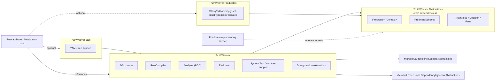

# ADR-0004: Package boundaries and extensibility

## Status

Accepted. Type and member names cited here (`TraceTree`, `TraceNode`, `Text`, `OutlineNode`, `Outline()`) read as renamed by [ADR-0007](0007-naming-cleanup-and-tre-diagnostic-prefix.md) (changed in place).

## Context

Predicate implementations frequently need to live in a different deployment
unit than the engine itself — a shared "kernel" of domain predicates
(`isManager`, `hasRole`, `customerHasCredit`) referenced from several
services, none of which necessarily want to depend on a rule parser, a BDD-
based analyzer, or a YAML library just to *implement and register*
predicates. Getting the package split wrong in v1 means either an
unnecessarily heavy dependency for predicate-only consumers, or a breaking
split later once real consumers already depend on a single monolithic
package.

A related, narrower question: what should this library log through, given
this repo's own rule against unnecessary dependencies and given the
project's observability story is intentionally minimal for the proof of
concept (see [CONTEXT.md](../../CONTEXT.md#deferred) — OpenTelemetry-shaped
observability is deferred, not v1).

## Decision

### Four packages

> A fifth package, `TruthWeaver.Testing` (`Decision` assertions and fake predicates, depending on
> `TruthWeaver.Abstractions` alone), was added later; the boundaries below are unchanged.
>
> A sixth package, `TruthWeaver.DataSources.Json` (`JsonDataSource`, `JsonQueryValidator` and the JsonPath.Net dependency;
> depends on `TruthWeaver.Abstractions` alone), was added by [ADR-0006](0006-data-sources-for-expression-variables.md).
> `TruthWeaver.Yaml` now also references it for `YamlDataSource`, and `TruthWeaver.Testing` gained `FakeDataSource`; the core
> `TruthWeaver` package still takes no JSON or YAML query dependency.

- **`TruthWeaver.Abstractions`** — `IPredicate<TContext>`,
  `PredicateSchema`, `PredicateArguments`, `TruthValue`, `Decision`, `Fault`.
  Zero third-party dependencies. This is the "common kernel" a project that
  only *implements* predicates references — it does not need the parser, the
  compiler, the analyzer, or any serialization support.
- **`TruthWeaver`** — the AST, DSL parser, `RuleCompiler`,
  `CompiledRule`, the analyzer (BDD-based constant/contradiction/redundancy
  detection), the evaluator, `System.Text.Json` support for the JSON tree
  form, and dependency-injection registration extensions. Depends on
  `Microsoft.Extensions.DependencyInjection.Abstractions` and
  `Microsoft.Extensions.Logging.Abstractions` (see below) — nothing else.
- **`TruthWeaver.Yaml`** — YAML tree support, isolated here because
  it is the one place YamlDotNet is needed, and a consumer with no interest
  in YAML should not acquire that dependency transitively.
- **`TruthWeaver.Predicates`** — a convenience library of ready-made,
  generic `IPredicate<TContext>`-shaped implementations (string comparison,
  null/empty, set equality, regex matching), each parameterized by a
  selector delegate supplied at registration. Depends on
  `TruthWeaver.Abstractions` alone — not `TruthWeaver` — so a
  service that wants these common predicates still doesn't acquire the
  parser, compiler, or analyzer. It is deliberately its own package rather
  than folded into `TruthWeaver.Abstractions` itself: `Abstractions`
  is a zero-opinion kernel (the contract every predicate author, including
  this package, implements against), while `Predicates` is one opinionated,
  optional convenience layer built on top of that contract — a host is free
  to implement every predicate itself and never reference this package at
  all. Any host project may opt into it; nothing in `TruthWeaver`
  itself depends on it.

Splitting a monolithic package into these four later is a breaking change
for anyone who already depends on the combined surface; shipping the split
from the start costs nothing extra now.

### Logging: abstractions, not a concrete provider

The library depends on `Microsoft.Extensions.Logging.Abstractions` and logs
through `ILogger<T>` — never a concrete provider such as Serilog. The
consuming application wires whatever provider it already uses (Serilog or
otherwise) to the `ILogger` the library requests; the library itself commits
to nothing beyond the abstraction. v1's logging is intentionally simple:
faults, compile diagnostics, and rule-swap events are logged as structured
log events. This is explicitly a stepping stone — a later OpenTelemetry-
shaped observability story (an `Activity` per rule evaluation, an event per
term, fault attributes) can be added on top of `ILogger`-based logging
without a breaking change, and is tracked as deferred in
[CONTEXT.md](../../CONTEXT.md#deferred) rather than built now.

### Extensibility: explicit registration only

New predicates are added by explicit registration against the
`PredicateRegistry` — either implementing `IPredicate<TContext>` and
registering the type (resolved per-evaluation from `IServiceProvider`, so
scoped dependencies work correctly per
[ADR-0002](0002-evaluation-semantics.md#predicate-registration-and-dependency-lifetimes)),
or registering a stateless lambda directly. There is no attribute-scanning
or assembly-scanning discovery mechanism. New *operators* are added inside
`TruthWeaver` itself (parser, compiler, evaluator, analyzer each
need to know about a new operator) rather than through an operator plugin
model — the operator set is closed by design
([ADR-0003](0003-rule-syntax-and-serialization.md); its size was expanded to the full Strong K3 set by
[ADR-0005](0005-strong-k3-language-surface.md), which keeps the no-plug-in stance), so an extensibility
point for operators would be speculative surface area with no current
consumer.

### Amendment: `RuleBuilder` is not a fourth front end

`RuleBuilder` (`TruthWeaver.Building`, added after this ADR was first
accepted) lets a host assemble a rule tree fluently in C#. It lives inside
`TruthWeaver` itself rather than as a separate package or an
extension point some other assembly could plug into: it renders to the same
JSON tree shape [ADR-0003](0003-rule-syntax-and-serialization.md) already
defines and compiles through the existing `CompileJson`, so it's a
convenience wrapper over the closed operator set above, not a new surface
that would need to independently track every operator this package adds.

### Amendment: the real per-operator touch-point count, after the shared node-shape seam

The "operator set is closed... adding a new operator is a versioned change" language above scoped
the cost of a new operator to four subsystems (parser, compiler, evaluator, analyzer). In practice,
by the time `TruthWeaver.Yaml` and the JSON/canonical-text printers existed, adding a new
operator touched **six** independent switches over `Expression` that each re-derived the same
structural fact — a node's op-name, its threshold `K` (when applicable), and its operand list:
`OperatorInfo`, `CanonicalPrinter`, `JsonTreePrinter`, `YamlTreePrinter`, `Evaluator` (its trace/skip
`Describe` helper), and `CompiledRule` (its `Outline()` operand-extraction switch). None of those six
were the four subsystems this ADR originally scoped (parser, compiler, evaluator's actual eval
dispatch, analyzer) — they were rendering/description call sites layered on afterward, each
re-implementing the same structural lookup independently.

`TruthWeaver.Ast.ExpressionShape.Of` (internal, `src/TruthWeaver/Ast/NodeShape.cs`) now
supplies that one structural fact from a single switch. Adding a new operator variant to the closed
set still means editing several places, but the count is smaller and each remaining edit is now
irreducibly format- or behavior-specific rather than a duplicate of the same structural
pattern-match:

1. `Expression.cs` — add the record.
2. The parser/compiler front ends (DSL, JSON, YAML) — teach them the new keyword/shape.
3. `ExpressionShape.Of` — **one** new case for op-name/K/operands (was six before this ticket).
4. `Evaluator`'s `EvalAsync` switch — the new operator's actual Kleene evaluation algorithm (never
   collapsible into the seam — it's genuinely distinct control flow per operator).
5. The analyzer's BDD encoding, if the operator needs one.
6. Per-format label/keyword strings in `OperatorInfo`, `CanonicalPrinter`,
   `JsonTreePrinter`/`YamlTreePrinter` — each format still needs to know what to *call* the new
   op-name in its own vocabulary, but no longer needs its own switch to find the op-name/K/operands
   in the first place.

The structural duplication (six identical `Expression` switches) is gone; what remains is
irreducible — genuinely different behavior or vocabulary per subsystem, not the same fact
re-derived six times.

> **Update (operator definition table):** item 6's per-format label and name strings are no longer
> separate switches. `OperatorDefinitions` (internal, `src/TruthWeaver/Ast/`) holds one definition per
> operator (canonical name, tree-format name, arity, label and description templates). `OperatorInfo`,
> the `Evaluator` trace label, `RuleBuilder` and `TreeFormatOpNames` read it, so a new operator adds one
> table entry instead of editing those. `CanonicalPrinter` keeps its own DSL keywords, since the table
> holds no DSL spelling. Evaluation, analysis and rewriting still switch on the node type. A missing
> entry fails the table completeness test.

> **Update (ADR-0005):** the K3 operator slices also touch the expand/compress/canonicalize/simplify
> rewriters (`src/TruthWeaver/Rewriting`), the structured-diagnostic suggestions and the JSON schema, in
> addition to the six switches above.

## Consequences

- A service that only implements domain predicates (e.g. a shared
  "permissions kernel" referenced by several microservices) takes a
  dependency with no parser, no BDD analyzer, and no YAML library — just the
  interfaces and value types it actually needs to implement against.
- Adding YAML support to a project that doesn't want it costs nothing;
  removing the dependency is impossible to need since it was never forced.
- Swapping the logging provider (Serilog, or anything else) is entirely the
  host application's concern and requires no change to this library.
- Because the operator set is closed and lives inside the core package,
  adding a new operator is a versioned change to `TruthWeaver` itself,
  not a third-party extension point — consistent with "do not introduce
  unnecessary abstractions."

## Related

- [ADR-0002: Evaluation semantics](0002-evaluation-semantics.md)
- [ADR-0003: Rule syntax and serialization](0003-rule-syntax-and-serialization.md)
- [CONTEXT.md](../../CONTEXT.md)
