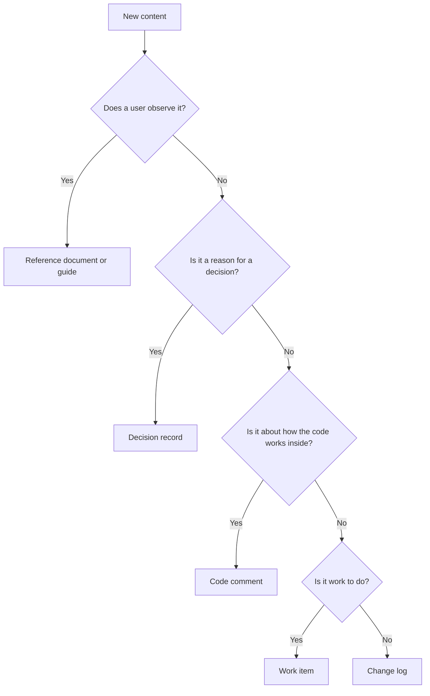

<!-- docs-lint: on -->

# Documentation standard

This standard sets the rules for all Markdown documentation in a repository. It does not depend on one project. Copy the file to another repository and complete the project settings at the end.

Read it in layers. Stop when you have what you need.

| Layer | Section | Read it to |
| --- | --- | --- |
| 1 | Summary | Learn the rules in one minute. |
| 2 | Rules | Learn the detail and the reason for each rule. |
| 3 | Checklist and Project settings | Review a change, or adopt the standard. |

## Summary

1. Documentation describes the project as it is now. Specifications, decision records and work items follow their usual conventions.
2. History, decisions, plans and developer-only detail stay out of reference documents.
3. Documentation and code change in the same commit.
4. Write in the present tense, in short sentences, with one term for each concept.
5. Keep rules, reasons and examples apart.
6. State a fact once. Link to it from other places.
7. Use relative links, sentence-case headings and tables for data.
8. Add a diagram or a formula only when it explains more than prose or a table.
9. When a topic has no documentation, write a minimal page now and open a work item for the rest.
10. Run the automated checks and a plain-language review pass before you merge.

## Rules

### Purpose and scope

Reference documents describe what the project does and how to use it. They are not a record of how the project got there.

A repository has two groups of writing. The group sets how strict this standard is.

**Documentation** explains the project to people who use it or change it. The full standard applies to it.

| Kind | Purpose | Tense |
| --- | --- | --- |
| Reference | Define behavior, formats, options and terms. | Present |
| Guide | Teach a task from start to end. | Present, as commands |
| README | Say what the project is and where to start. Link to the reference. | Present |
| Developer documentation | Explain how to build, test, extend and release the project. | Present, as commands |
| Code documentation and comments | Say what a member does, and why the code is the way it is. | Present |

**Records** capture planning, decisions and work. They follow the usual conventions for their type. The language rules of this standard (ASD-STE100, present tense, one term for each concept) do not apply to them, and they may tell the history on purpose.

| Kind | Usual form |
| --- | --- |
| Specification or product requirements | Problem, goals, scope, decisions, out of scope. |
| Decision record | Context, decision, consequences. Past tense is normal. |
| Work item | Problem, acceptance criteria, blockers, status. |
| Change log | What changed in each release. |
| Agent file | Short instructions to a coding agent. |

Keep a record accurate and easy to scan. A record can state a plan or a past choice. Documentation never links to a record to explain behavior. The documentation states the behavior.

Rule 9 and the code-with-docs workflow apply to records too. A work item that changes behavior or a public API lists the page it updates.

### Content

Document the resulting behavior or rule. Leave out:

- project history and earlier approaches,
- work items, plans and pending decisions,
- decision records and the discussion behind them,
- developer-only implementation detail,
- temporary concerns.

When a decision changes what users see, write the new behavior. Do not write the history of the decision.

Put each piece of content where it belongs.

A code comment explains why the code is the way it is. It does not repeat what the code does, and it does not replace a reference page for a behavior that users observe.

### Voice and language

Write what the project does now.

- Use the present tense. Write "The parser rejects the input", not "The parser will reject the input".
- Name the actor. Use the active voice.
- Use direct statements. Use "may", "could" and "should" only when the behavior is optional or conditional.
- Do not use the first person. Do not describe the document or its cleanup.
- Do not use words that mark a change: "now", "new", "previously", "no longer", "was added". Change logs are the exception.

Use ASD-STE100 Simplified Technical English (US) as the base for prose:

- Keep sentences short. One sentence has one meaning.
- Use one term for one concept. Do not swap synonyms for style.
- Keep the articles (a, an, the).
- Repeat the noun when "it" or "this" could point to two things.
- Choose the plain verb: "use", not "utilize".

Use the established terms of the project, of the field and of mathematics. Do not replace an exact term with a simpler word. Define a term once, where a new reader first meets it, or link to the glossary.

### Kinds of statement

Keep three kinds of statement apart.

| Kind | Says | Example form |
| --- | --- | --- |
| Normative | What the system does or requires. | "The function returns `false` for empty input." |
| Explanatory | Why a concept works, or how to think about it. | "This keeps the result stable when the input order changes." |
| Example | One use of a rule. | A code block with its output. |

An example adds no rule. If a rule matters, state it as a normative sentence first. Do not add a rule only to improve the prose.

### Structure and navigation

Build a document set that reads as one reference, not a pile of pages.

- Open every page with a one-sentence definition of its subject.
- Order content from the summary down to the edge cases, so a reader can stop at any level.
- State a fact once. Link to it from other pages. Do not copy reference content into a README.
- Use relative links. Check that each link resolves from the file that holds it.
- Use sentence-case headings, and keep the heading levels in order.
- Use a table when the content is a set of items with the same fields. Use a list for steps and short sets. Use prose for reasoning.
- Add an index page to a folder of related pages. Link each page to its neighbors.
- Merge pages that cover the same subject. Split a page when two audiences use it for different tasks.
- Follow GitHub Flavored Markdown for tables, alerts, code fences and math.

### Diagrams and formulas

Add a diagram only when it shows something that a table or prose does not. Good uses are a flow, a state change, a hierarchy and a relation between several parts. Do not add a diagram as decoration.

- Use Mermaid for diagrams, so the source stays in the repository and reviews as text.
- Validate the diagram syntax before you commit.
- Keep a diagram small. A reader must understand it without a legend.
- Write a formula in LaTeX when the notation is part of the subject. Explain each symbol the first time it appears.

### Code and documentation together

Write the code and the documentation in the same change. Do not leave the documentation for later.

A change must update the documentation when it changes observable behavior or a public API. This includes a new or changed public member, option, diagnostic code, format, default or operator. A refactor, an internal change or a test-only change does not.

When a change applies:

1. Find the page that describes the behavior.
2. Edit that page so that it states the current truth. Do not add "changed from" text, a version note or a diff of the old behavior.
3. Update the index, the navigation and the glossary when the change adds, renames or removes a documented item.
4. Check that the examples in the page still run and give the output shown.

When no page covers the behavior:

1. Write a minimal, correct page or section in the same change. It covers the behavior you change.
2. Open a work item for the wider topic the page does not cover.
3. Link the work item from the change description, not from the page.

Put the documentation step in the acceptance criteria of each work item that changes behavior or a public API. Name the page.

### Review and checks

Run these checks before you merge:

- The automated documentation checks of the project. They find broken links, banned words and untested examples.
- A plain-language pass over the prose. It removes filler, inflated claims and patterns that make text read as machine-written. It does not change a fact.
- A syntax check of every diagram.
- A read of the page by someone who did not write it, for any new page.

## Checklist

Use this list to review a change.

- [ ] The page describes the current behavior in the present tense.
- [ ] No history, plan, work item or decision text is in a reference page.
- [ ] Every sentence has one meaning. Every concept has one term.
- [ ] Rules, reasons and examples are apart.
- [ ] Each fact is stated once and linked from other pages.
- [ ] All links are relative and resolve.
- [ ] Each diagram and each formula adds something that prose does not.
- [ ] The documentation changed in the same commit as the code.
- [ ] A missing page was written in minimal form, and a work item covers the rest.
- [ ] The automated checks and the plain-language pass are clean.

## Project settings

Each project completes these settings in its agent file, such as `CLAUDE.md` or `AGENTS.md`. The standard stays the same from project to project.

| Setting | What to define |
| --- | --- |
| Scope | The folders and files that follow this standard, and the stop list of history and tool files. |
| Terms | The location of the glossary and the domain terms. |
| Checks | The automated checks, how to run them, and any list of known exceptions. |
| Examples | How runnable examples are marked and tested. |
| Tools | The tool for each role: the plain-language pass, the Markdown dialect, the diagram validator. |
| Reference sync | Which code changes need a matching page, and the check that enforces it. |
