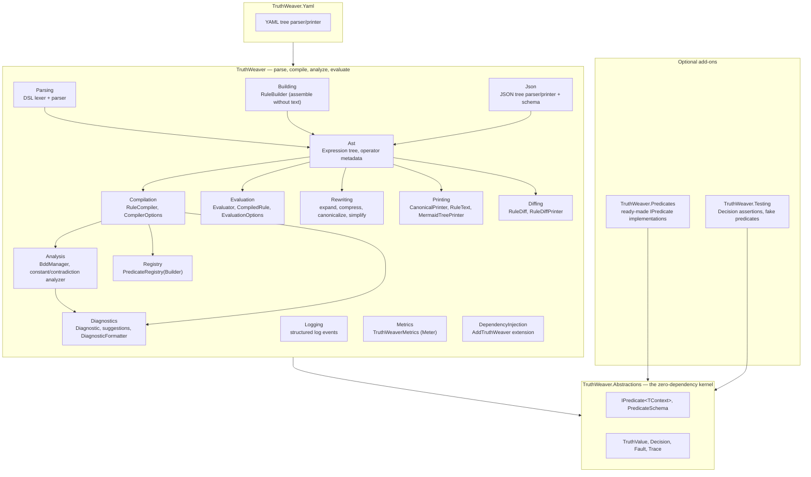
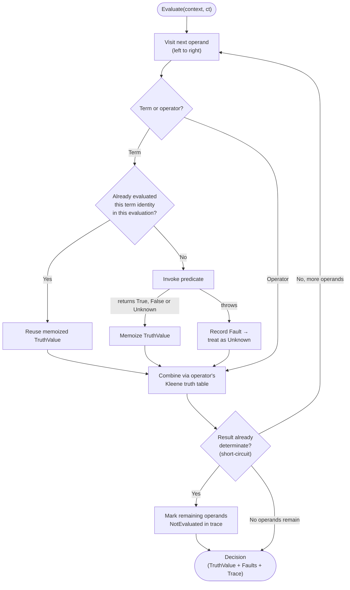
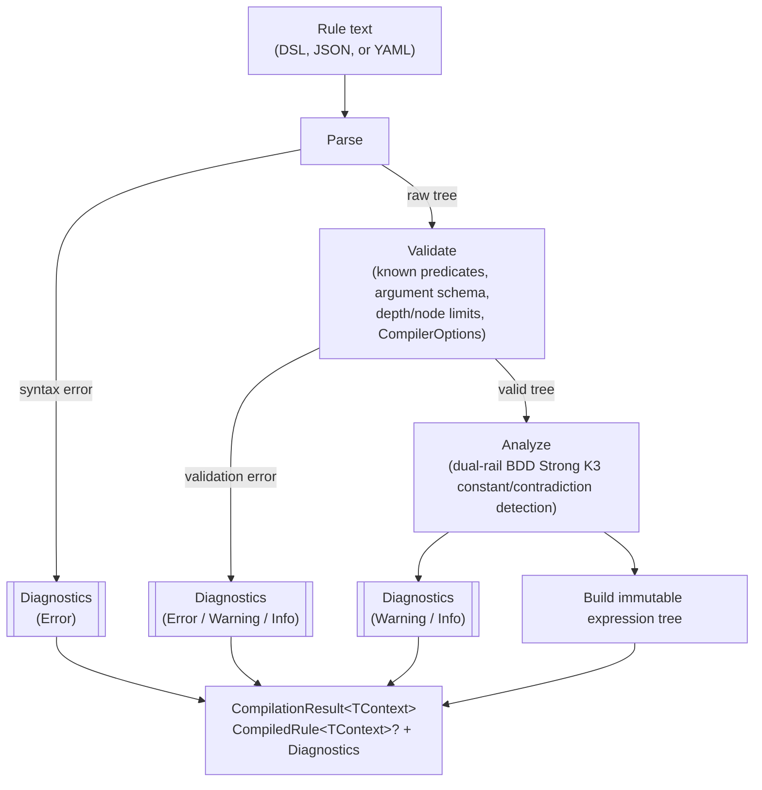

# Architecture

How the TruthWeaver source is laid out, how a rule is compiled, and how a compiled rule is evaluated.

## A tour of the codebase

The `src` projects follow the rule lifecycle from [Getting started](../README.md#getting-started). A service that implements predicates needs only the zero-dependency kernel. A host that authors rules also uses the parser, the compiler, the analyzer and the evaluator. The package list is in [Packages](packages.md).

<!-- doctest:skip class diagram, structure only -->

Start with these files for common tasks:

| Task | Start here |
| --- | --- |
| Implement a new predicate | [`IPredicate<TContext>`](../src/TruthWeaver.Abstractions/IPredicate.cs), or a factory in [`TruthWeaver.Predicates`](../src/TruthWeaver.Predicates) if it's a generic string/collection/regex check |
| Register predicates and compile a rule | [`PredicateRegistryBuilder`](../src/TruthWeaver/Registry/PredicateRegistryBuilder.cs), [`RuleCompiler`](../src/TruthWeaver/Compilation/RuleCompiler.cs) |
| Understand DSL parsing | [`Lexer`](../src/TruthWeaver/Parsing/Lexer.cs) → [`DslParser`](../src/TruthWeaver/Parsing/DslParser.cs) |
| Understand the compiled tree shape | [`Expression`](../src/TruthWeaver/Ast/Expression.cs) |
| Understand constant/contradiction detection | [`BddManager`](../src/TruthWeaver/Analysis/BddManager.cs), [`Analyzer`](../src/TruthWeaver/Analysis/Analyzer.cs) |
| Understand evaluation and short-circuiting | [`Evaluator`](../src/TruthWeaver/Evaluation/Evaluator.cs), [`CompiledRule`](../src/TruthWeaver/Evaluation/CompiledRule.cs) |
| Assemble a rule without hand-writing text | [`RuleBuilder`](../src/TruthWeaver/Building/RuleBuilder.cs) |
| Rewrite a rule (expand, compress, canonicalize, simplify) | [`CompiledRule`](../src/TruthWeaver/Evaluation/CompiledRule.cs) and [`Rewriting`](../src/TruthWeaver/Rewriting) |
| Understand compile diagnostics and "did you mean" | [`Diagnostic`](../src/TruthWeaver/Diagnostics/Diagnostic.cs), [`DiagnosticFormatter`](../src/TruthWeaver/Diagnostics/DiagnosticFormatter.cs) |
| Print or diagram a compiled rule | [`CanonicalPrinter`](../src/TruthWeaver/Printing/CanonicalPrinter.cs), [`MermaidTreePrinter`](../src/TruthWeaver/Printing/MermaidTreePrinter.cs) |
| Diff two compiled rules | [`RuleDiff`](../src/TruthWeaver/Diffing/RuleDiff.cs) |
| Check two rules for Strong K3 equivalence | [`RuleEquivalence`](../src/TruthWeaver/Analysis/RuleEquivalence.cs) |
| Wire into a DI container | [`TruthWeaverServiceCollectionExtensions`](../src/TruthWeaver/DependencyInjection/TruthWeaverServiceCollectionExtensions.cs) |
| Compile JSON or YAML instead of the DSL | [`JsonTreeParser`](../src/TruthWeaver/Json/JsonTreeParser.cs), [`YamlTreeParser`](../src/TruthWeaver.Yaml/YamlTreeParser.cs) |
| Write a unit test against a `Decision` | [`DecisionAssertions`](../src/TruthWeaver.Testing/DecisionAssertions.cs), [`FakePredicates`](../src/TruthWeaver.Testing/FakePredicates.cs) |

Beyond `src`, the repository holds these projects:

- [`tests/TruthWeaver.Tests`](../tests/TruthWeaver.Tests) holds the unit tests for all packages. It has one file for each behavior area, such as parsing, compilation, evaluation, memoization, YAML and JSON round-tripping, and diffing.
- [`benchmarks/TruthWeaver.Benchmarks`](../benchmarks/TruthWeaver.Benchmarks) holds a BenchmarkDotNet suite. It measures compile-time and evaluation-time cost. It is for development only.
- [`CONTEXT.md`](../CONTEXT.md) holds the domain vocabulary and the conceptual model. It matches the code.

## Evaluation flow

The diagram shows how the evaluator visits the operands of an expression.

<!-- doctest:skip class diagram, structure only -->

A short-circuit skips the remaining operands. An `AND` stops at the first `False`. An `OR` stops at the first `True`. The trace records each skipped operand as `NotEvaluated`, so the trace still explains the decision. A fault does not stop the evaluation. The fault becomes `Unknown`, and the truth table of the operator absorbs it where the table allows. For the behavior of the evaluator, see [Evaluation](strong-k3/specification/evaluation.md).

## Compilation pipeline

Rule text in DSL, JSON or YAML goes through the same Parse, Validate, Analyze and Build pipeline. For this reason `parse(print(x))` round-trips structurally, whichever surface the rule came from.

<!-- doctest:skip state diagram, structure only -->

`Compile` never throws for an authoring error. Each problem, from a syntax error to a Strong K3 tautology, becomes a `Diagnostic` (code, severity and source span) in the returned `CompilationResult<TContext>`. `CompiledRule<TContext>` has a value only when there are no `Error` diagnostics. A bad edit is therefore rejected, and the previously persisted rule stays active.
