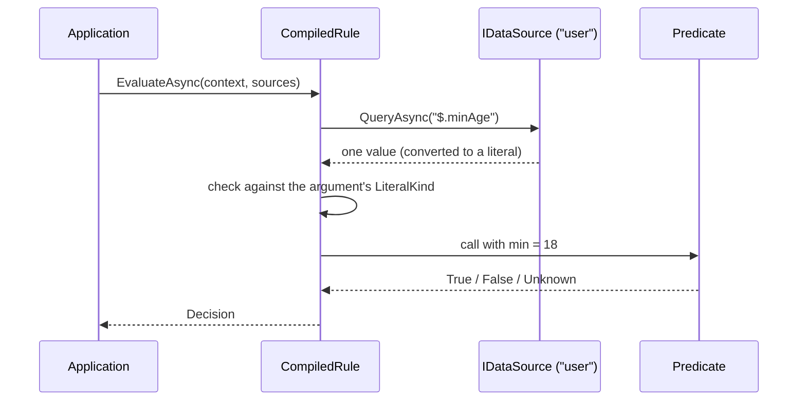

# Data sources and variable references

A rule argument can be a literal (`min: 18`) or a **variable reference** that reads its value from a
named data source on every evaluation (`min: from("user", "$.minAge")`). Use a variable when the value
changes per request, or lives in a JSON or YAML document you do not want to write a predicate for.

> [!NOTE]
> This guide describes the design accepted in
> [ADR-0006](adr/0006-data-sources-for-expression-variables.md). The feature is not implemented yet, so the
> examples below are not run by the documentation checker (see [doc-examples.md](doc-examples.md)); each is
> marked `doctest:skip` until the implementation lands. The C# member names (`DataSourceNames`,
> `JsonDataSource.Parse`, `Arg.From`, `GetAsync`, `FakeDataSource.With`, `EvaluationOptions`, `DataSourceDeclarations`, `JsonQueryValidator`, `QueryProblem`) are proposed,
> not final; the implementation tickets in `.scratch/data-sources/` settle them and this guide is then
> updated and its examples made runnable.

## Contents

- [How it works](#how-it-works)
- [Writing a variable reference](#writing-a-variable-reference)
- [Supplying data sources](#supplying-data-sources)
- [Queries](#queries)
- [How a result becomes an argument](#how-a-result-becomes-an-argument)
- [Using variables in `RuleBuilder`](#using-variables-in-rulebuilder)
- [Failures](#failures)
- [Testing with `FakeDataSource`](#testing-with-fakedatasource)
- [Writing your own data source](#writing-your-own-data-source)
- [Packages](#packages)

## How it works

The compiler stores the reference in the rule. Nothing is read until you evaluate.

<!-- doctest:skip flow diagram, structure only -->


Within one evaluation each `(source, query)` pair is queried once, however many terms use it.

## Writing a variable reference

The reference has two quoted parts: the source name and the query. It goes anywhere a literal argument goes.

<!-- doctest:skip variable references are not implemented yet -->
```text
ageAtLeast(min: from("user", "$.minAge")) AND hasRole(role: from("request", "$.requiredRole"))
```

The same rule as JSON and YAML. The reference is an object with `from` and `query`:

<!-- doctest:skip variable references are not implemented yet -->
```json
{
  "op": "and",
  "operands": [
    { "predicate": "ageAtLeast", "args": { "min": { "from": "user", "query": "$.minAge" } } },
    { "predicate": "hasRole", "args": { "role": { "from": "request", "query": "$.requiredRole" } } }
  ]
}
```

<!-- doctest:skip variable references are not implemented yet -->
```yaml
op: and
operands:
  - predicate: ageAtLeast
    args:
      min: { from: user, query: "$.minAge" }
  - predicate: hasRole
    args:
      role: { from: request, query: "$.requiredRole" }
```

Two terms are the same variable only when the predicate, the argument names and every source name and query
text are identical. `from("user", "$.a")` and `from("user", "$.b")` are different variables even if the data
holds the same value in both places.

## Supplying data sources

Declare the source names when you compile, and pass the sources when you evaluate. A name that is not declared
is a compile diagnostic, so a typo does not wait for the first evaluation. A name can also be declared with a
query validator, which turns a malformed query into a compile diagnostic too.

```csharp
// Compile: declare which source names rules may use.
var compiler = RuleCompiler.Create(registry, options with
{
    DataSources = new DataSourceDeclarations
    {
        ["user"] = JsonQueryValidator.Instance,   // queries on "user" are checked at compile time
        ["request"] = null,                       // declared, but queries are not syntax-checked
    },
});
CompilationResult<MyContext> result = compiler.Compile(ruleText);

// Evaluate: supply a source per name, usually per request.
var sources = new DataSources
{
    ["user"] = JsonDataSource.Parse(userJson),
    ["request"] = YamlDataSource.Parse(requestYaml),
};
Decision decision = await result.Rule!.EvaluateAsync(context, sources, cancellationToken);
```

A rule that uses `from(...)` but is evaluated without the source it names returns `Unknown` and records a
fault. Existing `EvaluateAsync(context)` calls keep working for rules with no variables.

## Queries

Each source defines its own query dialect. The JSON and YAML sources use
[JSONPath (RFC 9535)](https://www.rfc-editor.org/rfc/rfc9535); a YAML document is read into the same data
model as JSON, so one query works against either.

| Query | Meaning |
| --- | --- |
| `$.user.minAge` | A property by name. |
| `$.items[0].price` | An array element by index. |
| `$.orders[?@.id=='A7'].total` | The `total` of the order whose `id` is `A7`. |
| `$.roles[*]` | Every element of `roles`. |

A document often repeats a shape, for example many `orders` with a `total` each. Pin the node you want
with an index or a filter. A query meant to give one value that matches several is an error, not a guess.

To work with one repeated subtree as its own source, scope it. `ScopeAsync` returns a new source rooted at
the node the query matches, and queries on it stay absolute within that node:

```csharp
IDataSource order = await orders.ScopeAsync("$.orders[?@.id=='A7']", cancellationToken);
var sources = new DataSources { ["order"] = order };   // from("order", "$.total")
```

Rule text cannot use relative queries (`@.total`) or loop over the repeated subtrees. If the rule and the
data live in one document, pass the document (or a scope of it) as a named source and read neighbouring values
with `from("doc", "$.limits.age")`.

## How a result becomes an argument

The predicate's argument declares a `LiteralKind`, and that decides what a query result must look like.

| Argument kind | Required result |
| --- | --- |
| Scalar (`String`, `Int64`, `Decimal`, `Boolean`, `DateTimeOffset`, `Guid`) | Exactly one match of a convertible type. |
| Array (`StringArray`, `Int64Array`, and so on) | Every match, each convertible to the element type. No match gives an empty array. |

Conversions are deliberately the same as for literals written in a rule:

- a string becomes a `DateTimeOffset` (ISO 8601) or a `Guid` when the argument asks for one;
- a JSON integer widens to `Decimal`, and a whole-number `Decimal` narrows to `Int64` only if it is exactly representable;
- a string is never turned into a number or boolean, and a number is never turned into a string.

Anything else is a type-mismatch failure.

## Using variables in `RuleBuilder`

Where `RuleBuilder` takes an argument value, `Arg.From` gives a deferred reference, exactly like `from(...)` in
rule text:

```csharp
RuleBuilder rule = RuleBuilder.Predicate("ageAtLeast", ("min", Arg.From("user", "$.minAge")));
```

To read a value once, while you assemble the rule, query a source yourself and pass the literal. This fixes
the value in the rule; it does not create a variable.

```csharp
long limit = await configSource.GetAsync<long>("$.limits.age", cancellationToken);
RuleBuilder rule = RuleBuilder.Predicate("ageAtLeast", ("min", limit));
```

## Failures

A failed lookup never throws out of the evaluation. The term becomes `Unknown`, the evaluation records a
`Fault`, and the usual Kleene rules apply: `Unknown OR True` is still `True`, and
`Decision.IsSatisfied` stays fail-closed.

| Outcome | When | Result |
| --- | --- | --- |
| Missing | A scalar query matched nothing, or the path leads to a missing property. | `Unknown` plus a fault. |
| Ambiguous | A scalar query matched more than one node. | `Unknown` plus a fault. |
| Type mismatch | The match cannot convert to the argument's kind. | `Unknown` plus a fault naming the expected and actual kinds. |
| Source error | The source failed or timed out, or a query nobody validated turned out to be malformed. | `Unknown` plus a fault. |
| Undeclared source | The rule names a source that was not declared at compile time. | A compile diagnostic. |
| Malformed query | The query fails its source's validator at compile time. | A compile diagnostic pointing at the query string. |
| Unsupplied source | The source is declared but not passed to `EvaluateAsync`. | `Unknown` plus a fault. |

A validator checks syntax only. It cannot know whether the data holds a match, so a well-formed query can still
be missing at evaluation.

Faults and the evaluation trace name the reference and the outcome, but not the resolved value, because the
data may be sensitive. To include values in the trace while debugging:

```csharp
Decision decision = await rule.EvaluateAsync(context, sources, new EvaluationOptions { IncludeResolvedValues = true });
```

Faults never include values, even then.

## Testing with `FakeDataSource`

`TruthWeaver.Testing` has an in-memory source so tests of variable rules need no JSON parsing:

```csharp
var user = new FakeDataSource()
    .With("$.minAge", 18L)
    .With("$.roles[*]", ["admin", "auditor"])
    .Failing("$.salary", "source offline");

var sources = new DataSources { ["user"] = user };
```

## Writing your own data source

Implement `IQueryValidator` as well if you want compile-time checking of your dialect. It is stateless and needs no
data:

```csharp
public interface IQueryValidator
{
    IReadOnlyList<QueryProblem> Validate(string query);   // empty when the query is well-formed
}
```

Implement `IDataSource` (in `TruthWeaver.Abstractions`) for any store that can answer a query: a database
row, a feature-flag service, an XML document. The source chooses its own query dialect.

```csharp
public interface IDataSource
{
    ValueTask<DataQueryResult> QueryAsync(string query, CancellationToken cancellationToken);
    ValueTask<IDataSource> ScopeAsync(string query, CancellationToken cancellationToken);
}
```

- Convert each matched node to a `LiteralValue`. A node with no literal equivalent, such as an object, is
  reported as an unsupported type in the result.
- Report a malformed query or a failing backend as an error inside `DataQueryResult`. The engine also catches
  a thrown exception, but an error you return carries a better message.
- Honour the cancellation token. A timeout or cancellation becomes `Unknown` plus a fault.

## Packages

| Package | Contains |
| --- | --- |
| `TruthWeaver.Abstractions` | `IDataSource`, `IQueryValidator`, `DataQueryResult`, `DataSources`. |
| `TruthWeaver.DataSources.Json` | `JsonDataSource`, `JsonQueryValidator` and the JSONPath dependency. |
| `TruthWeaver.Yaml` | `YamlDataSource`, reusing the JSON source's query engine and validator. |
| `TruthWeaver.Testing` | `FakeDataSource`. |

The core `TruthWeaver` package takes no JSON or YAML query dependency.
