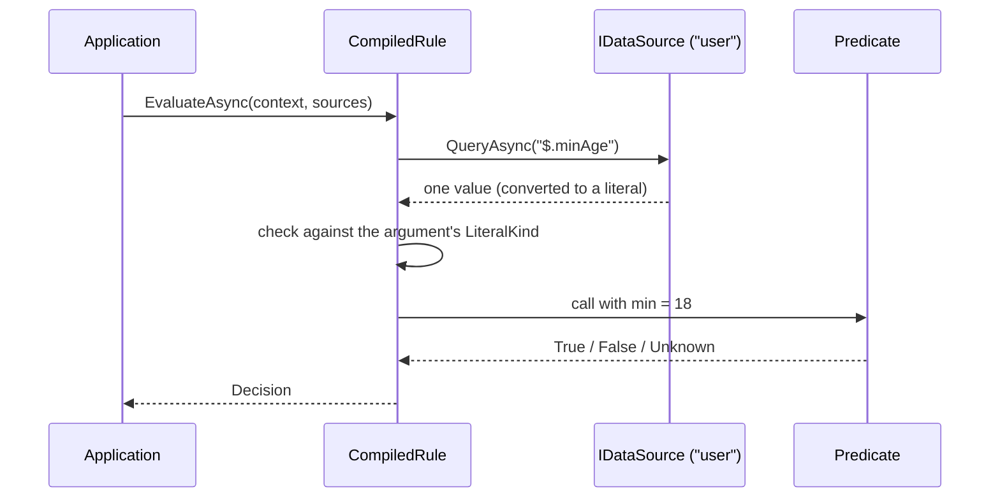

# Data sources and variable references

A rule argument can be a literal (`min: 18`) or a **variable reference** that reads its value from a
named data source on every evaluation (`min: from("user", "$.minAge")`). Use a variable when the value
changes per request, or lives in a JSON or YAML document you do not want to write a predicate for.

> [!NOTE]
> The rule examples (text, JSON and YAML) are compiled by `dotnet test` (see [doc-examples.md](doc-examples.md)); the C#
> snippets are exercised by `DataSourcesGuideTests`.

## Contents

- [How it works](#how-it-works)
- [Writing a variable reference](#writing-a-variable-reference)
- [Supplying data sources](#supplying-data-sources)
- [Queries](#queries)
- [How a result becomes an argument](#how-a-result-becomes-an-argument)
- [Using variables in `RuleBuilder`](#using-variables-in-rulebuilder)
- [Failures](#failures)
- [Testing with `FakeDataSource`](#testing-with-fakedatasource)
- [Writing your own data source](#writing-your-own-data-source)
- [Packages](#packages)

## How it works

The compiler stores the reference in the rule. Nothing is read until you evaluate.

<!-- doctest:skip flow diagram, structure only -->


Within one evaluation each `(source, query)` pair is queried once, however many terms use it.

## Writing a variable reference

The reference has two quoted parts: the source name and the query. It goes anywhere a literal argument goes.

<!-- doctest:rule ageAndRole -->
```text
ageAtLeast(min: from("user", "$.minAge")) AND hasRole(role: from("request", "$.requiredRole"))
```

The same rule as JSON and YAML. The reference is an object with `from` and `query`:

<!-- doctest:json ageAndRole -->
```json
{
  "op": "and",
  "operands": [
    { "predicate": "ageAtLeast", "args": { "min": { "from": "user", "query": "$.minAge" } } },
    { "predicate": "hasRole", "args": { "role": { "from": "request", "query": "$.requiredRole" } } }
  ]
}
```

<!-- doctest:yaml ageAndRole -->
```yaml
op: and
operands:
  - predicate: ageAtLeast
    args:
      min: { from: user, query: "$.minAge" }
  - predicate: hasRole
    args:
      role: { from: request, query: "$.requiredRole" }
```

Two terms are the same variable only when the predicate, the argument names and every source name and query
text are identical. `from("user", "$.a")` and `from("user", "$.b")` are different variables even if the data
holds the same value in both places.

## Supplying data sources

Declare the source names when you compile, and pass the sources when you evaluate. A name that is not declared
is a compile diagnostic, so a typo does not wait for the first evaluation. A name can also be declared with a
query validator, which turns a malformed query into a compile diagnostic too.

```csharp
// Compile: declare which source names rules may use.
var compiler = new RuleCompiler<MyContext>(
    registry,
    new CompilerOptions(DataSources: new DataSourceDeclarations { "user", "request" })
);
CompilationResult<MyContext> result = compiler.Compile(ruleText);

// Evaluate: supply a source per name, usually per request.
var sources = new DataSources
{
    ["user"] = userSource,
    ["request"] = requestSource,
};
Decision decision = await result.CompiledRule!.EvaluateAsync(context, services, sources, cancellationToken: cancellationToken);
```

A rule that uses `from(...)` but is evaluated without the source it names returns `Unknown` and records a
fault. Every `EvaluateAsync` argument after `context` is optional. Pass `services` only when the rule uses class-based
predicates, and `sources` only when the rule has variables. A null `services` is an empty provider: a class-based
predicate then returns `Unknown` and records a fault.

To catch a malformed query at compile time, declare the name with the source's query validator.
`JsonQueryValidator` (in `TruthWeaver.DataSources.Json`) parses the JSONPath without a document:

```csharp
var declarations = new DataSourceDeclarations
{
    { "user", JsonQueryValidator.Instance },   // queries against "user" are syntax-checked
    "request",                                 // no validator: a bad query surfaces at evaluation
};
```

A rule such as `ageAtLeast(min: from("user", "$.orders["))` then fails to compile with `TRE0025`, pointing at the query
string and carrying the validator's message and the position within the query. Each source name has its own validator,
so each query is checked in its own dialect. A validator checks syntax only.

## Queries

Each source defines its own query dialect. The JSON and YAML sources use
[JSONPath (RFC 9535)](https://www.rfc-editor.org/rfc/rfc9535); a YAML document is read into the same data
model as JSON, so one query works against either.

| Query | Meaning |
| --- | --- |
| `$.user.minAge` | A property by name. |
| `$.items[0].price` | An array element by index. |
| `$.orders[?@.id=='A7'].total` | The `total` of the order whose `id` is `A7`. |
| `$.roles[*]` | Every element of `roles`. |

`JsonDataSource` (package `TruthWeaver.DataSources.Json`) wraps a JSON document. A matched string, number or boolean
becomes a literal of its natural kind (an integer that fits is an `Int64`, any other number a `Decimal`); a matched
object, array or `null` has no literal equivalent and is reported as an unsupported type, so select their members
(`$.roles[*]`) instead.

```csharp
var user = JsonDataSource.Parse("""{ "minAge": 18, "roles": ["admin", "auditor"] }""");
var sources = new DataSources { ["user"] = user };
```

`YamlDataSource` (package `TruthWeaver.Yaml`) does the same for YAML, so the same query gives the same result against
equivalent documents. A quoted scalar is a string (`"18"`), a plain one follows the core schema limited to JSON's types
(`18` is a number, `yes` and `2026-10-03` stay strings), and `JsonQueryValidator` validates its queries too:

```csharp
var user = YamlDataSource.Parse("minAge: 18\nroles: [admin, auditor]\n");
```

`Parse` throws `JsonException` (or `YamlException`) when the text is malformed. Use `TryParse` for a document that a
user edits or that comes from outside the host. It returns `false` and sets `error` instead of throwing. For YAML,
a duplicate mapping key and an alias that refers to its own ancestor are also errors. The error text gives the
position of the problem and never repeats document content, because the content can be sensitive. A null argument
still throws `ArgumentNullException`.

```csharp
if (!JsonDataSource.TryParse(text, out JsonDataSource? user, out string? error))
{
    logger.LogWarning("Rejected the user document: {Error}", error);
    return;
}
```

A document often repeats a shape, for example many `orders` with a `total` each. Pin the node you want
with an index or a filter. A query meant to give one value that matches several is an error, not a guess.

To work with one repeated subtree as its own source, scope it. `ScopeAsync` returns a new source rooted at
the node the query matches, and queries on it stay absolute within that node. The query must match exactly one
node. `ScopeAsync` never throws for a wrong query. It returns a `DataScopeResult`. When `Succeeded` is `true`,
`Source` is the scoped source. Otherwise `ErrorKind` and `ErrorMessage` describe the failure. The message never contains
document values.

| `ErrorKind` | Meaning |
| --- | --- |
| `MalformedQuery` | The query is not valid in the source's dialect. |
| `NoMatch` | The query matches no node. |
| `AmbiguousMatch` | The query matches more than one node. |
| `SourceFailure` | The source or its backend failed. |
| `UnsupportedType` | The matched node cannot be used as a source. |

```csharp
DataScopeResult scope = await orders.ScopeAsync("$.orders[?@.id=='A7']", cancellationToken);
if (scope.Succeeded)
{
    var sources = new DataSources { ["order"] = scope.Source };   // from("order", "$.total")
}
```

Rule text cannot use relative queries (`@.total`) or loop over the repeated subtrees. If the rule and the
data live in one document, pass the document (or a scope of it) as a named source and read neighbouring values
with `from("doc", "$.limits.age")`.

## How a result becomes an argument

The predicate's argument declares a `LiteralKind`, and that decides what a query result must look like.

| Argument kind | Required result |
| --- | --- |
| Scalar (`String`, `Int64`, `Decimal`, `Boolean`, `DateTimeOffset`, `Guid`) | Exactly one match of a convertible type. |
| Array (`StringArray`, `Int64Array`, and so on) | Every match, each convertible to the element type. No match, including a path to a missing property, gives an empty array. |

An array query that matches no node is not a failure, so no fault is recorded. The trace marks the term instead, so a mistyped
path does not pass unseen. The trace text of the term ends with `[no match for from("user", "$.rolez[*]")]`, with or without
`IncludeResolvedValues`. The note names the query and never a value.

Conversions are deliberately the same as for literals written in a rule:

- a string becomes a `DateTimeOffset` or a `Guid` when the argument asks for one. A date-time string must end in `Z` or carry an offset such as `+02:00`; text without an offset is a type-mismatch failure, because the host time zone must not decide the instant;
- a JSON integer widens to `Decimal`, and a whole-number `Decimal` narrows to `Int64` only if it is exactly representable;
- a string is never turned into a number or boolean, and a number is never turned into a string.

Anything else is a type-mismatch failure.

## Using variables in `RuleBuilder`

Where `RuleBuilder` takes an argument value, `Arg.From` gives a deferred reference, exactly like `from(...)` in
rule text:

```csharp
RuleBuilder rule = RuleBuilder.Predicate("ageAtLeast", ("min", Arg.From("user", "$.minAge")));
```

`Arg.From(source, query, validator)` takes an optional `IQueryValidator` (for example `JsonQueryValidator.Instance`) and throws
`ArgumentException` at once for a malformed query, instead of waiting for the compile diagnostic. For a query that comes
from external input, `Arg.TryFrom(source, query, validator, out reference, out problems)` returns `false` and the validator's
`QueryProblem` list instead of throwing.

To read a value once, while you assemble the rule, query a source yourself and pass the literal. This fixes
the value in the rule; it does not create a variable.

```csharp
long limit = await configSource.GetAsync<long>("$.limits.age", cancellationToken);
RuleBuilder rule = RuleBuilder.Predicate("ageAtLeast", ("min", limit));
```

`GetAsync<T>` (an extension on `IDataSource` in `TruthWeaver.Building`) supports `string`, `long`, `decimal`, `bool`,
`DateTimeOffset` and `Guid`, converts like a variable would, and throws `InvalidOperationException` (never echoing data) when
the query matches nothing, several nodes, the wrong kind, or the source fails.

`TryGetAsync<T>` takes the same arguments and returns a `DataReadResult<T>` instead of throwing for those four cases.
`Succeeded` tells which, `Value` holds the value, and a failed result has a `FailureKind` (`Missing`, `Ambiguous`,
`TypeMismatch` or `SourceError`) and an `ErrorMessage` that never contains data. A `T` outside the list still throws
`NotSupportedException`.

```csharp
DataReadResult<long> limit = await configSource.TryGetAsync<long>("$.limits.age", cancellationToken);
RuleBuilder rule = RuleBuilder.Predicate("ageAtLeast", ("min", limit.Succeeded ? limit.Value : 18L));
```

## Failures

A failed lookup never throws out of the evaluation. The term becomes `Unknown`, the evaluation records a
`Fault`, and the usual Kleene rules apply: `Unknown OR True` is still `True`, and
`Decision.IsSatisfied` stays fail-closed.

| Outcome | When | Result |
| --- | --- | --- |
| Missing | A scalar query matched nothing. | `Unknown` plus a fault. |
| Ambiguous | A scalar query matched more than one node. | `Unknown` plus a fault. |
| Type mismatch | The match cannot convert to the argument's kind. | `Unknown` plus a fault naming the expected and actual kinds. |
| Source error | The source returned an error, threw, gave up on its own timeout, or a query nobody validated turned out to be malformed. The thrown exception is the fault's inner exception. | `Unknown` plus a fault. |
| Undeclared source | The rule names a source that was not declared at compile time. | A compile diagnostic. |
| Malformed query | The query fails its source's validator at compile time. | A compile diagnostic pointing at the query string. |
| Unsupplied source | The source is declared but not passed to `EvaluateAsync`. | `Unknown` plus a fault. |

A validator checks syntax only. It cannot know whether the data holds a match, so a well-formed query can still
be missing at evaluation.

Faults and the evaluation trace name the reference and the outcome, but not the resolved value, because the
data may be sensitive. To include values in the trace while debugging:

```csharp
Decision decision = await rule.EvaluateAsync(
    context,
    services,
    sources,
    new EvaluationOptions(IncludeResolvedValues: true),
    cancellationToken);
```

Faults never include values, even then.

## Testing with `FakeDataSource`

`TruthWeaver.Testing` has an in-memory source so tests of variable rules need no JSON parsing:

```csharp
var user = new FakeDataSource()
    .With("$.minAge", 18L)
    .With("$.roles[*]", ["admin", "auditor"])
    .Failing("$.salary", "source offline");

var sources = new DataSources { ["user"] = user };
```

## Writing your own data source

Implement `IQueryValidator` as well if you want compile-time checking of your dialect. It is stateless, thread-safe
and needs no data. Each `QueryProblem` carries a message (no data values) and an optional 0-based position within the query:

```csharp
public interface IQueryValidator
{
    IReadOnlyList<QueryProblem> Validate(string query);   // empty when the query is well-formed
}

public sealed record QueryProblem(string Message, int? Position = null);
```

Implement `IDataSource` (in `TruthWeaver.Abstractions`) for any store that can answer a query: a database
row, a feature-flag service, an XML document. The source chooses its own query dialect.

```csharp
public interface IDataSource
{
    ValueTask<DataQueryResult> QueryAsync(string query, CancellationToken cancellationToken);
    ValueTask<DataScopeResult> ScopeAsync(string query, CancellationToken cancellationToken);
}
```

- Convert each matched node to a `LiteralValue`. A node with no literal equivalent, such as an object, is
  reported as an unsupported type in the result.
- Report a malformed query or a failing backend as an error inside `DataQueryResult`. The engine also catches
  a thrown exception, but an error you return carries a better message.
- Report a scope query that is malformed, matches no node or matches several as a failed `DataScopeResult`
  (`DataScopeResult.Failure`). Do not throw for these.
- Honour the cancellation token. If the source gives up on its own (it throws a timeout or its own cancellation) the term
  becomes `Unknown` plus a source-error fault. If the evaluation itself is cancelled, by the caller's token or by
  `EvaluationOptions.Timeout`, the evaluation is cancelled and throws, exactly as it does for a slow predicate.

## Packages

| Package | Contains |
| --- | --- |
| `TruthWeaver.Abstractions` | `IDataSource`, `IQueryValidator`, `QueryProblem`, `DataQueryResult`, `DataScopeResult`, `DataSources`, `VariableReference`. |
| `TruthWeaver` | `DataSourceDeclarations` (with `CompilerOptions.DataSources`), `EvaluationOptions.IncludeResolvedValues`, `Arg.From` and `IDataSource.GetAsync<T>` for `RuleBuilder`. |
| `TruthWeaver.DataSources.Json` | `JsonDataSource`, `JsonQueryValidator` and the JSONPath dependency. |
| `TruthWeaver.Yaml` | `YamlDataSource`, reusing the JSON source's query engine and validator. |
| `TruthWeaver.Testing` | `FakeDataSource`. |

The core `TruthWeaver` package takes no JSON or YAML query dependency.
