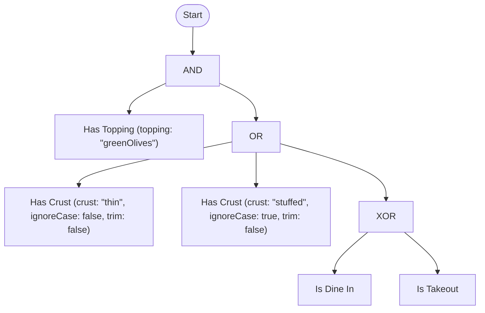
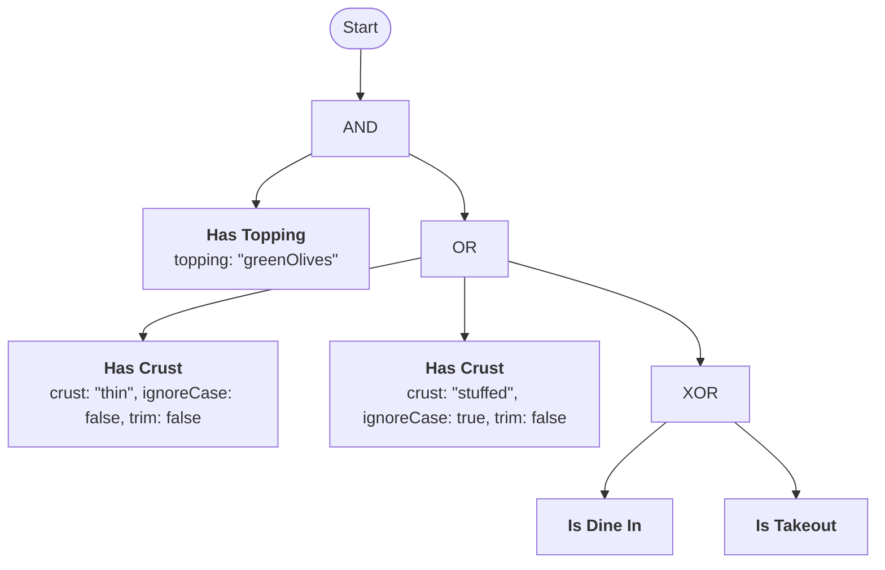

# Examples

Seven examples, each adding one piece: a single predicate, combined predicates, named arguments, `XOR`, `EQUIVALENT`, `ExactlyOne` and the threshold family, the full worked example in all three formats, the same rule assembled with `RuleBuilder`, and a match against one or several constants. A bonus section shows how to turn a denial into a sentence. Back to the [README](../README.md).

## 1. A single predicate

<!-- doctest:rule ex1 -->
```text
lovesPineapple
```

```csharp
PredicateRegistry<Customer> registry = PredicateRegistry<Customer>.CreateBuilder().Add<LovesPineapple>().Build();
RuleCompiler<Customer> compiler = new(registry);
CompiledRule<Customer> rule = compiler.Compile("lovesPineapple").GetRuleOrThrow();

Decision decision = await rule.EvaluateAsync(customer, serviceProvider, cancellationToken: ct);
```

## 2. Combining predicates: `AND` / `OR` / `NOT`

<!-- doctest:rule ex2 -->
```text
lovesPineapple AND NOT isBanned
```

`NOT` binds tighter than `AND`, and `AND` binds tighter than `OR`. The rule parses as `lovesPineapple AND (NOT isBanned)` and needs no parentheses.

## 3. Named arguments

<!-- doctest:rule ex3 -->
```text
hasTopping(topping: "greenOlives")
```

```csharp
PredicateRegistry<Customer> registry = PredicateRegistry<Customer>.CreateBuilder()
    .Add(
        new PredicateSchema(
            "hasTopping",
            "Has Topping",
            "Does the order include the given topping?",
            [new PredicateArgumentSchema("topping", "The topping to check for.", LiteralKind.String)]),
        (customer, args, ct) =>
            ValueTask.FromResult(customer.Toppings.Contains(args.GetString("topping")) ? TruthValue.True : TruthValue.False))
    .Build();
```

The order of arguments in the source text never matters. A predicate with several arguments compiles to the same term identity in any order. Argument values are case-sensitive: `"greenOlives"` and `"Greenolives"` are different terms (see [Term identity](../CONTEXT.md#term-identity)).

`PredicateSchema` and `PredicateArgumentSchema` both require a `Description`. `PredicateSchema` also requires a `Label`. The `Label` is a short display name that is separate from the machine-facing `Name` in rule text (for example `Name: "hasTopping"` and `Label: "Has Topping"`). A rule-authoring UI or generated documentation therefore always has text to show for every predicate and argument. [Outlining a compiled rule](rulebuilder.md#outlining-a-compiled-rule) shows how the label pairs with the label and description of an operator.

A DSL string-literal argument supports four escape sequences:

- `\"` is a quote.
- `\\` is a backslash.
- `\n` is a newline.
- `\t` is a tab.

For example, `hasTopping(topping: "Chef's \"Special\"")` compiles to a string argument with the value `Chef's "Special"`. Printing the compiled rule back to DSL text gives the same text. Any other backslash sequence (for example `\p`) is an `InvalidEscapeSequence` diagnostic. The compilation fails, and the compiler does not guess the intended value. This rule is specific to the DSL text format. JSON and YAML use the string escaping of their own format (`System.Text.Json` and YamlDotNet). See [Converting between DSL, JSON, and YAML](rule-formats.md#converting-between-dsl-json-and-yaml).

A predicate can take more than one named argument. The registration shape is the same, with a longer `PredicateArgumentSchema` array and an `EvaluateAsync` that makes more than one `Get*` call:

<!-- doctest:rule ex3b -->
```text
hasToppingAmount(topping: "pepperoni", amount: "extra")
```

```csharp
PredicateRegistry<Customer> registry = PredicateRegistry<Customer>.CreateBuilder()
    .Add(
        new PredicateSchema(
            "hasToppingAmount",
            "Has Topping Amount",
            "Does the order include the given topping at the given amount?",
            [
                new PredicateArgumentSchema("topping", "The topping to check for.", LiteralKind.String),
                new PredicateArgumentSchema("amount", "The amount requested (e.g. \"regular\" or \"extra\").", LiteralKind.String),
            ]),
        (customer, args, ct) =>
            ValueTask.FromResult(
                customer.ToppingAmounts.TryGetValue(args.GetString("topping"), out string? amount)
                && amount == args.GetString("amount")
                    ? TruthValue.True
                    : TruthValue.False))
    .Build();
```

`hasToppingAmount(topping: "pepperoni", amount: "extra")` and `hasToppingAmount(amount: "extra", topping: "pepperoni")` compile to the same term identity. The argument order in the source text does not matter, for any number of arguments.

## 4. `XOR`, `EQUIVALENT`, `ExactlyOne`, and the threshold family

<!-- doctest:rule ex4a -->
```text
AtLeast(2, approvedByAlice, approvedByBob, approvedByCarol)
```

The rule means "at least two of these three approvals." The sibling operators read the same way: `AtMost(1, ...)`, `GreaterThan(1, ...)`, `LessThan(2, ...)` and `Exactly(2, ...)`. They compile to one shared `ThresholdExpression` node. They differ only in the comparison against the count of true operands. See [Operations](strong-k3/specification/operations.md) for every operator.

`ExactlyOne(a, b, c)` is the n-ary "exactly one of these" operator. `XOR` is binary only. A third operand is a compile error that points at both alternatives. Use `ExactlyOne` for "exactly one". Use `PARITY(a, b, c)` for n-ary parity (an odd number of operands are true, and the result is `Unknown` if any operand is `Unknown`). The two differ from three operands. When `a`, `b` and `c` are all true, `PARITY` is `True` and `ExactlyOne` is `False`.

`EQUIVALENT` (`IFF`, `↔`) is the counterpart of `XOR`. It means "these two must agree":

<!-- doctest:rule ex4b -->
```text
isPrimaryReviewer EQUIVALENT isBackupReviewer
```

The rule is `True` when both are reviewers or neither is a reviewer. It is `False` when exactly one is a reviewer.

`IMPLIES` (or `→`) is material implication. It means "if this holds, that must hold too":

<!-- doctest:rule ex4c -->
```text
isContractor IMPLIES hasSignedNda
```

The rule is the same as `NOT isContractor OR hasSignedNda`. A non-contractor passes regardless of the NDA. When `isContractor` is `True`, the result is the value of `hasSignedNda`. Like `XOR` and `EQUIVALENT`, `IMPLIES` is binary. Put it in parentheses next to `AND`, `OR` or another infix operator, for example `(isContractor IMPLIES hasSignedNda) AND isActive`. In JSON and YAML, it is `{"op": "implies", "operands": [antecedent, consequent]}`. See [Syntax](strong-k3/specification/syntax.md) for the spellings, precedence and operand counts.

## 5. The full worked example, in all three formats

This is the rule text as authored. `CanonicalText` prints the same rule with the optional `hasCrust` arguments filled in from their defaults:

<!-- doctest:rule worked -->
```text
hasTopping(topping: "greenOlives") AND (hasCrust(crust: "thin") OR hasCrust(crust: "stuffed", ignoreCase: true) OR (isDineIn XOR isTakeout))
```

The same rule as JSON:

<!-- doctest:json worked -->
```json
{
  "op": "and",
  "operands": [
    { "predicate": "hasTopping", "args": { "topping": "greenOlives" } },
    {
      "op": "or",
      "operands": [
        { "predicate": "hasCrust", "args": { "crust": "thin" } },
        { "predicate": "hasCrust", "args": { "crust": "stuffed", "ignoreCase": true } },
        {
          "op": "xor",
          "operands": [
            { "predicate": "isDineIn" },
            { "predicate": "isTakeout" }
          ]
        }
      ]
    }
  ]
}
```

The same rule in YAML (`TruthWeaver.Yaml`):

<!-- doctest:yaml worked -->
```yaml
op: and
operands:
  - predicate: hasTopping
    args:
      topping: "greenOlives"
  - op: or
    operands:
      - predicate: hasCrust
        args:
          crust: "thin"
      - predicate: hasCrust
        args:
          crust: "stuffed"
          ignoreCase: true
      - op: xor
        operands:
          - predicate: isDineIn
          - predicate: isTakeout
```

This code registers the predicates and evaluates the rule:

```csharp
(PredicateSchema hasCrustSchema, var hasCrustEvaluate) =
    StringPredicates.EqualsConfigurable<PizzaOrder>("hasCrust", order => order.Crust, "Has Crust", argumentName: "crust");

PredicateRegistry<PizzaOrder> registry = PredicateRegistry<PizzaOrder>.CreateBuilder()
    .Add<IsDineIn>()
    .Add<IsTakeout>()
    .Add(
        new PredicateSchema(
            "hasTopping",
            "Has Topping",
            "Does the order include the given topping?",
            [new PredicateArgumentSchema("topping", "The topping to check for.", LiteralKind.String)]),
        (order, args, ct) =>
            ValueTask.FromResult(order.Toppings.Contains(args.GetString("topping")) ? TruthValue.True : TruthValue.False))
    .Add(hasCrustSchema, hasCrustEvaluate)
    .Build();

RuleCompiler<PizzaOrder> compiler = new(registry);
CompilationResult<PizzaOrder> result = compiler.Compile(ruleText);

if (!result.Succeeded)
{
    // Surface result.Diagnostics to whoever is authoring the rule.
    // The previously persisted rule (if any) stays active.
    return;
}

CompiledRule<PizzaOrder> rule = result.Rule;
Decision decision = await rule.EvaluateAsync(order, serviceProvider, cancellationToken: cancellationToken);

if (decision.IsSatisfied)
{
    // allowed
}
```

`IsDineIn` and `IsTakeout` are class-based predicates (`IPredicate<PizzaOrder>`). The engine resolves them again from `serviceProvider` on every call. This is the correct shape for a predicate with a scoped dependency, such as a `DbContext`. `hasTopping` is a hand-written stateless lambda. `hasCrust` comes from the ready-made `StringPredicates.EqualsConfigurable` factory (see [Predicate types](predicates.md)). It takes `crust` as the rule-text comparison target, plus the `ignoreCase` and `trim` arguments with defaults, so `hasCrust(crust: "thin")` compiles alone. All three forms register against the same `PredicateRegistryBuilder<TContext>`. When a compilation fails, the previously persisted rule stays active.

This code wires the registry into the DI container of a host instead of building it by hand:

```csharp
services.AddTruthWeaver<PizzaOrder>(builder => builder
    .Add<IsDineIn>()
    .Add<IsTakeout>());
```

## 6. The same rule, assembled with `RuleBuilder` instead of text

This builds the same tree as example 5, `hasTopping(topping: "greenOlives") AND (hasCrust(...) OR hasCrust(...) OR (isDineIn XOR isTakeout))`, without DSL, JSON or YAML text. Use this approach when the shape of a rule comes from application logic (for example a dynamically assembled list of conditions) and not from an author who types it:

```csharp
using TruthWeaver.Building;

RuleBuilder rule = RuleBuilder.And(
    RuleBuilder.Predicate("hasTopping", ("topping", "greenOlives")),
    RuleBuilder.Or(
        RuleBuilder.Predicate("hasCrust", ("crust", "thin")),
        RuleBuilder.Predicate("hasCrust", ("crust", "stuffed"), ("ignoreCase", true)),
        RuleBuilder.Xor(RuleBuilder.Predicate("isDineIn"), RuleBuilder.Predicate("isTakeout"))));

CompilationResult<PizzaOrder> result = rule.Compile(compiler);
```

This code renders the same rule as a Mermaid diagram:

```csharp
string mermaid = result.GetRuleOrThrow().PrintMermaid();
```

<!-- doctest:mermaid worked -->


Set `TwoLineTermLabels` to show each term as a bold label with its argument values on a second line (see [Rendering a rule as a diagram](rulebuilder.md#rendering-a-rule-as-a-diagram)):

```csharp
string twoLine = result.GetRuleOrThrow().PrintMermaid(new MermaidOptions { TwoLineTermLabels = true });
```

<!-- doctest:mermaid worked two-line -->


This code renders the same rule as a text tree:

```csharp
string tree = result.GetRuleOrThrow().PrintPlainText();
```

<!-- doctest:tree worked -->
```text
AND
├─ Has Topping (topping: "greenOlives")
└─ OR
   ├─ Has Crust (crust: "thin", ignoreCase: false, trim: false)
   ├─ Has Crust (crust: "stuffed", ignoreCase: true, trim: false)
   └─ XOR
      ├─ Is Dine In
      └─ Is Takeout
```

The second `hasCrust` term sets `ignoreCase: true` in the rule text. `StringPredicates.EqualsConfigurable` (see [Predicate types](predicates.md)) declares three rule-text arguments: `crust`, `ignoreCase` and `trim`. This term shows a rule that sets more than the one required argument that every other predicate in this example takes. Both outputs show the argument values of every term by default. The compiler fills in the `ignoreCase` and `trim` values of the first `hasCrust` term from the schema defaults, although its rule text does not name them. For this reason the two `hasCrust` terms are different in the output, which a predicate label alone does not show. Pass `showArgumentValues: false` to `PrintMermaid` or `PrintPlainText` to render labels that show only the structure (see [Rendering a rule as a diagram](rulebuilder.md#rendering-a-rule-as-a-diagram)).

`RuleBuilder` is not a fourth parser. Every builder method renders the same flat JSON tree shape as a hand-written JSON rule, and `Compile` gives that JSON to the same `CompileJson` that any other tool uses. A rule from a builder therefore gets every diagnostic that a hand-written rule gets. These include an unknown predicate, a bad argument, an out-of-range threshold, the operand count of `XOR`, `EQUIVALENT`, `IMPLIES`, `NAND` and `NOR`, resource limits, and a structural tautology or contradiction. The builder does not bypass the Validate and Analyze stages of the [compilation pipeline](architecture.md#compilation-pipeline). See [RuleBuilder](rulebuilder.md) for the full API.

## 7. Matching against a constant, or any of several constants

This section shows two ways to write "has at least one topping of pepperoni, mushroom or green olives". The choice depends on whether a predicate already exists for each value.

**If a single-value predicate already exists** (for example `hasTopping(topping: "greenOlives")` from [example 3](#3-named-arguments)), use `OR` for each alternative. No new predicate is necessary:

<!-- doctest:rule ex7a -->
```text
hasTopping(topping: "pepperoni") OR hasTopping(topping: "mushroom") OR hasTopping(topping: "greenOlives")
```

Each call is a different term and a different memoization unit. The rule is clear for a few alternatives and becomes long as the set grows. The rule text contains the alternatives, so they are not passed as data.

**For a set of any size, write a predicate that takes an array argument** and checks the membership itself. The rule has one term and one predicate call, and the alternatives are rule-authored data, not repeated rule structure:

```csharp
public sealed class HasAnyTopping : IPredicate<Customer>
{
    public static PredicateSchema Schema =>
        new(
            "hasAnyTopping",
            "Has Any Topping",
            "Does the order include at least one of the given toppings?",
            [
                new PredicateArgumentSchema(
                    "toppings",
                    "The toppings to check for (any match).",
                    LiteralKind.StringArray
                ),
            ]);

    public ValueTask<TruthValue> EvaluateAsync(Customer customer, PredicateArguments args, CancellationToken ct)
    {
        IReadOnlyList<string> toppings = args.GetStringArray("toppings");
        bool result = toppings.Any(topping => customer.Toppings.Any(t => string.Equals(t, topping, StringComparison.Ordinal)));
        return ValueTask.FromResult(result ? TruthValue.True : TruthValue.False);
    }
}
```

A rule uses the predicate as follows:

<!-- doctest:rule ex7b -->
```text
hasAnyTopping(toppings: ["pepperoni", "mushroom", "greenOlives"])
```

**The predicate, not the engine, decides case sensitivity.** Term identity (which two term references are the same variable for memoization) is always exact and case-sensitive. `"pepperoni"` and `"Pepperoni"` are different arguments (see [Term identity](../CONTEXT.md#term-identity)). What the predicate does with the string that it reads through `GetString` or `GetStringArray` is ordinary C#. The example above uses `StringComparison.Ordinal`, which is case-sensitive. Change that one argument to `StringComparison.OrdinalIgnoreCase` and the same predicate is case-insensitive, with no other change. If you need both variants, write two predicates (for example `hasAnyTopping` and `hasAnyToppingIgnoreCase`). Do not thread a flag through the rule text. Then the name of each predicate shows its fixed behavior.

The same shape works for "equals one specific constant". Compare against a single value and do not check array membership (for example `args.GetGuid("id") == expectedId`, or the single-argument predicates `hasTopping` and `hasFlavor`). The schema decides whether the constants come from a `LiteralKind.String`, `Int64`, `Decimal`, `Boolean`, `DateTimeOffset` or `Guid` argument, scalar or array. The compiler validates and converts each kind in the same way. See the [Guid literal tests](../tests/TruthWeaver.Tests/GuidLiteralTests.cs) for a worked `Guid` example.

**"Matches a pattern", not "matches a fixed set"**, uses the same idea with `Regex.IsMatch` in place of set membership. The pattern is a rule-authored `string` argument, not a special literal kind:

```csharp
public sealed class HasToppingMatching : IPredicate<Customer>
{
    public static PredicateSchema Schema =>
        new(
            "hasToppingMatching",
            "Has Topping Matching",
            "Does the order include a topping whose code matches the given regular expression?",
            [new PredicateArgumentSchema("pattern", "The regular expression to match a topping code against.", LiteralKind.String)]);

    public ValueTask<TruthValue> EvaluateAsync(Customer customer, PredicateArguments args, CancellationToken ct)
    {
        Regex pattern = new(args.GetString("pattern"), RegexOptions.None, TimeSpan.FromMilliseconds(100));
        return ValueTask.FromResult(customer.Toppings.Any(pattern.IsMatch) ? TruthValue.True : TruthValue.False);
    }
}
```

A rule uses the predicate as `hasToppingMatching(pattern: "^EXTRA-.+$")`, which means "any topping code of the form `EXTRA-CHEESE`." Use `RegexOptions.IgnoreCase` in place of `RegexOptions.None` for a case-insensitive match, in the same way as the `StringComparison` choice above. The explicit timeout is more important here than in the other examples. A pattern is rule-authored text that can be very slow to match (catastrophic backtracking), by accident or on purpose. A predicate is the correct place to contain that risk. Without a timeout, the match can stall the evaluation of every rule that reaches this term.

`RegexPredicates` in [`TruthWeaver.Predicates`](../src/TruthWeaver.Predicates) already wraps this pattern with the same timeout, so a hand-written predicate is not always necessary.

## Bonus: explaining a denied decision

`Decision`, `Fault` and `Trace` give the structured reason for a denial. The host turns that reason into a sentence for an end user or a support agent. [Humanizer](https://github.com/Humanizr/Humanizer) is a convenient pairing: predicate names are camelCase words, and fault counts are numbers:

```csharp
using Humanizer;

if (!decision.IsSatisfied && decision.Faults.Count > 0)
{
    string summary = decision.Faults.Count.ToQuantity("predicate");
    Console.WriteLine($"Couldn't reach a decision: {summary} failed to answer.");

    foreach (Fault fault in decision.Faults)
    {
        // "hasTopping" -> "has topping"
        Console.WriteLine($"  - {fault.Term.PredicateName.Humanize()}: {fault.Exception.Message}");
    }
}
```
