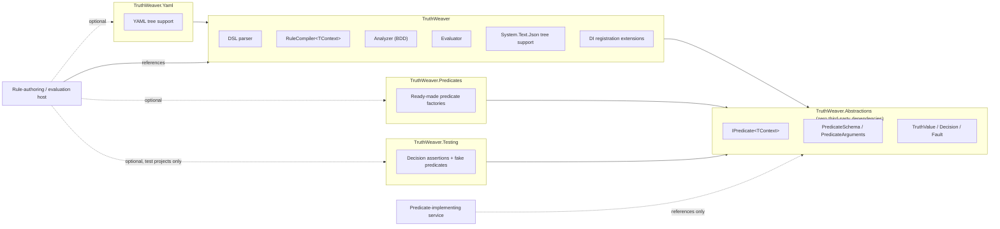

# Packages

TruthWeaver ships as six packages. Each package has one purpose, so a consumer takes only the dependencies that it needs. For the layout of the source, see [Architecture](architecture.md).

| Package | Depends on | Ships |
| --- | --- | --- |
| `TruthWeaver.Abstractions` | *(nothing third-party)* | `IPredicate<TContext>`, `PredicateSchema`, `PredicateArguments`, `TruthValue`, `Decision`, `Fault`, and the data source kernel (`IDataSource`, `DataQueryResult`, `DataSources`, `VariableReference`). It holds everything that a service that implements predicates needs. |
| `TruthWeaver` | `Abstractions`, `Microsoft.Extensions.DependencyInjection.Abstractions`, `Microsoft.Extensions.Logging.Abstractions` | The DSL parser, `RuleCompiler<TContext>`, `CompiledRule<TContext>`, the BDD-based analyzer, the evaluator, `System.Text.Json` tree support, printing/diffing, and DI registration extensions. |
| `TruthWeaver.Yaml` | `TruthWeaver`, `TruthWeaver.DataSources.Json`, YamlDotNet | YAML tree support (`CompileYaml`/`PrintYaml`) and `YamlDataSource` (a YAML document as a data source, queried with the JSON package's JSONPath engine), isolated so a consumer with no interest in YAML never pulls in YamlDotNet. |
| `TruthWeaver.DataSources.Json` | `TruthWeaver.Abstractions`, JsonPath.Net | `JsonDataSource` (a JSON document as a data source for `from("source", "query")` variable references, queried with JSONPath, RFC 9535) and `JsonQueryValidator` (compile-time syntax check of those queries). Isolated so the core package takes no JSONPath dependency. |
| `TruthWeaver.Predicates` | `TruthWeaver.Abstractions` | Ready-made generic `IPredicate<TContext>` factories for string comparison, null/empty, set equality, regex matching, and externally-selected-value predicates for a safe-to-share lookup client. A consumer uses them for common checks without writing a class and without the parser, compiler or analyzer. |
| `TruthWeaver.Testing` | `TruthWeaver.Abstractions` | Fluent `Decision` assertions, fake/scripted predicate factories and an in-memory `FakeDataSource` for tests, without a hand-written `IPredicate<TContext>` or data source per test. |

<!-- doctest:skip class diagram, structure only -->

A service that only implements domain predicates references `TruthWeaver.Abstractions` alone. It needs no parser, no BDD analyzer and no YAML library.
