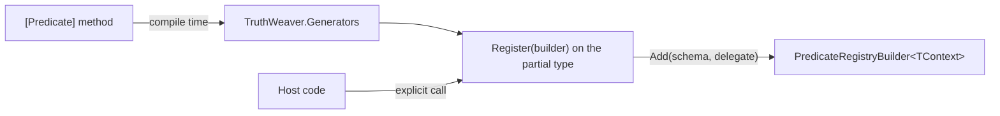

# Predicate source generator

`TruthWeaver.Generators` writes predicate registration code at compile time. Mark a static method with `[Predicate]`, and the generator adds a `Register` method to the type. `Register` adds each marked method to a `PredicateRegistryBuilder<TContext>`, with a `PredicateSchema` built from the method signature. Back to the [README](../README.md).

The generated code calls the public `PredicateRegistryBuilder<TContext>.Add` method, the same call as hand-written registration. No reflection and no assembly scanning run at run time, so the generated code is trim and Native AOT safe. Registration stays an explicit call in host code.

## Requirements

- The consuming project references `TruthWeaver` (for `PredicateRegistryBuilder<TContext>`) and `TruthWeaver.Abstractions`.
- The build uses the .NET 9.0.300 SDK or later. The generator needs version 4.14 or later of the Roslyn compiler.
- The package holds only an analyzer. It adds no assembly to the build output.

```xml
<ItemGroup>
  <PackageReference Include="TruthWeaver.Generators" PrivateAssets="all" />
</ItemGroup>
```

In this repository, a project references the generator project as an analyzer:

```xml
<ItemGroup>
  <ProjectReference
    Include="../../src/TruthWeaver.Generators/TruthWeaver.Generators.csproj"
    OutputItemType="Analyzer"
    ReferenceOutputAssembly="false"
  />
</ItemGroup>
```

## Registration without the generator

A hand-written registration repeats the predicate name, the argument names, the argument kinds and the defaults that the method signature already holds:

```csharp
public static class OrderPredicates
{
    public static TruthValue HasMinimumOrders(Customer customer, long minimum)
    {
        return customer.OrderCount >= minimum ? TruthValue.True : TruthValue.False;
    }
}

PredicateRegistry<Customer> registry = PredicateRegistry<Customer>
    .CreateBuilder()
    .Add(
        new PredicateSchema(
            "hasMinimumOrders",
            "Has minimum orders",
            "Did the customer place at least the given number of orders?",
            [
                new PredicateArgumentSchema(
                    "minimum",
                    "The smallest order count that passes.",
                    LiteralKind.Int64,
                    Required: false,
                    Default: LiteralValue.OfInt64(3)
                ),
            ]
        ),
        (customer, arguments, cancellationToken) =>
            ValueTask.FromResult(OrderPredicates.HasMinimumOrders(customer, arguments.GetInt64("minimum")))
    )
    .Build();
```

## Registration with the generator

Mark the method, make the type `partial`, and call the generated `Register` method:

```csharp
using TruthWeaver.Generators;

public static partial class OrderPredicates
{
    /// <summary>Answers whether the customer placed at least the given number of orders.</summary>
    /// <param name="customer">The customer to check.</param>
    /// <param name="minimum">The smallest order count that passes.</param>
    /// <returns><see cref="TruthValue.True"/> when the order count reaches <paramref name="minimum"/>.</returns>
    [Predicate("hasMinimumOrders", "Has minimum orders", "Did the customer place at least the given number of orders?")]
    public static TruthValue HasMinimumOrders(Customer customer, long minimum = 3)
    {
        return customer.OrderCount >= minimum ? TruthValue.True : TruthValue.False;
    }
}

PredicateRegistry<Customer> registry = OrderPredicates.Register(PredicateRegistry<Customer>.CreateBuilder()).Build();
```

The two registrations give the same schema. `Register` returns the builder, so it chains with other `Add` calls and with the `Register` methods of other types.

<!-- doctest:skip build pipeline, structure only -->


## The attribute

`[Predicate(name, label, description)]` goes on a method. The generator adds the attribute to each consuming compilation as an internal type in the `TruthWeaver.Generators` namespace, so the attribute needs no run-time assembly.

| Attribute argument | Schema member |
| --- | --- |
| `name` | `PredicateSchema.Name`, the name in rule text |
| `label` | `PredicateSchema.Label` |
| `description` | `PredicateSchema.Description` |

## Method rules

A marked method is `static` and not generic. It can have any accessibility, because the generated `Register` method is a member of the same type. The type that declares the method, and each type around it, is `partial` and not generic.

The method returns `TruthValue`, `ValueTask<TruthValue>` or `Task<TruthValue>`.

| Parameter | Becomes |
| --- | --- |
| The first parameter | The context. Its type is the `TContext` of the `Register` method. |
| A `CancellationToken` parameter | The cancellation token of the evaluation. |
| `string`, `long`, `decimal`, `bool`, `DateTimeOffset` or `Guid` | An argument of the matching `LiteralKind` scalar kind. |
| `IReadOnlyList<T>` of one of those types | An argument of the matching array kind, for example `StringArray`. |

An argument has the parameter name. The `<param>` documentation comment of the parameter is the argument description. Without a comment, the description is empty. A parameter with a default value is an optional argument with that default. The default must be a constant `string`, `long`, `decimal` or `bool` that is not `null`.

## The generated code

The generator writes one `Register` overload for each context type in a type. The overload is `public` when the context type is public, and `internal` otherwise. Each marked method becomes one `Add` call: a `PredicateSchema` built inline from constant values, and a static lambda that reads each argument from `PredicateArguments` and calls the method. The type must not declare a member of its own named `Register` with the same parameter type.

## Diagnostics

Each diagnostic is a build error. The generator registers no method that has an error.

| ID | Cause |
| --- | --- |
| `TWG001` | A parameter type that is not an argument type, for example `int`. Use `long`. |
| `TWG002` | Two methods of one type with the same predicate name. Names are not case-sensitive, the same as in `PredicateRegistryBuilder<TContext>`. |
| `TWG003` | A return type other than `TruthValue`, `ValueTask<TruthValue>` or `Task<TruthValue>`. |
| `TWG004` | An instance method, a generic method, a method with no context parameter, or a `ref`, `out` or `in` parameter. |
| `TWG005` | A declaring type, or a type around it, that is not `partial` or is generic. |
| `TWG006` | A default value with no literal form, for example `null` or `default` of a `Guid`. |
| `TWG007` | A predicate name that the rule text reads as a keyword, such as `any` or `Between`, in any case. See [Grammar](rule-text.md#grammar). |

## Limits

- The generator reads methods only. It does not discover `IPredicate<TContext>` classes or attributes on a class. Register a class-based predicate with `Add<TPredicate>()`.
- A generated predicate has no `ArgumentValidator` and no `Deprecation`. Register a predicate that needs either by hand.
