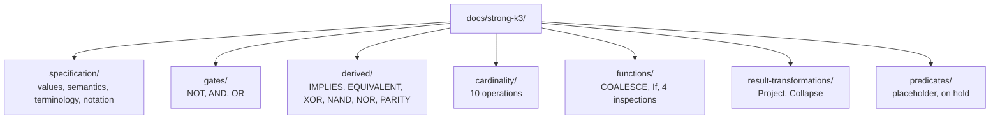

# Strong Kleene (K3) reference: taxonomy, template and structure proposal

> [!IMPORTANT]
> **Status: approved by the owner on 2026-10-03, with the recommendation on each of the 11 open questions accepted.** This page is the decision record for the model, categories, template and directory tree. Tickets 02 onward may proceed ([ticket 01](../../.scratch/k3-reference/issues/01-taxonomy-template-and-structure.md), [spec](../../.scratch/k3-reference/spec.md)).

This page fixes the authoritative model for the reference library: the values, the categories, the primitive-versus-derived rule, the template for one operation document, the directory tree and an inventory of every operation in the engine's final design. Sections that need an owner decision are collected in [Open questions](#open-questions); none is resolved silently.

Sources: [ADR-0005](../adr/0005-strong-k3-language-surface.md) (final operator set, amended by k3-followups 04, 05, 06 and 15, all done), [`CONTEXT.md`](../../CONTEXT.md), `src/TruthWeaver/Ast/OperatorDefinitions.cs`, `Decision.Project` and `Decision.Collapse`, the [spec audit](../../.scratch/k3-conformance/spec-audit.md) and the [research findings](../../.scratch/k3-conformance/research-findings.md).

## 1. Model

### 1.1 Values

The value set is `{True, False, Unknown}`, written T, F and U in tables. Two orders matter and the reference keeps them apart:

| Order | Definition | Used for |
| --- | --- | --- |
| Truth order | `False < Unknown < True` | `AND` is min, `OR` is max, `NOT` reverses it. An implementation aid, not a numeric ordering of truth. |
| Information order | `Unknown` below `True` and `False`, which are incomparable | Separates the Strong Kleene connectives (monotone) from the external operators (not monotone). |

### 1.2 Terms

| Term | Meaning in this reference |
| --- | --- |
| **Operation** | Umbrella term for anything with its own document: an operator, a cardinality function, a function, or a result transformation. Predicates are Operations too once documented (on hold). |
| **Category** | The one primary grouping of an Operation (section 1.3). Exactly one per Operation. |
| **Kind** | `Primitive` or `Derived`. Orthogonal to category (section 1.4). |
| **Strong Kleene connective** | An Operation monotone in the information order. Per ADR-0005 decision 18 these are `NOT`, `AND`, `OR`, `IMPLIES`, `EQUIVALENT`, `XOR`, `NAND`, `NOR`, `PARITY`, the cardinality operations and `If`. |
| **External operator** | Not monotone in the information order, so not a Strong Kleene connective: `COALESCE` and the four inspections. Flagged on every such document. |
| **Canonical form** | For a derived Operation, its definition in terms of primitives (see open question 9). |

Prose uses "Strong Kleene (K3)", never "K3" and "Strong K3" as two systems (ADR-0005 decision 18).

### 1.3 Categories

Exactly one primary category per Operation. The grouping follows the ticket order and the owner's category names; where ticket 04 to 10 already fix a split, this proposal follows it.

| Category | Directory | Holds | Ticket |
| --- | --- | --- | --- |
| Gates / Operators | `gates/` | The primitive Strong Kleene connectives `NOT`, `AND`, `OR` | 05 |
| Derived / Composite Operations | `derived/` | Logical connectives defined by composing gates: `IMPLIES`, `EQUIVALENT`, `XOR`, `NAND`, `NOR`, `PARITY` | 06 |
| Cardinality Functions | `cardinality/` | Operations over the count of true operands: primitives `AtLeast`, `AtMost`, `Exactly` and every operation reducible to them | 07, 08 |
| Functions | `functions/` | Value operations that are not plain connectives: `COALESCE`, `If` and the four inspections | 09 |
| Result Transformations | `result-transformations/` | Methods on an evaluated `Decision`: `Project`, `Collapse` | 10 |
| Predicates | `predicates/` | **On hold.** A placeholder index only, until the predicates are implemented | 13 |



### 1.4 Primitive versus derived

- **Primitive** (ADR-0005 decision 3): `NOT`, `AND`, `OR`, `AtLeast`, `AtMost`, `Exactly`, `COALESCE`. Seven in all. Every other Operation is **Derived**.
- A derived Operation stays a first-class node in the engine (decision 3a); "derived" means it has a definition in primitives, not that it is desugared.
- Kind and category are independent. The `derived/` category is all Derived, but `cardinality/` and `functions/` mix both kinds (open question 1).
- A derived Operation lists a **Canonical Form** only where one is established and was verified under Strong K3 by exhaustive brute force. Otherwise the document says "no canonical reduction is established".

## 2. Operation document template

One Markdown file per Operation, named by the lower-case canonical name (`xor.md`, `atleast.md`). Section order is fixed; conditional sections are omitted, not left empty. Every document carries a header block and relative links to `specification/`.

**Required sections**

| Section | Content |
| --- | --- |
| Name | Canonical name, plus the name used in each syntax (DSL word, JSON/YAML `op`) |
| Classification | Category, whether it is a Strong Kleene connective or an external operator, link to the category index |
| Kind | `Primitive` or `Derived` |
| Arity | Operand counts as the engine accepts them, including parameters (`k`, `min`, `max`) and rejected values |
| Input Domain | Always `{T, F, U}` per operand, with integer parameter ranges where they exist |
| Output Domain | `{T, F, U}`, or `{T, F}` for the inspections and `Project` |
| Definition | One plain-language sentence a rule author can use |
| Syntax | Canonical DSL form, symbol forms, JSON/YAML shape, `RuleBuilder` member |
| Aliases | Every accepted alternative spelling; removed names (`NXOR`) are not listed as aliases |
| Formal Semantics | The mathematical definition (min/max/negation, or the cardinality interval) |

**Conditional sections**

| Section | Included when |
| --- | --- |
| Formula | A closed formula exists (LaTeX per `specification/notation.md`) |
| Truth Table | The Operation is finite and fixed-arity (`NOT`, `IMPLIES`, `XOR`, `EQUIVALENT`, `NAND`, `NOR`, `If`, the inspections, `Project`, `Collapse`, and the binary table of `AND`/`OR`) |
| Evaluation Table | The Operation is parameterised, variadic or cardinality (the table lists the definitely-true and possibly-true counts and the result) |
| Canonical Form | Derived and a form is established and verified |
| Equivalent Forms | Other verified equivalences, including coincidences such as `ANY` and `OR` and classical laws that fail |
| Examples | Always worth including with `Unknown`; omitted only if redundant with the table |
| Edge Cases | Single operand, `Unknown` propagation, faults as `Unknown`, rejected parameter values |
| Mermaid Diagram | Only when it shows something the formula does not (the `If` decision flow, an interval, a decomposition) |
| Implementation Notes | Engine behaviour that is not semantics: short-circuiting, evaluation order, `NotEvaluated` nodes |
| Related Operations | Links to neighbours and contrasts |

A Truth Table and an Evaluation Table are mutually exclusive per document.

## 3. Directory tree

```text
docs/strong-k3/
  README.md                      root overview and navigation (ticket 04)
  PROPOSAL.md                    this file; removed or folded into specification/ at ticket 12
  specification/
    README.md
    values.md                    T, F, U, truth order, information order, the literals
    semantics.md                 min/max/negation, strongest extension, which laws hold and fail
    terminology.md               Operation, category, kind, canonical form, public form
    notation.md                  LaTeX conventions used in every formula
  gates/
    README.md
    not.md  and.md  or.md
  derived/
    README.md
    implies.md  equivalent.md  xor.md  nand.md  nor.md  parity.md
  cardinality/
    README.md
    atleast.md  atmost.md  exactly.md  exactlyone.md  greaterthan.md  lessthan.md
    any.md  all.md  none.md  between.md
  functions/
    README.md
    coalesce.md  if.md  istrue.md  isfalse.md  isunknown.md  isknown.md
  result-transformations/
    README.md
    project.md  collapse.md
  predicates/
    README.md                    placeholder: on hold until predicates are implemented
```

Every directory index lists its documents with a one-line summary and links, and does not repeat definitions. File names are the lower-case canonical name, so a link target can be derived from an operator name (the ticket 14 sync check relies on this).

## 4. Inventory

27 Operations: 3 gates, 6 derived, 10 cardinality, 6 functions, 2 result transformations. Arity is what the engine accepts today (`RuleNodeCompiler`, `OperatorDefinitions`). "K3" is `connective` for a Strong Kleene connective and `external` otherwise. "Canonical form" is the verified primitive definition (see section 5); `none` means no canonical reduction is established.

| # | Operation | Category | Kind | K3 | Arity | Canonical form | Flag |
| --- | --- | --- | --- | --- | --- | --- | --- |
| 1 | `NOT` | Gates | Primitive | connective | 1 | n/a (primitive) | |
| 2 | `AND` | Gates | Primitive | connective | 2 or more | n/a (primitive) | |
| 3 | `OR` | Gates | Primitive | connective | 2 or more | n/a (primitive) | |
| 4 | `IMPLIES` | Derived | Derived | connective | 2 | `OR(NOT a, b)` | |
| 5 | `EQUIVALENT` | Derived | Derived | connective | 2 | `OR(AND(a, b), AND(NOT a, NOT b))`; also `NOT XOR(a, b)` | aliases `IFF`, `XNOR` |
| 6 | `XOR` | Derived | Derived | connective | 2 only | `OR(AND(a, NOT b), AND(NOT a, b))` | more than 2 operands is a compile error pointing at `PARITY` |
| 7 | `NAND` | Derived | Derived | connective | 2 only | `NOT(AND(a, b))` | |
| 8 | `NOR` | Derived | Derived | connective | 2 only | `NOT(OR(a, b))` | |
| 9 | `PARITY` | Derived | Derived | connective | 2 or more | `OR(Exactly(1, ...), Exactly(3, ...), ...)` over every odd count | category: open question 7 |
| 10 | `AtLeast(k)` | Cardinality | Primitive | connective | 1 or more operands, `1 <= k <= n` | n/a (primitive) | arity: open question 10 |
| 11 | `AtMost(k)` | Cardinality | Primitive | connective | 1 or more operands, `0 <= k <= n-1` | n/a (primitive); equals `NOT AtLeast(k+1)` | arity: open question 10 |
| 12 | `Exactly(k)` | Cardinality | Primitive | connective | 1 or more operands, `0 <= k <= n` | n/a (primitive); equals `AND(AtLeast(k), AtMost(k))` | arity: open question 10 |
| 13 | `ExactlyOne` | Cardinality | Derived | connective | 2 or more | `Exactly(1, ...)` | differs from `PARITY` from 3 operands |
| 14 | `GreaterThan(k)` | Cardinality | Derived | connective | 1 or more operands, `0 <= k <= n-1` | `AtLeast(k+1, ...)` | arity: open question 10 |
| 15 | `LessThan(k)` | Cardinality | Derived | connective | 1 or more operands, `1 <= k <= n` | `AtMost(k-1, ...)` | arity: open question 10 |
| 16 | `ANY` | Cardinality | Derived | connective | 2 or more | `AtLeast(1, ...)` | equals `OR` as a value; distinct operation |
| 17 | `ALL` | Cardinality | Derived | connective | 2 or more | `AtLeast(n, ...)` | equals `AND` as a value; distinct operation |
| 18 | `NONE` | Cardinality | Derived | connective | 2 or more | `AtMost(0, ...)` | equals `NOT OR` as a value; distinct operation |
| 19 | `BETWEEN(min, max)` | Cardinality | Derived | connective | 2 or more, `0 <= min <= max <= n`, not the whole `0..n` | `AND(AtLeast(min, ...), AtMost(max, ...))` | unrelated to SQL and numeric `Between` |
| 20 | `COALESCE` | Functions | Primitive | external | 2 or more | n/a (primitive) | category and kind: open questions 3, 4 |
| 21 | `If` | Functions | Derived | connective | 3 | `OR(AND(c, t), AND(NOT c, f), AND(t, f))` | category: open question 5; bare multiplexer is not equivalent |
| 22 | `IsTrue` | Functions | Derived | external | 1 | `COALESCE(x, False)` | open question 4 |
| 23 | `IsFalse` | Functions | Derived | external | 1 | `COALESCE(NOT x, False)` | open question 4 |
| 24 | `IsUnknown` | Functions | Derived | external | 1 | `AND(COALESCE(x, True), COALESCE(NOT x, True))` | open question 4 |
| 25 | `IsKnown` | Functions | Derived | external | 1 | `OR(COALESCE(x, False), COALESCE(NOT x, False))` | open question 4 |
| 26 | `Project(unknownAs)` | Result Transformations | Derived | n/a | 1 result, `bool` parameter | `COALESCE(rule, unknownAs)` | method on `Decision`, not a rule node; open question 6 |
| 27 | `Collapse(policy)` | Result Transformations | Primitive | n/a | 1 result, `CollapsePolicy` parameter | none established | method on `Decision`; yields `CollapseOutcome`, not a `TruthValue`; open question 6 |

Not in the inventory (open question 8): the literals `True`, `False`, `Unknown`, terms (a predicate bound to arguments) and the infix spellings, which are documented as syntax and aliases of the Operations above. Predicates are on hold.

## 5. Verification of canonical forms

Every canonical form in the inventory was re-derived by an independent brute-force script (not the engine): for every assignment of `{T, F, U}` to the operands, operand counts 2 to 5 for the variadic Operations and every valid parameter, the primitive form was compared with the Operation's definition (min/max/negation, the cardinality interval `[definitely true, possibly true]`, or the strongest extension of the Boolean function). All forms in the table agree. The same pass confirmed:

- `PARITY` equals both the odd-count disjunction and the left fold of `XOR` for 2 to 5 operands.
- `EQUIVALENT` equals `NOT XOR` and `AND(IMPLIES(a, b), IMPLIES(b, a))`.
- `If(c, t, f)` equals the strongest extension of if-then-else for all 27 triples, so `If(Unknown, True, True)` is `True`. The bare multiplexer `OR(AND(c, t), AND(NOT c, f))` omits the consensus term and is not the same function.
- `Project(False)` and `Project(True)` equal `COALESCE(x, False)` and `COALESCE(x, True)`.
- `COALESCE(Unknown, False)` is `False` and `COALESCE(True, False)` is `True`, so `COALESCE` and the inspections are not information-monotone.

ADR-0005 decision 10 records that the engine's own oracle tests check the same expansions; this proposal did not re-run them. Ticket 02 turns the brute-force check into a permanent harness. `Collapse` has no canonical form: it maps to a `CollapseOutcome`, not a `TruthValue`, and `UnknownIsError` is not a truth function.

## Open questions

Each question gives the options and a recommendation. The owner approved the proposal on 2026-10-03 and accepted the recommendation on every question.

### 1. Category and kind overlap

The categories include "Derived / Composite Operations" while Kind also says Derived. As written, `derived/` holds the six derived logical connectives, but thirteen derived Operations (`ExactlyOne`, `GreaterThan`, `LessThan`, `ANY`, `ALL`, `NONE`, `BETWEEN`, `If`, the four inspections, `Project`) live elsewhere.

- **A (recommended):** keep the split the tickets already imply. Category is the topic, Kind is an independent explicit field, and `derived/` is the "derived logical connectives" directory. Rename the category in prose to "Derived Logical Operations" to cut the confusion.
- **B:** make `derived/` hold every Derived Operation, so category equals kind for derived items. Changes tickets 07 to 10.
- **C:** drop Derived / Composite as a category and place the six connectives in Gates / Operators.

### 2. "Gates" versus `CONTEXT.md`

`CONTEXT.md` says an Operator is "never called a gate". The owner's category name is "Gates / Operators".

- **A (recommended):** use the owner's name `Gates / Operators` for the category only, state in `specification/terminology.md` that "gate" is a reference-library label for the primitive connectives, and align `CONTEXT.md` in ticket 12.
- **B:** rename the category "Primitive Operators" (directory `operators/`) and avoid "gate" entirely.

### 3. `COALESCE`: gate-like, but external

It is the one primitive that can observe `Unknown`, and it is not a Strong Kleene connective.

- **A (recommended):** category Functions, Kind Primitive, flagged `external`. Matches ticket 09 and ADR-0005 decision 18.
- **B:** category Gates / Operators, flagged `external`, because it is a primitive that folds operands like `OR`.

### 4. Inspections: derived but external

They are Derived (they expand to `COALESCE`) and external.

- **A (recommended):** category Functions, Kind Derived, flagged `external`.
- **B:** category Derived / Composite, which would put external operators next to connectives and blur the connective boundary.

### 5. `If`: connective or function

`If` is a Strong Kleene connective (information-monotone, strongest extension) but ternary and value-selecting.

- **A (recommended):** category Functions (ticket 09), Kind Derived, flagged `connective`, so the document explains why it is monotone.
- **B:** category Derived / Composite, next to the other derived connectives.

### 6. `Project` and `Collapse`: Kind

Both are TruthWeaver terms and methods on `Decision`, outside the rule tree, yet the ticket requires an explicit Primitive or Derived Kind.

- **A (recommended):** `Project` is Derived (it is `COALESCE(rule, v)`), `Collapse` is Primitive (nothing in the rule language expresses it). Both marked "result transformation, not a rule node".
- **B:** a third Kind value `Boundary` for both. Departs from the ticket's two-value Kind.

### 7. `PARITY`: derived connective or cardinality

It is the parity of the true-count, and is defined through `Exactly`, but the owner groups it with the XOR family.

- **A (recommended):** `derived/`, next to `XOR` (ticket 06), with a link to `ExactlyOne` for the contrast.
- **B:** `cardinality/`.

### 8. Literals, terms and infix spellings

`True`, `False`, `Unknown` and terms are not operators.

- **A (recommended):** not Operations. Literals are documented in `specification/values.md`, spellings in each Operation's Syntax and Aliases sections, and terms with the predicates when the hold lifts.
- **B:** give each literal a document under a new `constants/` directory.

### 9. Meaning of "Canonical Form"

The engine already has `Canonicalize()` and "canonical text", which are different: a reordering and flattening rewrite and a printed spelling. The template's Canonical Form means "defined in primitives".

- **A (recommended):** keep the section name the owner specified, define it in `specification/terminology.md` as the canonical primitive form, and state it is not the output of `Canonicalize()`.
- **B:** name the section "Primitive Form".

### 10. Operand minimum of the threshold family

`OperatorDefinitions` records a minimum of 2 for `AtLeast`, `AtMost`, `Exactly`, `GreaterThan` and `LessThan`, but `RuleNodeCompiler.BuildThreshold` accepts one operand and the valid `k` range is derived from the operand count (ADR-0005 decision 13 also mentions the one-operand allowance). I did not change either.

- **A (recommended):** document the compiler behaviour (1 or more operands) and record the table mismatch as a finding for ticket 11, with no code change in this effort.
- **B:** first ask for a code ticket that makes the table match.

### 11. Fate of this file

- **A (recommended):** keep `PROPOSAL.md` until ticket 12, then fold the decisions into `specification/terminology.md` and delete it.
- **B:** keep it permanently as the design record.
