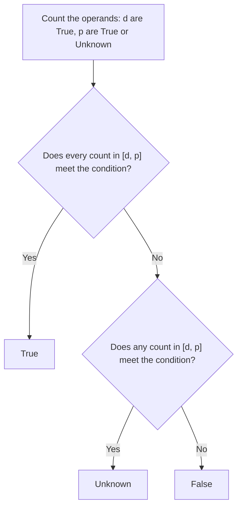

# Cardinality Functions

Operations over the count of true operands. `AtLeast`, `AtMost` and `Exactly` are primitive; the rest are derived from them. Back to the [reference](../README.md).

| Operation | Kind | Summary |
| --- | --- | --- |
| [AtLeast](atleast.md) | Primitive | At least `k` operands are true; `AtLeast(1)` is `OR`, `AtLeast(n)` is `AND` |
| [AtMost](atmost.md) | Primitive | At most `k` operands are true; the negation of `AtLeast(k + 1)` |
| [Exactly](exactly.md) | Primitive | Exactly `k` operands are true; `AND(AtLeast(k), AtMost(k))` |
| [ExactlyOne](exactlyone.md) | Derived | Exactly one operand is true; contrast with `PARITY` |
| [GreaterThan](greaterthan.md) | Derived | More than `k` operands are true; `AtLeast(k + 1)` |
| [LessThan](lessthan.md) | Derived | Fewer than `k` operands are true; `AtMost(k - 1)` |
| [ANY](any.md) | Derived | At least one operand is true; `AtLeast(1, ...)`, the same value as `OR` |
| [ALL](all.md) | Derived | Every operand is true; `AtLeast(n, ...)`, the same value as `AND` |
| [NONE](none.md) | Derived | No operand is true; `AtMost(0, ...)`, the same value as `NOT OR` |
| [BETWEEN](between.md) | Derived | The true count lies within `min` and `max`; `AND(AtLeast(min), AtMost(max))` |

## How a cardinality operation decides

Let `d` be the number of operands that are `True`, and `p` the number that are `True` or `Unknown`. The count of true operands lies in the interval `[d, p]`. Each operation tests a condition on that count. The result is `True` when every count in the interval meets the condition, `False` when no count does, and `Unknown` otherwise. [semantics](../specification/semantics.md#cardinality-uses-an-interval) defines the interval.

For `n` operands, each operation answers `True` and `False` at these bounds:

| Operation | `True` when | `False` when |
| --- | --- | --- |
| `AtLeast(k)` | `d >= k` | `p < k` |
| `AtMost(k)` | `p <= k` | `d > k` |
| `Exactly(k)` | `d = p = k` | `k < d` or `k > p` |
| `ExactlyOne` | `d = p = 1` | `d >= 2` or `p = 0` |
| `GreaterThan(k)` | `d > k` | `p <= k` |
| `LessThan(k)` | `p < k` | `d >= k` |
| `ANY` | `d >= 1` | `p = 0` |
| `ALL` | `d = n` | `p < n` |
| `NONE` | `p = 0` | `d >= 1` |
| `BETWEEN(min, max)` | `d >= min` and `p <= max` | `p < min` or `d > max` |

Every other case is `Unknown`.
