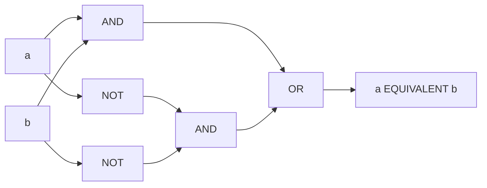

# EQUIVALENT

Biconditional: `True` when the two operands are the same definite value, `False` when they are different definite values, and `Unknown` when either is `Unknown`. Back to the [Derived Logical Operations index](README.md); shared rules are in the [specification](../specification/README.md).

## Name

- Canonical name: `EQUIVALENT`
- DSL: `EQUIVALENT` (also `IFF`, `XNOR`, `↔` and `⇔`, see [Aliases](#aliases))
- JSON and YAML `op`: `equivalent` (`iff` and `xnor` are accepted on read)
- `RuleBuilder` member: `RuleBuilder.Equivalent` (`RuleBuilder.Xnor` forwards to it)

## Classification

- Category: Derived Logical Operations
- Category index: [Derived Logical Operations](README.md)
- A Strong Kleene connective: it is monotone in the [information order](../specification/values.md#information-order). It is not an external operator.

## Kind

Derived. `EQUIVALENT` is defined from `AND`, `OR` and `NOT` (see [Canonical form](#canonical-form)); it is also the negation of [XOR](xor.md). It stays a first-class node in the engine and is not rewritten to its definition unless a rewrite such as `ExpandToPrimitives` asks for it.

## Arity

Exactly two operands. `EQUIVALENT` is binary only. A chain with more operands (`a EQUIVALENT b EQUIVALENT c`) and a JSON or YAML node with any other operand count are compile errors, `InfixArityViolation` (`TRE0006`, see [diagnostics](../specification/diagnostics.md)). `RuleBuilder` takes exactly two arguments, so a wrong count cannot be written there. See [Edge cases](#edge-cases).

## Input domain

Each operand is a value in `{T, F, U}`.

## Output domain

`{T, F, U}`.

## Definition

`a EQUIVALENT b` is `True` when `a` and `b` are both `True` or both `False`, `False` when one is `True` and the other `False`, and `Unknown` when either is `Unknown`.

## Syntax

| Form | Spelling |
| --- | --- |
| DSL, canonical | `a EQUIVALENT b` |
| DSL, other | `a IFF b`, `a XNOR b`, `a ↔ b`, `a ⇔ b` |
| JSON | `{"op": "equivalent", "operands": [ <expression>, <expression> ]}` |
| YAML | `op: equivalent` with an `operands:` list of exactly two items |
| `RuleBuilder` | `RuleBuilder.Equivalent(left, right)` |

`EQUIVALENT` is an infix operator with no call form: `EQUIVALENT(a, b)` is a syntax error. It sits outside the `NOT`, `AND`, `OR` precedence chain, so it needs parentheses to combine with another operator at the same level. Precedence, the mixing rule and the printed form are in [syntax](../specification/syntax.md#precedence-and-grouping).

## Aliases

| Alias | Kind |
| --- | --- |
| `IFF` | Word |
| `XNOR` | Word |
| `↔` | Symbol |
| `⇔` | Symbol |

Every alias compiles to the same node as `EQUIVALENT`, so persisted rules written with `XNOR` keep compiling, and the canonical printer writes `EQUIVALENT`. In JSON and YAML `iff` and `xnor` are accepted as the `op`. `RuleBuilder.Xnor` forwards to `RuleBuilder.Equivalent`. The ASCII spelling `<=>` is not accepted.

## Formal semantics

`EQUIVALENT` is the strongest extension of the Boolean biconditional ([semantics](../specification/semantics.md#truth-functional-evaluation-and-the-strongest-extension)): it is definite only when both operands are, because refining either `Unknown` operand can change the answer.

## Formula

$$a \leftrightarrow b = (a \land b) \lor (\neg a \land \neg b) = \neg(a \oplus b)$$

When both operands are definite this is $\mathsf{T}$ if $a = b$ and $\mathsf{F}$ if $a \ne b$; if either is $\mathsf{U}$ the result is $\mathsf{U}$.

## Truth table

<!-- k3:truth EQUIVALENT -->
| a | b | EQUIVALENT(a, b) |
| --- | --- | --- |
| T | T | T |
| T | U | U |
| T | F | F |
| U | T | U |
| U | U | U |
| U | F | U |
| F | T | F |
| F | U | U |
| F | F | T |

## Canonical form

The definition in primitives is the disjunction of the two ways the operands can agree:

<!-- k3:canonical EQUIVALENT vars=a,b -->
```text
OR(AND(a, b), AND(NOT(a), NOT(b)))
```

## Equivalent forms

`EQUIVALENT` is the negation of [XOR](xor.md), and the conjunction of the implication in both directions:

<!-- k3:canonical EQUIVALENT vars=a,b -->
```text
NOT(XOR(a, b))
```

<!-- k3:canonical EQUIVALENT vars=a,b -->
```text
AND(IMPLIES(a, b), IMPLIES(b, a))
```

`EQUIVALENT` is commutative and associative, `a EQUIVALENT True` is `a` and `a EQUIVALENT False` is `NOT a`. The classical law `a EQUIVALENT a = True` fails at `a = U`; see [laws that fail](../specification/semantics.md#laws-that-fail).

## Mermaid diagram

The composition of the canonical form: the upper `AND` is the case where both operands are `True`, the lower one the case where both are `False`.



## Examples

| Rule | Operand values | Result | Why |
| --- | --- | --- | --- |
| `isActive EQUIVALENT isVerified` | `True`, `True` | `True` | Both `True`. |
| `isActive EQUIVALENT isVerified` | `False`, `False` | `True` | Both `False` also agree. |
| `isActive EQUIVALENT isVerified` | `True`, `False` | `False` | They differ. |
| `isActive EQUIVALENT isVerified` | `Unknown`, `Unknown` | `Unknown` | Not `True`: two unknowns are not known to agree. |

## Edge cases

- More than two operands. `a EQUIVALENT b EQUIVALENT c` (in any spelling, and the same node in JSON or YAML) is rejected with `TRE0006` and a hint to add parentheses. A chain of biconditionals reads two ways in everyday speech, so it is never silently grouped. Nest explicitly, `(a EQUIVALENT b) EQUIVALENT c`.
- Unknown propagates. One `Unknown` operand makes the result `Unknown`, whatever the other is.
- Faults are `Unknown`. A faulting predicate contributes `Unknown` and records a fault (see [evaluation](../specification/evaluation.md#predicates-and-faults)). In the table below `boom` is a term that faults, `isOn` is `True` and `isOff` is `False`:

| Rule | Result | Faults recorded |
| --- | --- | --- |
| `boom EQUIVALENT isOff` | `Unknown` | 1 |

## Evaluation behavior

- Every operand runs in both evaluation modes, and none is recorded as `NotEvaluated`. A faulting operand always records its fault, even when the result is already settled (see [evaluation](../specification/evaluation.md#evaluation-modes)).
- The analyzer does not report `a EQUIVALENT a` as a tautology. The expression is `Unknown` when `a` is.

## Related operations

- [XOR](xor.md) is its negation.
- [IMPLIES](implies.md) is one direction of it.
- [NOT](../gates/not.md), [AND](../gates/and.md) and [OR](../gates/or.md) define it.
