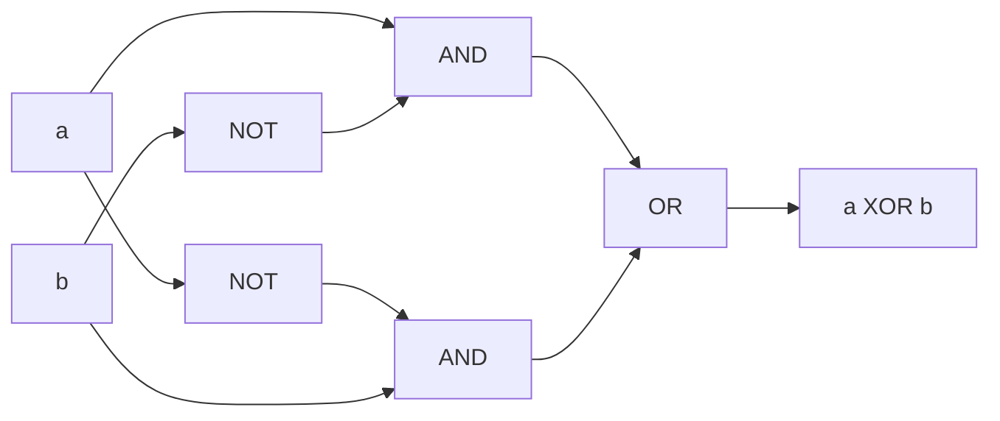

# XOR

Exclusive or: `True` when the two operands are different definite values, `False` when they are the same, and `Unknown` when either is `Unknown`. Back to the [Derived Logical Operations index](README.md); shared rules are in the [specification](../specification/README.md).

## Name

- Canonical name: `XOR`
- DSL: `XOR` (also `⊕` and `⊻`, see [Aliases](#aliases))
- JSON and YAML `op`: `xor`
- `RuleBuilder` member: `RuleBuilder.Xor`

## Classification

- Category: Derived Logical Operations
- Category index: [Derived Logical Operations](README.md)
- A Strong Kleene connective: it is monotone in the [information order](../specification/values.md#information-order). It is not an external operator.

## Kind

Derived. `XOR` is defined from `AND`, `OR` and `NOT` (see [Canonical form](#canonical-form)). It stays a first-class node in the engine and is not rewritten to its definition unless a rewrite such as `ExpandToPrimitives` asks for it.

## Arity

Exactly two operands. `XOR` is binary only. A chain with more operands (`a XOR b XOR c`) and a JSON or YAML node with any other operand count are compile errors, `InfixArityViolation` (`TRE0006`, see [diagnostics](../specification/diagnostics.md)). `RuleBuilder` takes exactly two arguments, so a wrong count cannot be written there. See [Edge cases](#edge-cases).

## Input domain

Each operand is a value in `{T, F, U}`.

## Output domain

`{T, F, U}`.

## Definition

`a XOR b` is `True` when exactly one of `a` and `b` is `True`, `False` when both are `True` or both are `False`, and `Unknown` when either is `Unknown`.

## Syntax

| Form | Spelling |
| --- | --- |
| DSL, canonical | `a XOR b` |
| DSL, symbols | `a ⊕ b`, `a ⊻ b` |
| JSON | `{"op": "xor", "operands": [ <expression>, <expression> ]}` |
| YAML | `op: xor` with an `operands:` list of exactly two items |
| `RuleBuilder` | `RuleBuilder.Xor(left, right)` |

`XOR` is an infix operator with no call form: `XOR(a, b)` is a syntax error. It sits outside the `NOT`, `AND`, `OR` precedence chain, so it needs parentheses to combine with another operator at the same level. Precedence, the mixing rule and the printed form are in [syntax](../specification/syntax.md#precedence-and-grouping).

## Aliases

| Alias | Kind |
| --- | --- |
| `⊕` | Symbol |
| `⊻` | Symbol |

Symbols compile to the same node as the word, so notation never changes meaning. The word is case-insensitive. The caret `^` is not accepted: it is a syntax error. For more than two operands use [PARITY](parity.md), not a chain of `XOR`.

## Formal semantics

`XOR` is the strongest extension of the Boolean exclusive or ([semantics](../specification/semantics.md#truth-functional-evaluation-and-the-strongest-extension)): the result is definite only when both operands are, because refining either `Unknown` operand to `True` or `False` flips the answer.

## Formula

$$a \oplus b = (a \land \neg b) \lor (\neg a \land b)$$

When both operands are definite this is $\mathsf{T}$ if $a \ne b$ and $\mathsf{F}$ if $a = b$; if either is $\mathsf{U}$ the result is $\mathsf{U}$.

## Truth table

Any `U` operand gives `U`: unlike `AND` and `OR`, no definite value settles `XOR` on its own.

<!-- k3:truth XOR -->
| a | b | XOR(a, b) |
| --- | --- | --- |
| T | T | F |
| T | U | U |
| T | F | T |
| U | T | U |
| U | U | U |
| U | F | U |
| F | T | T |
| F | U | U |
| F | F | F |

## Canonical form

The definition in primitives is the disjunction of the two ways the operands can differ:

<!-- k3:canonical XOR vars=a,b -->
```text
OR(AND(a, NOT(b)), AND(NOT(a), b))
```

## Equivalent forms

`XOR` is the negation of [EQUIVALENT](equivalent.md), and it equals the conjunction of `OR` with `NAND`:

<!-- k3:canonical XOR vars=a,b -->
```text
NOT(EQUIVALENT(a, b))
```

<!-- k3:canonical XOR vars=a,b -->
```text
AND(OR(a, b), NAND(a, b))
```

`XOR` of two operands is also the two-operand case of [PARITY](parity.md):

<!-- k3:canonical XOR vars=a,b -->
```text
PARITY(a, b)
```

`XOR` is commutative and associative, `a XOR False` is `a` and `a XOR True` is `NOT a`. The classical laws `a XOR a = False` and `a XOR NOT a = True` fail at `a = U`, and `AND` does not distribute over `XOR`; see [laws that fail](../specification/semantics.md#laws-that-fail).

## Mermaid diagram

The composition of the canonical form: each `AND` keeps one operand and negates the other, and the `OR` joins the two ways of differing.



The upper `AND` is `AND(a, NOT(b))` and the lower one is `AND(NOT(a), b)`.

## Examples

| Rule | Operand values | Result | Why |
| --- | --- | --- | --- |
| `isOwner XOR isAdmin` | `True`, `False` | `True` | The operands differ. |
| `isOwner XOR isAdmin` | `True`, `True` | `False` | The operands agree. |
| `isOwner XOR isAdmin` | `Unknown`, `False` | `Unknown` | An unknown operand leaves the answer open. |
| `isOwner XOR isAdmin` | `Unknown`, `Unknown` | `Unknown` | Not `False`: two unknowns are not known to agree. |

## Edge cases

- More than two operands. `a XOR b XOR c` (also with `⊕`, and the same node in JSON or YAML) is rejected with `TRE0006`; the message points at `PARITY(...)` for an odd number of `True` operands and at `ExactlyOne(...)` for exactly one. The two differ from three operands on, see [PARITY](parity.md#parity-versus-exactlyone-versus-xor). A chain is never silently regrouped. Nest explicitly with parentheses, `(a XOR b) XOR c`, which for definite operands is the same as `PARITY(a, b, c)`.
- Unknown propagates. One `Unknown` operand makes the result `Unknown`, whatever the other is.
- Faults are `Unknown`. A faulting predicate contributes `Unknown` and records a fault (see [evaluation](../specification/evaluation.md#predicates-and-faults)). In the table below `boom` is a term that faults, `isOn` is `True` and `isOff` is `False`:

| Rule | Result | Faults recorded |
| --- | --- | --- |
| `boom XOR isOn` | `Unknown` | 1 |
| `isOn XOR boom` | `Unknown` | 1 |

## Evaluation behavior

- Every operand runs in both evaluation modes, and none is recorded as `NotEvaluated`. A faulting operand always records its fault, even when the result is already settled (see [evaluation](../specification/evaluation.md#evaluation-modes)).
- The analyzer does not report `a XOR a` as a contradiction. The expression is `Unknown` when `a` is.

## Related operations

- [EQUIVALENT](equivalent.md) is the negation of `XOR`.
- [PARITY](parity.md) is the n-ary generalisation; `ExactlyOne` in the [Cardinality Functions](../cardinality/README.md) is the other n-ary reading and is a different operation from three operands.
- [AND](../gates/and.md), [OR](../gates/or.md) and [NOT](../gates/not.md) define it.
