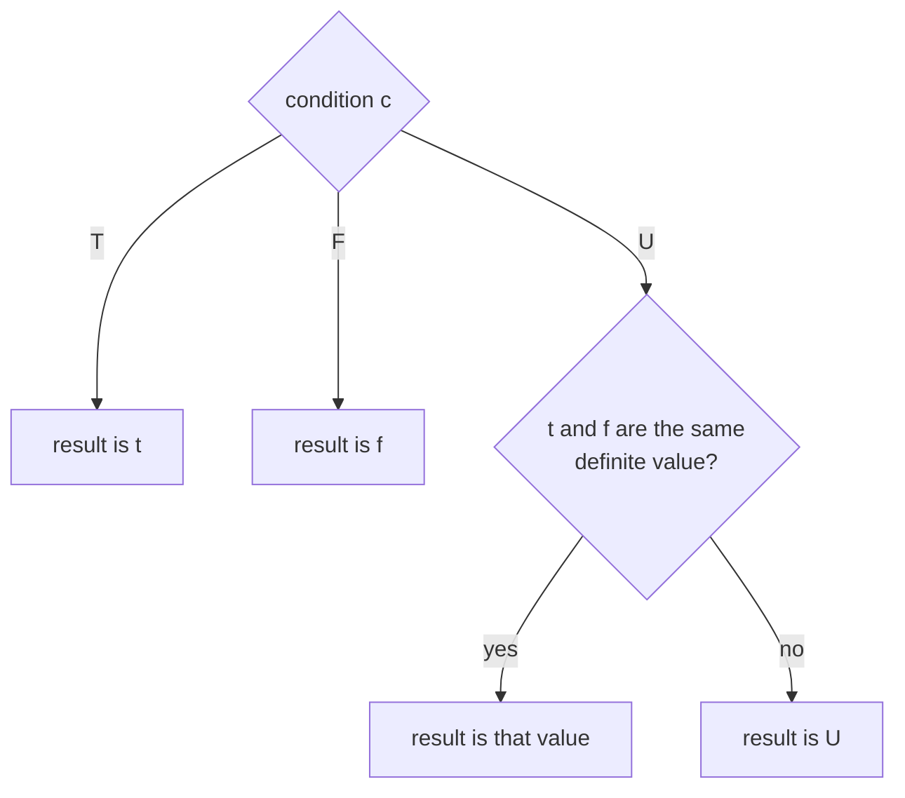

# If

The conditional: `True` selects the first branch, `False` the second, and an `Unknown` condition does not guess, giving a branch value only when both branches agree. A Strong Kleene connective, the strongest extension of if-then-else. Back to the [Functions index](README.md); shared rules are in the [specification](../specification/README.md).

## Name

- Canonical name: `If`
- DSL: `If(c, t, f)` (also the ternary `c ? t : f`, see [Aliases](#aliases))
- JSON and YAML `op`: `if`
- `RuleBuilder` member: `RuleBuilder.If`

## Classification

- Category: Functions
- Category index: [Functions](README.md)
- A Strong Kleene connective: it is monotone in the [information order](../specification/values.md#information-order). It is not an external operator, so unlike [COALESCE](coalesce.md) and the [inspections](istrue.md) it is covered by the no-tautology theorem and can be rewritten with `NAND` alone.

`If` is a Strong Kleene connective. It is in the Functions category because it has three operands and selects a value instead of combining truth values.

## Kind

Derived. `If` is defined as the multiplexer plus its consensus term (see [Canonical form](#canonical-form)). It stays a first-class node in the engine and is rewritten to its definition only when a rewrite such as `ExpandToPrimitives` asks for it.

## Arity

Exactly three operands, in the order condition, `whenTrue`, `whenFalse`. Any other count is the compile error `InfixArityViolation` (`TRE0006`, see [diagnostics](../specification/diagnostics.md)). This holds for `If(a, b)`, `If(a, b, c, d)` and `If()` in the DSL and for a JSON or YAML node with another operand count; `RuleBuilder.If` takes exactly three arguments, so a wrong count cannot be written there.

## Input domain

Each operand is a value in `{T, F, U}`.

## Output domain

`{T, F, U}`.

## Definition

`If(c, t, f)` is `t` when `c` is `True` and `f` when `c` is `False`. When `c` is `Unknown` it is `t` if `t` and `f` are the same definite value, and `Unknown` otherwise.

## Syntax

| Form | Spelling |
| --- | --- |
| DSL, canonical | `If(c, t, f)` |
| DSL, ternary | `c ? t : f` |
| JSON | `{"op": "if", "operands": [ <condition>, <whenTrue>, <whenFalse> ]}` |
| YAML | `op: if` with an `operands:` list of exactly three items |
| `RuleBuilder` | `RuleBuilder.If(condition, whenTrue, whenFalse)` |

`If` is a reserved word in any letter case, so a predicate cannot be named `If`. The condition and each branch of the ternary are single operands or parenthesized groups: `(a AND b) ? x : y` is valid, and `a AND b ? x : y` is not. See [syntax](../specification/syntax.md#the-mixing-rule). The canonical printer writes the call form `If(a, b, c)`. The tree printers label the node `If`, except the C-style tree style, which renders `?:`. The evaluated and description label stays `If`.

## Aliases

| Alias | Kind |
| --- | --- |
| `c ? t : f` | Ternary; builds the same node as `If(c, t, f)` |

There is no other spelling. The JSON and YAML `op` is case-insensitive on read.

## Formal semantics

`If` is the strongest extension of the Boolean conditional: its result is definite exactly when every `True`/`False` resolution of the `Unknown` operands gives the same answer, and then it is that answer ([semantics](../specification/semantics.md#truth-functional-evaluation-and-the-strongest-extension)). It is monotone in the information order. For a definite condition it is plain selection; the consensus term matters only for an `Unknown` condition, where it is what makes `If(Unknown, True, True)` equal `True`.

## Formula

$$\operatorname{If}(c, t, f) = (c \land t) \lor (\neg c \land f) \lor (t \land f)$$

By cases:

$$\operatorname{If}(c, t, f) = \begin{cases} t & \text{if } c = \mathsf{T} \\ f & \text{if } c = \mathsf{F} \\ t & \text{if } c = \mathsf{U} \text{ and } t = f \in \{\mathsf{T}, \mathsf{F}\} \\ \mathsf{U} & \text{otherwise} \end{cases}$$

## Truth table

Twenty-seven rows, one for each assignment of `T`, `U` and `F` to the condition and the two branches. The rows with `U` as the condition are the interesting ones: only `(U, T, T)` and `(U, F, F)` are definite.

<!-- k3:truth If -->
| c | t | f | If(c, t, f) |
| --- | --- | --- | --- |
| T | T | T | T |
| T | T | U | T |
| T | T | F | T |
| T | U | T | U |
| T | U | U | U |
| T | U | F | U |
| T | F | T | F |
| T | F | U | F |
| T | F | F | F |
| U | T | T | T |
| U | T | U | U |
| U | T | F | U |
| U | U | T | U |
| U | U | U | U |
| U | U | F | U |
| U | F | T | U |
| U | F | U | U |
| U | F | F | F |
| F | T | T | T |
| F | T | U | U |
| F | T | F | F |
| F | U | T | T |
| F | U | U | U |
| F | U | F | F |
| F | F | T | T |
| F | F | U | U |
| F | F | F | F |

## Canonical form

`If` is the multiplexer with its consensus term:

<!-- k3:canonical If vars=c,t,f -->
```text
OR(AND(c, t), AND(NOT(c), f), AND(t, f))
```

The third term `AND(t, f)` is the **consensus term**. It is redundant in classical logic and **not** in Strong Kleene (K3): without it `If(Unknown, True, True)` would be `Unknown`. No TruthWeaver rewrite removes it ([semantics](../specification/semantics.md#the-invalid-consensus-removal)).

## Equivalent forms

Swapping the branches and negating the condition gives the same function:

<!-- k3:canonical If vars=c,t,f -->
```text
If(NOT(c), f, t)
```

A constant branch collapses `If` to a gate. A `True` then-branch gives `OR`, and a `False` else-branch gives `AND`:

<!-- k3:canonical OR vars=c,f -->
```text
If(c, True, f)
```

<!-- k3:canonical AND vars=c,t -->
```text
If(c, t, False)
```

With a `True` else-branch it is `IMPLIES`:

<!-- k3:canonical IMPLIES vars=a,b -->
```text
If(a, b, True)
```

If both branches are the same operand the condition is irrelevant: `If(c, x, x)` is `x`, for definite `x` and for `Unknown` alike (the `(c, t, t)` rows of the table above).

### Contrasts with other conditionals

The bare multiplexer, McCarthy's conditional and SQL `CASE` are different functions. Each agrees with `If` for a `True` or `False` condition and differs only at some triples whose condition is `Unknown`:

| Conditional | Differs from `If` at | Why |
| --- | --- | --- |
| Bare multiplexer `OR(AND(c, t), AND(NOT(c), f))` | 1 triple: `(U, T, T)` is `U` instead of `T` | It omits the consensus term. |
| McCarthy's conditional | 2 triples: `(U, T, T)` and `(U, F, F)` are `U` | An `Unknown` condition is undefined whatever the branches are. |
| SQL `CASE WHEN c THEN t ELSE f END` | 4 triples: `(U, T, F)`, `(U, U, F)` give `F`; `(U, F, T)`, `(U, U, T)` give `T` | An `Unknown` condition is not `True`, so it takes the `ELSE` branch. |

`If(IsTrue(c), t, f)` is the SQL `CASE` equivalent: the [inspection](istrue.md) turns an `Unknown` condition into `False`, so it takes the else-branch exactly as `CASE` does. Both give a definite choice of branch, but `If(IsTrue(c), t, f)` can still be `Unknown` when the chosen branch is.

## Mermaid diagram

The decision flow of the table: a definite condition selects a branch, and an `Unknown` condition needs both branches to agree on a definite value.



## Examples

| Rule | Operand values (c, t, f) | Result | Why |
| --- | --- | --- | --- |
| `isAdmin ? canEdit : canView` | `True`, `False`, `True` | `False` | A true condition takes the first branch. |
| `isAdmin ? canEdit : canView` | `False`, `False`, `True` | `True` | A false condition takes the second branch. |
| `isAdmin ? canEdit : canView` | `Unknown`, `True`, `True` | `True` | Both branches agree, so the unknown condition does not matter. |
| `isAdmin ? canEdit : canView` | `Unknown`, `True`, `False` | `Unknown` | The branches disagree and the condition cannot decide. |
| `isAdmin ? canEdit : canView` | `Unknown`, `Unknown`, `Unknown` | `Unknown` | Nothing is known. |

## Edge cases

- Unknown condition. The result is a definite value only when `t` and `f` are the same definite value; it is never a guess of one branch.
- Unknown branches. `If(True, Unknown, False)` is `Unknown`: the selected branch is `Unknown`. `If(Unknown, Unknown, Unknown)` is `Unknown`.
- Faults are `Unknown`. A faulting predicate contributes `Unknown` and records a fault (see [evaluation](../specification/evaluation.md#predicates-and-faults)). In the table below `boom` is a term that faults, `isOn` is `True` and `isOff` is `False`:

| Rule | Result | Faults recorded |
| --- | --- | --- |
| `If(boom, isOn, isOn)` | `True` | 1, and the agreeing branches still decide it |
| `If(boom, isOn, isOff)` | `Unknown` | 1 |
| `If(isOn, isOff, boom)` | `False` | 0, because the `boom` branch is not run |
| `If(isOn, boom, isOff)` | `Unknown` | 1 |

## Evaluation behavior

- For a definite condition only the needed branch runs. The other branch is recorded as `NotEvaluated`, so its predicate does not run and its fault is not recorded. A condition of `Unknown` runs both branches, and `EvaluationMode.Exhaustive` always runs both. Neither mode changes `Decision.Result` (see [evaluation](../specification/evaluation.md#evaluation-modes)).
- `CompressToDerived` rewrites the three-term form back to `If`, and `ExpandToPrimitives` expands `If` to it. `Simplify` and `Canonicalize` never remove the consensus term. `Simplify` reduces `If(c, x, x)` to `x`.
- The analyzer treats `If(a, b OR True, c OR True)` as a tautology, even when `a` is `Unknown`.

## Related operations

- [AND](../gates/and.md), [OR](../gates/or.md) and [NOT](../gates/not.md) define it.
- [COALESCE](coalesce.md) and the [inspections](istrue.md) are the external operators; `If(IsTrue(c), t, f)` is the SQL `CASE` equivalent, and `If(IsKnown(a), a, b)` equals `COALESCE(a, b)`.
- [IMPLIES](../derived/implies.md) is `If(a, b, True)`.
