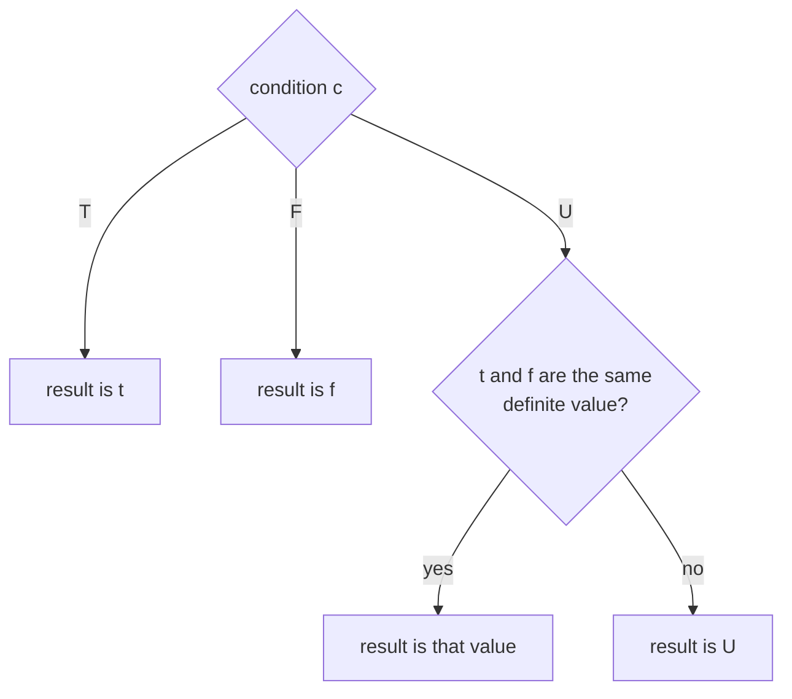

# If

The conditional: `True` selects the first branch, `False` the second, and an `Unknown` condition does not guess, giving a branch value only when both branches agree. A Strong Kleene connective, the strongest extension of if-then-else. Back to the [Functions index](README.md); shared rules are in the [specification](../specification/README.md).

## Name

- Canonical name: `If`
- DSL: `If(c, t, f)` (also the ternary `c ? t : f`, see [Aliases](#aliases))
- JSON and YAML `op`: `if`
- `RuleBuilder` member: `RuleBuilder.If`

## Classification

- Category: Functions
- Category index: [Functions](README.md)
- A Strong Kleene connective: it is monotone in the [information order](../specification/values.md#information-order). It is not an external operator, so unlike [COALESCE](coalesce.md) and the [inspections](istrue.md) it is covered by the no-tautology theorem and can be rewritten with `NAND` alone.

> [!NOTE]
> `If` is a connective that sits in the Functions category because it is ternary and selects a value rather than combining truth values ([proposal](../PROPOSAL.md#5-if-connective-or-function)). The owner accepted the recommendation: Functions, Derived, flagged as a connective. The category stays on the unresolved-questions list for the validation report.

## Kind

Derived. `If` is defined as the multiplexer plus its consensus term (see [Canonical Form](#canonical-form)). It stays a first-class node in the engine and is rewritten to its definition only when a rewrite such as `ExpandToPrimitives` asks for it ([ADR-0005](../../adr/0005-strong-k3-language-surface.md) decision 3).

## Arity

Exactly three operands, in the order condition, `whenTrue`, `whenFalse`. Any other count is the compile error `MalformedTree` (`TRE0014`): "If requires exactly 3 operands (condition, whenTrue, whenFalse) but found N." This holds for `If(a, b)`, `If(a, b, c, d)` and `If()` in the DSL and for a JSON or YAML node with another operand count; `RuleBuilder.If` takes exactly three arguments, so a wrong count cannot be written there.

## Input Domain

Each operand is a value in `{T, F, U}`.

## Output Domain

`{T, F, U}`.

## Definition

`If(c, t, f)` is `t` when `c` is `True` and `f` when `c` is `False`. When `c` is `Unknown` it is `t` if `t` and `f` are the same definite value, and `Unknown` otherwise.

## Syntax

| Form | Spelling |
| --- | --- |
| DSL, canonical | `If(c, t, f)` |
| DSL, ternary | `c ? t : f` |
| JSON | `{"op": "if", "operands": [ <condition>, <whenTrue>, <whenFalse> ]}` |
| YAML | `op: if` with an `operands:` list of exactly three items |
| `RuleBuilder` | `RuleBuilder.If(condition, whenTrue, whenFalse)` |

`If` is a reserved word in any letter case (`if(c, t, f)`), so a predicate cannot be named `If`. The call form has no precedence. The ternary is the lowest-precedence construct and is accepted wherever a full expression is: the rule root, parentheses and call arguments. The condition and each branch must each be a single operand or a parenthesized group: a bare `AND` or `OR` chain, a bare infix expression (`XOR`, `??` and the others) or an unparenthesized nested ternary in any of the three positions is the compile error `AmbiguousOperatorMixing` (`TRE0007`). `(a AND b) ? x : y` is fine; `a AND b ? x : y` and `a ? b ? x : y : z` are not. A lone `?` without its `:`, or the reverse, is a syntax error (`TRE0001`). The canonical printer writes the call form `If(a, b, c)`. The tree printers label the node `If`, except in the C-style tree style, which renders `?:`; the evaluated and description label stays `If`.

## Aliases

| Alias | Kind |
| --- | --- |
| `c ? t : f` | Ternary; builds the same node as `If(c, t, f)` |

There is no other spelling. The JSON and YAML `op` is case-insensitive on read.

## Formal Semantics

`If` is the strongest extension of the Boolean conditional: its result is definite exactly when every `True`/`False` resolution of the `Unknown` operands gives the same answer, and then it is that answer ([semantics](../specification/semantics.md#truth-functional-evaluation-and-the-strongest-extension)). It is monotone in the information order. For a definite condition it is plain selection; the consensus term matters only for an `Unknown` condition, where it is what makes `If(Unknown, True, True)` equal `True`.

## Formula

$$\operatorname{If}(c, t, f) = (c \land t) \lor (\neg c \land f) \lor (t \land f)$$

By cases:

$$\operatorname{If}(c, t, f) = \begin{cases} t & \text{if } c = \mathsf{T} \\ f & \text{if } c = \mathsf{F} \\ t & \text{if } c = \mathsf{U} \text{ and } t = f \in \{\mathsf{T}, \mathsf{F}\} \\ \mathsf{U} & \text{otherwise} \end{cases}$$

## Truth Table

Twenty-seven rows, one for each assignment of `T`, `U` and `F` to the condition and the two branches. The rows with `U` as the condition are the interesting ones: only `(U, T, T)` and `(U, F, F)` are definite.

<!-- k3:truth If -->
| c | t | f | If(c, t, f) |
| --- | --- | --- | --- |
| T | T | T | T |
| T | T | U | T |
| T | T | F | T |
| T | U | T | U |
| T | U | U | U |
| T | U | F | U |
| T | F | T | F |
| T | F | U | F |
| T | F | F | F |
| U | T | T | T |
| U | T | U | U |
| U | T | F | U |
| U | U | T | U |
| U | U | U | U |
| U | U | F | U |
| U | F | T | U |
| U | F | U | U |
| U | F | F | F |
| F | T | T | T |
| F | T | U | U |
| F | T | F | F |
| F | U | T | T |
| F | U | U | U |
| F | U | F | F |
| F | F | T | T |
| F | F | U | U |
| F | F | F | F |

## Canonical Form

`If` is the multiplexer with its consensus term:

<!-- k3:canonical If vars=c,t,f -->
```text
OR(AND(c, t), AND(NOT(c), f), AND(t, f))
```

The third term `AND(t, f)` is the **consensus term**. It is redundant in classical logic and **not** in Strong Kleene (K3): without it `If(Unknown, True, True)` would be `Unknown`. No TruthWeaver rewrite removes it ([semantics](../specification/semantics.md#the-invalid-consensus-removal)).

## Equivalent Forms

Swapping the branches and negating the condition gives the same function:

<!-- k3:canonical If vars=c,t,f -->
```text
If(NOT(c), f, t)
```

A constant branch collapses `If` to a gate. A `True` then-branch gives `OR`, and a `False` else-branch gives `AND`:

<!-- k3:canonical OR vars=c,f -->
```text
If(c, True, f)
```

<!-- k3:canonical AND vars=c,t -->
```text
If(c, t, False)
```

With a `True` else-branch it is `IMPLIES`:

<!-- k3:canonical IMPLIES vars=a,b -->
```text
If(a, b, True)
```

If both branches are the same operand the condition is irrelevant: `If(c, x, x)` is `x`, for definite `x` and for `Unknown` alike (the `(c, t, t)` rows of the table above).

### Contrasts with other conditionals

The bare multiplexer, McCarthy's conditional and SQL `CASE` are different functions. Each agrees with `If` for a `True` or `False` condition and differs only at some triples whose condition is `Unknown`:

| Conditional | Differs from `If` at | Why |
| --- | --- | --- |
| Bare multiplexer `OR(AND(c, t), AND(NOT(c), f))` | 1 triple: `(U, T, T)` is `U` instead of `T` | It omits the consensus term. |
| McCarthy's conditional | 2 triples: `(U, T, T)` and `(U, F, F)` are `U` | An `Unknown` condition is undefined whatever the branches are. |
| SQL `CASE WHEN c THEN t ELSE f END` | 4 triples: `(U, T, F)`, `(U, U, F)` give `F`; `(U, F, T)`, `(U, U, T)` give `T` | An `Unknown` condition is not `True`, so it takes the `ELSE` branch. |

`If(IsTrue(c), t, f)` is the SQL `CASE` equivalent: the [inspection](istrue.md) turns an `Unknown` condition into `False`, so it takes the else-branch exactly as `CASE` does. Both give a definite choice of branch, but `If(IsTrue(c), t, f)` can still be `Unknown` when the chosen branch is.

## Mermaid Diagram

The decision flow of the table: a definite condition selects a branch, and an `Unknown` condition needs both branches to agree on a definite value.



## Examples

| Rule | Operand values (c, t, f) | Result | Why |
| --- | --- | --- | --- |
| `isAdmin ? canEdit : canView` | `True`, `False`, `True` | `False` | A true condition takes the first branch. |
| `isAdmin ? canEdit : canView` | `False`, `False`, `True` | `True` | A false condition takes the second branch. |
| `isAdmin ? canEdit : canView` | `Unknown`, `True`, `True` | `True` | Both branches agree, so the unknown condition does not matter. |
| `isAdmin ? canEdit : canView` | `Unknown`, `True`, `False` | `Unknown` | The branches disagree and the condition cannot decide. |
| `isAdmin ? canEdit : canView` | `Unknown`, `Unknown`, `Unknown` | `Unknown` | Nothing is known. |

## Edge Cases

- **Unknown condition.** The result is a definite value only when `t` and `f` are the same definite value; it is never a guess of one branch.
- **Unknown branches.** `If(True, Unknown, False)` is `Unknown`: the selected branch is `Unknown`. `If(Unknown, Unknown, Unknown)` is `Unknown`.
- **Short-circuit.** For a definite condition only the needed branch is evaluated and the other is recorded as `NotEvaluated`, so its predicate is not invoked and its fault is not recorded. An `Unknown` condition evaluates both branches, and `EvaluationMode.Exhaustive` always evaluates both. This changes the trace and the recorded faults, never `Decision.Result`.
- **Faults are Unknown.** A predicate that throws, times out or is cancelled contributes `Unknown` and records a `Fault` ([ADR-0001](../../adr/0001-kleene-failure-model.md)). In the table below `boom` is a term that faults, `isOn` is `True` and `isOff` is `False`:

| Rule | Result | Faults recorded |
| --- | --- | --- |
| `If(boom, isOn, isOn)` | `True` | 1, and the agreeing branches still decide it |
| `If(boom, isOn, isOff)` | `Unknown` | 1 |
| `If(isOn, isOff, boom)` | `False` | 0, because the `boom` branch is not run |
| `If(isOn, boom, isOff)` | `Unknown` | 1 |

## Implementation Notes

- The evaluator reports an `If` node as `If` in the trace and the evaluated tree, in every operator style.
- Compression rewrites the three-term form back to `If`, and `ExpandToPrimitives` expands `If` to it ([ADR-0005](../../adr/0005-strong-k3-language-surface.md)). `Simplify` and `Canonicalize` never remove the consensus term; `Simplify` reduces `If(c, x, x)` to `x`.
- The analyzer uses the three-term definition over the definite and possible rails, so `If(a, b OR True, c OR True)` is a tautology even for an `Unknown` `a`.
- The semantics are pinned by an exhaustive 27-triple test in the engine suite ([ADR-0005](../../adr/0005-strong-k3-language-surface.md) decision 21).

## Related Operations

- [AND](../gates/and.md), [OR](../gates/or.md) and [NOT](../gates/not.md) define it.
- [COALESCE](coalesce.md) and the [inspections](istrue.md) are the external operators; `If(IsTrue(c), t, f)` is the SQL `CASE` equivalent, and `If(IsKnown(a), a, b)` equals `COALESCE(a, b)`.
- [IMPLIES](../derived/implies.md) is `If(a, b, True)`.
