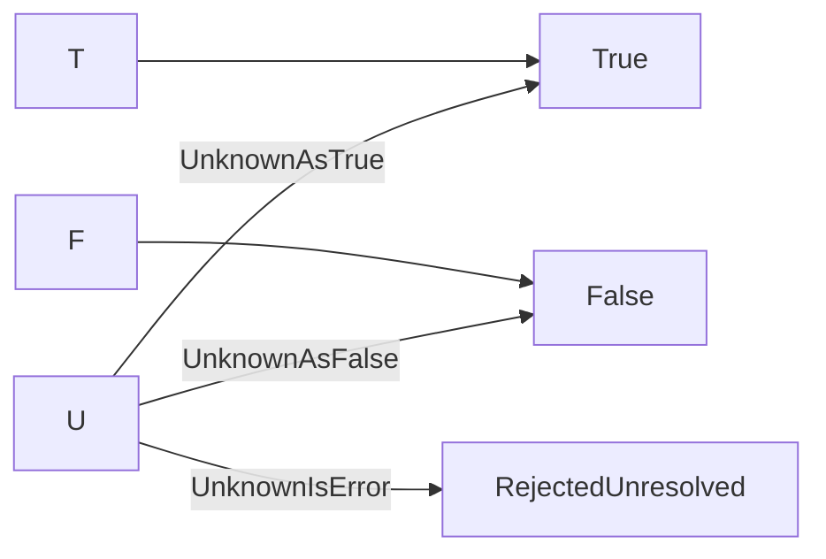

# Collapse

Reduces an evaluated result to a final outcome under a chosen policy for `Unknown`. A method on `Decision`, not a rule operator. Back to the [Result Transformations index](README.md); shared rules are in the [specification](../specification/README.md).

> [!IMPORTANT]
> `Project` and `Collapse` are **TruthWeaver terms**, not Strong Kleene (K3) literature terms. Kleene's logic has no notion of collapsing to two values. `Collapse` is a call on the *result*, never a node in the rule; rule text that still declares a `Collapse` is rejected.

## Name

- Canonical name: `Collapse`
- C# API: `Decision.Collapse(CollapsePolicy policy)`, returning a `CollapseOutcome`
- DSL, JSON, YAML and `RuleBuilder`: none. `Collapse` is not part of the rule language ([Syntax](#syntax))

## Classification

- Category: Result Transformations
- Category index: [Result Transformations](README.md)
- A result transformation, not a Strong Kleene connective and not a rule operator. It runs after evaluation, on the `Decision` the rule produced ([terminology](../specification/terminology.md)).
- It does not return a `TruthValue`: it returns a `CollapseOutcome`, which has a third member, `RejectedUnresolved`, that is not a Strong Kleene value.

## Kind

Primitive. Nothing in the rule language expresses it: `UnknownIsError` is not a truth function, and a `CollapseOutcome` is not a `TruthValue`. It is a result transformation, not a rule node. It therefore has no canonical form; two of its three policies match [Project](project.md), see [Equivalent Forms](#equivalent-forms).

## Arity

One evaluated result (the `Decision` the method is called on) and one `CollapsePolicy` parameter. There is no operand list and so no operand-count error. An undefined policy value is rejected ([Edge Cases](#edge-cases)).

## Input Domain

The decision's `Result`, a value in `{T, F, U}`, and `policy`, one of `UnknownAsFalse`, `UnknownAsTrue` and `UnknownIsError`.

## Output Domain

A `CollapseOutcome`: `False`, `True` or `RejectedUnresolved`. `RejectedUnresolved` is a normal outcome, not a `Fault`, and is not recorded in `Decision.Faults`.

## Definition

`Collapse(policy)` returns the matching `CollapseOutcome` for `True` and `False`. For `Unknown` it returns `False` under `UnknownAsFalse`, `True` under `UnknownAsTrue` and `RejectedUnresolved` under `UnknownIsError`. The original three-valued result is not changed: `Decision.Result`, `Decision.Faults` and `Decision.IsSatisfied` are exactly what they were, and the decision stays available after the call.

The choice is always explicit. `Unknown` is a normal value, not an error, and the engine never converts it to `True` or `False` on its own.

## Syntax

| Form | Spelling |
| --- | --- |
| C# | `decision.Collapse(CollapsePolicy.UnknownAsFalse)`, `decision.Collapse(CollapsePolicy.UnknownAsTrue)` or `decision.Collapse(CollapsePolicy.UnknownIsError)` |
| DSL, JSON, YAML, `RuleBuilder` | none |

`Collapse` is not part of the rule language ([ADR-0005](../../adr/0005-strong-k3-language-surface.md) decision 14). Rule text that declares one, in the DSL (`TRE0001`) or in JSON and YAML (`TRE0014`), is the compile error "Collapse is not part of the rule language: a rule always yields the three-valued result. Evaluate the rule, then call Decision.Collapse(policy) on the Decision to choose how Unknown is resolved." A rule always yields the raw three-valued result, so a persisted rule cannot change how its own `Unknown` is resolved.

### Policy values

| `CollapsePolicy` | `Unknown` becomes | Meaning |
| --- | --- | --- |
| `UnknownAsFalse` | `False` | Fail closed: only a definite `True` is accepted. Matches `IsSatisfied`. |
| `UnknownAsTrue` | `True` | Fail open: only a definite `False` is refused. Choose it deliberately. |
| `UnknownIsError` | `RejectedUnresolved` | An explicit "not known" outcome, neither a fault nor an exception, so "the answer is not known" is distinct from "something broke". |

## Aliases

None.

## Formal Semantics

For a result $a$ and a policy $\pi$, $\operatorname{Collapse}_{\pi}(a)$ keeps the definite values and resolves $\mathsf{U}$ according to $\pi$ ([notation](../specification/notation.md)). It is a function on the value of `Decision.Result`; it changes nothing else about the decision.

## Formula

$$\operatorname{Collapse}_{\pi}(a) = \begin{cases} a & \text{if } a \ne \mathsf{U} \\ \mathsf{F} & \text{if } a = \mathsf{U} \text{ and } \pi = \text{UnknownAsFalse} \\ \mathsf{T} & \text{if } a = \mathsf{U} \text{ and } \pi = \text{UnknownAsTrue} \\ \text{RejectedUnresolved} & \text{if } a = \mathsf{U} \text{ and } \pi = \text{UnknownIsError} \end{cases}$$

## Truth Table

One table per policy. `True` and `False` always map to the matching outcome.

`UnknownAsFalse`:

<!-- k3:truth Collapse policy=UnknownAsFalse -->
| result | Collapse(UnknownAsFalse) |
| --- | --- |
| T | True |
| U | False |
| F | False |

`UnknownAsTrue`:

<!-- k3:truth Collapse policy=UnknownAsTrue -->
| result | Collapse(UnknownAsTrue) |
| --- | --- |
| T | True |
| U | True |
| F | False |

`UnknownIsError`:

<!-- k3:truth Collapse policy=UnknownIsError -->
| result | Collapse(UnknownIsError) |
| --- | --- |
| T | True |
| U | RejectedUnresolved |
| F | False |

## Equivalent Forms

`Collapse(UnknownAsFalse)` is the outcome `True` exactly when `Project(false)` is `True`, and `Collapse(UnknownAsTrue)` is the outcome `True` exactly when `Project(true)` is `True`. Only `UnknownIsError` has no `Project` counterpart, because it is not a truth function. `Decision.IsSatisfied` equals `Collapse(UnknownAsFalse) == CollapseOutcome.True`.

## Mermaid Diagram

`True` and `False` map to the matching outcome under every policy. Only `Unknown` depends on the policy, and only `UnknownIsError` reaches the third outcome.

## Examples

| Result of the rule | Policy | Outcome | Why |
| --- | --- | --- | --- |
| `True` | `UnknownIsError` | `True` | A definite value never depends on the policy. |
| `False` | `UnknownAsTrue` | `False` | A definite value never depends on the policy. |
| `Unknown` | `UnknownAsFalse` | `False` | Fail closed. |
| `Unknown` | `UnknownAsTrue` | `True` | Fail open. |
| `Unknown` | `UnknownIsError` | `RejectedUnresolved` | The caller is told the rule could not be resolved. |

## Edge Cases

- **The original result is kept.** `Collapse` is pure. After `Collapse(UnknownAsTrue)` on an `Unknown` decision, `Result` is still `Unknown`, `Faults` is unchanged and `IsSatisfied` is still `false`.
- **`IsSatisfied` stays fail-closed.** `Decision.IsSatisfied` is `True` only when `Result` is `True`, whatever policy was applied. Reading `Collapse(UnknownAsTrue)` as "satisfied" is a choice the application makes at its own boundary ([ADR-0001](../../adr/0001-kleene-failure-model.md)).
- **An undefined policy is rejected for every result.** `Collapse((CollapsePolicy)99)` throws `ArgumentOutOfRangeException` for a `True` and a `False` result as well as for `Unknown`, so a bad value cannot hide behind a definite result and surface later ([k3-followups ticket 29](../../../.scratch/k3-followups/issues/29-schema-op-case-and-collapse-policy-validation.md)). It is a programming error at the call site, not a business outcome.
- **`RejectedUnresolved` is not a failure.** It is returned, never thrown, and not recorded as a `Fault`.
- **A faulting predicate.** A predicate that throws, times out or is cancelled contributes `Unknown` and a `Fault`. `Collapse(UnknownAsTrue)` of such a decision is `True` while `Faults` still lists the fault, so a fail-open policy can hide an outage. Check `Faults`, or use `UnknownIsError`, when that matters.
- **SQL precedents.** SQL `WHERE` keeps a row only on `true` (`UnknownAsFalse`); a `CHECK` constraint is satisfied on `true` or null (`UnknownAsTrue`) ([PostgreSQL, table expressions](https://www.postgresql.org/docs/current/queries-table-expressions.html), [PostgreSQL, constraints](https://www.postgresql.org/docs/current/ddl-constraints.html)). In both, the consumer applies the two-valued policy and the three-valued value is not rewritten, which is why the policy is a call-site choice here too.

## Implementation Notes

- `Decision.Collapse` checks the policy with `Enum.IsDefined` first, then maps `True` and `False` directly and resolves `Unknown` with a `switch` on the policy. It does not look at `Faults`, `Trace` or `TraceTree`.
- The harness ([doc-examples](../../doc-examples.md)) checks the three tables against an independent oracle, not against `Decision.Collapse`.
- `Collapse` is not an `Expression` node, so the printers, `Simplify`, the `Expand` rewrites and the JSON and YAML schema never see it.

## Related Operations

- [Project](project.md) is the two-valued form, returning a `TruthValue` and never `RejectedUnresolved`.
- [COALESCE](../functions/coalesce.md) gives the `UnknownAsFalse` and `UnknownAsTrue` effect inside a rule.
- [IsTrue](../functions/istrue.md) and [IsKnown](../functions/isknown.md) are the rule-level inspections.
