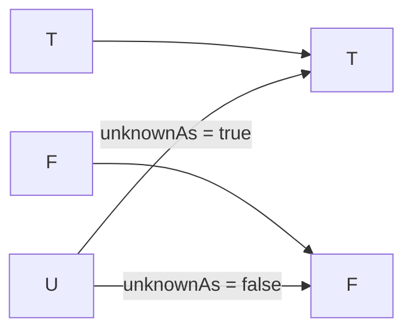

# Project

Replaces `Unknown` with a chosen definite value and passes `True` and `False` through. A method on an evaluated `Decision`, not a rule operator. Back to the [Result Transformations index](README.md); shared rules are in the [specification](../specification/README.md).

> [!IMPORTANT]
> `Project` and `Collapse` are **TruthWeaver terms**, not Strong Kleene (K3) literature terms; in relational algebra "projection" means selecting columns. `Project` is a call on the *result*, never a node in the rule. Inside a rule, `COALESCE(x, True)` and `COALESCE(x, False)` give the same effect ([Canonical form](#canonical-form)).

## Name

- Canonical name: `Project`
- C# API: `Decision.Project(bool unknownAs)`, returning a `TruthValue`
- DSL, JSON, YAML and `RuleBuilder`: none. `Project` is not part of the rule language ([Syntax](#syntax))

## Classification

- Category: Result Transformations
- Category index: [Result Transformations](README.md)
- A result transformation, not a Strong Kleene connective and not a rule operator. It runs after evaluation, on the `Decision` the rule produced ([terminology](../specification/terminology.md)).
- Like [COALESCE](../functions/coalesce.md) with a constant it is not monotone in the [information order](../specification/values.md#information-order): it turns the least informative value into a definite one. The [no-tautology theorem](../specification/semantics.md#no-tautologies-no-contradictions) does not extend to it ([semantics](../specification/semantics.md#strong-kleene-connectives-and-external-operators)).

## Kind

Derived. `Project` is `COALESCE(rule, unknownAs)` applied to the result instead of inside the rule (see [Canonical form](#canonical-form)). It is a result transformation, not a rule node.

## Arity

One evaluated result (the `Decision` the method is called on) and one `bool` parameter, `unknownAs`. The parameter is a `bool`, not a `TruthValue`, so a request to project `Unknown` to `Unknown` cannot be written. There is no operand list and so no operand-count error.

## Input domain

The decision's `Result`, a value in `{T, F, U}`, and `unknownAs` in `{true, false}`.

## Output domain

`{T, F}`. The returned `TruthValue` is never `Unknown`.

## Definition

`Project(unknownAs)` returns `True` and `False` unchanged and returns `True` for an `Unknown` result when `unknownAs` is `true`, `False` when it is `false`. The original three-valued result is not changed: `Decision.Result`, `Decision.Faults` and `Decision.IsSatisfied` are exactly what they were, and the decision stays available after the call.

## Syntax

| Form | Spelling |
| --- | --- |
| C# | `decision.Project(unknownAs: true)` or `decision.Project(unknownAs: false)` |
| DSL, JSON, YAML, `RuleBuilder` | none |

`Project` is not part of the rule language. A rule that spells `Project(...)` is the compile error `TRE0002`: "Project is not part of the rule language. To replace Unknown inside a rule write COALESCE(x, True) or COALESCE(x, False); to make the final result definite call Decision.Project(unknownAs) on the Decision." The call is pure, never throws and never records a `Fault`.

## Aliases

None.

## Formal semantics

For a result $a$ and a definite value $v \in \{\mathsf{T}, \mathsf{F}\}$, $\operatorname{Project}_{v}(a)$ keeps $\mathsf{T}$ and $\mathsf{F}$ and replaces $\mathsf{U}$ with $v$ ([notation](../specification/notation.md)). It is a function on the value of `Decision.Result`; it changes nothing else about the decision.

## Formula

$$\operatorname{Project}_{v}(a) = \begin{cases} v & \text{if } a = \mathsf{U} \\ a & \text{otherwise} \end{cases}$$

## Truth table

With `unknownAs` set to `False`, only `Unknown` is replaced, and it becomes `False`:

<!-- k3:truth Project unknownAs=False -->
| result | Project(false) |
| --- | --- |
| T | T |
| U | F |
| F | F |

With `unknownAs` set to `True`, `Unknown` becomes `True`:

<!-- k3:truth Project unknownAs=True -->
| result | Project(true) |
| --- | --- |
| T | T |
| U | T |
| F | F |

## Canonical form

`Project` is `COALESCE` with a constant, written over the rule's value `x`. `unknownAs` is `True` or `False`:

<!-- k3:canonical Project vars=x -->
```text
COALESCE(x, unknownAs)
```

So `COALESCE(rule, False)` makes a rule fail closed from inside the rule text, and `COALESCE(rule, True)` makes it fail open. Choosing the value at the call site with `Project` keeps the rule itself three-valued.

## Equivalent forms

With the parameter fixed, `Project(false)` has the same table as the inspection [IsTrue](../functions/istrue.md), and `Project(true)` the same table as `NOT IsFalse(x)`. The difference is where it runs: an inspection is a rule node whose value is used inside the rule, while `Project` is applied once to the final result.

The SQL counterparts are `x IS TRUE` for `Project(false)` and `x IS NOT FALSE` for `Project(true)` ([PostgreSQL, comparison functions](https://www.postgresql.org/docs/current/functions-comparison.html)).

## Mermaid diagram



`True` and `False` map to themselves. `Unknown` maps to the chosen value, so only two definite outputs are possible.

## Examples

| Result of the rule | Call | Returned value | Why |
| --- | --- | --- | --- |
| `True` | `Project(false)` | `True` | A definite value passes through. |
| `False` | `Project(true)` | `False` | A definite value passes through, whatever `unknownAs` is. |
| `Unknown` | `Project(false)` | `False` | `Unknown` becomes the chosen value, `False`. |
| `Unknown` | `Project(true)` | `True` | `Unknown` becomes the chosen value, `True`. |

## Edge cases

- The original result is kept. `Project` returns a new `TruthValue`; the `Decision` still holds `Unknown`, so a caller can project the same decision both ways or inspect it afterwards.
- `IsSatisfied` stays fail-closed. `Decision.IsSatisfied` is `True` only when `Result` is `True`, so an `Unknown` decision is not satisfied whatever `Project` returned. `Project(true)` does not make an `Unknown` decision satisfied.
- A faulting predicate. A predicate that throws, times out or is cancelled contributes `Unknown` and a `Fault`. `Project` sees only the `Unknown`: `Project(true)` of such a decision is `True` while `Faults` still lists the fault. Check `Faults` before trusting a fail-open projection ([Collapse](collapse.md#edge-cases) has the same hazard).
- SQL precedents. SQL `WHERE` keeps a row only on `true`, which is `Project(false)`; a `CHECK` constraint passes on `true` or null, which is `Project(true)` ([PostgreSQL, table expressions](https://www.postgresql.org/docs/current/queries-table-expressions.html), [PostgreSQL, constraints](https://www.postgresql.org/docs/current/ddl-constraints.html)). In each system the consumer applies the two-valued policy; the three-valued value itself is not rewritten.

## Evaluation behavior

- `Project` reads only `Result`. It does not look at `Faults`, `Trace` or `TraceTree`.
- `Project` is not an expression node, so the printers, `Simplify`, the `Expand` rewrites and the JSON and YAML schema never see it.

## Related operations

- [Collapse](collapse.md) applies a policy and can return `RejectedUnresolved` instead of guessing.
- [COALESCE](../functions/coalesce.md) is `Project`'s canonical form, inside a rule.
- [IsTrue](../functions/istrue.md), [IsFalse](../functions/isfalse.md), [IsUnknown](../functions/isunknown.md) and [IsKnown](../functions/isknown.md) are the rule-level inspections.
