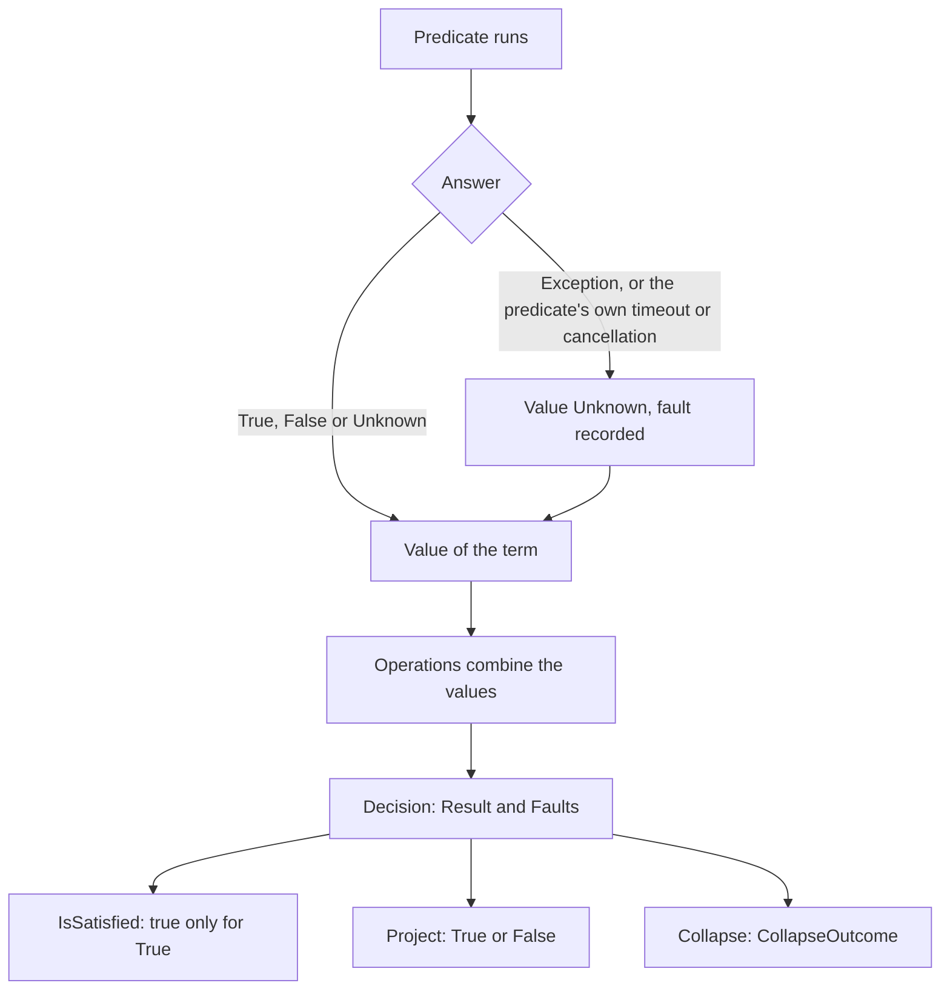

# Evaluation

How an expression becomes a `Decision`: what a predicate contributes, which operands run, what a fault does, and how a caller reads the result. Back to the [specification index](README.md).

## The expression and the decision

An expression is an immutable tree of Operations over terms and constants. A term is a predicate bound to arguments. Evaluation reads the tree once and produces one `Decision`. A `Decision` has these members:

| Member | Content |
| --- | --- |
| `Result` | The value of the whole expression: `True`, `False` or `Unknown`. It is always the raw value. A rule cannot choose a policy for `Unknown`. |
| `Faults` | Every fault absorbed during the evaluation, in the order they occurred. |
| `Trace`, `TraceTree` | A log and a tree of what happened to each node. They are present only when the caller asks for them. |

The value of each Operation depends only on the values of its operands. [semantics](semantics.md) defines those values.

## Predicates and faults

A predicate answers `True`, `False` or `Unknown`. An answer of `Unknown` is a normal answer and records no fault.

A predicate that cannot answer is a fault. A thrown exception, or a predicate's own timeout or cancellation, gives the term the value `Unknown` and records a fault on the `Decision`. Cancellation of the evaluation itself is not a fault: it throws `OperationCanceledException`. The rest of the expression sees `Unknown`. A fault never changes the rules of an Operation. `False` still settles `AND`, and `True` still settles `OR`, whether or not another operand faulted.

The caller can pass evaluation options. `Mode` selects the evaluation mode below. `Timeout` is an overall time bound for the evaluation. When it expires, the evaluation throws `OperationCanceledException` and does not record a fault. `FaultBudget` stops the evaluation as soon as that many faults are recorded, so a budget of 1 stops at the first fault. `null` means no limit, and a budget below 1 throws `ArgumentOutOfRangeException`.

## Evaluation modes

`EvaluationMode.ShortCircuit` is the default. Operands run from left to right, and an Operation stops when its result is settled. A skipped operand is recorded as `NotEvaluated`, and its predicates do not run.

`EvaluationMode.Exhaustive` runs every reachable term and collects every fault. It changes which terms run and which faults the `Decision` holds. It never changes `Result`.

| Operation | In `ShortCircuit` mode |
| --- | --- |
| `AND` | Stops after the first `False` |
| `OR` | Stops after the first `True` |
| `COALESCE` | Stops after the first operand that is not `Unknown` |
| `If` | Runs the condition and the branch that the condition selects. A condition of `Unknown` runs both branches. |
| Every other Operation | Runs every operand |

The Evaluation behavior section of each Operation document states the rule for that Operation. These rows show the effect on a fault. Here `boom` is a term that faults, `isOn` is `True` and `isOff` is `False`.

| Rule | Mode | Result | Faults |
| --- | --- | --- | --- |
| `boom AND isOn` | Either | `Unknown` | 1 |
| `boom AND isOff` | Either | `False` | 1 |
| `isOff AND boom` | `ShortCircuit` | `False` | 0, because `boom` does not run |
| `isOff AND boom` | `Exhaustive` | `False` | 1 |
| `isOn OR boom` | `ShortCircuit` | `True` | 0 |
| `isOn OR boom` | `Exhaustive` | `True` | 1 |
| `isOff NAND boom` | Either | `True` | 1, because `NAND` runs every operand |
| `IsTrue(boom)` | Either | `False` | 1 |

## Reading a decision

A `Decision` offers three ways to read `Result`. None of them changes the `Decision`, its faults or `IsSatisfied`.

| Reader | Answer |
| --- | --- |
| `IsSatisfied` | `true` only when `Result` is `True`. `Unknown` and `False` are not satisfied, so the check fails closed. |
| `Project(unknownAs)` | `True` or `False`. A definite `Result` passes through, and `Unknown` becomes `unknownAs`. See [Project](../result-transformations/project.md). |
| `Collapse(policy)` | A `CollapseOutcome`: `True`, `False` or `RejectedUnresolved`. A definite `Result` maps to itself. The policy decides `Unknown`. See [Collapse](../result-transformations/collapse.md). |

`RejectedUnresolved` is a normal outcome. It is not a fault, and nothing is thrown.

## Flow

## Related

- [values](values.md) defines the three values and the two orders.
- [semantics](semantics.md) defines the value of each Operation.
- [terminology](terminology.md) defines fault, decision and result transformation.
- [diagnostics](diagnostics.md) lists the errors that stop a rule before it evaluates.
