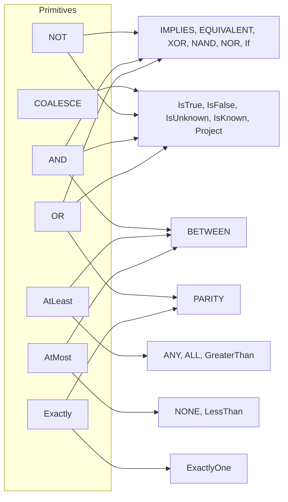

# Operations

The inventory of the 27 Operations of the Strong Kleene (K3) reference. Back to the [specification index](README.md). The terms in the column headings are defined in [terminology](terminology.md).

## Inventory

Each Operation has one document, one primary category and one Kind. A canonical form is listed where the Operation has a definition in terms of primitives. For a primitive, `n/a` replaces it. "Connective" means a Strong Kleene connective. "External" means an external operator.

| Operation | Category | Kind | Class | Operands | Canonical form | Notes |
| --- | --- | --- | --- | --- | --- | --- |
| [`NOT`](../gates/not.md) | Gates / Operators | Primitive | Connective | 1 | n/a | |
| [`AND`](../gates/and.md) | Gates / Operators | Primitive | Connective | 2 or more | n/a | |
| [`OR`](../gates/or.md) | Gates / Operators | Primitive | Connective | 2 or more | n/a | |
| [`IMPLIES`](../derived/implies.md) | Derived Logical Operations | Derived | Connective | 2 | `OR(NOT a, b)` | |
| [`EQUIVALENT`](../derived/equivalent.md) | Derived Logical Operations | Derived | Connective | 2 | `OR(AND(a, b), AND(NOT a, NOT b))` | Also `NOT XOR(a, b)`. Aliases `IFF` and `XNOR`. |
| [`XOR`](../derived/xor.md) | Derived Logical Operations | Derived | Connective | 2 only | `OR(AND(a, NOT b), AND(NOT a, b))` | More than two operands is a compile error that names `PARITY`. |
| [`NAND`](../derived/nand.md) | Derived Logical Operations | Derived | Connective | 2 only | `NOT(AND(a, b))` | |
| [`NOR`](../derived/nor.md) | Derived Logical Operations | Derived | Connective | 2 only | `NOT(OR(a, b))` | |
| [`PARITY`](../derived/parity.md) | Derived Logical Operations | Derived | Connective | 2 or more | `OR(Exactly(1, ...), Exactly(3, ...), ...)` over every odd count | Differs from `ExactlyOne` from three operands. |
| [`AtLeast(k)`](../cardinality/atleast.md) | Cardinality Functions | Primitive | Connective | 1 or more, `1 <= k <= n` | n/a | |
| [`AtMost(k)`](../cardinality/atmost.md) | Cardinality Functions | Primitive | Connective | 1 or more, `0 <= k <= n-1` | n/a | Equals `NOT AtLeast(k+1)`. |
| [`Exactly(k)`](../cardinality/exactly.md) | Cardinality Functions | Primitive | Connective | 1 or more, `0 <= k <= n` | n/a | Equals `AND(AtLeast(k), AtMost(k))`. |
| [`ExactlyOne`](../cardinality/exactlyone.md) | Cardinality Functions | Derived | Connective | 2 or more | `Exactly(1, ...)` | Differs from `PARITY` from three operands. |
| [`GreaterThan(k)`](../cardinality/greaterthan.md) | Cardinality Functions | Derived | Connective | 1 or more, `0 <= k <= n-1` | `AtLeast(k+1, ...)` | |
| [`LessThan(k)`](../cardinality/lessthan.md) | Cardinality Functions | Derived | Connective | 1 or more, `1 <= k <= n` | `AtMost(k-1, ...)` | |
| [`ANY`](../cardinality/any.md) | Cardinality Functions | Derived | Connective | 2 or more | `AtLeast(1, ...)` | Equals `OR` as a value. A separate Operation. |
| [`ALL`](../cardinality/all.md) | Cardinality Functions | Derived | Connective | 2 or more | `AtLeast(n, ...)` | Equals `AND` as a value. A separate Operation. |
| [`NONE`](../cardinality/none.md) | Cardinality Functions | Derived | Connective | 2 or more | `AtMost(0, ...)` | Equals `NOT OR` as a value. A separate Operation. |
| [`BETWEEN(min, max)`](../cardinality/between.md) | Cardinality Functions | Derived | Connective | 2 or more, `0 <= min <= max <= n`, not the whole range `0..n` | `AND(AtLeast(min, ...), AtMost(max, ...))` | Unrelated to SQL and numeric `Between`. |
| [`COALESCE`](../functions/coalesce.md) | Functions | Primitive | External | 2 or more | n/a | |
| [`If`](../functions/if.md) | Functions | Derived | Connective | 3 | `OR(AND(c, t), AND(NOT c, f), AND(t, f))` | The form without the third term is not equivalent. |
| [`IsTrue`](../functions/istrue.md) | Functions | Derived | External | 1 | `COALESCE(x, False)` | |
| [`IsFalse`](../functions/isfalse.md) | Functions | Derived | External | 1 | `COALESCE(NOT x, False)` | |
| [`IsUnknown`](../functions/isunknown.md) | Functions | Derived | External | 1 | `AND(COALESCE(x, True), COALESCE(NOT x, True))` | |
| [`IsKnown`](../functions/isknown.md) | Functions | Derived | External | 1 | `OR(COALESCE(x, False), COALESCE(NOT x, False))` | |
| [`Project(unknownAs)`](../result-transformations/project.md) | Result Transformations | Derived | n/a | 1 result, one `bool` parameter | `COALESCE(rule, unknownAs)` | A method on `Decision`, not a rule node. |
| [`Collapse(policy)`](../result-transformations/collapse.md) | Result Transformations | Primitive | n/a | 1 result, one `CollapsePolicy` parameter | None | A method on `Decision`. It returns a `CollapseOutcome`, not a value. |

Each canonical form agrees with its Operation for every assignment of `T`, `F` and `U`, for every operand count that the Operation accepts, and for every valid parameter. `Collapse` has no canonical form. It returns a `CollapseOutcome` and `UnknownIsError` is not a truth function.

Category and Kind are independent. The Derived Logical Operations category holds only derived Operations. The Cardinality Functions and Functions categories hold both Kinds.

## Operation map

The map shows which primitives each group of derived Operations uses in its canonical form.

## Not Operations

The literals `True`, `False` and `Unknown`, terms, and the infix spellings of the connectives are not Operations. The literals are described in [values](values.md). Each spelling is listed in the Syntax and Aliases sections of its Operation.

## Related

- [terminology](terminology.md) defines Operation, category, Kind and canonical form.
- [semantics](semantics.md) states which Operations are Strong Kleene connectives and which are external operators.
