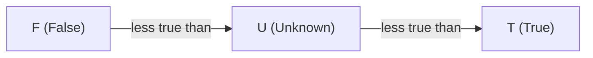
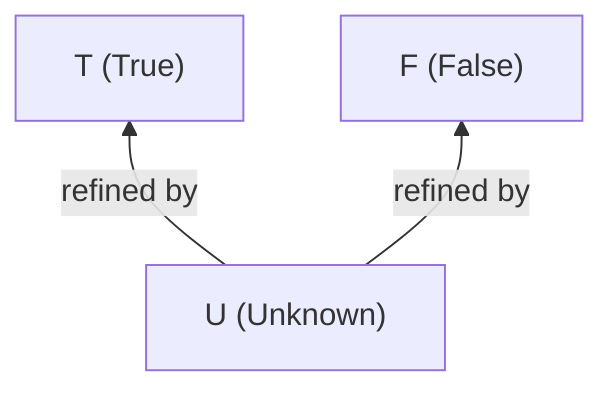

# Values

The three values of Strong Kleene (K3) and the two orders defined on them. Back to the [specification index](README.md).

## The three values

Every expression evaluates to exactly one of three values. In tables and formulas they are written `T`, `F` and `U`.

| Value | Symbol | Meaning | `TruthValue` member | DSL literal | JSON and YAML constant |
| --- | --- | --- | --- | --- | --- |
| True | T | Definitely true | `TruthValue.True` | `True` | `{"const": true}` |
| False | F | Definitely false | `TruthValue.False` | `False` | `{"const": false}` |
| Unknown | U | Not determined: neither established as true nor as false | `TruthValue.Unknown` | `Unknown` | `{"const": "unknown"}` |

- `Unknown` is a value in its own right, not an error, not `null` and not a third way of writing `False`. It is never converted to `True` or `False` implicitly. The only conversions to a two-valued answer are the explicit ones: `COALESCE` with a constant inside a rule, and `Decision.Project` or `Decision.Collapse` on the result.
- A predicate that cannot answer (an exception, a timeout or a cancellation) contributes `Unknown` and records a fault (see [evaluation](evaluation.md#predicates-and-faults)). A predicate that simply returns `Unknown` is a normal answer and records no fault.
- The literals `True`, `False` and `Unknown` are case-insensitive on input and printed in that spelling. They are not Operations; they are documented here and in each Operation's Syntax section.

> [!WARNING]
> The `TruthValue` enum is declared in the order `False`, `True`, `Unknown`, so the numeric order of its underlying integers is `F < T < U`. That is **not** the truth order below. Never compare the integers; use the operations. `default(TruthValue)` is `False`, which suits fail-closed handling.

## Truth order

The truth order is the chain

$$\mathsf{F} < \mathsf{U} < \mathsf{T}$$

Under this order the Strong Kleene connectives are plain lattice operations, which is why it is used throughout the reference:

- $a \land b = \min(a, b)$ ([`AND`](../gates/README.md))
- $a \lor b = \max(a, b)$ ([`OR`](../gates/README.md))
- $\neg a$ reverses the order, swapping $\mathsf{T}$ and $\mathsf{F}$ and fixing $\mathsf{U}$ ([`NOT`](../gates/README.md))

The cardinality operations also read it: `AtLeast(k)` is the $k$-th largest of its operands under this order. The definitions are in [semantics](semantics.md).

> [!IMPORTANT]
> The truth order is an implementation aid for stating truth functions and cardinality bounds. It is not a numeric ordering of truth: `Unknown` is not "half true", there is no arithmetic on values, and a count of `Unknown` operands as `0.5` of a `True` is wrong. Counting `Unknown` as `False` or as `True` is wrong for the same reason; cardinality operations use the interval described in [semantics](semantics.md).

## Information order

The information order ranks values by how much they say. `Unknown` says nothing; `True` and `False` each settle the question and neither settles it more than the other:

$$\mathsf{U} \sqsubseteq \mathsf{T}, \qquad \mathsf{U} \sqsubseteq \mathsf{F}, \qquad \mathsf{T} \text{ and } \mathsf{F} \text{ are incomparable}$$

Read an arrow as "may be refined to". Replacing an `Unknown` input by `True` or `False` is a refinement. A function $f$ is **monotone in the information order** when refining its inputs never changes a definite output:

$$x \sqsubseteq y \;\Rightarrow\; f(x) \sqsubseteq f(y)$$

with $\sqsubseteq$ applied position by position to the operands. Equivalently: if $f(x)$ is `True` or `False`, then $f(y)$ is the same value for every refinement $y$ of $x$.

The Strong Kleene connectives are exactly the monotone operations; the external operators are not. That boundary, and what follows from it, is in [semantics](semantics.md#strong-kleene-connectives-and-external-operators).

Two tables show the orders at work. Under the truth order `AND` is the minimum:

<!-- k3:truth AND -->
| a | b | AND(a, b) |
| --- | --- | --- |
| T | T | T |
| T | U | U |
| T | F | F |
| U | T | U |
| U | U | U |
| U | F | F |
| F | T | F |
| F | U | F |
| F | F | F |

Under the information order `AND` is monotone: in every row where the result is definite (`T` or `F`), refining an `Unknown` operand leaves it unchanged. The row `AND(U, F)` is `F`, and so are `AND(T, F)` and `AND(F, F)`. `COALESCE` is the contrast, since its first operand being `Unknown` selects the second:

<!-- k3:truth COALESCE -->
| a | b | COALESCE(a, b) |
| --- | --- | --- |
| T | T | T |
| T | U | T |
| T | F | T |
| U | T | T |
| U | U | U |
| U | F | F |
| F | T | F |
| F | U | F |
| F | F | F |

`COALESCE(U, F)` is `F`, but refining the first operand to `T` gives `COALESCE(T, F)`, which is `T`. A definite output changed under refinement, so `COALESCE` is not monotone.

## Related

- [semantics](semantics.md) defines the connectives over these orders.
- [terminology](terminology.md) defines the other terms used here.
- [notation](notation.md) lists the symbols.
